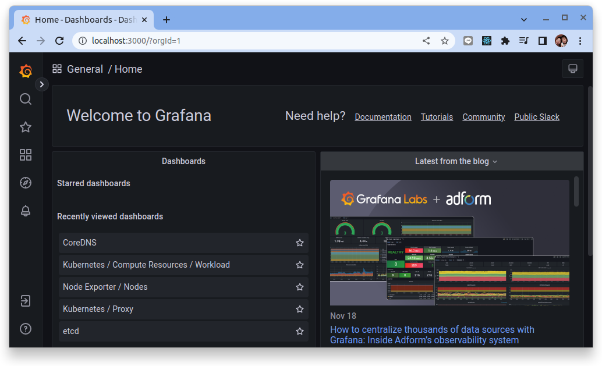

# 應用程序可觀測性實戰 - Logging


本教程主要用來展示應用程式如何實作可觀測性三大支柱之一的 Logs　并且與平台系統元件進行整合。

## 步驟 01 - 環境安裝

環境的搭建主要要使用到下列幾個關鍵元件:

- Kubernetes
- [Banzai Cloud - Logging operator](https://banzaicloud.com/docs/one-eye/logging-operator/)
    - fluentbit
    - fluentd
- [Grafana Loki](https://grafana.com/oss/loki/)
- [Prometheus Operator](https://prometheus-operator.dev/)
    - grafana


### Kubernetes

本教程使用 K3D 來構建實驗 K8S 集群, 詳細說明請參考: 

- [使用 K3D 設置 Kubernetes 集群](../../../kubernetes/01-getting-started/learning-env/k3d/k3s-kubernetes-cluster-setup-with-k3d.md)


執行下列命令來創建實驗 Kubernetes 集群:

```bash
k3d cluster create --api-port 6443 \
--port 8080:80@loadbalancer --port 8443:443@loadbalancer
```

確認 Kubernetes 及 Kubectl 是否成功安裝：

```bash
kubectl cluster-info
```
(輸出結果)

```bash
Kubernetes control plane is running at https://0.0.0.0:6443
CoreDNS is running at https://0.0.0.0:6443/api/v1/namespaces/kube-system/services/kube-dns:dns/proxy
Metrics-server is running at https://0.0.0.0:6443/api/v1/namespaces/kube-system/services/https:metrics-server:/proxy
```

### Grafana Loki

本教程使用 `grafana/loki-stack` chart 來構建 Grafana Loki, 詳細說明請參考:

- [使用 Loki 做為 Kubernetes 的日誌聚合亓件](../../../kubernetes/observability/logging/loki/logging-with-loki-and-plg.md)
- [使用 Logging Operator 將 Nginx 訪問日誌存儲在 Grafana Loki](../../../kubernetes/observability/logging/loki/loki-nginx.md)

使用以下命令添加 Loki 的 chart 存儲庫：

```bash
helm repo add grafana https://grafana.github.io/helm-charts

helm repo update
```

將 Loki 安裝到 logging 命名空間中：

```bash
helm upgrade --install --create-namespace --namespace logging loki grafana/loki-stack \
  --set promtail.enabled=false
```

安裝之後檢查:

```bash
kubectl get svc -n logging
```

結果:

```bash
$ kubectl get svc -n logging
NAME               TYPE        CLUSTER-IP     EXTERNAL-IP   PORT(S)    AGE
loki               ClusterIP   10.43.32.223   <none>        3100/TCP   2m47s
```

!!! tip
  loki 的服務可通過 `http://loki.logging:3100` 來連接


### logging-operator

本教程使用 `banzaicloud-stable/logging-operator` chart 來構建 Logging operator, 詳細說明請參考:

- [Logging Operator - 優雅的雲原生日誌管理方案](../../../kubernetes/observability/logging/operator/logging-operator.md)

添加 `banzaicloud-stable` helm 存儲庫並更新本地緩存：

```bash
helm repo add banzaicloud-stable https://kubernetes-charts.banzaicloud.com

helm repo update
```

將 Logging operator 安裝到 `logging` 命名空間中：

```bash
helm upgrade --install --wait --create-namespace --namespace logging logging-operator banzaicloud-stable/logging-operator
```

### kube-prometheus-stack

本教程使用 `kube-prometheus-stack` 來構建可觀測性的相關元件, 詳細說明請參考:

- [Prometheus 簡介](../../../prometheus/prometheus/overview.md)
- [Prometheus Operator 簡介](../../../prometheus/operator/install.md)

添加 Prometheus-Community helm 存儲庫並更新本地緩存：

```bash
$ helm repo add prometheus-community https://prometheus-community.github.io/helm-charts
$ helm repo update 
```

創建要配置的 vlaues 檔案:

```yaml title="kube-stack-prometheus-values.yaml"
grafana:
  # change timezone setting base on browser
  defaultDashboardsTimezone: browser
  datasources:
    datasources.yaml:
      apiVersion: 1
      datasources:
      - name: Prometheus
        type: prometheus
        url: http://kube-stack-prometheus-kube-prometheus.monitoring:9090
        access: proxy
        isDefault: true
      - name: Loki
        type: loki
        url: http://loki.logging:3100
        access: proxy
        isDefault: false
  grafana.ini:
    users:
      viewers_can_edit: true
    auth:
      disable_login_form: false
      disable_signout_menu: false
    auth.anonymous:
      enabled: true
      org_role: Viewer
  sidecar:
    datasources:
      logLevel: "DEBUG"
      enabled: true
      searchNamespace: "ALL"
    dashboards:
      logLevel: "DEBUG"
      # enable the cluster wide search for dashbaords and adds/updates/deletes them in grafana
      enabled: true
      searchNamespace: "ALL"
      label: grafana_dashboard
      labelValue: "1"

prometheus:
  prometheusSpec:
    # enable the cluster wide search for ServiceMonitor CRD
    serviceMonitorSelectorNilUsesHelmValues: false
    # enable the cluster wide search for PodMonitor CRD
    podMonitorSelectorNilUsesHelmValues: false
    # enable the cluster wide search for PrometheusRule CRD
    ruleSelectorNilUsesHelmValues: false
    probeSelectorNilUsesHelmValues: false
```

!!! info
    在設定 `kube-stack-prometheus` 的設定中定義了兩個元件 (Prometheus 與 Loki) 在 grafana 中的 Data Source 的設定:
    
    ```yaml
    grafana:
      # change timezone setting base on browser
      defaultDashboardsTimezone: browser
      datasources:
        datasources.yaml:
          apiVersion: 1
          datasources:
          - name: Prometheus
            type: prometheus
            url: http://kube-stack-prometheus-kube-prometheus.monitoring:9090
            access: proxy
            isDefault: true
          - name: Loki
            type: loki
            url: http://loki.logging:3100
            access: proxy
            isDefault: false
      ..
    ..
    ..
    ```

使用 Helm 在命名空間監控中部署 `kube-stack-prometheus` chart：

```bash
helm upgrade --install --wait --create-namespace --namespace monitoring  \
kube-stack-prometheus prometheus-community/kube-prometheus-stack \
--values kube-stack-prometheus-values.yaml
```

該 Helm chart 安裝了 Prometheus 組件和 Operator、Grafana 以及以下 exporters：

- [prometheus-node-exporter](https://github.com/prometheus/node_exporter) 暴露底層硬件和操作系統的相關指標
- [kube-state-metrics](https://github.com/kubernetes/kube-state-metrics) 監聽 Kubernetes API 服務器並生成有關對象狀態的指標

有關 `kube-stack-prometheus` 的詳細說明:

- [Prometheus Operator](../../../prometheus/operator/install.md)

#### 連接到 Grafana

Grafana Web UI 可通過以下命令通過端口轉發訪問：

```bash
kubectl port-forward --namespace monitoring svc/kube-stack-prometheus-grafana 3000:80 --address="0.0.0.0"
```

打開瀏覽器並轉到 http://localhost:3000 並填寫前一個命令所取得的用戶名/密碼。預設的帳號是:

- `username`: admin
- `password`: prom-operator



## 步驟 02 - 應用程序 Logging 實戰

在雲原生應用開發 The Twelve-Factor App 方法論中的第11個原則說的是:

!!! quote
    11. Logs

    **把日志當作事件流**

    - 應用程式不應該煩惱 logs 存放位置，統一使用 {==stdout==} 直接輸出
    - 這些事件流可以輸出至文件，或是在終端實現觀察的
    - 輸出流可以發送到 Loki/ELK 諸如此類的日誌索引及分析系統

對很多應用開發工程師不容易理解為什麼把 log 日誌打印在 STDOUT 上是符合現代雲原生的一個作法，其實這個原則在實踐上是要搭配應用運行的平台來實施。

本教程是以 Kubernetes 來作為應用佈署運行的平台的角度來說明平台如何簡化了應用在 Observability 上的提升。

有關 Kubernetes **日誌架構** 的詳細說明:

- [日誌架構](../../../kubernetes/02-concepts/11-cluster-adm/logging.md)
- [日誌完整指南](../../../kubernetes/02-concepts/11-cluster-adm/kubernetes-logging.md)


應用程序可觀性針對 Logging 的這個支柱來強化時的整合的手法可簡化成三個步驟:

1. 應用程序日誌結構化 (Structured Logging)
2. 設定應用程序日誌集中化收集轉換與轉拋的規則
3. 應用程序日誌探索與查找

### 1. 應用程序日誌結構化

結構化日誌記錄是為應用程序日誌提供標準化的、預先確定的消息格式的過程，使它們能夠作為數據集而不是文本來處理。結構化日誌記錄的目標是獲取現在作為文本字符串提供的應用程序日誌，並將其轉化為易於搜索和分析的關係數據集合。

結構化日誌記錄組織記錄的數據，使其易於搜索、過濾和處理以進行更複雜的分析。JSON 是結構化日誌記錄的首選格式，但也可以接受其他格式例如在 CNCF 專案中常見的 logmft。最佳實踐是使用可以與日誌管理解決方案交互並支持自定義字段的日誌記錄框架來提供結構化日誌記錄。

參考下面教程來了解日誌結構化的定義與詳細說明:

- [Structured Logging](../logs/structured-logging.md)

儀器化應用程序的手法主要可區分成兩種類型:

本教程主要說明如何在不同程式語言裡使用第三方套件(侵入式的強化)來進行應用程序日誌結構化 (Structured Logging)。

=== "Dotnet"

    參考下面兩個教程來來進行 Dotnet 應用程序日誌結構化:

    1. [使用 ASP.NET Core 創建 Web API](../../dotnet/backend/base/web-api-base.md)
    2. [結構化日誌 ASP.NET Core 應用程序](../../dotnet/backend/logging/web-api-logging.md)

    佈署應用:

    ```bash title="Deployment"
    kubectl apply -f -<<EOF
    apiVersion: apps/v1
    kind: Deployment
    metadata:
      name: dotnet-todoapi
      labels:
        app: dotnet-todoapi
    spec:
      replicas: 1
      selector:
        matchLabels:
          app: dotnet-todoapi
      template:
        metadata:
          labels:
            app: dotnet-todoapi
        spec:
          containers:
          - name: dotnet-todoapi
            image: witlab/dotnet-todoapi:logging
            ports:
            - name: web
              containerPort: 8080
    EOF
    ```

    創建 `Service`:

    ```bash title="Service"
    kubectl apply -f -<<EOF
    apiVersion: v1
    kind: Service
    metadata:
      name: dotnet-todoapi
      labels:
        app: dotnet-todoapi
    spec:
      selector:
        app: dotnet-todoapi
      ports:
        - name: web
          port: 8080
          targetPort: 8080
    EOF
    ```

    完成上述的教程後, 應用程式會啟動在 `port:8080` 並且將己經結構化的日誌打印在 stdout 上。執行下列指令來驗證:

    ```bash
    $ kubectl get pods
    NAME                             READY   STATUS    RESTARTS   AGE
    dotnet-todoapi-6ff77d597-sqsxf   1/1     Running   0          52s

    $ kubectl logs dotnet-todoapi-6ff77d597-sqsxf
    {"Timestamp":"2022-12-03T09:19:58.3051046+00:00","Level":"Information","Message":"Starting web host","Application":"dotnet-todoapi"}
    {"Timestamp":"2022-12-03T09:19:58.4785717+00:00","Level":"Warning","Message":"Overriding address(es) 'http://+:80'. Binding to endpoints defined via IConfiguration and/or UseKestrel() instead.","addresses":"http://+:80","SourceContext":"Microsoft.AspNetCore.Server.Kestrel","Application":"dotnet-todoapi"}
    {"Timestamp":"2022-12-03T09:19:58.4903858+00:00","Level":"Information","Message":"Now listening on: http://[::]:8080","address":"http://[::]:8080","EventId":{"Id":14,"Name":"ListeningOnAddress"},"SourceContext":"Microsoft.Hosting.Lifetime","Application":"dotnet-todoapi"}
    {"Timestamp":"2022-12-03T09:19:58.4905616+00:00","Level":"Information","Message":"Application started. Press Ctrl+C to shut down.","SourceContext":"Microsoft.Hosting.Lifetime","Application":"dotnet-todoapi"}
    {"Timestamp":"2022-12-03T09:19:58.4906005+00:00","Level":"Information","Message":"Hosting environment: Production","envName":"Production","SourceContext":"Microsoft.Hosting.Lifetime","Application":"dotnet-todoapi"}
    {"Timestamp":"2022-12-03T09:19:58.4906368+00:00","Level":"Information","Message":"Content root path: /app/","contentRoot":"/app/","SourceContext":"Microsoft.Hosting.Lifetime","Application":"dotnet-todoapi"}
    ```

=== "Java"

    參考下面兩個教程來來進行 Java 應用程序日誌結構化:

    1. [使用 Springboot 創建 Web API](../../java/backend/base/web-api-base.md)
    2. [結構化日誌 Sprintboot 應用程序](../../java/backend/logging/web-api-logging.md)

    佈署應用:

    ```bash title="Deployment"
    kubectl apply -f -<<EOF
    apiVersion: apps/v1
    kind: Deployment
    metadata:
      name: java-todoapi
      labels:
        app: java-todoapi
    spec:
      replicas: 1
      selector:
        matchLabels:
          app: java-todoapi
      template:
        metadata:
          labels:
            app: java-todoapi
        spec:
          containers:
            - name: java-todoapi
              image: witlab/java-todoapi:logging
              ports:
              - name: web
                containerPort: 8080
    EOF
    ```

    創建 `Service`:

    ```bash title="Service"
    kubectl apply -f -<<EOF
    apiVersion: v1
    kind: Service
    metadata:
      name: java-todoapi
      labels:
        app: java-todoapi
    spec:
      selector:
        app: java-todoapi
      ports:
        - name: web
          port: 8080
          targetPort: 8080
    EOF
    ```

    完成上述的教程後, 應用程式會啟動在 `port:8080` 並且將己經結構化的日誌打印在 stdout 上。執行下列指令來驗證:

    ```bash
    $ kubectl get pods

    NAME                             READY   STATUS    RESTARTS   AGE
    java-todoapi-79f8b546f9-x4wcx    1/1     Running   0          18s

    $ kubectl logs java-todoapi-79f8b546f9-x4wcx
    {"@timestamp":"2022-12-03T11:29:28.727Z","@version":"1","message":"Starting TodoapiApplication v0.0.1-SNAPSHOT using Java 11.0.16.1 on java-todoapi-79f8b546f9-x4wcx with PID 1 (/opt/app.jar started by root in /opt)","logger_name":"com.wistron.todoapi.TodoapiApplication","thread_name":"main","level":"INFO","level_value":20000}
    {"@timestamp":"2022-12-03T11:29:28.736Z","@version":"1","message":"No active profile set, falling back to 1 default profile: \"default\"","logger_name":"com.wistron.todoapi.TodoapiApplication","thread_name":"main","level":"INFO","level_value":20000}
    {"@timestamp":"2022-12-03T11:29:29.283Z","@version":"1","message":"Bootstrapping Spring Data JPA repositories in DEFAULT mode.","logger_name":"org.springframework.data.repository.config.RepositoryConfigurationDelegate","thread_name":"main","level":"INFO","level_value":20000}
    {"@timestamp":"2022-12-03T11:29:29.319Z","@version":"1","message":"Finished Spring Data repository scanning in 28 ms. Found 1 JPA repository interfaces.","logger_name":"org.springframework.data.repository.config.RepositoryConfigurationDelegate","thread_name":"main","level":"INFO","level_value":20000}
    {"@timestamp":"2022-12-03T11:29:29.838Z","@version":"1","message":"Tomcat initialized with port(s): 8080 (http)","logger_name":"org.springframework.boot.web.embedded.tomcat.TomcatWebServer","thread_name":"main","level":"INFO","level_value":20000}
    {"@timestamp":"2022-12-03T11:29:29.846Z","@version":"1","message":"Initializing ProtocolHandler [\"http-nio-8080\"]","logger_name":"org.apache.coyote.http11.Http11NioProtocol","thread_name":"main","level":"INFO","level_value":20000}
    {"@timestamp":"2022-12-03T11:29:29.847Z","@version":"1","message":"Starting service [Tomcat]","logger_name":"org.apache.catalina.core.StandardService","thread_name":"main","level":"INFO","level_value":20000}
    {"@timestamp":"2022-12-03T11:29:29.847Z","@version":"1","message":"Starting Servlet engine: [Apache Tomcat/9.0.68]","logger_name":"org.apache.catalina.core.StandardEngine","thread_name":"main","level":"INFO","level_value":20000}
    {"@timestamp":"2022-12-03T11:29:29.906Z","@version":"1","message":"Initializing Spring embedded WebApplicationContext","logger_name":"org.apache.catalina.core.ContainerBase.[Tomcat].[localhost].[/]","thread_name":"main","level":"INFO","level_value":20000}
    {"@timestamp":"2022-12-03T11:29:29.906Z","@version":"1","message":"Root WebApplicationContext: initialization completed in 1125 ms","logger_name":"org.springframework.boot.web.servlet.context.ServletWebServerApplicationContext","thread_name":"main","level":"INFO","level_value":20000}
    {"@timestamp":"2022-12-03T11:29:30.038Z","@version":"1","message":"HikariPool-1 - Starting...","logger_name":"com.zaxxer.hikari.HikariDataSource","thread_name":"main","level":"INFO","level_value":20000}
    {"@timestamp":"2022-12-03T11:29:30.233Z","@version":"1","message":"HikariPool-1 - Start completed.","logger_name":"com.zaxxer.hikari.HikariDataSource","thread_name":"main","level":"INFO","level_value":20000}
    {"@timestamp":"2022-12-03T11:29:30.274Z","@version":"1","message":"HHH000204: Processing PersistenceUnitInfo [name: default]","logger_name":"org.hibernate.jpa.internal.util.LogHelper","thread_name":"main","level":"INFO","level_value":20000}
    {"@timestamp":"2022-12-03T11:29:30.316Z","@version":"1","message":"HHH000412: Hibernate ORM core version 5.6.12.Final","logger_name":"org.hibernate.Version","thread_name":"main","level":"INFO","level_value":20000}
    {"@timestamp":"2022-12-03T11:29:30.458Z","@version":"1","message":"HCANN000001: Hibernate Commons Annotations {5.1.2.Final}","logger_name":"org.hibernate.annotations.common.Version","thread_name":"main","level":"INFO","level_value":20000}
    {"@timestamp":"2022-12-03T11:29:30.571Z","@version":"1","message":"HHH000400: Using dialect: org.hibernate.dialect.H2Dialect","logger_name":"org.hibernate.dialect.Dialect","thread_name":"main","level":"INFO","level_value":20000}
    {"@timestamp":"2022-12-03T11:29:31.019Z","@version":"1","message":"HHH000490: Using JtaPlatform implementation: [org.hibernate.engine.transaction.jta.platform.internal.NoJtaPlatform]","logger_name":"org.hibernate.engine.transaction.jta.platform.internal.JtaPlatformInitiator","thread_name":"main","level":"INFO","level_value":20000}
    {"@timestamp":"2022-12-03T11:29:31.026Z","@version":"1","message":"Initialized JPA EntityManagerFactory for persistence unit 'default'","logger_name":"org.springframework.orm.jpa.LocalContainerEntityManagerFactoryBean","thread_name":"main","level":"INFO","level_value":20000}
    {"@timestamp":"2022-12-03T11:29:31.47Z","@version":"1","message":"spring.jpa.open-in-view is enabled by default. Therefore, database queries may be performed during view rendering. Explicitly configure spring.jpa.open-in-view to disable this warning","logger_name":"org.springframework.boot.autoconfigure.orm.jpa.JpaBaseConfiguration$JpaWebConfiguration","thread_name":"main","level":"WARN","level_value":30000}
    {"@timestamp":"2022-12-03T11:29:32.13Z","@version":"1","message":"Starting ProtocolHandler [\"http-nio-8080\"]","logger_name":"org.apache.coyote.http11.Http11NioProtocol","thread_name":"main","level":"INFO","level_value":20000}
    {"@timestamp":"2022-12-03T11:29:32.145Z","@version":"1","message":"Tomcat started on port(s): 8080 (http) with context path ''","logger_name":"org.springframework.boot.web.embedded.tomcat.TomcatWebServer","thread_name":"main","level":"INFO","level_value":20000}
    {"@timestamp":"2022-12-03T11:29:32.153Z","@version":"1","message":"Started TodoapiApplication in 4.069 seconds (JVM running for 4.495)","logger_name":"com.wistron.todoapi.TodoapiApplication","thread_name":"main","level":"INFO","level_value":20000}
    ```

### 2. 設定應用程序日誌集中化收集轉換與轉拋的規則

Logging Operator 利用 CRD 的方式介入了日誌從採集、路由、輸出這三個階段的配置。它本質上來說還是利用 DaemonSet 和 StatefulSet 在集群內分別部署了 FluentBit 和 Fluentd 兩個組件，FluentBit 將容器日誌採集並初步處理後轉發給 Fluentd 做進一步的解析和路由，最終由 Fluentd 將日誌結果轉發給不同的服務。

**Logging Operator CRD**

整個 Logging Operator 的核心 CRD 就只有5個，它們分別是:

- logging：用於定義一個日誌採集端(FleuntBit)和傳輸端(Fleuntd)服務的基礎配置；
- flow：用於定義一個 namespaces 級別的日誌過濾、解析和路由等規則。
- clusterflow：用於定義一個集群級別的日誌過濾、解析和路由等規則。
- output： 用於定義namespace級別的日誌的輸出和參數；
- clusteroutput： 用於定義集群級別的日誌輸出和參數，它能把被其他命名空間內的 flow 關聯

參考下面教程來了解 LoggingOperator 的詳細說明:

- [Logging Operator - 優雅的雲原生日誌管理方案](../../../kubernetes/observability/logging/operator/logging-operator.md)

接著讓我們使用 logging operator 所定義的 CRD 來定義收集日誌的 pipeline。下列的設定是使用了最簡化的配置來啟用 Logging Operator，實務上會採取各細緻的配置。

#### 創建日誌 Logging 資源

```bash
kubectl -n logging apply -f - <<EOF
apiVersion: logging.banzaicloud.io/v1beta1
kind: Logging
metadata:
  name: default-logging-simple
spec:
  fluentd: {}
  fluentbit: {}
  controlNamespace: logging
EOF
```

#### 創建 Loki ClusterOutput 資源

```bash
kubectl -n logging apply -f - <<EOF
apiVersion: logging.banzaicloud.io/v1beta1
kind: ClusterOutput
metadata:
  name: loki-cluster-output
spec:
  loki:
    url: http://loki.logging:3100
    configure_kubernetes_labels: true
    buffer:
      flush_mode: interval
      flush_interval: 5s
      timekey: 1m
      timekey_wait: 30s
      timekey_use_utc: true
EOF
```

#### 創建 ClusterFlow 資源
```bash
kubectl -n logging apply -f - <<EOF
apiVersion: logging.banzaicloud.io/v1beta1
kind: ClusterFlow
metadata:
  name: loki-cluster-flow
spec:
  filters:
    - tag_normaliser: {}
  globalOutputRefs:
    - loki-cluster-output
EOF
```

### 3. 應用程序日誌探索與查找

打開瀏覽器並輸入 Grafana UI的位址 `http://localhost:3000`。預設的帳號是:

- `username`: admin
- `password`: prom-operator


=== "Dotnet"

    1. 在左側的功能導引列表上點擊 "Explore"

        

    2. 在上方的 "Data srouce" 的下接選單點選 "Loki"

        

    3. 點選 "Log browser" 接著點選 "app" 的標籤, 最後選擇 "dotnet-todoapi" 這個標籤值然後點選 "Show logs" 按鈕

        

    4. 在 Grafana 的 Exploer 介面可看到 `dotnet-todoapi` 拋到 stdout 上被收集的日誌

        

=== "Java"

    1. 在左側的功能導引列表上點擊 "Explore"

        

    2. 在上方的 "Data srouce" 的下接選單點選 "Loki"

        

    3. 點選 "Log browser" 接著點選 "app" 的標籤, 最後選擇 "java-todoapi" 這個標籤值然後點選 "Show logs" 按鈕

        

    4. 在 Grafana 的 Exploer 介面可看到 `java-todoapi` 拋到 stdout 上被收集的日誌

        

#### Loki 查詢語言 LogQL

受 PromQL 的啓發，Loki 也有自己的查詢語言，稱爲 LogQL，它就像一個分佈式的 grep，可以聚合查看日誌。和 PromQL 一樣，LogQL 也是使用標籤和運算符進行過濾的。

想了解更多使用 LogQL 來查詢或分析日誌的語法:

  - [Grafana Loki 查詢語言 LogQL 使用](../../../kubernetes/observability/logging/loki/loki-ql.md)
  - [LogQL: Log query language](https://grafana.com/docs/loki/latest/logql/)

## 結論

現在我們已經有了結構化的、集中的和正規化的日誌記錄的基本工具與平台。我們可以同時查詢我們所有的應用程序，搜索一些特定的異常，並過濾掉出錯誤日誌。

擁有結構化日誌記錄並不意味著每條的日誌都是值得記錄。換句話說，僅僅因為安裝了可觀察性工具並不意味著我們可看到的更多有用的訊息。

因此，團隊應該思考如何來收集真正有幫助我們了解應用程序的見解的日誌，並且積極地應用這些信息來推論出可改善 Day2 運維的 actions。


