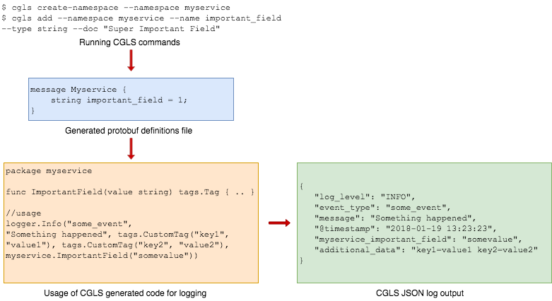
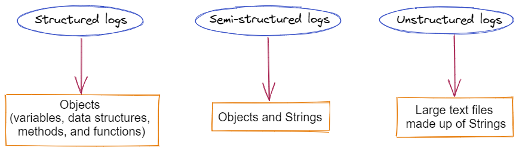

# Structured Logging

- 原文: [Structured Logging That Makes Everybody Happy](https://qxperts.io/structured-logging-that-makes-everybody-happy/)
- 原文: [Structured Logging](https://www.atatus.com/glossary/structured-logging/)


當我們運行我們的應用程序時，我們顯然希望看到並了解正在發生的事情以及我們的應用程序性能如何。為實現這一目標，我們需要將 **可觀察性 (Observability)** 作為我們應用程序的一個關鍵特徵。

可觀察性是衡量一個系統的內部狀態可以從其外部輸出的知識中推斷出來的程度。指標 (metrics)、鏈路跟踪 (tracing) 和日誌記錄 (logs) 是在應用程序中要實現可觀察性的關鍵。

其中兩個支柱，指標和鏈路跟踪，對於讓描繪應用程序可觀察性完整的構面也非常重要。然而在這篇教程中，將重點關注如何從日誌記錄 (logs) 中獲得最大收益。

結構化日誌記錄的核心設計目的是 **降低錯誤或問題的平均解決時間 (MTTR)**，幫助開發人員在發生服務中斷時更快地解決問題。

提高可觀察性以有效維護這些系統至關重要。來自適當監控（指標）、事件日誌和請求範圍信息跟踪的數據都可以幫助我們更好地了解系統中發生的事情。

日誌通常是第一個也是最繁忙的交互點，它清楚地描述了系統中發生的事情。當有良好的日誌時，後端更容易理解、管理和排除故障。如果沒有日誌或日誌不准確，將很難理解發生了什麼。

## 什麼是結構化日誌記錄？

結構化日誌記錄是為應用程序日誌提供標準化的、預先確定的消息格式的過程，使它們能夠作為數據集而不是文本來處理。結構化日誌記錄的目標是獲取現在作為文本字符串提供的應用程序日誌，並將其轉化為易於搜索和分析的關係數據集合。

結構化日誌記錄組織記錄的數據，使其易於搜索、過濾和處理以進行更複雜的分析。**JSON** 是結構化日誌記錄的首選格式，但也可以接受其他格式例如在CNCF專案中常見的 [logmft](https://brandur.org/logfmt)。最佳實踐是使用可以與日誌管理解決方案交互並支持自定義字段的日誌記錄框架來提供結構化日誌記錄。

結構化、半結構化和非結構化日誌都屬於一個大類，各有優缺點。結構化日誌在您的日誌管理系統中很容易解析，但如果沒有日誌管理解決方案就很難使用。非結構化和半結構化日誌對人類來說很容易閱讀，但對機器來說提取起來可能具有挑戰性。

### 結構化日誌範例

假設你的應用程序允許用戶創建你想要記錄的信息。最低限度的日誌消息可能如下所示：

```
2021-07-29 | New report created
```

為了能夠讓日誌信息更具可讀性你可能增加更細緻的時間和日誌級別來表達事件的嚴重性：

```
2021-07-29 14:52:55.1623|INFO|New report created
```

日誌內容再強化與人的相互信息，我們還包括創建報告的用戶的 ID：

```
2021-07-29 14:54:55.1623|INFO|New report created by user 4253
```

當然我們也可利用日誌來記錄不同的使用者操作事件：

```
INFO|New report created by user 4253
INFO|Report updated by user 257
INFO|User 478 deleted report 
```

現在是棘手的部分。假設您需要搜索日誌事件以查找特定用戶對 Report 執行某些操作的所有日誌記錄。由於日誌消息格式不一致，這並不容易做到。

除了報告之外，用戶還可以創建其他類型的工件，並且還會記錄此類活動。使用適量的正則表達式，您可能能夠完成它。但是，此類代碼容易出錯、脆弱，並且不會為您和您的客戶產生最大價值。

結構化日誌記錄通過生成易於解析的日誌來解決上述問題。例如，以下是我們如何使用 JSON 構建示例中的事件日誌記錄：

```json
{
    "TimeStamp": "2021-07-29 14:52:55.1623",
    "Level": "Info",
    "Message": "New report created",
    "UserId": "4253",
    "ReportId": "4567",
    "Action": "Report_Creation"
}
```



### 結構化日誌記錄格式的重要性

團隊可以通過組織日誌來確保日誌將被日誌管理工具無縫地攝取和解釋。但是，該工具必須接受 JSON 文件。

手動讀取非結構化日誌和使用日誌管理工具之間最顯著的區別之一就是這一點。使用日誌管理軟件查看非結構化日誌的價值較低，因為它們是基於文本的。此外，如果日誌文件是逐行檢查的，這些限制就沒有那麼重要了。

這些日誌仍然是個問題，尤其是在處理大量數據時。結構化的數據記錄有助於避免在管理大規模日誌數據時可能出現的問題。

### 結構化日誌中包含哪些數據？

日誌的價值取決於它們包含的數據。儀表板、圖形、圖表、算法分析和任何其他可用於評估環境健康的有用信息都是使用事件中包含的數據生成的。

由於這些結構化日誌，搜索特定事件更加有效。當使用日誌分析工具等解析器應用程序時，結構化日誌可以在單個事件中包含任意數量的數據片段。

以下是可以添加到事件中的一些數據示例：

- 事件的日期和時間
- 觸發操作的類型（例如，信息、關鍵、警告、錯誤等）
- 觸發事件發生的位置（例如，API端點或正在運行的應用程序）
- 事件的描述（例如，可以記錄信用卡失敗以檢測潛在的欺詐行為）
- 唯一的事件 ID
- 客戶 ID 或用戶名
- 用於訪問應用程序的協議
- 用於執行函數的端口

即使不是所有的信息都應該記錄在日誌中，記錄的事件也應該有足夠的細節以允許更正任何嚴重的錯誤。切勿在日誌中保留密鑰、密碼或任何其他敏感信息。

### 結構化、非結構化和半結構化日誌差異



非結構化日誌是由字符串組成的大型文本文件，旨在供人類閱讀，由有組織的字符序列組成。這些字符串是在日誌變量中別處定義的屬性的佔位符。有時變量是一個通配符，一個表示不明確屬性的佔位符。

人們很容易理解變量，但機器經常難以理解它們。他們有時會發現很難區分一個字符串中的變量和日誌文件中其他地方的類似字符串。發生這種情況時，結果可能不明確，從而降低生產率、增加易錯性並浪費處理週期和工時。

對象而不是字符串構成了結構化日誌。變量、數據結構、方法和函數都可以在對像中找到。例如，作為日誌消息組件的對象可以包含有關平台或應用程序的詳細信息。

為了使日誌最有助於滿足他們的特定目標，組織可以指定他們打算包含在對像中的標準。在結構化日誌中，這就是“結構”。

由於結構化日誌旨在供機器讀取，因此這樣做的機器可以更快地搜索它們，創建更清晰的輸出，並提供跨平台的一致性。儘管他們不是目標受眾，但人類仍然可以閱讀結構化日誌。

### 結構化日誌記錄的好處

擁有定義明確且結構化的日誌（如 JSON 或 logfmt）有很多好處：

- **更好的一致性**: 通過使用結構化日誌，您可以為您的日誌提供更多結構，並使它們在系統更改時更加一致。這使我們更容易在像 Elastic Stack 這樣的系統中為我們的日誌編制索引，因為我們可以確定我們遵守某種結構。
- **更好的根本原因分析**: 與單獨使用非結構化日誌相比，我們可以使用結構化日誌來攝取和運行更複雜的查詢。在查找與場景相關的日誌時，開發人員可以進行更有啟發性的搜索。
- **更好的標準化**: 我們可以通過單一的、明確定義的、結構化的方法來標準化日誌記錄，這減少了解釋日誌以確定係統中發生的事情的認知負荷，並使採用更容易。
- **動態日誌級別**: 這使我們能夠發布具有基線警告設置的代碼，並且僅在必要時切換到較低級別（調試日誌），從而使我們能夠擁有相關的日誌級別。
- **面向未來的日誌一致性**: 通過採用單一模式，我們確保即使在明天我們的日誌系統發生變化時也能保持相同的結構，從而使我們能夠面向未來。我們可以只在記錄器中提供一個函數，而不是顯式聲明要記錄的內容。
- **更高的透明度或更好的可觀察性**: 當您使用有組織的日誌時，您可以更清楚地看到您的系統正在發生什麼。這使您可以更清楚地了解系統中發生的情況，並使您的系統更易於管理和長期故障排除。

### 為什麼結構化日誌很重要？

在非結構化日誌中查找事件可能具有挑戰性，因為一個簡單的查詢經常會產生比所需數據多得多的數據以及完全錯誤的數據。

例如，如果開發人員在給定應用程序的磁盤配額超過指定數量時查找日誌事件，可能會發現所有應用程序產生的所有磁盤配額事件。在企業環境中，這將是一個相當大的文件。

開發人員必須創建一個具有挑戰性的 **正則表達式** 來指定搜索以發現適當的事件。此外，事件越具體，短語就越難。因為日誌記錄中的每一行值都必須與匹配表達式的要求進行比較，所以這種方法的計算量很大。

如果使用通配符，計算成本會增加。此外，如果日誌數據發生變化，匹配表達式將無法按預期運行。

在某些公司中，開發人員創建代碼字符串，而運營團隊編寫代碼將這些字符串轉換為結構化數據。這需要更多的時間和成本來計算。如果開發人員或運營團隊的成員犯了錯誤，記錄過程就會中斷，並且會浪費額外的時間來確定錯誤的原因。

通過在生成數據時對其進行排列，結構化日誌記錄消除了這些問題。可以選擇固定列、鍵值對、JSON 或任何其他最適合業務的格式。

由於與自動化系統（尤其是警報系統）的兼容性，JSON 格式是當今大多數企業的首選格式。

由於結構化日誌的限制，文本日誌在工作場所仍然使用。數據只能用於定義支持的用途，因為結構化日誌在數據創建時描述數據。

此外，無論結構化數據是保存在現場還是在具有剛性數據架構的數據倉庫中，更新結構化數據將是一項耗時且昂貴的任務。

組織應該考慮誰將使用這些數據，收集什麼樣的數據，數據將存儲在哪里以及如何存儲，以及數據是否需要在存儲之前準備好，或者在選擇日誌記錄策略時是否可以在使用時準備好。


## 日誌結構化、集中化和正規化

通常應用程序至少會實現基於文件的純文本日誌記錄，以提供對應用程序的一些了解。改進這種類型的日誌記錄的一個很好的開始是從純文本日誌 (plaintext logging) 記錄到結構化日誌 (structured logging) 記錄。這可以通過以下方式完成：

- 將日誌語句寫成 json blob。
- 在某個能夠解析它們的集中式平台上捕獲它們。

現在我們有了結構化和集中的日誌記錄，我們可以毫不費力地 **搜索**、**過濾** 和 **查詢** 日誌記錄。甚至可能同時審閱來自多個應用程序的日誌記錄。

當我們查看各種來源的日誌記錄時，我們還有一個願望：正規化日誌記錄。為此，所有應用程序都應以相同的方式構建其日誌結構。在設置新應用程序時考慮使用可重用的日誌記錄組件或默認的日誌記錄配置範本。


## 日誌分析取得見解

現在我們已經有了結構化的、集中的和正規化的日誌記錄的基本工具，我們在可觀察性方面進展順利。我們可以同時查詢我們所有的應用程序，搜索一些特定的異常，並過濾掉錯誤日誌。

僅僅因為擁有結構化日誌記錄並不意味著它值得記錄。換句話說，僅僅因為安裝了可觀察性工具並不意味著我們可看到的更多有用的訊息。

那麼，接下來，讓我們談談跟如何收集真正有幫助我們了解應用程序的見解的日誌。


## 日誌審閱站會


我們需要一種從結構化日誌記錄到信息的策略。它可能有助於設定一個具體的目標。例如：“每個帶有嚴重錯誤的日誌語句都應該是一個實際錯誤。”換句話說，帶有嚴重錯誤的日誌語句應該表明出現了錯誤，即操作無法成功執行。這樣的目標在許多情況下都可以證明是有價值的。

{==簡單來說就是所有日誌的 leve 是屬於 error 級別的日誌要明確表明錯誤的問題與原因。==}

!!! quote
    We need a strategy to get from structured logging to information. It may help to set a concrete goal. E.g.: “every log statement with severity error should be an actual error.” In other words, a log statement with severity error should indicate that something went wrong, i.e. an operation could not be executed successfully. Such a goal can prove valuable in many situations.


既然我們已經為專案設定了這個目標，我們就需要一種方法來實現它。下面是應用程序上線後專案團隊實施了一個例會：

- 每週定期舉辨日誌分析會議(大約 30 分鐘內)，團隊用來追踪最常見的錯誤模式。
    - 因為我們在 30 分鐘內只能做這麼多，所以我們可以：
        - 在 30 分鐘內解決重覆出現錯誤模式
        - 或是準備和計劃進一步調查。這將包括更詳細的日誌分析以及使用指標和跟踪來掌握全貌。
        
在後一種情況下，團隊通常會在產品待辦事項列表上創建一個工單來追踪。

常規化日誌分析會議的結果? 幾週後，錯誤日誌的數量就顯著減少了。幾個月後，應用程序運行的穩定性會達到一定的目標。

總之，我們現在可以使用錯誤日誌來深入了解我們的應用程序環境的健康狀況——這是[漸進式交付](https://xebia.com/blog/how-to-succeed-at-progressive-delivery/)的關鍵步驟和手法。

## 下一步，也就是告警

可觀察性不僅與工具有關，還與為提供有用的數據有關。

我們不能假設當我們一次性地清理錯誤日誌的根因後，它就會保持健康穩定的狀態。對於我們在應用程序所做的每一項更改，我們都需要考慮我們的可觀察性需求。

回答以下問題：

1. 我們需要什麼日誌記錄？
2. 其中應該包含哪些數據或標籤？
3. 我們應該添加哪些指標來深入了解我們的服務水平目標？

{==如果有太多錯誤需要調查，如果你看到的只是一堆無意義的數據，那麼根本就沒有人會看它。==}

## 結論

典型日誌條目的文本格式使人類分析師易於閱讀，但對計算機處理而言具有挑戰性。在某些情況下，我們可能希望使用自動處理來探索日誌文件，或者我們可能希望利用算法根據特定條件對日誌文件進行分類、索引和搜索。為提供此功能，IT 公司必須構建結構化日誌記錄。
