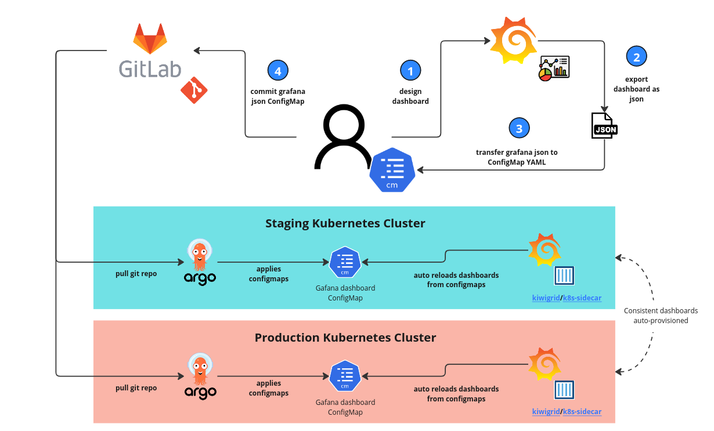

# 應用程序可觀測性實戰 - Metrics


本教程主要用來展示應用程式如何實作可觀測性三大支柱之一的 **Metrics**　并且與平台系統元件進行整合。

## 步驟 01 - 環境安裝

### Kubernetes

執行下列命令來創建實驗 Kubernetes 集群:

```bash
k3d cluster create --api-port 6443 \
--port 8080:80@loadbalancer --port 8443:443@loadbalancer
```

確認 Kubernetes 及 Kubectl 是否成功安裝：

```bash
kubectl cluster-info
```
(輸出結果)

```bash
Kubernetes control plane is running at https://0.0.0.0:6443
CoreDNS is running at https://0.0.0.0:6443/api/v1/namespaces/kube-system/services/kube-dns:dns/proxy
Metrics-server is running at https://0.0.0.0:6443/api/v1/namespaces/kube-system/services/https:metrics-server:/proxy
```

### kube-prometheus-stack

添加 Prometheus-Community helm 存儲庫並更新本地緩存：

```bash
$ helm repo add prometheus-community https://prometheus-community.github.io/helm-charts
$ helm repo update 
```

創建要配置的 vlaues 檔案:

```yaml title="kube-stack-prometheus-values.yaml"
grafana:
  # change timezone setting base on browser
  defaultDashboardsTimezone: browser
  grafana.ini:
    users:
      viewers_can_edit: true
    auth:
      disable_login_form: false
      disable_signout_menu: false
    auth.anonymous:
      enabled: true
      org_role: Viewer
  sidecar:
    datasources:
      logLevel: "DEBUG"
      enabled: true
      searchNamespace: "ALL"
    dashboards:
      logLevel: "DEBUG"
      # enable the cluster wide search for dashbaords and adds/updates/deletes them in grafana
      enabled: true
      searchNamespace: "ALL"
      label: grafana_dashboard
      labelValue: "1"

prometheus:
  prometheusSpec:
    # enable the cluster wide search for ServiceMonitor CRD
    serviceMonitorSelectorNilUsesHelmValues: false
    # enable the cluster wide search for PodMonitor CRD
    podMonitorSelectorNilUsesHelmValues: false
    # enable the cluster wide search for PrometheusRule CRD
    ruleSelectorNilUsesHelmValues: false
    probeSelectorNilUsesHelmValues: false
```

使用 Helm 在命名空間監控中部署 `kube-stack-prometheus` chart：

```bash
helm upgrade --install --wait --create-namespace --namespace monitoring  \
kube-stack-prometheus prometheus-community/kube-prometheus-stack \
--values kube-stack-prometheus-values.yaml
```

該 Helm chart 安裝了 Prometheus 組件和 Operator、Grafana 以及以下 exporters：

- [prometheus-node-exporter](https://github.com/prometheus/node_exporter) 暴露底層硬件和操作系統的相關指標
- [kube-state-metrics](https://github.com/kubernetes/kube-state-metrics) 監聽 Kubernetes API 服務器並生成有關對象狀態的指標

有關 `kube-stack-prometheus` 的詳細說明:

- [Prometheus Operator](../../../prometheus/operator/install.md)

#### 連接到 Prometheus

Prometheus Web UI 可通過以下命令通過端口轉發訪問：

```bash
kubectl port-forward --namespace monitoring svc/kube-stack-prometheus-kube-prometheus 9090:9090 --address="0.0.0.0"
```

在 http://localhost:9090 上打開瀏覽器選項卡會顯示 Prometheus Web UI。我們可以檢索從不同指標 Exporters 所收集回來的指標：


#### 連接到 AlertManager

AlertManager Web UI 可通過以下命令通過端口轉發訪問：

```bash
kubectl port-forward svc/kube-stack-prometheus-kube-alertmanager 9093:9093 --address="0.0.0.0"
```


#### 連接到 Grafana

Grafana Web UI 可通過以下命令通過端口轉發訪問：

```bash
kubectl port-forward --namespace monitoring svc/kube-stack-prometheus-grafana 3000:80 --address="0.0.0.0"
```

打開瀏覽器並轉到 http://localhost:3000 並填寫前一個命令所取得的用戶名/密碼。預設的帳號是:

- `username`: admin
- `password`: prom-operator


## 步驟 02 - 應用程序 Metric 實戰


應用程序可觀性首先可先從 Metrics 的第一個支柱來先行強化，整合的手法可簡化成四個步驟:

1. 儀器化你的應用程序
2. 設定應用程序指標的收集
3. 設定應用程序告警規則
4. 創建應用程序指標儀表板

### 1. 儀器化你的應用程序

儀器化是監控過程的關鍵。只有首先捕獲使你能夠做出這些決定的數據，你才能對系統的性能和健康狀況做出有意義的決定。通過使用檢測，你收集的信息應該足以評估性能、診斷問題和做出決策，而無需登錄到遠端的服務器以手動執行排錯和調試。

儀器化應用程序的手法主要可區分成兩種類型:

1. 非侵入式的強化 - 使用 sidecar 的模式, 例如使用 Istio 的 envoy sidecard
2. 侵入式的強化 - 使用 library 的模式

本教程主要說明如何使用不同程式語言的第三方套件來進行應用程序的儀器化(instrument)。

=== "Dotnet"

    參考下面兩個教程來儀器化你的 Dotnet 應用程序:

    1. [使用 ASP.NET Core 創建 Web API](../../dotnet/backend/base/web-api-base.md)
    2. [儀器化 ASP.NET Core 應用程序](../../dotnet/backend/metric/web-api-metric.md)

    佈署應用:

    ```bash title="Deployment"
    kubectl apply -f -<<EOF
    apiVersion: apps/v1
    kind: Deployment
    metadata:
      name: dotnet-todoapi
      labels:
        app: dotnet-todoapi
    spec:
      replicas: 1
      selector:
        matchLabels:
          app: dotnet-todoapi
      template:
        metadata:
          labels:
            app: dotnet-todoapi
        spec:
          containers:
          - name: dotnet-todoapi
            image: witlab/dotnet-todoapi:metric
            ports:
            - name: web
              containerPort: 8080
    EOF
    ```

    創建 `Service`:

    ```bash title="Service"
    kubectl apply -f -<<EOF
    apiVersion: v1
    kind: Service
    metadata:
      name: dotnet-todoapi
      labels:
        app: dotnet-todoapi
    spec:
      selector:
        app: dotnet-todoapi
      ports:
        - name: web
          port: 8080
          targetPort: 8080
    EOF
    ```

    完成上述的教程後, 應用程式會啟動在 `port:8080` 並且在 `/metrics` 的路徑上可取得應用程序暴露出來的指標:

    

=== "Java"

    參考下面兩個教程來儀器化你的 Ｓprintboot(Java) 應用程序:

    1. [使用 Springboot 創建 Web API](../../java/backend/base/web-api-base.md)
    2. [儀器化 Sprintboot 應用程序](../../java/backend/metric/web-api-metric.md)

    佈署應用:

    ```bash title="Deployment"
    kubectl apply -f -<<EOF
    apiVersion: apps/v1
    kind: Deployment
    metadata:
      name: java-todoapi
      labels:
        app: java-todoapi
    spec:
      replicas: 1
      selector:
        matchLabels:
          app: java-todoapi
      template:
        metadata:
          labels:
            app: java-todoapi
        spec:
          containers:
            - name: java-todoapi
              image: witlab/java-todoapi:metric
              ports:
              - name: web
                containerPort: 8080
    EOF
    ```

    創建 `Service`:

    ```bash title="Service"
    kubectl apply -f -<<EOF
    apiVersion: v1
    kind: Service
    metadata:
      name: java-todoapi
      labels:
        app: java-todoapi
    spec:
      selector:
        app: java-todoapi
      ports:
        - name: web
          port: 8080
          targetPort: 8080
    EOF
    ```

    完成上述的教程後, 應用程式會啟動在 `port:8080` 並且在 `/actuator/prometheus` 的路徑上可取得應用程序暴露出來的指標:

    

### 2. 設定應用程序指標的收集

在本教程中 Prometheus 是用來收集應用程式指標數據的元件，而 Prometheus 是使用拉 (pull) 的手法來取得各個應用的指標。在 `kube-prometheus-stack` 的安裝包裡頭也安裝了 `prometheus-operator` 的元件與相關的 CRD 來讓各應用程式的開發團隊可使用這些 CRD　來自服務式地配置讓 Prometheus 可認知到如何 scrape 到應用程序的指標 endpoint。

詳細的說明請參考: 

- [自定義監控報警](../../../prometheus/operator/custom.md)

接下來讓我們應用 `ServiceMonitor` (CRD) 來讓 Prometheus Operator 來幫我們設定應用程序指標數據的收集。

=== "Dotnet"

    構建一個 ServiceMonitor 對象來配置 Prometheus 來刮取應用程序的指標數據:

    ```bash title="ServiceMonitor"
    # ServiceMonitor (scrape)
    kubectl apply -f -<<EOF
    apiVersion: monitoring.coreos.com/v1
    kind: ServiceMonitor
    metadata:
      name: dotnet-todoapi
      labels:
        app: dotnet-todoapi
    spec:
      selector:
        matchLabels:
          app: dotnet-todoapi
      namespaceSelector:
        matchNames:
        - default
      endpoints:
      - port: web
        path: /metrics
    EOF
    ```

    驗證:

    在 Prometheus UI　中點選 `Status >> Target`:

    

=== "Java"

    構建一個 ServiceMonitor 對象來配置 Prometheus 來刮取應用程序的指標數據:

    ```bash title="ServiceMonitor"
    # ServiceMonitor (scrape)
    kubectl apply -f -<<EOF
    apiVersion: monitoring.coreos.com/v1
    kind: ServiceMonitor
    metadata:
      name: java-todoapi
      labels:
        app: java-todoapi
    spec:
      selector:
        matchLabels:
          app: java-todoapi
      namespaceSelector:
        matchNames:
        - default
      endpoints:
      - port: web
        path: /actuator/prometheus
    EOF
    ```

    驗證:

    在 Prometheus UI　中點選 `Status >> Target`:

    


### 3. 設定應用程序告警規則

Prometheus 除了可以收集應用程式指標,同時它也是用來執行告警規則的元件。`prometheus-operator` 的 CRD 中　`PrometheusRule` 就是讓各應用程式的開發團隊可以使用這個 CRD　來自服務式地配置讓 Prometheus 執行的告警規則。

詳細的說明請參考: 

- [自定義監控報警](../../../prometheus/operator/custom.md)

接下來讓我們應用 `PrometheusRule` (CRD) 來讓 Prometheus Operator 來幫我們設定告警規則。

=== "Dotnet"

    構建一個 PrometheusRule 的對象來監控 `dotnet-todoapi` 當這個服務不存在的時來觸發告警:

    ```bash title="PrometheusRule"
    kubectl apply -f -<<EOF
    apiVersion: monitoring.coreos.com/v1
    kind: PrometheusRule
    metadata:
      labels:
        team: dxlab
      name: dotnet-todoapi
    spec:
      groups:
        - name: dotnet-todoapi
          rules:
            - alert: DotnetTodoApiAppDown
              annotations:
                summary: Target disappeared from Prometheus target discovery.
                description: dotnet-todoapi has disappeared from Prometheus target discovery.
              expr: |
                absent(up{job="dotnet-todoapi"} == 1)
              for: 1m
              labels:
                namespace: default
                severity: critical
    EOF
    ```

    驗證:

    在 Prometheus UI　中點選 `Status >> Rules`:

    

=== "Java"

    構建一個 PrometheusRule 的對象來監控 `dotnet-todoapi` 當這個服務不存在的時來觸發告警:

    ```bash title="PrometheusRule"
    kubectl apply -f -<<EOF
    apiVersion: monitoring.coreos.com/v1
    kind: PrometheusRule
    metadata:
      labels:
        team: dxlab
      name: java-todoapi
    spec:
      groups:
        - name: java-todoapi
          rules:
            - alert: JavaTodoApiAppDown
              annotations:
                summary: Target disappeared from Prometheus target discovery.
                description: java-todoapi has disappeared from Prometheus target discovery.
              expr: |
                absent(up{job="java-todoapi"} == 1)
              for: 1m
              labels:
                namespace: default
                severity: critical
    EOF
    ```

    驗證:

    在 Prometheus UI　中點選 `Status >> Rules`:

    

### 4. 創建應用程序指標儀表板

Grafana 確實是一個了不起的、強大的工具，它可以通過漂亮、靈活的儀表板創建、探索和共享您的數據——無論數據存儲在哪裡。

但是，隨著公司的發展，在維護大量儀表板方面帶來了新的挑戰。讓我們來看看其中的一些……

1. `Inconsistent dashboards in different environments`: 很多時候，我們根據當時的特定需求更新儀表板，然後忘記在所有其他環境中更新它。這會導致跨環境的不一致，因此它使監控變得更加困難，有時甚至效率低下。

2. `Ownership`: 儀表板沒有明確的所有者。創建和更改儀表板，與佈署儀表板的權責不明。

3. `Diaster recovery`: 當涉及到災難恢復、創建新環境或將現有環境遷移到新集群時，如何將所有內容恢復到所需狀態並準備必要的調整。

4. `ChangeLog`: 隨著開發部門的發展，儀表板的變化也越來越頻繁。有時，可以針對特定案例或測試在不同環境中更改多個儀表板。 Grafana 有自己的變更管理，但是，它是每個儀表板的。我們缺乏一個集中的地方，在那裡我們可以看到某人所做的所有更改，並且能夠在需要時立即回滾所有內容。

#### Dashboards, ConfigMaps 與 GitOps

幸運的是，Grafana 5.0 版引入了一個使用配置文件的新的主動供應系統。這意味著我們現在能夠從配置文件（Kubernetes 中的 ConfigMap）配置儀表板。 Grafana 將自動加載它們，而無需進一步部署部署（就像我們過去在 Kubernetes 中使用配置映射時一樣）。

我們現在需要找到一種方法將 configmap 從一個地方分發到所有環境。GitOps 方法可以幫助我們實現這一點，因為我們將儀表板配置存儲在 git 中，合併到主分支的任何更改都將自動應用於我們的系統。

市面上有很多 GitOps 工具，比如 Flux、Jenkins 等等——我們選擇了 ArgoCD。ArgoCD 是用於 Kubernetes 的聲明式 GitOps 持續交付工具。

ArgoCD 持續監視指定的 git 存儲庫，將其與集群中當前部署的清單進行比較，並在它們上有效地運行 `kubectl apply -f <all>`。

對於廣泛的用例，這導致了一個非常簡單和可見的持續交付過程——在我們的例子中，在 configmaps 中持續部署 Grafana 儀表板。




想了解如何將自己客制的Dashbaord轉換成 Configmap 來 GitOps 進到 Kubernetes 中的 Grafana，請參考: [使用 ConfigMap 添加 Grafana 儀表板](../../../prometheus/operator/dashboard-using-configmap.md)。

接下來我們會使用 [Grafana Lab - Dashbaord](https://grafana.com/grafana/dashboards/) 網站上公開的 Dashbaord 來作示範。

=== "Dotnet"

    **搜索儀表板:**

    在 `filter` 上鍵入 `prometheus-net`:

    

    點選合適的儀表板(例如有 138K download的 ASP.NET Core - controller summary):

    

    點選 `Copy ID to clipboard`。

    **創建儀表板:**

    登入至一個 **開發用** 的 Grafana (開發者需要被授與 [Grafana `Editor` 權限](https://grafana.com/docs/grafana/latest/administration/roles-and-permissions/)),　然後在 Grafana UI　中的左側瀏覽欄中點選 "Dashboards >> Import", 並在 `Import via grafana.com` 欄中輸入上一步驟所複製下來的 Dashboard ID, 然後點選 "Load":

    

    接著點選 `Select a Prometheus data source` 的下拉選單來選擇在本地 Grafana 配置好的 Prometheus data soucre 之後再點選 `Import`:

    

    **導出儀表板:**

    在儀表板上方點選 `Share dashboard or panel` 的圖示:

    

    切換到 `Export` 頁籤之後再點選 `Save to file` 來下載儀表板:

    

    **構建儀表板 ConfigMap:**

    由於下載的檔名裡包含許多空白字元，修改檔名便於後續的操作：

    ```bash
    mv 'ASP.NET Core - controller summary (Prometheus)-1669089546575.json' asp-net-core-controller-summary-prometheus_rev4.json
    ```

    執行下列指令來創建 configmap 的 yaml 檔案:

    ```bash
    kubectl create configmap cm-dotnet-dashboard \
    --from-file=asp-net-core-controller-summary-prometheus_rev4.json \
    --dry-run=client -o yaml > cm-dotnet-dashboard.yaml
    ```

    結果會在當前的目錄下產生出一個包含 Dashboard 的 ConfigMap 檔案 `cm-dotnet-dashboard.yaml`。

    使用任一文件編輯器來編修 `cm-dotnet-dashboard.yaml` 來增加一個關鍵的標籤`{==grafana_dashboard: "1"==}`:

    ```yaml title="cm-dotnet-dashboard.yaml" hl_lines="13 14"
    apiVersion: v1
    data:
      asp-net-core-controller-summary-prometheus_rev4.json: |-
        {
        "__inputs": [
        ..
        ...
        }
    kind: ConfigMap
    metadata:
      creationTimestamp: null
      name: cm-dotnet-dashboard
      labels:
        grafana_dashboard: "1"
    ```

    執行下列指令來手動將 `cm-dotnet-dashboard.yaml` 建置進 Kubernetes 中:

    ```bash
    kubectl apply -f cm-dotnet-dashboard.yaml
    ```

    **在 Grafana 中驗證儀表板:**

    在 Grafana UI　中的左側瀏覽欄中點選 "Dashboards >> Browse", 並在 filter 欄中輸入 "ASP.NET":

    

    **在 Grafana 中驗證儀表板:**

    打開儀表板之後點選上方　"Save dashoard"　的圖示, 接著 Grafa 會從右側滑動一個視窗來說明這是一個 `Provisioned dashboard`:

    

=== "Java"

    **搜索儀表板:**

    在 `filter` 上鍵入 `prometheus-net`:

    

    點選合適的儀表板(例如有 3.06M download的 JVM Micrometer):

    

    點選 `Copy ID to clipboard`。

    **創建儀表板:**

    登入至一個 **開發用** 的 Grafana (開發者需要被授與 [Grafana `Editor` 權限](https://grafana.com/docs/grafana/latest/administration/roles-and-permissions/)),　然後在 Grafana UI　中的左側瀏覽欄中點選 "Dashboards >> Import", 並在 `Import via grafana.com` 欄中輸入上一步驟所複製下來的 Dashboard ID, 然後點選 "Load":

    

    接著點選 `Select a Prometheus data source` 的下拉選單來選擇在本地 Grafana 配置好的 Prometheus data soucre 之後再點選 `Import`:

    

    **導出儀表板:**

    在儀表板上方點選 `Share dashboard or panel` 的圖示:

    

    切換到 `Export` 頁籤之後再點選 `Save to file` 來下載儀表板:

    

    **構建儀表板 ConfigMap:**

    由於下載的檔名裡包含許多空白字元，修改檔名便於後續的操作：

    ```bash
    mv 'JVM (Micrometer)-1669091781879.json' jvm-micrometer_rev9.json
    ```

    執行下列指令來創建 configmap 的 yaml 檔案:

    ```bash
    kubectl create configmap cm-java-dashboard \
    --from-file=jvm-micrometer_rev9.json \
    --dry-run=client -o yaml > cm-java-dashboard.yaml
    ```

    結果會在當前的目錄下產生出一個包含 Dashboard 的 ConfigMap 檔案 `cm-java-dashboard.yaml`。

    使用任一文件編輯器來編修 `cm-java-dashboard.yaml` 來增加一個關鍵的標籤`{==grafana_dashboard: "1"==}`:

    ```yaml title="cm-java-dashboard.yaml" hl_lines="13 14"
    apiVersion: v1
    data:
      jvm-micrometer_rev9.json: |-
        {
          "annotations": {
          ..
          ...
        }
    kind: ConfigMap
    metadata:
      creationTimestamp: null
      name: cm-java-dashboard
      labels:
        grafana_dashboard: "1"
    ```

    執行下列指令來手動將 `cm-java-dashboard.yaml` 建置進 Kubernetes 中:

    ```bash
    kubectl apply -f cm-java-dashboard.yaml
    ```

    **在 Grafana 中驗證儀表板:**

    在 Grafana UI　中的左側瀏覽欄中點選 "Dashboards >> Browse", 並在 filter 欄中輸入 "JVM":

    

    **在 Grafana 中驗證儀表板:**

    打開儀表板之後點選上方　"Save dashoard"　的圖示, 接著 Grafa 會從右側滑動一個視窗來說明這是一個 `Provisioned dashboard`:

    

## 結論

GitOps 不是單一的產品、插件或平台。團隊將 GitOps 付諸實踐的最佳方式會因團隊的具體需求和目標而異。本教程裡結合了應用程式的可觀測性的能力整合與 GitOps 與 kube-prometheus-stack 中不同的 CRD 與配置來確保開發團隊對於非程式源碼的 artifacts 或配置也都可依循 GitOps 的手法來進行管理。

