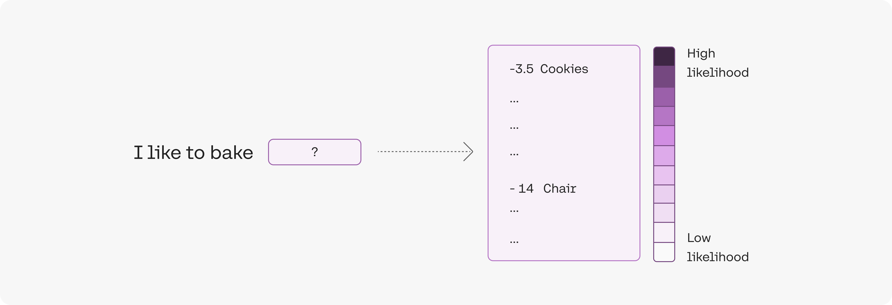

# Likeihood

LLM 模型通過閱讀從不同來源上抓取的文本來學習建模語言。給定一個句子，例如 `I like to bake cookies` ，要求模型重複預測下一個 token [?] 是什麼：

```console
I [?]
I like [?]
I like to [?]
I like to bake [?]
I like to bake cookies
```

該模型了解到單詞 `to` 很可能跟在英語中的單詞 `like` 後面，而單詞 `cookies` 很可能跟在單詞 `bake` 後面。

## 直覺

Token 的 **可能性** 可以被視為一個數字（通常在 `-15` 到 `0` 之間），用於量化模型對該標記在句子中使用的驚訝程度。如果 token 的可能性較低，則意味著模型預計不會使用該令牌。相反，如果一個令牌具有很高的可能性，則該模型有信心它會被使用。

對於我們的模型，`I like to` 句子中 `to` 的可能性大約為 -1.5。這是相當高的，意味著該模型相當有信心 `I like`的令牌後面會跟著 `to` 的令牌。

同樣，`I like to bake cookies` 這句話中出現 `cookies` 的可能性大約為 -3.5，比前面的例子要低一些。這很直觀，因為 `brownies` 或 `cake` 也是合理的選擇，但它仍然相當高。然而，如果我們將句子改為 `I like to bake chairs`，那麼出現象徵性椅子的可能性就會大大降低，約為 -14。這意味著模型對其在句子中的使用感到非常驚訝。

<figure markdown>
  
  <figcaption>一個 token 的 likelihood</figcaption>
</figure>

