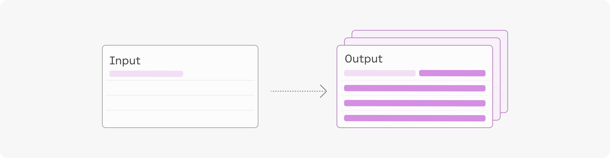

# Number of Generations

當您調用 `/generate` 的 API 端點時，您可以選擇在一次調用中產生出多個生成句子。這是通過設置 `num_generations` 參數來完成的。

<figure markdown>
  
  <figcaption>在單個 API 調用中生成多個輸出</figcaption>
</figure>

模型的輸出將根據您指定的生成設置（例如 `temperature`、`top-k` 和 `top-p`）而有所不同。

每一次的生成都有其一組 likelihood 值，其中包括：

- 每個生成令牌的可能性。
- 所有生成令牌的平均可能性。

## 範例

此範例使用輸入：`This curved gaming monitor delivers ...`

使用 maximum token set of 4 生成並按平均標記概率排序的輸出：

|LIKELIHOOD	|TEXT|
|-----------|----|
|-0.96	|a truly immersive experience|
|-1.11	|a virtually seamless view|
|-1.70	|the ultimate viewing experience|
|-2.15	|a 144Hz rapid|
|-2.44	|a comfortable and stylish|

您可以通過多種方式使用這些輸出，例如，選擇可能性最高的輸出作為最終輸出，或者將它們作為應用程序中的選項呈現。