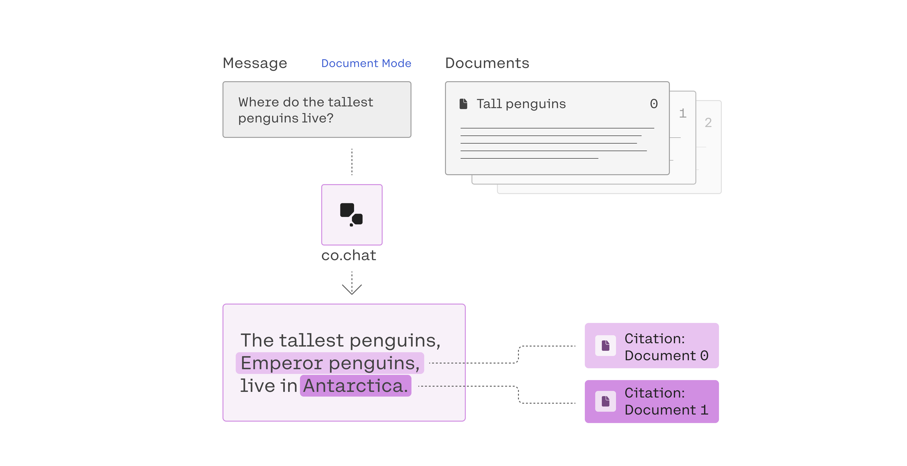
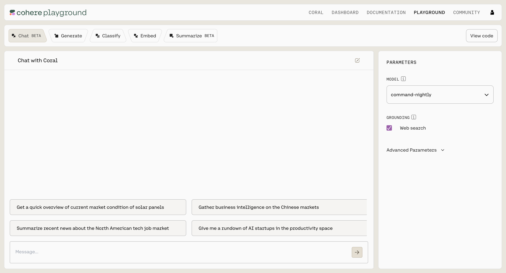
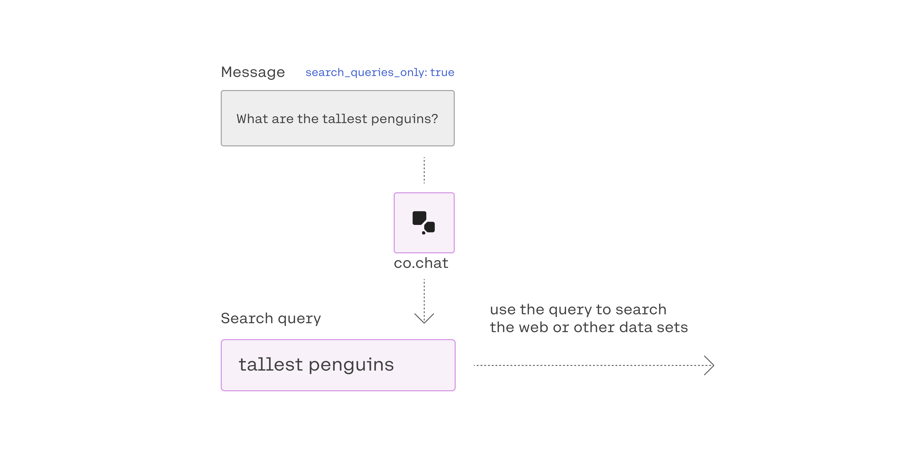
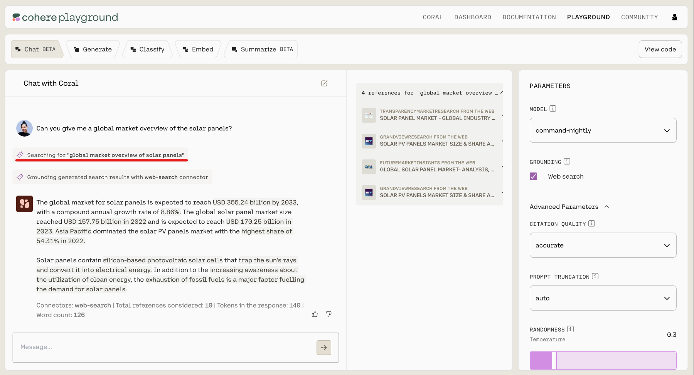
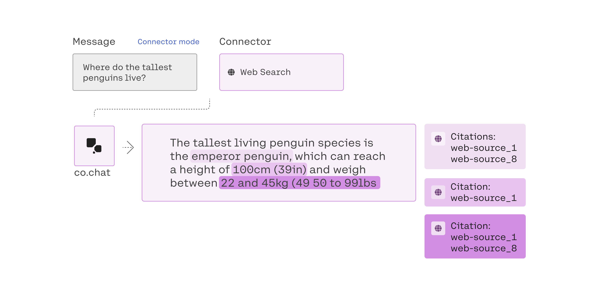
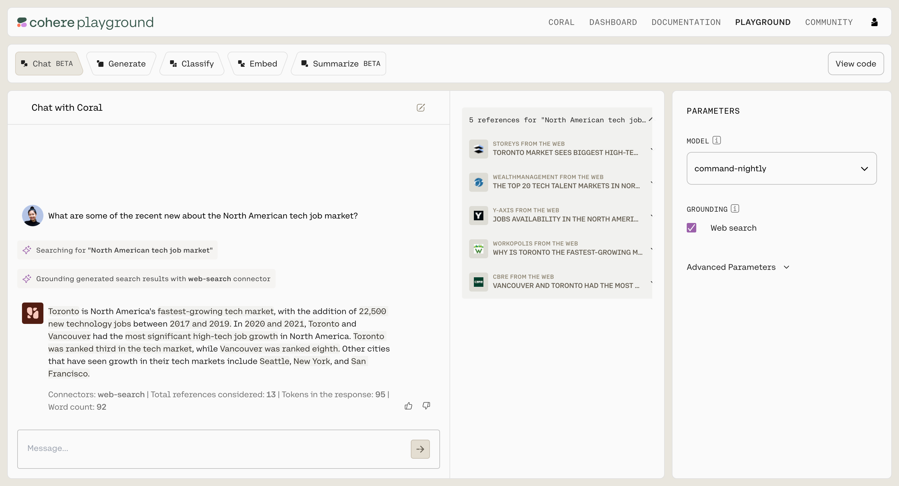

# Retrieval Augmented Generation (RAG)

## 什麼是檢索增強生成？

通過檢索增強生成（RAG），模型能夠利用附加信息來生成更準確的回覆。

## RAG 使什麼成為可能？

忽略所有棘手的技術細節，大型語言模型在生成輸出時所做的事情主要歸結為{==在給定它已經看到的一系列標記的情況下預測下一個最可能的標記==}。

儘管這個過程的結果通常令人驚訝，但眾所周知，大型語言模型也會在其回覆中產生事實上不正確、無意義或不完整的信息，這對於某些用例來說可能會出現問題。

RAG 通過提供模型可使用的源材料或資訊，大大減少了這個問題。該模型不是簡單地根據輸入提示生成輸出，而是可以從該材料中提取信息並將其合併到其回覆中。

這就像隨意詢問朋友對企鵝有什麼了解，與給他們一堆有關企鵝科學的書籍並（禮貌地！）要求他們引用來源之間的區別。

就目前情況而言，該源材料可以來自兩個地方之一：

- 用戶可以直接向地面回覆提供上下文豐富的文檔。
- 用戶可以指定文檔的位置（此模式通過“連接器”運行，我們將在下面更詳細地介紹）。

重要的是，如果模型找到了可以支撐其輸出的相關信息，它將包括引用，告訴您它從哪裡獲得信息；如果沒有發現任何相關性，則不會在輸出中添加任何引文。這些引文使用戶有機會自行評估回覆的準確性——要麼通過將回覆中包含的信息追溯到文檔中的來源，要么直接閱讀源材料以確保它確實支持回覆。

值得強調最後一部分。 RAG 不保證準確性。它涉及提供一個模型上下文來通知其回覆，但如果這些文檔本身過時、不准確或有偏見，那麼模型生成的任何內容也可能是這樣。更重要的是，RAG 並不能保證模型不會產生幻覺。它減少了問題，但不一定完全消除它。

RAG 還可以配置為模型僅返回建議的搜索查詢，而不是自行執行任何實際搜索。

## 如何使用 RAG？

RAG 和基本聊天功能之間的最大區別在於，我們將在 json 負載中包含一些特殊參數。

從概念上講，RAG 可以處於三種模式：

- 文檔模式（用戶的消息提供模型使用的信息）
- 查詢生成模式（用戶獲取模型生成的查詢作為輸出）
- 連接器模式（用戶的消息指向外部信息供模型使用）

我們將在以下部分中介紹所有三個內容。

## 文檔模式

我們要討論的第一個模式是“文檔模式”。文檔模式涉及用戶直接在消息中向模型提供他們自己的文檔，模型可以使用該文檔來進行回覆。



這是一個例子：

```json
{  "message": "Where do the tallest penguins live?",

  "documents": [{  
    "title": "Tall penguins",  
    "snippet": "Emperor penguins are the tallest."  
    },  
    {"title": "Penguin habitats",  
     "snippet": "Emperor penguins only live in Antarctica."  
	},  
    {"title": "What are animals?",  
    "snippet": "Animals are different from plants."  
	}  
 ],  
"prompt_truncation":"AUTO"  
}
```

輸出如下所示：

```json
{  
    "response_id": "ea9eaeb0-073c-42f4-9251-9ecef5b189ef",  
    "text": "The tallest penguins, Emperor penguins, live in Antarctica.",  
    "generation_id": "1b5565da-733e-4c14-9ff5-88d18a26da96",  
    "token_count": {  
        "prompt_tokens": 445,  
        "response_tokens": 13,  
        "total_tokens": 458,  
        "billed_tokens": 20  
    },  
    "meta": {  
        "api_version": {  
            "version": "2022-12-06"  
        }  
    },  
    "citations": [  
        {  
            "start": 22,  
            "end": 38,  
            "text": "Emperor penguins",  
            "document_ids": [  
                "doc_0"  
            ]  
        },  
        {  
            "start": 48,  
            "end": 59,  
            "text": "Antarctica.",  
            "document_ids": [  
                "doc_1"  
            ]  
        }  
    ],  
    "documents": [  
        {  
            "id": "doc_0",  
            "title": "Tall penguins",  
            "snippet": "Emperor penguins are the tallest.",  
            "url": ""  
        },  
        {  
            "id": "doc_1",  
            "title": "Penguin habitats",  
            "snippet": "Emperor penguins only live in Antarctica.",  
            "url": ""  
        }  
    ],  
    "search_queries": \[]  
}
```

如果您之前使用過聊天端點，那麼您會對其中的大部分內容感到熟悉，但有一些事情值得注意。

首先，觀察有效負載包含一個文檔列表，其中包含一個“片段”字段，其中包含我們希望模型使用的信息。每個文檔片段的建議長度相對較短，300 字或更少。我們建議使用與本示例中包含的字段名稱類似的字段名稱（即“title”和“snippet”），但 RAG 在構建文檔的方式方面非常靈活。您可以為字段指定任何您想要的名稱，也可以傳入其他字段，例如“日期”字段。所有字段名稱和字段值都傳遞給模型。

接下來，我們可以清楚地看到它已經使用了該文檔。我們的第一份文件說帝企鵝是最高的企鵝物種，第二份文件說帝企鵝只能在南極洲找到。該模型的回答成功地綜合了這兩個事實：“最高的企鵝，帝企鵝，生活在南極洲。”

最後，請注意，輸出包含一個引用對象，它不僅告訴我們模型依賴哪些文檔（使用“text”和“document_ids”字段），還告訴我們特定文檔支持的聲明的特定部分（使用“開始”和“結束”字段，這些跨度告訴我們回復中受支持的聲明的位置）。包含此引用對像是因為模型能夠使用所提供的文檔，但如果它無法使用為此，將不存在任何引用對象。

您可以在 chat playground 中嘗試 RAG。這是它的屏幕截圖：



## 查詢生成模式

在某些情況下，您可能更願意獲取模型建議的搜索查詢來查找信息，而不是其實際答覆。



這是通過將 `search_queries_only` 參數設置為 `true` （默認情況下為 `false`）來完成的。

這是一個例子：

```json
{  
  "message": "What are the tallest penguins?",  
  "search_queries_only": true  
}
```

這是輸出：

```json
{  
    "response_id": "25c15f38-c563-44f1-88f3-638224ffb75d",  
    "meta": {  
        "api_version": {  
            "version": "2022-12-06"  
        }  
    },  
    "is_search_required": true,  
    "search_queries": [  
        {  
            "text": "tallest penguins",  
            "generation_id": "06265f3a-1a6b-47d6-99a4-1efcc1ad3d3b"  
        }  
    ]  
}
```

在查詢生成模式下，模型會響應 “search_queries” 字段，該字段建議您可以輸入到搜索引擎或其他自然語言系統中以查找有用信息的查詢。該模型在查詢生成和連接器模式下都會生成自己的查詢，但在查詢生成模式下，該查詢是輸出。

我們加入此功能是為了提高我們產品的模塊化程度。例如，我們有將一系列 API 查詢鏈接在一起的用戶。換句話說，他們可能 1) 使用 Cohere 生成搜索查詢，2) 自己運行查詢，或者通過不同的自然語言系統運行查詢。

我們還有些用戶會在查詢生成模式下調用 co.chat()，然後再次調用 co.chat() 以發送從外部搜索獲得的文檔。

如果有一種方法可以獲取我們的模型生成的搜索查詢（這就是查詢生成模式的用途），那麼這種工作流程就更容易構建。

您還可以使用查詢生成模式來生成多個查詢。如果您發送諸如“最高的企鵝是什麼，最高的貓是什麼”之類的消息，模型將生成兩個單獨的查詢：

```json
{  
    "response_id": "f0640f9d-f373-465d-8a33-c5a4492fa143",  
    "meta": {  
        "api_version": {  
            "version": "2022-12-06"  
        }  
    },  
    "is_search_required": true,  
    "search_queries": [  
        {  
            "text": "tallest penguins",  
            "generation_id": "fcf6a711-95f7-475d-8e8b-c2fa82e04aed"  
        },  
        {  
            "text": "tallest cat",  
            "generation_id": "fcf6a711-95f7-475d-8e8b-c2fa82e04aed"  
        }  
    ]  
}
```

“search_queries” 對象現在包含兩個查詢，“tallest penguins” 和 “tallest cat”。

您可以在 chat playground 中查看查詢生成。這是它的屏幕截圖：



## 連接器模式

最後，如果您想將模型指向它應該使用的資料源而不是指定您自己的資料源源，則可以通過連接器模式來實現。



這是一個例子：

```json
{  
  "message": "What are the tallest living penguins?",  
  "connectors": [{"id": "web-search"}],  
  "prompt_truncation":"AUTO"  
}
```

輸出如下所示：

```json
{  
    "response_id": "a29d7080-11e5-43f6-bbb6-9bc3c187eed7",  
    "text": "The tallest living penguin species is the emperor penguin, which can reach a height of 100 cm (39 in) and weigh between 22 and 45 kg (49 to 99 lb).",  
    "generation_id": "1c60cb38-f92f-4054-b37d-566601de7e2e",  
    "token_count": {  
        "prompt_tokens": 1257,  
        "response_tokens": 38,  
        "total_tokens": 1295,  
        "billed_tokens": 44  
    },  
    "meta": {  
        "api_version": {  
            "version": "2022-12-06"  
        }  
    },  
    "citations": [  
        {  
            "start": 42,  
            "end": 57,  
            "text": "emperor penguin",  
            "document_ids": [  
                "web-search_1",  
                "web-search_8"  
            ]  
        },  
        {  
            "start": 87,  
            "end": 101,  
            "text": "100 cm (39 in)",  
            "document_ids": [  
                "web-search_1"  
            ]  
        },  
        {  
            "start": 120,  
            "end": 146,  
            "text": "22 and 45 kg (49 to 99 lb)",  
            "document_ids": [  
                "web-search_1",  
                "web-search_8"  
            ]  
        }  
    ],  
    "documents": [  
        {  
            "id": "web-search_1",  
            "title": "Emperor penguin - Wikipedia",  
            "snippet": "The emperor penguin (Aptenodytes forsteri) is the tallest and heaviest of all living penguin species and is endemic to Antarctica. The male and female are similar in plumage and size, reaching 100 cm (39 in) in length and weighing from 22 to 45 kg (49 to 99 lb).",  
            "url": "https://en.wikipedia.org/wiki/Emperor_penguin"  
        },  
        {  
            "id": "web-search_8",  
            "title": "The largest penguin that ever lived",  
            "snippet": "They concluded that the largest flipper bones belong to a penguin that tipped the scales at an astounding 154 kg. In comparison, emperor penguins, the tallest and heaviest of all living penguins, typically weigh between 22 and 45 kg.",  
            "url": "https://www.cam.ac.uk/stories/giant-penguin"  
        },  
        {  
            "id": "web-search_1",  
            "title": "Emperor penguin - Wikipedia",  
            "snippet": "The emperor penguin (Aptenodytes forsteri) is the tallest and heaviest of all living penguin species and is endemic to Antarctica. The male and female are similar in plumage and size, reaching 100 cm (39 in) in length and weighing from 22 to 45 kg (49 to 99 lb).",  
            "url": "https://en.wikipedia.org/wiki/Emperor_penguin"  
        },  
        {  
            "id": "web-search_1",  
            "title": "Emperor penguin - Wikipedia",  
            "snippet": "The emperor penguin (Aptenodytes forsteri) is the tallest and heaviest of all living penguin species and is endemic to Antarctica. The male and female are similar in plumage and size, reaching 100 cm (39 in) in length and weighing from 22 to 45 kg (49 to 99 lb).",  
            "url": "https://en.wikipedia.org/wiki/Emperor_penguin"  
        },  
        {  
            "id": "web-search_8",  
            "title": "The largest penguin that ever lived",  
            "snippet": "They concluded that the largest flipper bones belong to a penguin that tipped the scales at an astounding 154 kg. In comparison, emperor penguins, the tallest and heaviest of all living penguins, typically weigh between 22 and 45 kg.",  
            "url": "https://www.cam.ac.uk/stories/giant-penguin"  
        }  
    ],  
    "search_results": [  
        {  
            "search_query": {  
                "text": "tallest living penguins",  
                "generation_id": "12eda337-f096-404f-9ba9-905076304934"  
            },  
            "document_ids": [  
                "web-search_0",  
                "web-search_1",  
                "web-search_2",  
                "web-search_3",  
                "web-search_4",  
                "web-search_5",  
                "web-search_6",  
                "web-search_7",  
                "web-search_8",  
                "web-search_9"  
            ],  
            "connector": {  
                "id": "web-search"  
            }  
        }  
    ],  
    "search_queries": [  
        {  
            "text": "tallest living penguins",  
            "generation_id": "12eda337-f096-404f-9ba9-905076304934"  
        }  
    ]  
}
```

在連接器模式下，我們告訴模型使用“網絡搜索”連接器來找出最高的企鵝品種，而不是通過文檔參數傳遞源材料。如果您想知道其幕後工作原理，我們將在下一節中提供更多信息。

您可以在 chat playground 中嘗試此功能。這是它的屏幕截圖：



與文檔模式一樣，當聊天端點使用連接器生成響應時，它將在其輸出中包含引文對象。但是，如果模型無法找到任何合適的內容，則輸出中不會出現此類引用對象。

## 使用 RAG 的最佳實踐

我們經常發現，首先向基本模型提供提示，然後傳入文檔，然後利用互聯網搜索，這有助於迭代地構建查詢。它看起來像這樣：

- Start with a base request (`co.chat(“What is the tallest penguin?”`))
- Then, pass in documents, with `documents= [“”,...,””.]`
- Then, use internet search, with `connectors=[{"id": "web-search}`].

## 一個 RAG 常見用例

Cohere 平台的一個常見用例是構建一個應用程序，允許公司自己的員工查詢其數據。例如，一家跨國公司可能會為不同的國家/地區提供不同的假期，並且內部文檔的連接器將生成對“英國員工的下一個觀察的假期是什麼？”的準確答覆。

## 關於模型生成文本的警告

語言模型是根據來自互聯網和其他來源的大量人類編寫的數據進行訓練的，並且在測試階段可能會復制這些數據中發現的某些有問題的特徵。示例包括：

- 本質上是暴力或色情的圖片內容，或者與抑鬱或自殘有關的圖片內容。
- 人類、有感知力或具有與醫學、法律等相關的人類資格的印象。
- 歧視、仇恨言論、攻擊性笑話以及包含微妙偏見的內容，例如有害的刻板印像或抹殺少數群體身份。
- 錯誤信息或陰謀論。
- 包含進行犯罪或惡意活動的明確指示的指令。

還有更多風險並非源於訓練數據，而是當今所有語言模型的屬性。示例包括：

- 不正確的事實，從錯誤的日期到完全捏造的歷史事件和地標。你所問的問題越不為人所知，模型就越有可能是錯誤的。這對於醫療或法律問題尤其危險，我們不建議詢問。
- 不正確的引用，可能是虛構的引用材料，也可能是確實存在但與語言模型生成的事實不匹配的引用材料。
- 數學和代碼不正確。