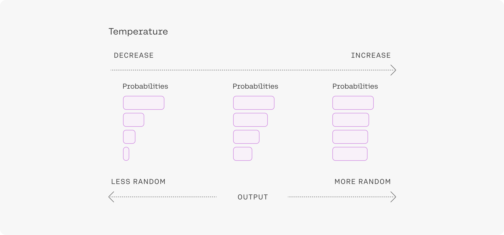

# Temperature

從生成模型中採樣包含隨機性，因此每次點擊“生成”時相同的提示可能會產生不同的輸出。`temperature` 是用於調整隨機程度的數字。

## 採樣時如何選取 temperature

`temperature` 越低，隨機性越小；`temperature` 為 0 將始終產生相同的輸出。當執行具有“正確”答案的任務（例如回答問題或總結）時，較低的`temperature` (小於 1) 更合適。如果模型開始重複，則表示 `temperature` 設的太低。

`temperature` 愈高意味著更多的隨機性，可以幫助模型給出更多創造性的輸出。如果模型開始偏離主題或給出無意義的輸出，則表明溫度過高。

<figure markdown>
  
  <figcaption>調整溫度設置</figcaption>
</figure>

可以針對不同的問題調整溫度，但大多數人會發現溫度 `1` 是一個很好的起點。

隨著序列變長，模型自然對其預測更加自信，因此您可以將長提示的溫度提高得更高，而不會偏離主題。相反，在短提示下使用高溫可能會導致輸出非常不穩定。

