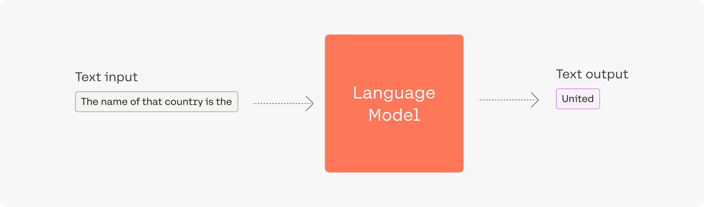
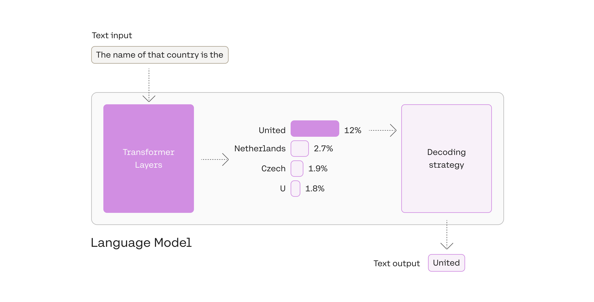
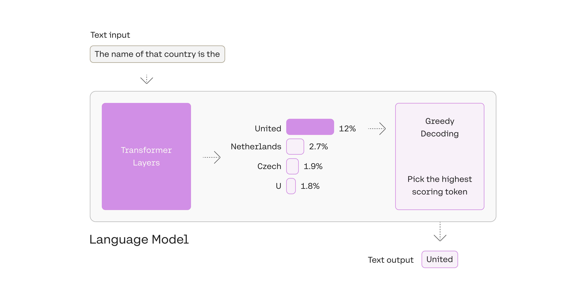
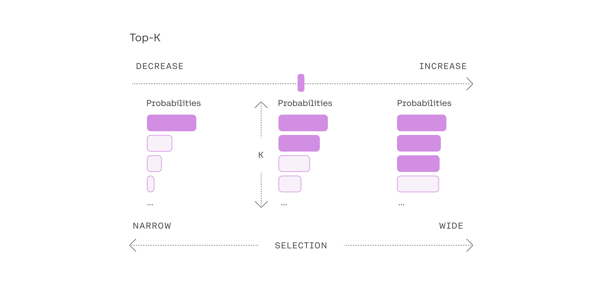
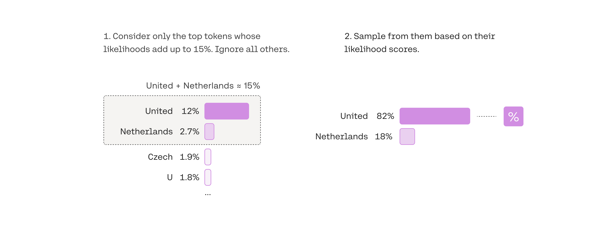

# Top-k & Top-p

用於選擇輸出標記的方法是使用語言模型成功生成文本的重要組成部分。有多種方法（也稱為解碼策略）用於選擇輸出標記，其中兩種主要方法是 `top-k` 採樣和 `top-p` 採樣。

讓我們看一下模型的輸入的提示的範例 `The name of that country is the`:

<figure markdown>
  
  <figcaption>生成語言模型的示例輸出</figcaption>
</figure>

本例中的輸出令牌 United，是在處理的最後一步中被選擇出來的 - 在語言模型處理輸入併計算詞彙表中每個標記的似然分數之後。該分數表示它將成為句子中下一個標記的可能性 (基於模型訓練的所有文本)。

<figure markdown>
  
  <figcaption>該模型計算其詞彙表中每個標記的可能性。然後解碼策略選擇一個作為輸出。</figcaption>
</figure>

## 1.選擇最上面的 token: greedy decoding

您可以在本例中看到，我們選擇了可能性最高的令牌 `United`。

<figure markdown>
  
  <figcaption>總是選擇得分最高的令牌稱為 "Greedy Decoding"。它很有用，但也有一些缺點。</figcaption>
</figure>

貪婪解碼是一種合理的策略，但也有一些缺點；例如，輸出可能會陷入重複循環。想想智能手機自動建議中的建議。當你不斷地選擇建議最高的單詞時，它可能會變成重複的句子。

## 2. 從排名靠前的 token 中選擇：`top-k`

另一種常用的策略是從前 3 個 token 的候選列表中進行抽樣。這種方法使其他高分標記有機會被選中。這種採樣引入的隨機性有助於在很多情況下提高生成質量。

<figure markdown>
  
  <figcaption>添加一些隨機性有助於使輸出文本更加自然。在 `top-3` 解碼中，我們首先列出三個標記，然後通過考慮它們的概率似然分數對其中一個進行採樣。</figcaption>
</figure>

更廣泛地說，選擇前三個標記意味著將 `top-k` 參數設置為 `3`。更改 `top-k` 參數可設置模型在輸出每個標記時從中採樣的入圍名單的大小。將 `top-k` 設置為 1 可以讓我們進行貪婪解碼。

<figure markdown>
  
  <figcaption>調整至 top-k 設置。</figcaption>
</figure>

## 3. 從概率加起來為 15% 的頂級令牌中挑選：top-p

選擇最佳 top-k 值的難度為動態設置令牌候選列表大小的流行解碼策略打開了大門。這種方法稱為核心採樣，通過選擇似然總和不超過特定值的頂部標記來創建候選列表。 `top-p` 值為 `0.15` 的簡單示例可能如下所示：

<figure markdown>
  
  <figcaption>在top-p中，候選名單的大小是根據達到某個閾值的似然分數之和動態選擇的。</figcaption>
</figure>

`Top-p` 通常設置為一個較高的值（如 `0.75`），目的是限制可能被採樣的低概率令牌的長尾。我們可以同時使用 `top-k` 和 `top-p`。如果 k 和 p 都啟用，則 p 在 k 之後起作用。

