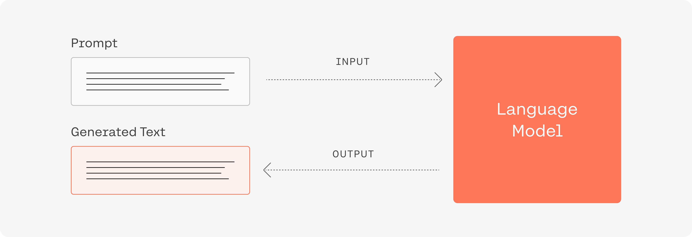
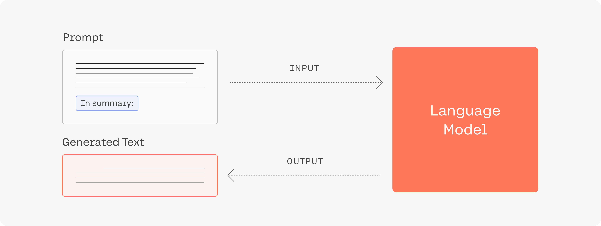
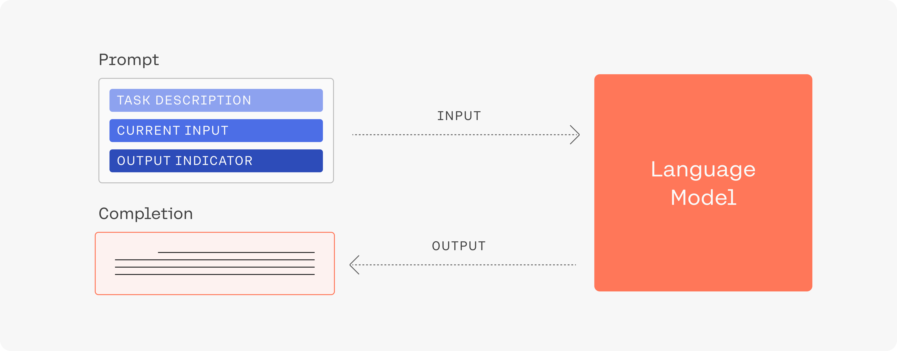
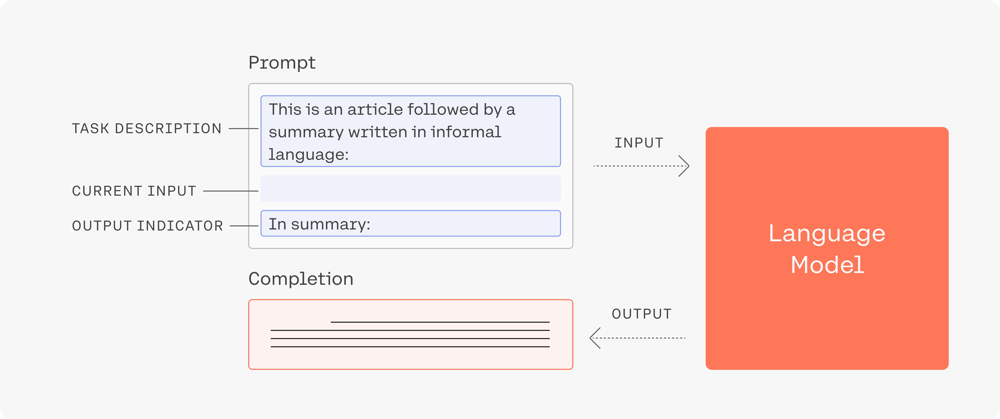
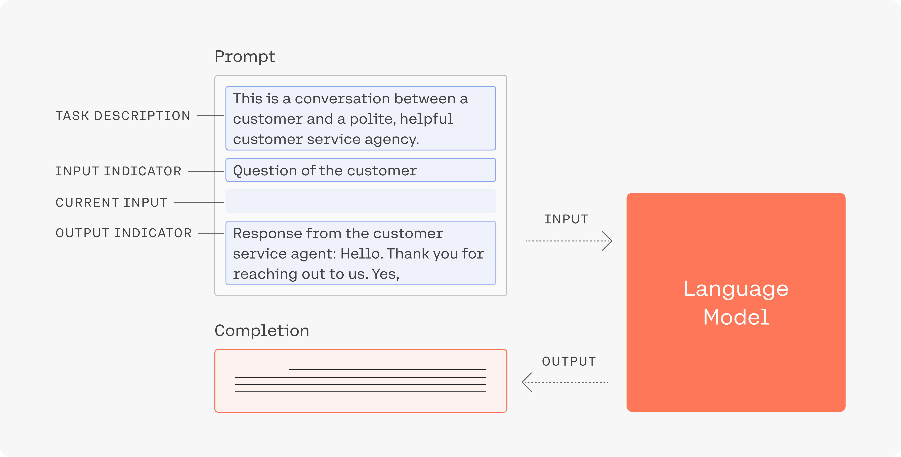
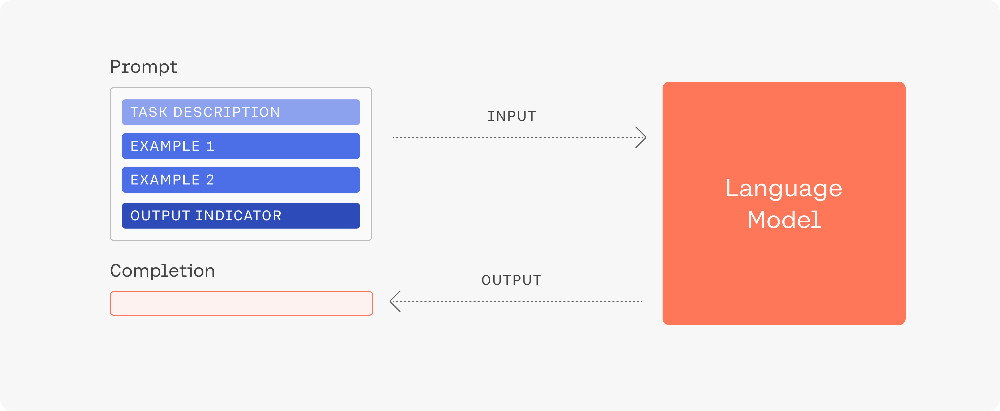
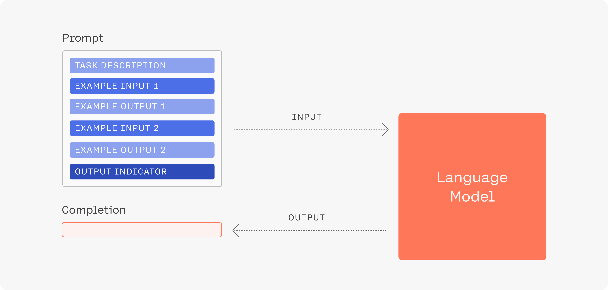
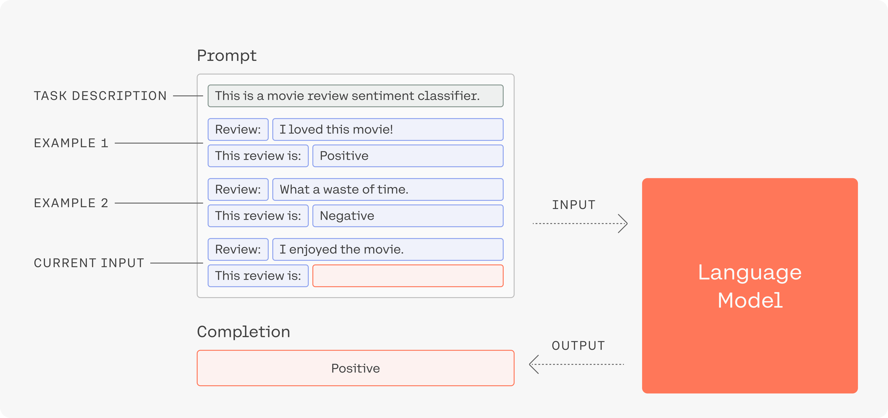

# Prompt Engineering

在這裡，我們討論一些編寫提示（模型的輸入）的原則和技術，這將幫助您為您的任務獲得最佳生成。選擇合適的 `temperature` 也會對生成質量產生很大影響。我們會有額外的文章來單獨討論 `temperature`。



## 主要原則

我們發現在為模型設計提示(prompt)時需要牢記兩個主要思維。

### 1. 提示引導模型生成有用的輸出

例如，如果您需要一篇文章的摘要，那麼如果您像這樣引導它，那麼經過足夠數據訓練的大型語言模型可以生成摘要：

<figure markdown>
  
  <figcaption>該提示由兩個部分組成：您想要總結的文本和任務描述。</figcaption>
</figure>

### 2. 嘗試多種提示形式以獲得最佳生成

使用生成時，針對您要解決的問題嘗試一系列不同的提示非常有用。對人類來說可能聽起來相似的同一提示的不同表述可能會導致彼此截然不同的生成結果。例如，這種情況可能會發生，因為我們的模型已經了解到不同的公式實際上用於非常不同的環境和不同的目的。下面我們給出了一些我們發現對於不同任務特別有效的示例。

在 summarization 示例中，如果包含短語 “In summary” 並不能產生良好的生成效果，我們可能需要嘗試其他替代方案，例如 “To summarize in plain language,” 或 “The main point to take from this article is that” 。

此外，您還可以使用 playground 中的 likelihood 功能來查看模型是否難以理解特定的單詞、短語或結構。但是，請記住，token 的平均可能性在序列開頭始終很高。該模型可能會在您第一次引入新概念或名稱時將較低的可能性分配給您，但在看到新術語後，它可以輕鬆地在生成中使用它。您還可以使用可能性功能來查看是否有任何拼寫或標點符號造成標記化問題。

### 3. 描述任務和總體設置

<figure markdown>
  
  <figcaption>在任務描述中包含其他組成部分通常很有用。當然，這些往往出現在我們嘗試處理的輸入文本之後。</figcaption>
</figure>

為模型提供足夠的上下文。例如，在包含我們希望模型總結的文章之前，我們可以更詳細地描述總結任務。

<figure markdown>
  
  <figcaption>示例：塑造我們需要模型執行的任務可能涉及在我們要處理的輸入文本之前和之後使用文本。</figcaption>
</figure>

讓我們通過查看另一個示例來考慮更多方面。假設您想使用我們的模型通過自動生成對客戶請求的合理響應來協助您的客戶滿意度部門（注意：這些生成不會發送給客戶，這只是一個模擬）。

一位客戶聯繫您的公司並提出以下問題：

```console
Hi, I'd like a refund for the coffee maker I ordered. Would that be possible?
```

我們如何圍繞此設計提示，以便為客服人員與客戶交互提供有用的生成？讓我們首先告訴我們的模型一般設置是什麼以及提示的其餘部分將包含什麼：

```console
This is a conversation between a customer and a polite, helpful customer service agent. Question of the customer: Hi, I'd like a refund for the coffee maker I ordered. Would that be possible?
```

太好了，我們已經告訴我們的模型會發生什麼，並明確表示我們的查詢是客戶問題。接下來，讓我們向模型展示我們想要向客戶提供的響應的開始部分。

```console
Response by the customer service agent: Hello, thank you for reaching out to us. Yes,
```

請注意我們如何清楚地表明下一句話是對問題的答复，它來自客戶服務代理，並且我們希望給出肯定的答案。將所有這些放在一起，我們得到以下提示：

```console
This is a conversation between a customer and a polite, helpful customer service agent.
Question of the customer: Hi, I'd like a refund for the coffee maker I ordered. Would that be possible?
Response by the customer service agent: Hello, thank you for reaching out to us. Yes,
```

<figure markdown>
  
  <figcaption>提示的某些組件（例如輸入和輸出指示器）對於向模型描述所需的任務非常有用，特別是當提示中包含多個示例時（如下圖所示）。</figcaption>
</figure>

多次將其輸入到我們的 Medium 模型中會產生以下完成結果：

- Yes, we are able to accept returns if the product is unused and unopened.
- Yes, we are happy to refund your purchase. However, we do require you to return the item to our store for a full refund.
- Yes, we can do that. Please send us a message with your name, phone number, and the reason for the refund. We will get back to you as soon as possible.

請注意，儘管這是一個簡化的示例，但我們僅使用少量的客戶服務交互就可以從基線模型中獲得合理的完成結果！通過根據您希望模型如何處理特定問題和請求的示例進行微調，可以進一步改進這一點。

### 4. 向模型展示你想看到的內容

<figure markdown>
  
  <figcaption>在提示中添加範例是實現良好生成的關鍵之一。範例向模型展示了我們目標的輸出類型。</figcaption>
</figure>

舉幾個你想要的生成類型的例子。這稱為小樣本學習(few-shot learning)。讓我們看一個例子。假設您想使用我們的模型來分類電影評論是正面、負面還是中立。想像一下，您將以下提示輸入到我們的模型中：

```console
Review: "I really enjoyed this movie!"
This sentiment of this review is
```

根據我們的 Medium 模型的提示，實際生成如下：

```console
This sentiment of this review is apt, considering the movie's plot,
```

顯然，這不是我們想要的。

<figure markdown>
  
  <figcaption>提示中的示例應包括示例輸入和我們希望模型模擬的輸出。</figcaption>
</figure>

如果我們將所有這些整合到一個新的提示中，中等一代模型就會可靠地產生積極的結果。

```console
This is a movie review sentiment classifier. Review: "I loved this movie!" This review is positive. Review: "I don't know, it was ok I guess.." This review is neutral. Review: "What a waste of time, would not recommend this movie." This review is negative. Review: "I really enjoyed this movie!" This review is
```

此提示的更簡單版本可以如下所示：


<figure markdown>
  
  <figcaption>一個將高質量提示的組件組合在一起的示例。它還可以幫助重複每個示例的任務描述，以強調對模型的指導。</figcaption>
</figure>

Few-shot generations 通常更適合我們較大的模型。您可以使用 likelihood 端點來查看模型對於示例中給出的正確答案的不確定性。

如果此命令格式不起作用，請嘗試更基於散文的結構。與生成模型交互的一種直觀方法是為其提供與您想要的生成類型相關的命令，例如給出一個藝術職業列表：然而，由於我們的模型看到的大部分文本都是互聯網文章，有時這種寫作方式會被誤解。將命令改寫為散文會產生所需的輸出：

```console
The table lists the following professions as artistic careers: 1. Painter 2.
```

一般來說，您可能想要嘗試不同的寫作風格，直到獲得有效的東西。例子包括以新聞文章、博客文章或對話的風格寫作。

## 範例

在這裡，我們通過查看兩個特定任務來展示如何應用上述原則：根據給定的段落生成關鍵字，並根據一些現有示例生成其他示例。

關鍵字生成：假設我們有一些文本段落，我們希望使用文本中出現的最相關的概念自動標記這些文本段落。

通過結合上面討論的一些技術，我們可以生成這樣的結果！首先我們在開頭說明這個提示的設置是什麼。然後，我們向模型展示我們希望它執行的兩個示例：將約翰·馮·諾依曼的維基百科頁面中的一段段落標記為“約翰·馮·諾依曼”，並將維基百科中關於女權主義的頁面中的一段段落標記為“女權主義”。最後，我們為模型提供了 Python 維基百科頁面上的一段話。

```console
This is a bot that automatically finds the most important keyword for a given text passage.

Text: "John von Neumann (/vɒn ˈnɔɪmən/; Hungarian: Neumann János Lajos, pronounced [ˈnɒjmɒn ˈjaːnoʃ ˈlɒjoʃ]; December 28, 1903 – February 8, 1957) was a Hungarian-American mathematician, physicist, computer scientist, engineer and polymath. Von Neumann was generally regarded as the foremost mathematician of his time[2] and said to be "the last representative of the great mathematicians".[3] He integrated pure and applied sciences."

Most important key word: "John von Neumann"

Text: "Some scholars consider feminist campaigns to be a main force behind major historical societal changes for women's rights, particularly in the West, where they are near-universally credited with achieving women's suffrage, gender-neutral language, reproductive rights for women (including access to contraceptives and abortion), and the right to enter into contracts and own property.[9] Although feminist advocacy is, and has been, mainly focused on women's rights, some feminists argue for the inclusion of men's liberation within its aims, because they believe that men are also harmed by traditional gender roles.[10] Feminist theory, which emerged from feminist movements, aims to understand the nature of gender inequality by examining women's social roles and lived experience; feminist theorists have developed theories in a variety of disciplines in order to respond to issues concerning gender."

Most important key word:  "Feminism"

Text: "Guido van Rossum began working on Python in the late 1980s, as a successor to the ABC programming language, and first released it in 1991 as Python 0.9.0.[31] Python 2.0 was released in 2000 and introduced new features, such as list comprehensions and a garbage collection system using reference counting and was discontinued with version 2.7.18 in 2020.[32] Python 3.0 was released in 2008 and was a major revision of the language that is not completely backward-compatible and much Python 2 code does not run unmodified on Python 3."

Most important key word:
```

此提示可靠地生成“Python”作為答案 - 有時還會返回“Guido van Rossum”，這是另一個看似合理的選項。

樣例生成。一個常見的任務是嘗試讓模型根據某些描述生成示例。按照以下樣式將提示制定為列表往往效果很好。

```console
This is a list of ideas for blog posts for tourists visiting Toronto: 1. The best sights to see in Toronto 2. My favourite walks in Toronto
```

這給了我們幾句子生成，例如：

```console
3. An overview of Toronto 4. Toronto events 5. Restaurants in Toronto 6. Shopping in Toronto 7. Travel tips for Toronto 8. Sightseeing in Toronto 9. What to do in Toronto
```

