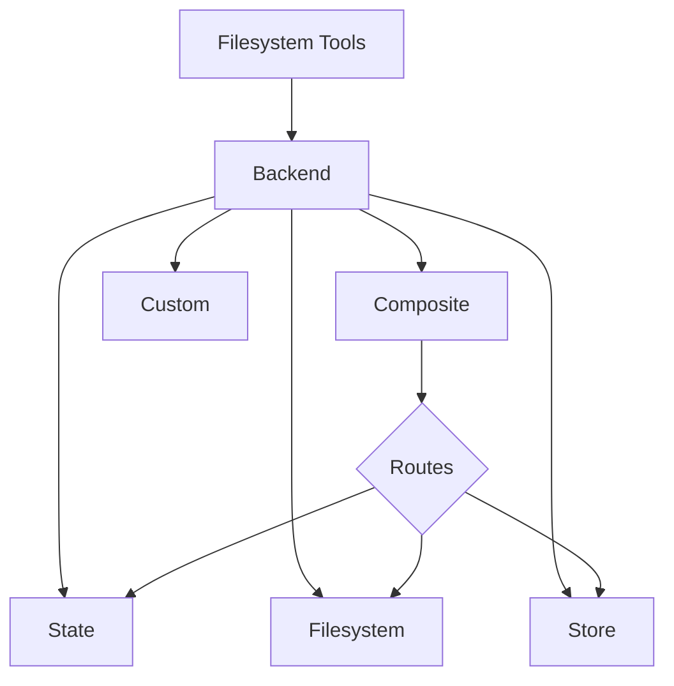

# Backends

為 deep agents 選擇和設定 filesystem tools 的 backends。您可以指定到不同後端的路由，實現虛擬檔案系統，並強制執行策略。

Deep agents 透過諸如 `ls`, `read_file`, `write_file`, `edit_file`, `glob` 和 `grep` 等 tools 向 agent 程式暴露檔案系統介面。這些 tools 透過可插拔的 backend 運作。



本頁說明如何[選擇 backend](https://docs.langchain.com/oss/python/deepagents/backends#specify-a-backend)、[將不同的路徑路由到不同的 backend](https://docs.langchain.com/oss/python/deepagents/backends#route-to-different-backends)、[實現自己的虛擬檔案系統](https://docs.langchain.com/oss/python/deepagents/backends#use-a-virtual-filesystem)（例如 S3 或 Postgres）、[新增 policy hooks](https://docs.langchain.com/oss/python/deepagents/backends#add-policy-hooks) 以及[遵守後端協定](https://docs.langchain.com/oss/python/deepagents/backends#protocol-reference)。

## Quickstart

以下是一些預先建置的檔案系統後端，您可以快速將其與您的 deep agent 程式一起使用：

| Built-in backend | Description |
| ---------------- | ----------- |
| [Default](https://docs.langchain.com/oss/python/deepagents/backends#statebackend-ephemeral) | `agent = create_deep_agent()` <br/> 狀態為臨時狀態。Agent 的預設檔案系統後端儲存在 langgraph 的 state 中。請注意，此檔案系統僅在單一執行緒期間持久存在。|
| [Local filesystem persistence](https://docs.langchain.com/oss/python/deepagents/backends#filesystembackend-local-disk)| `agent = create_deep_agent(backend=FilesystemBackend(root_dir="/Users/nh/Desktop/"))` <br/> 這樣，deep agent 就能存取本機的檔案系統。您可以指定 agent 可以存取的根目錄。請注意，提供的任何 `root_dir` 都必須是絕對路徑。|
| [Durable store (LangGraph store)](https://docs.langchain.com/oss/python/deepagents/backends#storebackend-langgraph-store)| `agent = create_deep_agent(backend=lambda rt: StoreBackend(rt))`<br/>這使得 agent 程式能夠存取跨執行緒持久化的長期儲存。這非常適合儲存長期記憶或在多次執行中都適用於 agent 程式的指令。|
| [Composite](https://docs.langchain.com/oss/python/deepagents/backends#compositebackend-router) |預設為暫存，/`memories/` 目錄會持久化。複合後端具有極高的靈活性。您可以在檔案系統中指定不同的路由，指向不同的後端。請參閱下面的複合路由範例，此範例可直接貼上。|


## Built-in backends

### StateBackend (ephemeral)

```python
# By default we provide a StateBackend
agent = create_deep_agent()

# Under the hood, it looks like
from deepagents.backends import StateBackend

agent = create_deep_agent(
    backend=(lambda rt: StateBackend(rt))   # Note that the tools access State through the runtime.state
)
```

**工作原理**:

- 將檔案儲存在目前執行緒的 LangGraph 代理的 state。
- 透過 checkpoints，在同一對話緒上 multiple agent turns 時保持資料持久化。

**適合**:

- 供 agent 程序記錄中間結果的 scratch pad。
- 自動清除 large tool outputs，agent 程式隨後可以逐段讀取這些輸出。

### FilesystemBackend (local disk)

```python
from deepagents.backends import FilesystemBackend

agent = create_deep_agent(
    backend=FilesystemBackend(root_dir=".", virtual_mode=True)
)
```

**工作原理**:

- 讀取/寫入可設定 `root_dir` 下的真實檔案。
- 您可以選擇設定 `virtual_mode=True` 來對根目錄下的路徑進行沙盒隔離和規範化。
- 使用安全路徑解析，盡可能防止不安全的符號連結遍歷，並可使用 `ripgrep` 實現快速 `grep`。

**適合**:

- 您機器上的本機項目
- CI sandboxes
- 已掛載的持久卷

### StoreBackend (LangGraph Store)

```python
from langgraph.store.memory import InMemoryStore
from deepagents.backends import StoreBackend

agent = create_deep_agent(
    backend=(lambda rt: StoreBackend(rt)),   # Note that the tools access Store through the runtime.store
    store=InMemoryStore()
)
```

**工作原理**:

- 將檔案儲存在運行時提供的 LangGraph `BaseStore` 中，從而實現跨對話緒上持久性儲存。

**適合**:

- 當您已經執行配置好的 LangGraph 儲存（例如，Redis, Postgres 或 `BaseStore` 背後的雲端實作）。
- 當您透過 LangSmith Deployment 部署 agent 程式時（系統會自動為您的代理程式配置儲存）。

### CompositeBackend (router)

```python
from deepagents import create_deep_agent
from deepagents.backends import CompositeBackend, StateBackend, StoreBackend
from langgraph.store.memory import InMemoryStore

composite_backend = lambda rt: CompositeBackend(
    default=StateBackend(rt),
    routes={
        "/memories/": StoreBackend(rt),
    }
)

agent = create_deep_agent(
    backend=composite_backend,
    store=InMemoryStore()  # Store passed to create_deep_agent, not backend
)
```

**工作原理**:

- 根據路徑前綴將檔案操作路由到不同的 backends。
- 在清單和搜尋結果中保留原始路徑前綴。

**適合**:

- 當您希望為 agent 程式提供臨時儲存和跨對話緒儲存時，複合後端可讓您同時提供狀態後端和儲存後端。
- 當您希望將多個資訊來源作為單一檔案系統的一部分提供給 agent 程式時，複合後端尤其適用。
    - 例如，您在一個儲存的 `/memories/` 目錄下儲存了長期記憶，同時您還有一個自訂後端，其文件可透過 `/docs/` 存取。

## Specify a backend

- 向 `create_deep_agent(backend=...)` 傳遞一個後端位址。檔案系統中間件會使用它來進行所有工具操作。
- 你可以選擇以下兩種方式之一：
    - 實作 `BackendProtocol` 的實例（例如，`FilesystemBackend(root_dir=".")`），或
    - 一個 factory 類別 `BackendFactory = Callable[[ToolRuntime], BackendProtocol]`（用於需要運行時的後端，例如 `StateBackend` 或 `StoreBackend`）。
- 如果省略，則預設值為 `lambda rt: StateBackend(rt)`。

## Route to different backends

將命名空間的不同部分路由到不同的 backends。通常用於持久化 `/memories/*` 目錄，而將其他所有內容保持臨時狀態。

```python
from deepagents import create_deep_agent
from deepagents.backends import CompositeBackend, StateBackend, FilesystemBackend

composite_backend = lambda rt: CompositeBackend(
    default=StateBackend(rt),
    routes={
        "/memories/": FilesystemBackend(root_dir="/deepagents/myagent", virtual_mode=True),
    },
)

agent = create_deep_agent(backend=composite_backend)
```

**行為**:

- `/workspace/plan.md` → StateBackend（暫存）
- `/memories/agent.md` → `/deepagents/myagent` 下的 FilesystemBackend
- `ls`, `glob`, `grep` 指令匯總結果並顯示原始路徑前綴。

**筆記**:

- 較長的前綴優先（例如，路由 `/memories/projects/` 可以覆蓋 `/memories/`）。
- 對於 StoreBackend 路由，請確保 agent 程式 runtime 時提供了一個儲存空間（`runtime.store`）。

## Use a virtual filesystem

建立自訂後端，將遠端或資料庫檔案系統（例如 S3 或 Postgres）投影到 tools 命名空間中。

**設計指南**:

- 路徑為絕對路徑（例如 `/x/y.txt`）。請確定如何將其對應到您的 storage keys/rows。
- 有效率地實作 `ls_info` 和 `glob_info` 函數（如果可用，則使用伺服器端清單；否則，使用本機篩選器）。
- 對於缺少的檔案或無效的正規表示式模式，傳回使用者可讀的錯誤字串。
- 對於外部持久化，請在結果中設定 `files_update=None`；只有內部持久化的後端才應傳回 `files_update` 字典。

**S3-style outline**:

```python
from deepagents.backends.protocol import BackendProtocol, WriteResult, EditResult
from deepagents.backends.utils import FileInfo, GrepMatch

class S3Backend(BackendProtocol):
    def __init__(self, bucket: str, prefix: str = ""):
        self.bucket = bucket
        self.prefix = prefix.rstrip("/")

    def _key(self, path: str) -> str:
        return f"{self.prefix}{path}"

    def ls_info(self, path: str) -> list[FileInfo]:
        # List objects under _key(path); build FileInfo entries (path, size, modified_at)
        ...

    def read(self, file_path: str, offset: int = 0, limit: int = 2000) -> str:
        # Fetch object; return numbered content or an error string
        ...

    def grep_raw(self, pattern: str, path: str | None = None, glob: str | None = None) -> list[GrepMatch] | str:
        # Optionally filter server‑side; else list and scan content
        ...

    def glob_info(self, pattern: str, path: str = "/") -> list[FileInfo]:
        # Apply glob relative to path across keys
        ...

    def write(self, file_path: str, content: str) -> WriteResult:
        # Enforce create‑only semantics; return WriteResult(path=file_path, files_update=None)
        ...

    def edit(self, file_path: str, old_string: str, new_string: str, replace_all: bool = False) -> EditResult:
        # Read → replace (respect uniqueness vs replace_all) → write → return occurrences
        ...
```

**Postgres-style outline**:

- 資料表 `files(path text primary key, content text, created_at timestamptz, modified_at timestamptz)`
- 將 tool operations 對應到 SQL:
    - `ls_info` 使用 `WHERE path LIKE $1 || '%'`
    - `glob_info` 在 SQL 中進行過濾，或先取得數據，然後在 Python 中套用 glob 模式
    - `grep_raw` 可以按副檔名或最後修改時間取得候選 rows，然後掃描 lines


## Add policy hooks

透過子類化或封裝後端來強制執行企業規則。

阻止在選取前綴（子類別）下的寫入/編輯操作：

```python
from deepagents.backends.filesystem import FilesystemBackend
from deepagents.backends.protocol import WriteResult, EditResult

class GuardedBackend(FilesystemBackend):
    def __init__(self, *, deny_prefixes: list[str], **kwargs):
        super().__init__(**kwargs)
        self.deny_prefixes = [p if p.endswith("/") else p + "/" for p in deny_prefixes]

    def write(self, file_path: str, content: str) -> WriteResult:
        if any(file_path.startswith(p) for p in self.deny_prefixes):
            return WriteResult(error=f"Writes are not allowed under {file_path}")
        return super().write(file_path, content)

    def edit(self, file_path: str, old_string: str, new_string: str, replace_all: bool = False) -> EditResult:
        if any(file_path.startswith(p) for p in self.deny_prefixes):
            return EditResult(error=f"Edits are not allowed under {file_path}")
        return super().edit(file_path, old_string, new_string, replace_all)
```

通用封裝器（適用於任何後端）：

```python
from deepagents.backends.protocol import BackendProtocol, WriteResult, EditResult
from deepagents.backends.utils import FileInfo, GrepMatch

class PolicyWrapper(BackendProtocol):
    def __init__(self, inner: BackendProtocol, deny_prefixes: list[str] | None = None):
        self.inner = inner
        self.deny_prefixes = [p if p.endswith("/") else p + "/" for p in (deny_prefixes or [])]

    def _deny(self, path: str) -> bool:
        return any(path.startswith(p) for p in self.deny_prefixes)

    def ls_info(self, path: str) -> list[FileInfo]:
        return self.inner.ls_info(path)
    def read(self, file_path: str, offset: int = 0, limit: int = 2000) -> str:
        return self.inner.read(file_path, offset=offset, limit=limit)
    def grep_raw(self, pattern: str, path: str | None = None, glob: str | None = None) -> list[GrepMatch] | str:
        return self.inner.grep_raw(pattern, path, glob)
    def glob_info(self, pattern: str, path: str = "/") -> list[FileInfo]:
        return self.inner.glob_info(pattern, path)
    def write(self, file_path: str, content: str) -> WriteResult:
        if self._deny(file_path):
            return WriteResult(error=f"Writes are not allowed under {file_path}")
        return self.inner.write(file_path, content)
    def edit(self, file_path: str, old_string: str, new_string: str, replace_all: bool = False) -> EditResult:
        if self._deny(file_path):
            return EditResult(error=f"Edits are not allowed under {file_path}")
        return self.inner.edit(file_path, old_string, new_string, replace_all)
```


## Protocol reference

Backends 必須實現 `BackendProtocol`。

**所需 endpoints**:

- `ls_info(path: str) -> list[FileInfo]`
    - 傳回至少包含路徑的 entries。如果可用，請包含 `is_dir`, `size` 和 `modified_at`。按路徑排序以獲得確定性輸出。
- `read(file_path: str, offset: int = 0, limit: int = 2000) -> str`
    - 返回編號的內容。如果檔案缺失，則傳回 "Error: File '/x' not found"。
- `grep_raw(pattern: str, path: Optional[str] = None, glob: Optional[str] = None) -> list[GrepMatch] | str`
    - 傳回結構化匹配項。對於無效的正規表示式，傳回類似 "Invalid regex pattern: ..." 的字串（不引發異常）。
- `glob_info(pattern: str, path: str = "/") -> list[FileInfo]`
    - 傳回符合的文件作為 `FileInfo` 條目（如果沒有符合的文件，則傳回空列表）。
- `write(file_path: str, content: str) -> WriteResult`
    - 僅創建。發生衝突時，回傳 `WriteResult(error=...)`。成功時，設定路徑，對於狀態後端，設定 `files_update={...}`；外部後端應使用 `files_update=None`。
- `edit(file_path: str, old_string: str, new_string: str, replace_all: bool = False) -> EditResult`
    - 除非 `replace_all=True`，否則強制 `old_string` 唯一。如果找不到匹配項，則傳回錯誤。成功時包含匹配項。

**支援型別**:

- `WriteResult(error, path, files_update)`
- `EditResult(error, path, files_update, occurrences)`
- `FileInfo`，欄位：`path`（必要），可選欄位：`is_dir`, `size`, `modified_at`。
- `GrepMatch`，欄位：`path`, `line`, `text`。