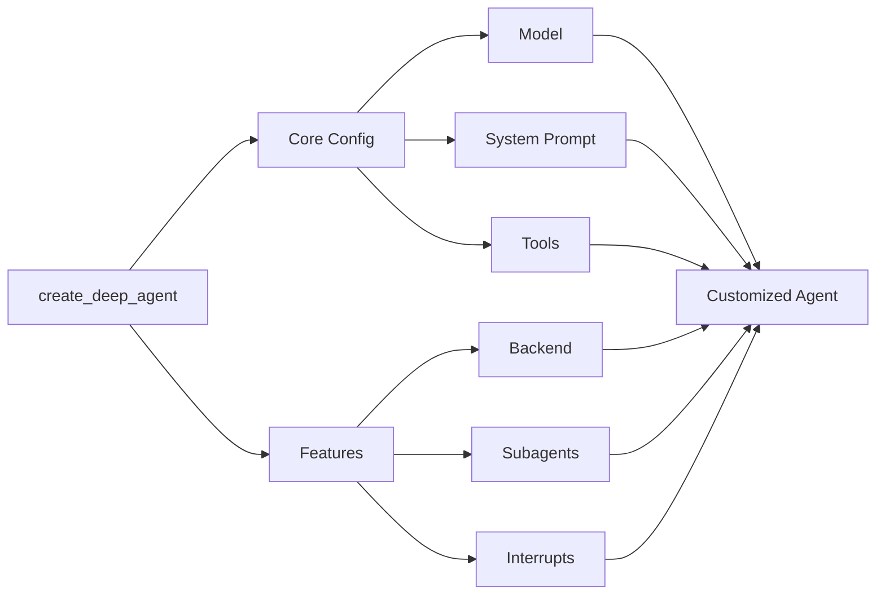

# Customize Deep Agents

了解如何使用系統提示、工具、子代理等功能來客制 deep agents。



## Model

預設情況下，deepagents 使用 `claude-sonnet-4-5-20250929` 模型。您可以透過傳遞任何受支援的 model identifier string 或 LangChain 模型物件來自訂使用的模型。

=== "Model string"
    ```python
    from langchain.chat_models import init_chat_model
    from deepagents import create_deep_agent

    model = init_chat_model(model="gpt-5")
    agent = create_deep_agent(model=model)
    ```

=== "LanChain model object"
    ```python
    from langchain_ollama import ChatOllama
    from langchain.chat_models import init_chat_model
    from deepagents import create_deep_agent

    model = init_chat_model(
                model=ChatOllama(
                    model="llama3.1",
                    temperature=0,
                    # other params...
                )
            )

    agent = create_deep_agent(model=model)
    ```

## System prompt

深度代理內建了一個 system prompt，其靈感來自 Claude Code 的 system prompt。預設系統提示字元包含使用內建規劃工具、檔案系統工具和子代理程式的詳細說明。

每個針對特定用例自訂的深度代理程式都應包含一個針對該用例的自訂系統提示字元。

```python
from deepagents import create_deep_agent

research_instructions = """\
You are an expert researcher. Your job is to conduct \
thorough research, and then write a polished report. \
"""

agent = create_deep_agent(
    system_prompt=research_instructions,
)
```

## Tools

與 tool-calling agents 一樣，深度代理也會獲得一組它可以存取的頂級工具。

```python
import os
from typing import Literal
from tavily import TavilyClient
from deepagents import create_deep_agent

tavily_client = TavilyClient(api_key=os.environ["TAVILY_API_KEY"])

def internet_search(
    query: str,
    max_results: int = 5,
    topic: Literal["general", "news", "finance"] = "general",
    include_raw_content: bool = False,
):
    """Run a web search"""
    return tavily_client.search(
        query,
        max_results=max_results,
        include_raw_content=include_raw_content,
        topic=topic,
    )

agent = create_deep_agent(
    tools=[internet_search]
)
```

除了您提供的任何工具外，深度代理還可以存取一些預設工具：

- `write_todos` – Update the agent’s to-do list
- `ls` – List all files in the agent’s filesystem
- `read_file` – Read a file from the agent’s filesystem
- `write_file` – Write a new file in the agent’s filesystem
- `edit_file` – Edit an existing file in the agent’s filesystem
- `task` – Spawn a subagent to handle a specific task
