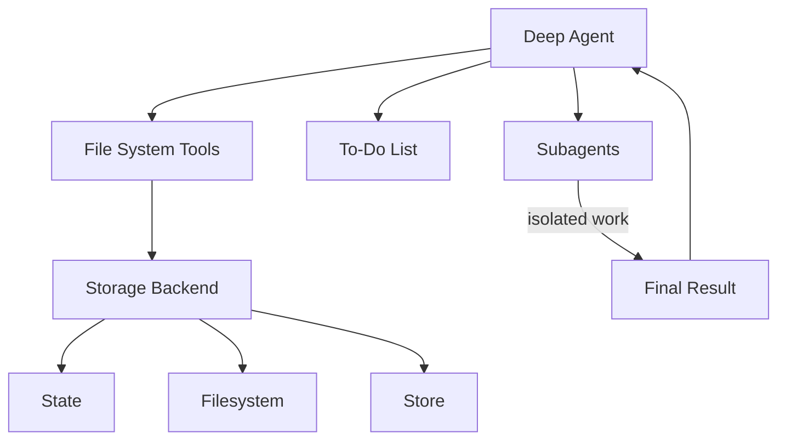

# Agent harness capabilities

我們將 `deepagents` 視為一種 “[agent harness](https://blog.langchain.com/agent-frameworks-runtimes-and-harnesses-oh-my/?_gl=1*1eztl2e*_gcl_au*MTA0NTc2NjA2OC4xNzYzNzI5OTg2*_ga*MTM5NTM1ODE0Mi4xNzQ3MDkyMTE0*_ga_47WX3HKKY2*czE3NjY2NTQ4NzAkbzgzJGcxJHQxNzY2NjU0ODcyJGo1OCRsMCRoMA..)”。它與其他代理框架一樣，都採用相同的核心工具呼叫循環，但內建了更多工具和功能。

??? info
    「Harness」 一詞在不同情境下有多種含義，主要可分為以下幾類:

    1. **實體裝備（吊帶、安全帶、馬具）**
   
    這是最常見的物理定義，指用來控制、支撐或固定人或動物的皮帶或支架。

    - **安全吊帶**： 登山、攀岩或高空作業時穿戴的安全吊帶 (Safety Harness)。
    - **寵物胸背帶**： 狗狗散步時使用的胸背帶 (Dog Harness)，比頸圈更安全舒適。
    - **嬰兒安全帶**： 嬰兒推車或高腳椅上的固定帶。
    - **馬具**： 套在馬身上以拉動車輛的設備。
  
    2. **動詞用法（利用、治理、控制）**
   
    在科技或商業語境中，「harness」常用來表示「有效利用」某種力量或資源。

    - **利用能源**： 例如「harness solar energy」指利用太陽能。
    - **運用控制**： 指控制自然力量（如水利）或抽象資源（如數據、集體智慧）以產生效用。

本頁列出了構成代理程式框架的各個元件。

## File system access

該元件提供了六種檔案系統操作工具，使文件在代理環境中成為一等公民：

| Tool         | Description                                         |
| ------------ | ----------------------------------------------------|
| `ls`         | 列出目錄中的檔案及其元資料（大小、修改時間）                |
| `read_file`  | 讀取檔案內容並顯示行號，支援大檔案的偏移量/限制值。          |
| `write_file` | 建立新文件                                            |
| `edit_file`  | 在檔案中執行精確字串替換（使用全域替換模式）                |
| `glob`       | 尋找符合特定模式的檔案（例如，`**/*.py`）                 |
| `grep`       | 支援多種輸出模式（僅文件、包含上下文的內容或計數）搜尋文件內容 |

## Large tool result eviction

當工具結果超過 token threshold 時，該工具會自動將 large tool results 轉儲到檔案系統中，從而防止上下文視窗飽和。

**工作原理**:

- 監控工具呼叫結果的大小（預設閾值：20,000 個 tokens）
- 當超過閾值時，將結果寫入文件
- 將工具結果替換為指向該檔案的簡潔引用
- 代理程式稍後可以根據需要讀取該文件

## Pluggable storage backends

該框架透過協定抽象檔案系統操作，從而允許針對不同的使用情境採用不同的儲存策略。

**可用的 backends**:

1. **StateBackend** - Ephemeral in-memory storage
      - 文件存在於代理程式的狀態中（與對話進行檢查點同步）
      - 在線程內持久存在，但不會跨線程持久存在
      - 適用於臨時工作文件

2. **FilesystemBackend** - Real filesystem access
      - 從實際磁碟讀寫
      - 支援虛擬模式（沙盒化到根目錄）
      - 與系統工具整合（ripgrep 用於 grep 命令）
      - 安全特性：路徑驗證、大小限制、防止符號鏈接
  
3. **StoreBackend** - Persistent cross-conversation storage
      - 使用 LangGraph 的 BaseStore 實現持久化
      - 按 assistant_id 命名空間
      - 文件在對話間保持不變
      - 適用於長期記憶或知識庫。
  
4. **CompositeBackend** - Route different paths to different backends
      - 範例：`/` → StateBackend，`/memories/` → StoreBackend
      - 路由採用最長前綴匹配
      - 支援混合儲存策略

## Task delegation (subagents)

此元件允許 main agent 建立臨時的 “subagents” 來執行獨立的多步驟任務。

**它的優勢在於**:

- **Context isolation** - Subagent 的工作不會干擾 main agent 的上下文。
- **Parallel execution** - 多個 subagents 程式可以同時運行
- **Specialization** - Subagents 可以擁有不同的 tools/configurations
- **Token efficiency** - 大型 subtask 上下文可被壓縮成 single result

**工作原理**:

- Main agent 擁有一個 `task` 工具
- 當被呼叫時，會建立一個具有獨立上下文的全新 agent 實例
- Subagent 自主執行直至完成
- 向 main agent 回傳一份最終報告
- Subagents 是無狀態的（不能發送多個訊息）

**預設 subagent**:

- 自動提供 “general-purpose” subagent
- 預設包含檔案系統工具
- 可使用其他工具/中介軟體進行自訂

**客制化 subagents**:

- 定義具有特定工具的專用 subagents
- 例如：code-reviewer, web-researcher, test-runner
- 透過 `subagents` 參數進行配置

## Conversation history summarization

當 token 使用量過大時，harness 會自動壓縮舊的對話歷史記錄。

**配置**:

- 觸發條件： token 數達到 170,000
- 保留最近的 6 則訊息
- 較早的消息由模型進行匯總壓縮。

**它的優勢在於**:

- 支援超長對話，不受上下文限制
- 保留近期上下文，同時壓縮過往對話
- 對代理透明（以特殊系統訊息的形式顯示）

## Dangling tool call repair

當 tool calls 在接收結果之前中斷或取消時，該機制可以修復訊息歷史記錄。

**問題**:

- Agent 請求 tool call: "Please run X"
- Tool call 被中斷（用戶取消、出錯等）
- Agent 在 AIMessage 中看到 `tool_call`，但沒有對應的 ToolMessage
- 這將導致無效的訊息序列

**解決辦法**:

- 檢測 tool_calls 無結果的 AIMessage
- 建立合成 ToolMessage 回應，指示呼叫已取消
- 在 agent execution 前修復訊息歷史記錄

**它的優勢在於**:

- 防止因訊息鏈不完整而導致 agent 困惑
- 妥善處理中斷和錯誤
- 保持對話連貫性

## To-do list tracking

該工具框架提供了一個 `write_todos` 工具，代理可以使用該工具來維護結構化的任務清單。

**特徵**:

- 追蹤多個任務及其狀態（待處理、進行中、已完成）
- 持久化到代理狀態
- 幫助代理組織複雜的多步驟工作
- 適用於長時間運行的任務和計劃

## Human-in-the-Loop

此安全機制會在指定 tool calls 時暫停代理執行，以便人工核准/修改。

**配置**:

- 將 tool names 對應到中斷配置
- 範例：`{"edit_file": True}` - 每次編輯前暫停
- 可以提供審批訊息或修改 tool inputs

**它的優勢在於**:

- 破壞性操作的安全防護措施
- 呼叫高成本 API 前進行使用者驗證
- 互動式調試和指導

## Prompt caching (Anthropic)

此元件支援 Anthropic 的提示快取功能，以減少冗餘的 tokens 處理。

**工作原理**:

- 快取回合間重複出現的提示訊息部分
- 顯著降低長系統提示的延遲和成本
- 自動跳過 non-Anthropic 的模型

**它的優勢在於**:

- System prompts（尤其是包含檔案系統文件的提示）可能包含 5k+ tokens。
- 這些提示每回合都會重複執行，除非進行快取。
- 快取可以帶來約 ~10x 倍的速度提升和成本降低。