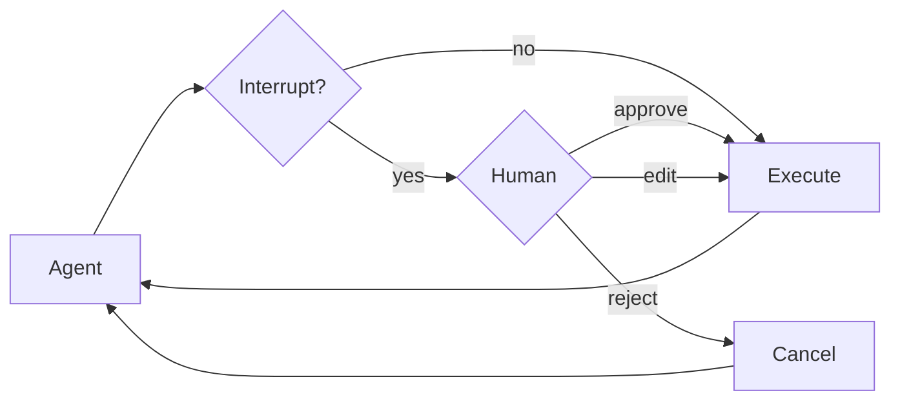

# Human-in-the-loop

了解如何為敏感 tool operation 配置人工審批。

某些工具操作可能涉及敏感訊息，需要人工審批才能執行。深度代理透過 LangGraph 的中斷功能支援人機協作工作流程。您可以使用 `interrupt_on` 參數配置哪些工具需要審核。



## Basic configuration

`interrupt_on` 參數接受一個 dictionary，該字典將 tool names 對應到 interrupt configurations。每個 tool 都可以配置以下參數：

- `True`：啟用預設行為的中斷（允許批准、編輯、拒絕）
- `False`：停用此工具的中斷
- `{"allowed_decisions": [...]}`：自訂配置，允許執行特定決策

```python
from langchain.tools import tool
from deepagents import create_deep_agent
from langgraph.checkpoint.memory import MemorySaver

@tool
def delete_file(path: str) -> str:
    """Delete a file from the filesystem."""
    return f"Deleted {path}"

@tool
def read_file(path: str) -> str:
    """Read a file from the filesystem."""
    return f"Contents of {path}"

@tool
def send_email(to: str, subject: str, body: str) -> str:
    """Send an email."""
    return f"Sent email to {to}"

# Checkpointer is REQUIRED for human-in-the-loop
checkpointer = MemorySaver()

agent = create_deep_agent(
    model="claude-sonnet-4-5-20250929",
    tools=[delete_file, read_file, send_email],
    interrupt_on={
        "delete_file": True,  # Default: approve, edit, reject
        "read_file": False,   # No interrupts needed
        "send_email": {"allowed_decisions": ["approve", "reject"]},  # No editing
    },
    checkpointer=checkpointer  # Required!
)
```

## Decision types

`allowed_decisions` 清單控制著人工審核 tool call 時可以執行的操作：

- `"approve"`: 使用 agent 建議的原始參數執行該工具。
- `"edit"`: 執行前修改 tool 參數
- `"reject"`: 完全跳過執行此 tool call

您可以自訂每種 tool 可用的決策選項：

```python
interrupt_on = {
    # Sensitive operations: allow all options
    "delete_file": {"allowed_decisions": ["approve", "edit", "reject"]},

    # Moderate risk: approval or rejection only
    "write_file": {"allowed_decisions": ["approve", "reject"]},

    # Must approve (no rejection allowed)
    "critical_operation": {"allowed_decisions": ["approve"]},
}
```

## Handle interrupts

當觸發中斷時，agent 會暫停執行並返回控制權。檢查結果中是否有中斷並進行相應的處理。

```python
import uuid
from langgraph.types import Command

# Create config with thread_id for state persistence
config = {"configurable": {"thread_id": str(uuid.uuid4())}}

# Invoke the agent
result = agent.invoke({
    "messages": [{"role": "user", "content": "Delete the file temp.txt"}]
}, config=config)

# Check if execution was interrupted
if result.get("__interrupt__"):
    # Extract interrupt information
    interrupts = result["__interrupt__"][0].value
    action_requests = interrupts["action_requests"]
    review_configs = interrupts["review_configs"]

    # Create a lookup map from tool name to review config
    config_map = {cfg["action_name"]: cfg for cfg in review_configs}

    # Display the pending actions to the user
    for action in action_requests:
        review_config = config_map[action["name"]]
        print(f"Tool: {action['name']}")
        print(f"Arguments: {action['args']}")
        print(f"Allowed decisions: {review_config['allowed_decisions']}")

    # Get user decisions (one per action_request, in order)
    decisions = [
        {"type": "approve"}  # User approved the deletion
    ]

    # Resume execution with decisions
    result = agent.invoke(
        Command(resume={"decisions": decisions}),
        config=config  # Must use the same config!
    )

# Process final result
print(result["messages"][-1].content)
```

## Multiple tool calls

當 agent 程式呼叫多個需要審批的工具時，所有中斷都會合併成一個中斷處理。您必須按順序對每個中斷做出決策。

```python
config = {"configurable": {"thread_id": str(uuid.uuid4())}}

result = agent.invoke({
    "messages": [{
        "role": "user",
        "content": "Delete temp.txt and send an email to admin@example.com"
    }]
}, config=config)

if result.get("__interrupt__"):
    interrupts = result["__interrupt__"][0].value
    action_requests = interrupts["action_requests"]

    # Two tools need approval
    assert len(action_requests) == 2

    # Provide decisions in the same order as action_requests
    decisions = [
        {"type": "approve"},  # First tool: delete_file
        {"type": "reject"}    # Second tool: send_email
    ]

    result = agent.invoke(
        Command(resume={"decisions": decisions}),
        config=config
    )
```

## Edit tool arguments

當 `"edit"` 選項在允許的操作範圍內時，您可以在執行前修改工具參數：

```python
if result.get("__interrupt__"):
    interrupts = result["__interrupt__"][0].value
    action_request = interrupts["action_requests"][0]

    # Original args from the agent
    print(action_request["args"])  # {"to": "everyone@company.com", ...}

    # User decides to edit the recipient
    decisions = [{
        "type": "edit",
        "edited_action": {
            "name": action_request["name"],  # Must include the tool name
            "args": {"to": "team@company.com", "subject": "...", "body": "..."}
        }
    }]

    result = agent.invoke(
        Command(resume={"decisions": decisions}),
        config=config
    )
```

## Subagent interrupts

每個 subagent 程式都可以有自己的 `interrupt_on` 配置，該配置會覆蓋 main agent 程式的設定：

```python
agent = create_deep_agent(
    tools=[delete_file, read_file],
    interrupt_on={
        "delete_file": True,
        "read_file": False,
    },
    subagents=[{
        "name": "file-manager",
        "description": "Manages file operations",
        "system_prompt": "You are a file management assistant.",
        "tools": [delete_file, read_file],
        "interrupt_on": {
            # Override: require approval for reads in this subagent
            "delete_file": True,
            "read_file": True,  # Different from main agent!
        }
    }],
    checkpointer=checkpointer
)
```

當 subagent 程式觸發中斷時，處理方式相同－檢查 `__interrupt__` 並使用指令恢復。

## Best practices

### Always use a checkpointer

Human-in-the-loop 需要一個 checkpointer 來在中斷和恢復之間保持 agent 狀態：

```python
from langgraph.checkpoint.memory import MemorySaver

checkpointer = MemorySaver()
agent = create_deep_agent(
    tools=[...],
    interrupt_on={...},
    checkpointer=checkpointer  # Required for HITL
)
```

### Use the same thread ID

恢復運行時，必須使用相同的配置和相同的 `thread_id`：

```python
# First call
config = {"configurable": {"thread_id": "my-thread"}}
result = agent.invoke(input, config=config)

# Resume (use same config)
result = agent.invoke(Command(resume={...}), config=config)
```

### Match decision order to actions

決策列表必須與 `action_requests` 的順序一致：

```python
if result.get("__interrupt__"):
    interrupts = result["__interrupt__"][0].value
    action_requests = interrupts["action_requests"]

    # Create one decision per action, in order
    decisions = []
    for action in action_requests:
        decision = get_user_decision(action)  # Your logic
        decisions.append(decision)

    result = agent.invoke(
        Command(resume={"decisions": decisions}),
        config=config
    )
```

### Tailor configurations by risk

依風險等級配置不同的工具：

```python
interrupt_on = {
    # High risk: full control (approve, edit, reject)
    "delete_file": {"allowed_decisions": ["approve", "edit", "reject"]},
    "send_email": {"allowed_decisions": ["approve", "edit", "reject"]},

    # Medium risk: no editing allowed
    "write_file": {"allowed_decisions": ["approve", "reject"]},

    # Low risk: no interrupts
    "read_file": False,
    "list_files": False,
}
```