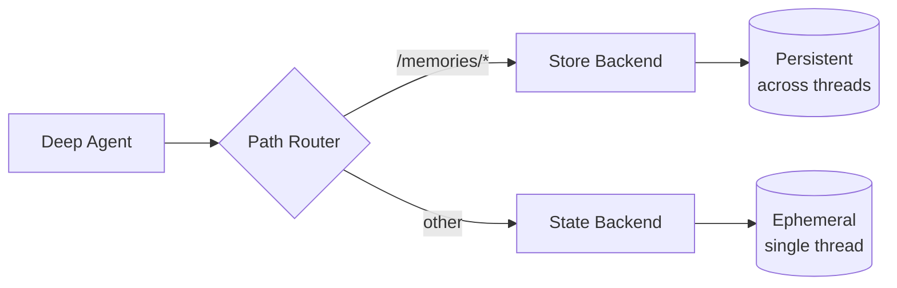

# Long-term memory

了解如何跨交談緒擴展具有持久內存的 deep agents。

deep agents 自備本機檔案系統以減輕記憶體負擔。預設情況下，該檔案系統儲存在 agent 狀態中，並且僅對單一交談緒有效 - 會話結束後檔案將遺失。

您可以使用複合後端（**CompositeBackend**）為深度代理程式新增 **long-term memory** 功能，該後端會將特定路徑路由至持久性儲存。這實現了混合存儲，其中某些文件會在線程間持久保存，而其他文件則保持臨時狀態。



## Setup

使用 `CompositeBackend` 配置長期內存，該 `CompositeBackend` 將 `/memories/` 路徑路由到 `StoreBackend`：

```python
from deepagents import create_deep_agent
from deepagents.backends import CompositeBackend, StateBackend, StoreBackend
from langgraph.store.memory import InMemoryStore

def make_backend(runtime):
    return CompositeBackend(
        default=StateBackend(runtime),  # Ephemeral storage
        routes={
            "/memories/": StoreBackend(runtime)  # Persistent storage
        }
    )

agent = create_deep_agent(
    store=InMemoryStore(),  # Required for StoreBackend
    backend=make_backend
)
```

## How it works

使用 `CompositeBackend` 時，深度代理程式會維護兩個獨立的檔案系統：

### 1. Short-term (transient) filesystem

- 儲存在代理程式的狀態中（透過 `StateBackend`）
- 僅在單一交談緒中持久存在
- 交談緒結束時文件遺失
- 可透過標準路徑存取：`/notes.txt`, `/workspace/draft.md`

### 2. Long-term (persistent) filesystem

- 儲存在 LangGraph 儲存中（透過 `StoreBackend`）
- 跨所有交談緒和對話持久存在
- 代理重啟後仍然存在
- 可透過以 `/memories/` 為前綴的路徑存取：`/memories/preferences.txt`


### Path routing

`CompositeBackend` 根據路徑前綴路由檔案操作：

- 路徑以 `/memories/` 開頭的檔案儲存在持久性儲存區 (`Store`) 中。
- 不帶此前綴的檔案則處於臨時狀態。
- 所有檔案系統工具（`ls`, `read_file`, `write_file`, `edit_file`）都支援這兩種儲存方式。

    ```python
    # Transient file (lost after thread ends)
    agent.invoke({
        "messages": [{"role": "user", "content": "Write draft to /draft.txt"}]
    })

    # Persistent file (survives across threads)
    agent.invoke({
        "messages": [{"role": "user", "content": "Save final report to /memories/report.txt"}]
    })
    ```

## Cross-thread persistence

任何交談緒都可以存取 `/memories/` 目錄中的檔案：

```python
import uuid

# Thread 1: Write to long-term memory
config1 = {"configurable": {"thread_id": str(uuid.uuid4())}}
agent.invoke({
    "messages": [{"role": "user", "content": "Save my preferences to /memories/preferences.txt"}]
}, config=config1)

# Thread 2: Read from long-term memory (different conversation!)
config2 = {"configurable": {"thread_id": str(uuid.uuid4())}}
agent.invoke({
    "messages": [{"role": "user", "content": "What are my preferences?"}]
}, config=config2)
# Agent can read /memories/preferences.txt from the first thread
```

## Use cases

### User preferences

儲存跨會話持久化的使用者偏好設定：

```python
agent = create_deep_agent(
    store=InMemoryStore(),
    backend=lambda rt: CompositeBackend(
        default=StateBackend(rt),
        routes={"/memories/": StoreBackend(rt)}
    ),
    system_prompt="""When users tell you their preferences, save them to
    /memories/user_preferences.txt so you remember them in future conversations."""
)
```

### Self-improving instructions

代理可以根據回饋更新自身的指令：

```python
agent = create_deep_agent(
    store=InMemoryStore(),
    backend=lambda rt: CompositeBackend(
        default=StateBackend(rt),
        routes={"/memories/": StoreBackend(rt)}
    ),
    system_prompt="""You have a file at /memories/instructions.txt with additional
    instructions and preferences.

    Read this file at the start of conversations to understand user preferences.

    When users provide feedback like "please always do X" or "I prefer Y",
    update /memories/instructions.txt using the edit_file tool."""
)
```

隨著時間的推移，指令檔會累積使用者偏好設置，從而幫助代理程式改進。

### Knowledge base

透過多次對話累積知識：

```python
# Conversation 1: Learn about a project
agent.invoke({
    "messages": [{"role": "user", "content": "We're building a web app with React. Save project notes."}]
})

# Conversation 2: Use that knowledge
agent.invoke({
    "messages": [{"role": "user", "content": "What framework are we using?"}]
})
# Agent reads /memories/project_notes.txt from previous conversation
```

### Research projects

在不同會話之間保持研究狀態：

```python
research_agent = create_deep_agent(
    store=InMemoryStore(),
    backend=lambda rt: CompositeBackend(
        default=StateBackend(rt),
        routes={"/memories/": StoreBackend(rt)}
    ),
    system_prompt="""You are a research assistant.

    Save your research progress to /memories/research/:
    - /memories/research/sources.txt - List of sources found
    - /memories/research/notes.txt - Key findings and notes
    - /memories/research/report.md - Final report draft

    This allows research to continue across multiple sessions."""
)
```

## Store implementations

任何 LangGraph `BaseStore` 實作都可以：

### InMemoryStore (development)

適用於測試和開發，但重啟後資料會遺失：

```python
from langgraph.store.memory import InMemoryStore

store = InMemoryStore()

agent = create_deep_agent(
    store=store,
    backend=lambda rt: CompositeBackend(
        default=StateBackend(rt),
        routes={"/memories/": StoreBackend(rt)}
    )
)
```

### PostgresStore (production)

生產環境中，請使用持久化儲存：

```python
from langgraph.store.postgres import PostgresStore
import os

store = PostgresStore(connection_string=os.environ["DATABASE_URL"])

agent = create_deep_agent(
    store=store,
    backend=lambda rt: CompositeBackend(
        default=StateBackend(rt),
        routes={"/memories/": StoreBackend(rt)}
    )
)
```

## Best practices

### Use descriptive paths

整理持久化文件，使其路徑清晰：

```bash
/memories/user_preferences.txt
/memories/research/topic_a/sources.txt
/memories/research/topic_a/notes.txt
/memories/project/requirements.md
```

### Document the memory structure

告訴 agent 你的系統提示中哪些內容儲存在什麼位置：

```bash
Your persistent memory structure:
- /memories/preferences.txt: User preferences and settings
- /memories/context/: Long-term context about the user
- /memories/knowledge/: Facts and information learned over time
```

### Prune old data

定期清理過時的持久性文件，以保持儲存空間的可控性。

### Choose the right storage

- **Development**: 使用 InMemoryStore 進行快速迭代
- **Production**: 使用 PostgresStore 或其他持久化存儲
- **Multi-tenant**: 考慮在您的 store 中使用基於 `assistant_id` 的命名空間