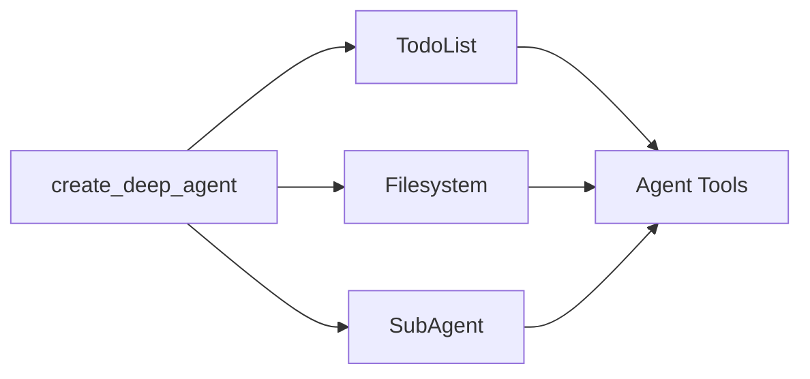

# Deep Agents Middleware

了解驅動 deep agents 的 middleware

深度代理採用模組化中介軟體架構建置。深度代理可以存取：

1. 一個 planning tool
2. 用於儲存上下文和長期記憶的檔案系統
3. Spawn subagents 的能力

每個功能都以獨立的中間件形式實現。當您使用 `create_deep_agent` 建立深度代理程式時，我們會自動將 `TodoListMiddleware`, `FilesystemMiddleware` 和 `SubAgentMiddleware` 附加到您的 agent 程式。



中間件是可組合的－您可以根據需要向代理程式添加任意數量的中間件。您可以獨立使用任何中間件。

以下各節將解釋每個中間件提供的功能。

## To-do list middleware

規劃是解決複雜問題的關鍵。如果您最近使用過 Claude Code，您會注意到它會在處理複雜的多步驟任務之前產生待辦事項清單。您還會注意到，隨著更多資訊的到來，它能夠即時調整和更新這份待辦事項清單。

`TodoListMiddleware` 為您的 agent 提供了一個專門用於更新此待辦事項清單的工具。在執行多部分任務之前和期間，系統會提示代理程式使用 `write_todos` 工具來追蹤其正在執行的任務以及仍需執行的任務。

```python
from langchain.agents import create_agent
from langchain.agents.middleware import TodoListMiddleware

# TodoListMiddleware is included by default in create_deep_agent
# You can customize it if building a custom agent
agent = create_agent(
    model="claude-sonnet-4-5-20250929",
    # Custom planning instructions can be added via middleware
    middleware=[
        TodoListMiddleware(
            system_prompt="Use the write_todos tool to..."  # Optional: Custom addition to the system prompt
        ),
    ],
)
```

## Filesystem middleware

Context engineering 是建構高效智能體的主要挑戰之一。當使用傳回可變長度結果的 tools（例如 web_search 和 rag）時，這一點尤其困難，因為過長的結果會迅速填滿上下文視窗。

`FilesystemMiddleware` 提供了四個用於與短期記憶體和長期記憶體互動的 tools：

- `ls`: 列出檔案系統中的文件
- `read_file`: 讀取整個檔案或檔案中的特定行數
- `write_file`: 向檔案系統寫入一個新文件
- `edit_file`: 編輯檔案系統中已存在的文件

```python
from langchain.agents import create_agent
from deepagents.middleware.filesystem import FilesystemMiddleware

# FilesystemMiddleware is included by default in create_deep_agent
# You can customize it if building a custom agent
agent = create_agent(
    model="claude-sonnet-4-5-20250929",
    middleware=[
        FilesystemMiddleware(
            backend=None,  # Optional: custom backend (defaults to StateBackend)
            system_prompt="Write to the filesystem when...",  # Optional custom addition to the system prompt
            custom_tool_descriptions={
                "ls": "Use the ls tool when...",
                "read_file": "Use the read_file tool to..."
            }  # Optional: Custom descriptions for filesystem tools
        ),
    ],
)
```

### Short-term vs. long-term filesystem

預設情況下，這些工具會將資料寫入 graph 狀態中的 local “filesystem”。若要啟用跨執行緒的持久存儲，請配置一個 `CompositeBackend`，將特定路徑（例如 `/memories/`）路由到 `StoreBackend`。

```python
from langchain.agents import create_agent
from deepagents.middleware import FilesystemMiddleware
from deepagents.backends import CompositeBackend, StateBackend, StoreBackend
from langgraph.store.memory import InMemoryStore

store = InMemoryStore()

agent = create_agent(
    model="claude-sonnet-4-5-20250929",
    store=store,
    middleware=[
        FilesystemMiddleware(
            backend=lambda rt: CompositeBackend(
                default=StateBackend(rt),
                routes={"/memories/": StoreBackend(rt)}
            ),
            custom_tool_descriptions={
                "ls": "Use the ls tool when...",
                "read_file": "Use the read_file tool to..."
            }  # Optional: Custom descriptions for filesystem tools
        ),
    ],
)
```

當您為 `/memories/` 配置帶有 `StoreBackend` 的 `CompositeBackend` 時，所有以 `/memories/` 為前綴的檔案都會保存到持久儲存中，並在不同的執行緒之間保留。不帶此前綴的檔案則保留在臨時狀態儲存中。

## Subagent middleware

將任務交給子代理程式可以隔離上下文，保持主（監督）代理程式的上下文視窗清晰，同時又能深入執行任務。

子代理中間件可讓您透過 `task` tool 提供 subagents。

```python
from langchain.tools import tool
from langchain.agents import create_agent
from deepagents.middleware.subagents import SubAgentMiddleware


@tool
def get_weather(city: str) -> str:
    """Get the weather in a city."""
    return f"The weather in {city} is sunny."

agent = create_agent(
    model="claude-sonnet-4-5-20250929",
    middleware=[
        SubAgentMiddleware(
            default_model="claude-sonnet-4-5-20250929",
            default_tools=[],
            subagents=[
                {
                    "name": "weather",
                    "description": "This subagent can get weather in cities.",
                    "system_prompt": "Use the get_weather tool to get the weather in a city.",
                    "tools": [get_weather],
                    "model": "gpt-4o",
                    "middleware": [],
                }
            ],
        )
    ],
)
```

subagent 由 **name**, **description**, **system prompt** 和 **tools** 定義。您也可以為 subagent 程式提供自訂模型或額外的中間件。當您希望為 subagent 提供一個與 main agent 共享的額外狀態鍵時，這將特別有用。

對於更複雜的用例，您還可以提供自己預先建立的 LangGraph graph 作為 subagent。

```python
from langchain.agents import create_agent
from deepagents.middleware.subagents import SubAgentMiddleware
from deepagents import CompiledSubAgent
from langgraph.graph import StateGraph

# Create a custom LangGraph graph
def create_weather_graph():
    workflow = StateGraph(...)
    # Build your custom graph
    return workflow.compile()

weather_graph = create_weather_graph()

# Wrap it in a CompiledSubAgent
weather_subagent = CompiledSubAgent(
    name="weather",
    description="This subagent can get weather in cities.",
    runnable=weather_graph
)

agent = create_agent(
    model="claude-sonnet-4-5-20250929",
    middleware=[
        SubAgentMiddleware(
            default_model="claude-sonnet-4-5-20250929",
            default_tools=[],
            subagents=[weather_subagent],
        )
    ],
)
```

除了使用者自訂的 subagent 式之外，main agent 始終可以存取一個通用 subagent 程式。此 subagent 程式擁有與 main agent 相同的指令以及所有可用的工具。通用 subagent 的主要目的是實現上下文隔離 - main agent 可以將複雜的任務委託給該 subagent，並獲得簡潔的答案，而無需調用中間工具。

