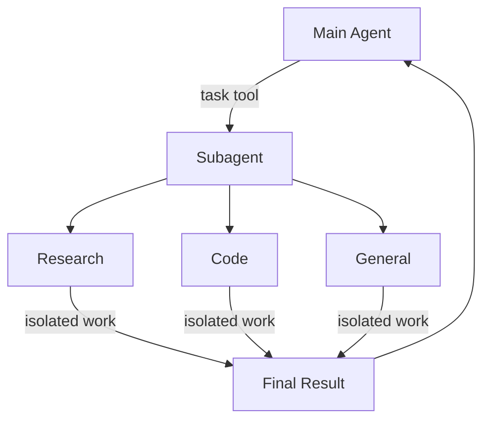

# Subagents

了解如何使用子代理來委派任務並保持上下文清潔

深度代理可以建立子代理來委派任務。您可以在 `subagents` 參數中指定自訂子代理程式。子代理可用於上下文隔離（保持主代理的上下文清潔）以及提供專門的指令。



## Why use subagents?

子代理解決了上下文膨脹問題(context bloat problem)。當代理程式使用 tools 產生出內容量大的內容（例如網頁搜尋、檔案讀取、資料庫查詢）時，上下文視窗會迅速被中間結果填滿。子代理將這些細節工作隔離出來——主代理只接收最終結果，而不是產生該結果的數十個工具呼叫。

**何時使用子代理**:

- ✅ 多步驟任務，會使主代理的上下文變得混亂
- ✅ 需要自訂指令或工具的專業領域
- ✅ 需要不同模型功能的任務
- ✅ 當您希望主代理人專注於高層協調時

**何時不應使用子代理**:

- ❌ 簡單的單步驟任務
- ❌ 需要維護中間上下文時
- ❌ 開銷大於收益時

## Configuration

`subagents` 應為字典列表或 `CompiledSubAgent` 物件。有兩種類型：

### SubAgent (Dictionary-based)

對於大多數使用場景，將 subagents 定義為 dictionaries：

**必需欄位**:

- `name (str)`: subagent 程式的唯一識別碼。main agent 在呼叫 `task()` 工具時使用此名稱。
- `description (str)`: 描述 subagent 的具體職責。務必具體明確，並專注於行動。main agent 會根據此資訊決定何時進行委託。
- `system_prompt (str)`: 給 subagent 的使用說明。包括工具使用指南和輸出格式要求。
- `tools (List[Callable])`: subagent 人可以使用的 tools。請盡量精簡，僅包含必需的工具。

**可選欄位**:

- `model (str | BaseChatModel)`: 覆蓋 main agent 的模型。使用 "`provider:model-name`" 格式（例如，"`openai:gpt-4o`"）。
- `middleware (List[Middleware])`: 用於自訂行為、記錄或速率限制的附加中間件。
- `interrupt_on (Dict[str, bool])`: 為特定工具設定 human-in-the-loop。需要 checkpointer。

### CompiledSubAgent

對於複雜的流程，請使用預先建置的 LangGraph graph：

**欄位**:

- `name (str)`: 唯一識別符
- `description (str)`: 這個 subagent 做什麼
- `runnable (Runnable)`: 已編譯的 LangGraph graph（必須先呼叫 `.compile()`）

## Using SubAgent

```python
import os
from typing import Literal
from tavily import TavilyClient
from deepagents import create_deep_agent

tavily_client = TavilyClient(api_key=os.environ["TAVILY_API_KEY"])

def internet_search(
    query: str,
    max_results: int = 5,
    topic: Literal["general", "news", "finance"] = "general",
    include_raw_content: bool = False,
):
    """Run a web search"""
    return tavily_client.search(
        query,
        max_results=max_results,
        include_raw_content=include_raw_content,
        topic=topic,
    )

research_subagent = {
    "name": "research-agent",
    "description": "Used to research more in depth questions",
    "system_prompt": "You are a great researcher",
    "tools": [internet_search],
    "model": "openai:gpt-4o",  # Optional override, defaults to main agent model
}

subagents = [research_subagent]

agent = create_deep_agent(
    model="claude-sonnet-4-5-20250929",
    subagents=subagents
)
```

## Using CompiledSubAgent

對於更複雜的用例，您可以將自己預先建立的 LangGraph graph 作為 subagent 提供:

```python
from deepagents import create_deep_agent, CompiledSubAgent
from langchain.agents import create_agent

# Create a custom agent graph
custom_graph = create_agent(
    model=your_model,
    tools=specialized_tools,
    prompt="You are a specialized agent for data analysis..."
)

# Use it as a custom subagent
custom_subagent = CompiledSubAgent(
    name="data-analyzer",
    description="Specialized agent for complex data analysis tasks",
    runnable=custom_graph
)

subagents = [custom_subagent]

agent = create_deep_agent(
    model="claude-sonnet-4-5-20250929",
    tools=[internet_search],
    system_prompt=research_instructions,
    subagents=subagents
)
```

## The general-purpose subagent

除了使用者自訂的 subagent 程式之外，deep agents 程式始終可以存取一個 `general-purpose` subagent。此 subagent:

- 與 main agent 具有相同的系統提示
- 可存取所有相同的 tools
- 使用相同的模型（除非被覆蓋）

### When to use it

通用 subagent 程式非常適合在無需特殊行為的情況下實現上下文隔離。main agent 可以將複雜的多步驟任務委託給該 subagent，並獲得簡潔的結果，避免中間工具呼叫所帶來的冗餘程式碼。

!!! example
    main agent 不再執行 10 個網路搜尋並將結果填入上下文中，而是將這些任務委託給通用 subagent 程式：`task(name="general-purpose", task="Research quantum computing trends")`。 subagent 程式會在內部執行所有搜索，並僅返回摘要。

## Best practices

### Write clear descriptions

main agent 會根據描述來決定要聯絡哪個 subagent。請務必具體：

- ✅ Good: "Analyzes financial data and generates investment insights with confidence scores"
- ❌ Bad: "Does finance stuff"


### Keep system prompts detailed

請提供如何使用工具和格式化輸出的具體指示：

```python
research_subagent = {
    "name": "research-agent",
    "description": "Conducts in-depth research using web search and synthesizes findings",
    "system_prompt": """You are a thorough researcher. Your job is to:

    1. Break down the research question into searchable queries
    2. Use internet_search to find relevant information
    3. Synthesize findings into a comprehensive but concise summary
    4. Cite sources when making claims

    Output format:
    - Summary (2-3 paragraphs)
    - Key findings (bullet points)
    - Sources (with URLs)

    Keep your response under 500 words to maintain clean context.""",
    "tools": [internet_search],
}
```


### Minimize tool sets

只給 subagent 他們需要的 tools。這樣可以提高他們的專注度和安全性：

```python
# ✅ Good: Focused tool set
email_agent = {
    "name": "email-sender",
    "tools": [send_email, validate_email],  # Only email-related
}

# ❌ Bad: Too many tools
email_agent = {
    "name": "email-sender",
    "tools": [send_email, web_search, database_query, file_upload],  # Unfocused
}
```

### Choose models by task

不同型號的模型擅長不同的任務：

```python
subagents = [
    {
        "name": "contract-reviewer",
        "description": "Reviews legal documents and contracts",
        "system_prompt": "You are an expert legal reviewer...",
        "tools": [read_document, analyze_contract],
        "model": "claude-sonnet-4-5-20250929",  # Large context for long documents
    },
    {
        "name": "financial-analyst",
        "description": "Analyzes financial data and market trends",
        "system_prompt": "You are an expert financial analyst...",
        "tools": [get_stock_price, analyze_fundamentals],
        "model": "openai:gpt-5",  # Better for numerical analysis
    },
]
```

### Return concise results

指示 subagent 返回摘要信息，而不是原始數據：

```python
data_analyst = {
    "system_prompt": """Analyze the data and return:
    1. Key insights (3-5 bullet points)
    2. Overall confidence score
    3. Recommended next actions

    Do NOT include:
    - Raw data
    - Intermediate calculations
    - Detailed tool outputs

    Keep response under 300 words."""
}
```

## Common patterns

### Multiple specialized subagents

為不同領域創建專門的 subagent:

```python
from deepagents import create_deep_agent

subagents = [
    {
        "name": "data-collector",
        "description": "Gathers raw data from various sources",
        "system_prompt": "Collect comprehensive data on the topic",
        "tools": [web_search, api_call, database_query],
    },
    {
        "name": "data-analyzer",
        "description": "Analyzes collected data for insights",
        "system_prompt": "Analyze data and extract key insights",
        "tools": [statistical_analysis],
    },
    {
        "name": "report-writer",
        "description": "Writes polished reports from analysis",
        "system_prompt": "Create professional reports from insights",
        "tools": [format_document],
    },
]

agent = create_deep_agent(
    model="claude-sonnet-4-5-20250929",
    system_prompt="You coordinate data analysis and reporting. Use subagents for specialized tasks.",
    subagents=subagents
)
```

工作流程：

1. Main agent 構建 high-level 計劃
2. 委派 data collection 給 data-collector
3. 傳遞 results 給 data-analyzer
4. 送出 insights 給 report-writer
5. 編輯 final output

每個 subagent 程式都在專注於自身任務的清晰上下文中工作。


## Troubleshooting

### Subagent not being called

**問題**: main agent 嘗試自行完成工作，而不是將工作委派出去。

**解決方案**:

1. 描述要更具體一些:

    ```python
    # ✅ Good
    {"name": "research-specialist", "description": "Conducts in-depth research on specific topics using web search. Use when you need detailed information that requires multiple searches."}

    # ❌ Bad
    {"name": "helper", "description": "helps with stuff"}
    ```

2. 指示 main agent 進行委託:

    ```python
    agent = create_deep_agent(
        system_prompt="""...your instructions...

        IMPORTANT: For complex tasks, delegate to your subagents using the task() tool.
        This keeps your context clean and improves results.""",
        subagents=[...]
    )
    ```


### Context still getting bloated

**問題**: 即使使用 subagent，上下文資訊仍然會填入。

**解決方案**:

1. 指示 subagent 回傳簡潔的結果：

    ```python
    system_prompt="""...

    IMPORTANT: Return only the essential summary.
    Do NOT include raw data, intermediate search results, or detailed tool outputs.
    Your response should be under 500 words."""
    ```

2. 使用檔案系統儲存數量大的內容：

    ```python
    system_prompt="""When you gather large amounts of data:
    1. Save raw data to /data/raw_results.txt
    2. Process and analyze the data
    3. Return only the analysis summary

    This keeps context clean."""
    ```

### Wrong subagent being selected

**問題**: main agent 呼叫了不合適的 subagent 來完成任務。

**解決方案**: 在描述中明確區分 subagent

```python
subagents = [
    {
        "name": "quick-researcher",
        "description": "For simple, quick research questions that need 1-2 searches. Use when you need basic facts or definitions.",
    },
    {
        "name": "deep-researcher",
        "description": "For complex, in-depth research requiring multiple searches, synthesis, and analysis. Use for comprehensive reports.",
    }
]
```

