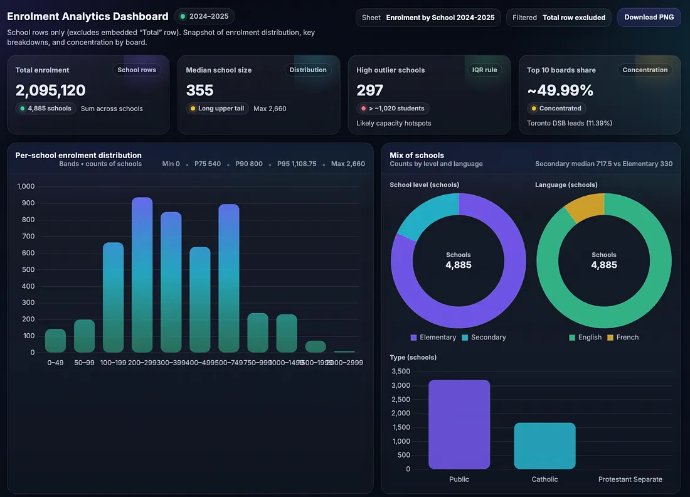

# 將 Claude Skills 融入 LangChain：Excel 分析的深度代理教程

原文: [Breaking Claude Skills into LangChain: A Deep Agents Tutorial for Excel Analytics](https://medium.com/@xleioo/breaking-claude-skills-out-of-claude-code-a-deepagents-tutorial-for-excel-analytics-c3e896813913)

> Skills 一直被鎖定在 IDE 擴充功能中。如果您想建立自己的應用程式——例如 Web 應用程式、CLI 工具或自訂服務——來利用這些強大的技能功能，該怎麼辦？

本教學將從零開始引導您使用 Deep Agents 和 Excel SLILLs 建立一個具備 Excel 處理能力的資料分析 AI agent。教程結束時，您將擁有一個可以讀取Excel 表格、執行資料分析程式碼並自動產生洞察的 agent，同時還能產生如下所示的精美資料報告：



## 背景與挑戰

之前，我使用 LangChain 和 LangGraph 開發了一個 BI 應用。雖然我成功地透過 MCP（模型上下文協議）實現了資料收集和視覺化，但人工智慧時代 BI 的核心在於產生「洞察」。這要求模型掌握複雜的領域知識。

## 技術突破: Deep Agents + SKILLs

2025 年下半年，隨著 LangChain Deep Agents 宣布支持 Anthropic 的 SKILLs 規範，這項痛點得到了巧妙的解決。 SKILLs 利用一套標準化的自然語言描述規範，取代了先前依賴資料庫和多個 LangGraph 節點的領域知識推理，從而顯著簡化了開發流程。

## 實際操作

如果你認為 SKILLs 僅限於 ClaudeCode 或 Cursor 等程式設計工具，那就低估了它們的潛力。本文將透過實​​際操作指導您：如何將 SKILLs 整合到自訂應用程式中，建立一個 AI 應用程式（例如 OpenClaw）—一個能夠透過動態擴展其「技能」而不斷進化的應用程式。

本教學將從零開始，指導您使用深度代理建立一個具備 Excel 處理能力的資料分析 AI agent。

## 專案概況

我們將要建構：

- LangChain 環境
- 最小可行原型 (MVP)
- 基於官方 Claude `xlsx` SKILLs 的 Excel 資料分析

技術棧：

- **Core**: DeepAgent + LangChain + LangGraph + Python (with Pandas)
- **Skills**: xlsx (https://github.com/anthropics/skills/tree/main/skills/xlsx)
- **Model**: OpenAI GPT-5.2 (configurable to any LangChain-supported model)
- **Dataset**: School enrollment by grade. Open data from “data.ontario.ca”

## Step 1: 設定 DeepAgent 使用 Skills

### 專案結構

```bash
<Project Home>/
├── agent.py # Main agent script
├── skills/ # Skills directory
│ └── xlsx/ # Excel analysis skill
│ └── SKILL.md
└── enrolment_by_school_2425_en.xlsx # Sample Excel file
```

### 安裝依賴項

安裝 DeepAgents 和 LangChain 所需的依賴項。

```bash
pip install deepagents langchain langchain-openai langgraph pandas
```

### 初始化代理

以下是 `agent.py` 檔案中完整的 agent 初始化程式碼：

```python
# Initialize OpenAI model
model = init_chat_model(model="openai:gpt-5.2")

# Create Checkpointer (required for human-in-the-loop)
checkpointer = MemorySaver()

# Create DeepAgent
agent = create_deep_agent(
    model=model,
    backend=FilesystemBackend(root_dir="<project home>"),
    tools=[execute_python],  # Add custom Python execution tool
    skills=["<project home>/skills/"],
    interrupt_on={
        "write_file": True,  # Requires human approval
        "read_file": False,  # No interruption needed
        "edit_file": True    # Requires human approval
    },
    checkpointer=checkpointer,
)
```

要點：

- 引入 `FilesystemBackend` 套件以啟用專案目錄中的檔案操作。因為您需要將分析結果寫入新的 Excel 檔案。
- `MemorySaver` checkpointer 用於在呼叫之間維護會話狀態。
- `skills` 參數指向包含 SKILL.md 檔案的目錄。
- `interrupt_on` 控制哪些作業需要手動核准。
- `tools` 參數在 SKILL 邏輯中至關重要。雖然官方文件中沒有詳細描述，但它執行定義 DeepAgents 呼叫邏輯的核心功能，該邏輯用於在需要執行腳本時進行定義。由於本範例涉及使用 Python 腳本分析 Excel 數據，因此必須定義 `tools` 介面。