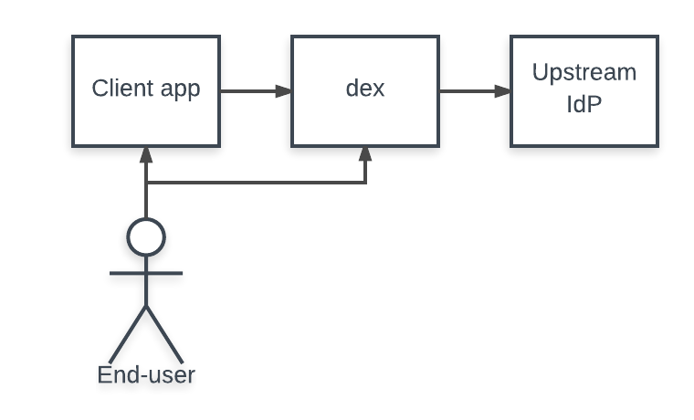

# Connectors

當用戶通過 Dex 登錄時，用戶的身份通常存儲在另一個用戶管理系統中：LDAP 目錄、GitHub 組織等。Dex 充當客戶端應用程序和上游身份提供者之間的墊片。客戶端只需要了解 OpenID Connect 就可以查詢 Dex，而 Dex 實現了一系列協議來查詢其他用戶管理系統。

“連接器”是 Dex 使用的一種策略，用於根據另一個身份提供者對用戶進行身份驗證。 Dex 實現了針對特定平台（如 GitHub、LinkedIn 和 Microsoft）以及已建立的協議（如 LDAP 和 SAML）的連接器。

根據協議中的連接器限制，可以阻止 Dex 發出刷新令牌或返回群組成員資格聲明。例如，由於 SAML 不提供非交互式方式來刷新斷言，如果用戶通過 SAML 連接器登錄，Dex 將不會向其客戶端發出刷新令牌。需要離線訪問的客戶端需要刷新令牌支持，例如 `kubectl`。

Dex 實現了以下連接器：

|Name	|supports refresh tokens	|supports groups claim	|supports preferred_username claim	|status	|notes|
|-----|-------------------------|-----------------------|-----------------------------------|-------|-----|
|LDAP	|yes	|yes	|yes	|stable||	
|GitHub	|yes	|yes	|yes	|stable||	
|SAML 2.0	|no	|yes	|no	|stable||	
|GitLab	|yes	|yes	|yes	|beta||	
|OpenID Connect	|yes	|yes	|yes	|beta	|Includes Salesforce, Azure, etc.|
|OAuth 2.0	|no	|yes	|yes	|alpha||	
|Google	|yes	|yes	|yes	|alpha||	
|LinkedIn	|yes	|no	|no	|beta||	
|Microsoft	|yes	|yes	|no	|beta||	
|AuthProxy	|no	|no	|no	|alpha	|Authentication proxies such as Apache2 mod_auth, etc.|
|Bitbucket |Cloud	|yes	|yes	|no	|alpha||	
|OpenShift	|no	|yes	|no	|stable||	
|Atlassian Crowd	|yes	|yes	|yes *	|beta	|preferred_username claim must be configured through config|
|Gitea	|yes	|no	|yes	|alpha||	
|OpenStack Keystone	|yes	|yes	|no	|alpha||

Stable、beta 和 alpha 定義為：

- Stable：經過良好測試，正在積極使用，並且不會以向後不兼容的方式改變。
- Beta：經過測試並且不太可能以向後不兼容的方式進行更改。
- Alpha：可能未經核心維護者測試，並且可能會以向後不兼容的方式進行更改。

