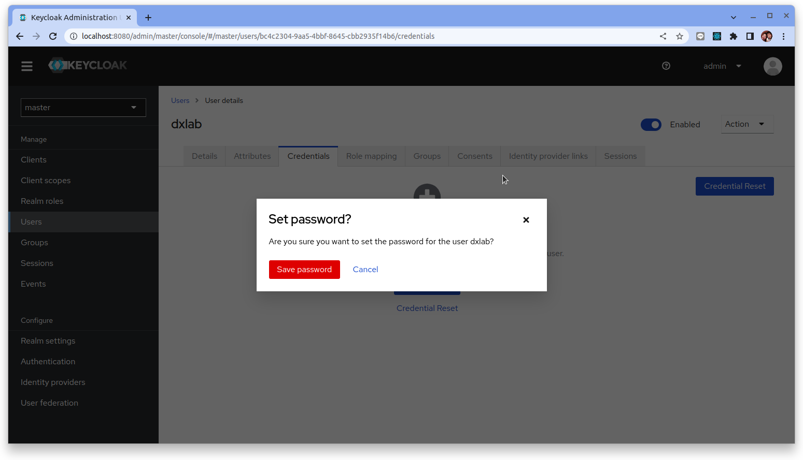

# 通過 OpenID Connect 提供商進行身份驗證

## 步驟 01 - 環境安裝

### Keycloak (IdP)

使用 Docerk 來啟動一個 Keycloak 服務:

```bash
docker run -p 8080:8080 -e KEYCLOAK_ADMIN=admin -e KEYCLOAK_ADMIN_PASSWORD=admin \
quay.io/keycloak/keycloak:21.1.1 start-dev
```

此命令啟動 Keycloak 服務並暴露在本地端口 `8080` 上的 ，並使用用戶名 `admin` 和密碼 `admin` 創建一個初始管理員用戶。

使用瀏覽器到 `http://127.0.0.1:8080` 網址:


#### 構建 oidc client

1. 點擊 "Adminstration Console" 並輸入用戶名 `admin` 和密碼 `admin`

      

2. 點擊左側導般菜單 "Realm settings", 然後點擊左下方的 “OpenID Endpoing Configuration" 連結

  

3. 在新的瀏覽頁裡會看到 Keycloak 的相關服務元數據與服務端點 URL

  

  讓我們截取後續動作所需要的資訊出來給大家參考:

  ```json hl_lines="2 3 4"
  {
    "issuer":"http://localhost:8080/realms/master",
    "authorization_endpoint":"http://localhost:8080/realms/master/protocol/openid-connect/auth",
    "token_endpoint":"http://localhost:8080/realms/master/protocol/openid-connect/token",
    "introspection_endpoint":"http://localhost:8080/realms/master/protocol/openid-connect/token/introspect",
    "userinfo_endpoint":"http://localhost:8080/realms/master/protocol/openid-connect/userinfo",
    "end_session_endpoint":"http://localhost:8080/realms/master/protocol/openid-connect/logout",
    "frontchannel_logout_session_supported":true,
    "frontchannel_logout_supported":true,
    "jwks_uri":"http://localhost:8080/realms/master/protocol/openid-connect/certs",
    "check_session_iframe":"http://localhost:8080/realms/master/protocol/openid-connect/login-status-iframe.html",
    "grant_types_supported":[
      "authorization_code",
      "implicit",
      "refresh_token",
      "password",
      "client_credentials",
      "urn:ietf:params:oauth:grant-type:device_code",
      "urn:openid:params:grant-type:ciba"
    ],
    "claims_supported":[
      "aud",
      "sub",
      "iss",
      "auth_time",
      "name",
      "given_name",
      "family_name",
      "preferred_username",
      "email",
      "acr"
    ],
    "scopes_supported":[
      "openid",
      "microprofile-jwt",
      "address",
      "web-origins",
      "offline_access",
      "profile",
      "roles",
      "email",
      "acr",
      "phone"
    ]
  }
  ```

4. 點擊左側導般菜單 "Clients", 然後點擊 “Create client" 按鈕

  

5. 設定 "General Settings":
  - Client ID: `dex-oidc-keycloak`
  - Name: `dex-oidc-keycloak`

  點擊 "Next"

  

6. 設定 "Capability config":
  - Client authentication: `On`
  - Authentication flow: [v] Standard flow

  點擊 "Next"

  

7. 設定 "Login settings":
  - Valid redirect URIs: `http://127.0.0.1:5556/dex/callback`
  - Web origins: `*`

  點擊 "Save"

  

!!! info
  在第 7 步裡頭很重要的設定是要把 `Valid redirect URIs` 設成 Dex 服務的端點。特別注意 `dex/callback` 的路徑。

8. 點擊 "Credentials" 頁籤並截取 "Client secret" 後續備用
  - Client secret: `JiaBlyreunTlfFV0CLi0rH4eHRXrKExD`

#### 創建 user 帳戶

讓我們在 Keycloak 中創建一個一個 user account 來便於後續的驗證。

1. 點擊左側導般菜單 "Users", 然後點擊 “Add user" 按鈕

  

2. 設定 user 的基本資訊
  - Username: `dxlab`
  - Email: `dxlab@example.it`
  - Email verified: `Yes`

  點擊 "Create"

  

3. 點擊 "Credentials" 頁籤, 然後點擊 “Set password" 按鈕

  

4. 設定 user 的密碼
  - Password: `12341234`
  - Temporary: `Off`

  點擊 "Save"

  

  確認 "Save password"

  

### Dex 服務

#### 構建 dex 二進製文件

**先決條件:**

- 安裝好 [Golang](https://go.dev/) 的機器 (在本文中, 使用 Ubuntu 22.04)

要從源代碼構建 dex，請根據[官方文檔](https://go.dev/doc/install) 安裝 1.19 或更高版本的工作 Go 環境。然後克隆存儲庫並使用 `make` 編譯 dex 二進製文件。

```bash
$ git clone https://github.com/dexidp/dex.git
$ cd dex/
$ make build
```

#### 配置

Dex 專門從配置文件中提取配置選項。使用 `examples/` 目錄中的示例配置文件啟動一個帶有 sqlite3 數據存儲和一組預定義 OAuth2 客戶端的 dex 實例。

```bash
./bin/dex serve examples/config-dev.yaml
```


範例[配置文件](https://github.com/dexidp/dex/blob/master/examples/config-dev.yaml)通過註釋記錄了許多配置選項。有關其它的配置選項，請查看該文件。

我們將在本配置文件中額外配置 dex `oidc` 的 connector 資訊來讓 dex 訪問 keycloak:

```yaml title="dex/examples/config-dev.yaml" hl_lines="135-146"
# dex 的基本路徑和 OpenID Connect 服務的外部名稱。
# 這是所有客戶端必須用來引用 dex 的規範 URL。
issuer: http://127.0.0.1:5556/dex

# 存儲配置決定了 dex 存儲其狀態的位置。支持的
# 選項包括 SQL 資料庫和 Kubernetes 第三方資源。
#
# 有關詳細信息，請參閱文檔 (https://dexidp.io/docs/storage/)。
storage:
  type: sqlite3
  config:
    file: examples/dex.db

  # type: mysql
  # config:
  #   host: localhost
  #   port: 3306
  #   database: dex
  #   user: mysql
  #   password: mysql
  #   ssl:
  #     mode: "false"

  # type: postgres
  # config:
  #   host: localhost
  #   port: 5432
  #   database: dex密碼
  #   user: postgres
  #   password: postgres
  #   ssl:
  #     mode: disable

  # type: etcd
  # config:
  #   endpoints:
  #     - http://localhost:2379
  #   namespace: dex/

  # type: kubernetes
  # config:
  #   kubeConfigFile: $HOME/.kube/config

# HTTP 端點的配置。
web:
  http: 0.0.0.0:5556
  # 如果要配置 HTTPS 選項請使用下列的註釋。
  # https: 127.0.0.1:5554
  # tlsCert: /etc/dex/tls.crt
  # tlsKey: /etc/dex/tls.key

# dex外觀的配置
# frontend:
#   issuer: dex
#   logoURL: theme/logo.png
#   dir: web/
#   theme: light

# 遙測配置
telemetry:
  http: 0.0.0.0:5558
  # enableProfiling: true

# 取消下列註釋以啟用 gRPC API。這個值必須不同於在 "HTTP 端點的配置"。
# grpc:
#   addr: 127.0.0.1:5557
#   tlsCert: examples/grpc-client/server.crt
#   tlsKey: examples/grpc-client/server.key
#   tlsClientCA: examples/grpc-client/ca.crt

# 取消此區塊註釋以啟用相關token有效持續時間的配置。
# 可以僅使用 s、m 和 h 後綴指定單位。
# expiry:
#   deviceRequests: "5m"
#   signingKeys: "6h"
#   idTokens: "24h"
#   refreshTokens:
#     reuseInterval: "3s"
#     validIfNotUsedFor: "2160h" # 90 days
#     absoluteLifetime: "3960h" # 165 days

# 用於控制日誌的選項。
# logger:
#   level: "debug"
#   format: "text" # can also be "json"

# 預設值如下所示
# oauth2:
    # 使用 ["code", "token", "id_token"] 為 web-only 客戶端啟用 implicit flow
#   responseTypes: [ "code" ] # also allowed are "token" and "id_token"

    # 默認情況下，Dex 會請求批准與應用程序共享數據
    #（批准從連接的 IdP 到 Dex 的共享數據是 IdP 上的單獨過程）
#   skipApprovalScreen: false

    # 如果只啟用一種身份驗證方法，則默認行為是直接去吧。
    # 對於已連接的 IdP，這會將瀏覽器重定向到上游 IdP 提供商，例如 Google 登錄頁面
#   alwaysShowLoginScreen: false

    # 取消下列註釋以使用特定連接器進行密碼授予
#   passwordConnector: local

# 若不是從外部存儲讀取，也可使用這個靜態配置的客戶端列表。
#
# 如果不使用靜態配置，也可以通過 gRPC API 添加客戶端。
staticClients:
- id: example-app
  redirectURIs:
  - 'http://127.0.0.1:5555/callback'
  name: 'Example App'
  secret: ZXhhbXBsZS1hcHAtc2VjcmV0
#  - id: example-device-client
#    redirectURIs:
#      - /device/callback
#    name: 'Static Client for Device Flow'
#    public: true

connectors:
- type: mockCallback
  id: mock
  name: Example
# - type: google
#   id: google
#   name: Google
#   config:
#     issuer: https://accounts.google.com
#     # Connector config values starting with a "$" will read from the environment.
#     clientID: $GOOGLE_CLIENT_ID
#     clientSecret: $GOOGLE_CLIENT_SECRET
#     redirectURI: http://127.0.0.1:5556/dex/callback
#     hostedDomains:
#     - $GOOGLE_HOSTED_DOMAIN

- type: oidc
  id: keycloak
  name: Keycloak
  config:
    issuer: http://127.0.0.1:8080/realms/master
#     # Connector config values starting with a "$" will read from the environment.
    clientID: dex-oidc-keycloak
    clientSecret: JiaBlyreunTlfFV0CLi0rH4eHRXrKExD
    redirectURI: http://127.0.0.1:5556/dex/callback
    # 由於 keycloak 的 JWT 令牌的 claims 裡並沒有 `name` 的 claim
    # 因此把 preferred_username 映射成 dex 所需要的 `name` claim
    userNameKey: preferred_username

# 讓 dex 保留一個密碼列表，可以用來登錄 dex。
enablePasswordDB: true

# 用於登錄最終用戶的靜態密碼列表。通過在這裡識別，dex
# 不會在其底層存儲中查找密碼。
#
# 如果不是使用此選項，則可以通過 gRPC API 添加用戶與密碼。
staticPasswords:
- email: "admin@example.com"
  # bcrypt hash of the string "password": $(echo password | htpasswd -BinC 10 admin | cut -d: -f2)
  hash: "$2a$10$2b2cU8CPhOTaGrs1HRQuAueS7JTT5ZHsHSzYiFPm1leZck7Mc8T4W"
  username: "admin"
  userID: "08a8684b-db88-4b73-90a9-3cd1661f5466"
```

## 步驟 02 - Dex 身份驗證展示

### 運行客戶端

Dex 與大多數其他 OAuth2 provider 有著一樣的運作原理。用戶從客戶端應用程序重定向到 dex 以登錄。 Dex 附帶一個[客戶端應用程序範例](https://github.com/dexidp/dex/blob/master/examples/example-app/main.go)（使用 `make examples` 命令構建），用於測試和演示。

下面截取範例客戶端程式中有關的關鍵設定:

  - issuer: `http://127.0.0.1:5556/dex`
  - client-id: `example-app`
  - client-secret: `ZXhhbXBsZS1hcHAtc2VjcmV0`
  - redirect-uri: `http://127.0.0.1:5555/callback`

```golang title="examples/example-app/main.go"
c.Flags().StringVar(&a.clientID, "client-id", "example-app", "OAuth2 client ID of this application.")
	c.Flags().StringVar(&a.clientSecret, "client-secret", "ZXhhbXBsZS1hcHAtc2VjcmV0", "OAuth2 client secret of this application.")
	c.Flags().StringVar(&a.redirectURI, "redirect-uri", "http://127.0.0.1:5555/callback", "Callback URL for OAuth2 responses.")
	c.Flags().StringVar(&issuerURL, "issuer", "http://127.0.0.1:5556/dex", "URL of the OpenID Connect issuer.")
	c.Flags().StringVar(&listen, "listen", "http://127.0.0.1:5555", "HTTP(S) address to listen at.")
	c.Flags().StringVar(&tlsCert, "tls-cert", "", "X509 cert file to present when serving HTTPS.")
	c.Flags().StringVar(&tlsKey, "tls-key", "", "Private key for the HTTPS cert.")
	c.Flags().StringVar(&rootCAs, "issuer-root-ca", "", "Root certificate authorities for the issuer. Defaults to host certs.")
	c.Flags().BoolVar(&debug, "debug", false, "Print all request and responses from the OpenID Connect issuer.")
```

預設情況下，範例客戶端配置有與 `examples/config-dev.yaml` 中定義的相同 `OAuth2 credentials` 以與 dex 通信。運行範例應用程序將觸發它查詢 dex 的 discovery endpoint 並確定 OAuth2 端點。

!!! info
    作為 OpenID Connect 或 OAuth2 的服務 provider, 必需提供很多 endpoint 以滿足各種流程運作需要。
    
    **Discovery endpoint** 正是解決此問題的好方法，它定義 OpenID/OAuth2 Provider 需要一個提供 URL 如：

    ```
    http://example.com/.well-known/openid-configuration
    ```

    例如: 使用瀏覽器到 `http://127.0.0.1:5556/dex/.well-known/openid-configuration` 

    

    從回傳的結果可了解 OpenConnect provider 的元數據與相關服務的 URL 端點資訊。

    詳細的說明可參考: [Standard OAuth 2.0 / OpenID Connect endpoints](https://connect2id.com/products/server/docs/api)


```bash
$ cd dex/
$ make examples
```

接下來讓我們來執行這個客戶端應用程序範例:

```bash
./bin/example-app
```


使用以下步驟通過範例應用程序來體驗如何使用 dex 完成身份驗證並且取得 JWT token。

1. 在瀏覽器中導航到位於 http://localhost:5555/ 的範例應用程序。

    

2. 在範例應用程序上點擊 “login” 以重導向到 dex。

    

3. 選擇 "Login with Keycloak" 進行身份驗證：

    

4. 在跳出來的 Keycloak 登入視窗中輸入之前設定的用戶帳密:

  - Username: `dxlab`
  - Password: `12341234`

    

5. 批准範例應用程序的請求。

    

    點擊 "Grant Access"。

5. 查看範例應用程序通過 dex 身份驗證後所取回的令牌資訊。

    


參考下列的圖表來了解範例應用程序與 dex (IDP) 互動的過程:


