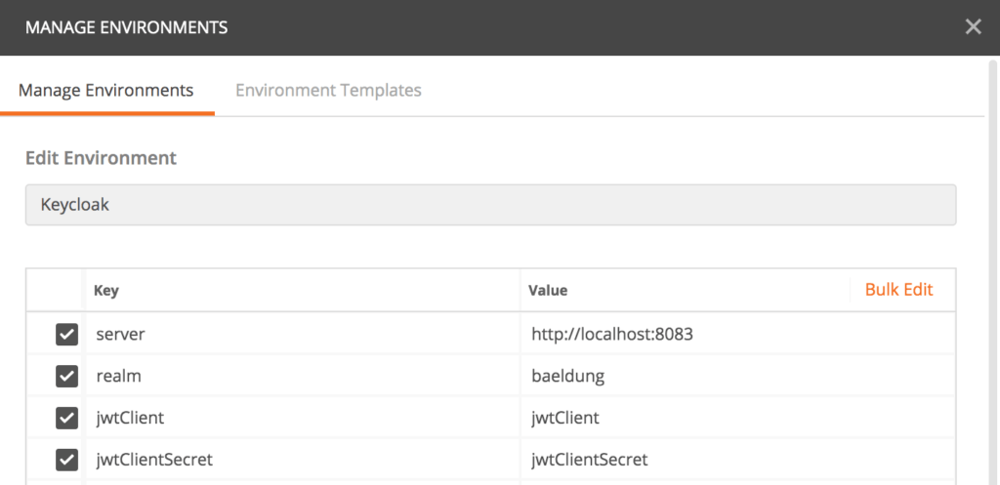

# 使用 Postman 訪問 Keycloak endpoints

## 簡介

我們將學習 Keycloak REST API 以及如何在 Postman 中調用它們。

## OAuth 2.0

OAuth 2.0 是一種授權框架，可讓經過身份驗證的用戶通過令牌向第三方授予訪問權限。令牌通常限於生命週期有限的某些範圍。因此，它是替代用戶憑據的安全方法。

OAuth 2.0 包含四個主要組件：

- **資源所有者**: 擁有受保護資源或數據的最終用戶或系統
- **資源服務器**: 該服務通常通過基於HTTP的API公開受保護的資源
- **客戶端**: 代表資源所有者調用受保護的資源
- **授權服務器**: 頒發OAuth 2.0令牌，並在對資源所有者進行身份驗證後將其傳遞給客戶端

OAuth 2.0 是具有一些[標準流程](https://auth0.com/docs/protocols/protocol-oauth2)的協議，但是我們對授權服務器組件特別感興趣。

## OpenID C0nnect

[OpenID Connect 1.0](https://openid.net/connect/) （OIDC）建立在 OAuth 2.0 的基礎上，用於向協議添加身份管理層。因此，它允許客戶端驗證最終用戶的身份並通過標準 OAuth 2.0 流訪問基本配置文件信息。 OIDC 向 OAuth 2.0 引入了一些標準範圍(scope)，例如 `openid` ，`profile` 和 `email`。

## Keycloak 作為授權服務器

Keycloak 為 OAuth 2.0 流程提供了各種 REST 端點。

要將這些端點與 Postman 一起使用，讓我們開始創建一個名為 “Keycloak” 的環境。然後，我們為 Keycloak 授權服務器 URL，領域，OAuth 2.0 客戶端 ID 和客戶端密碼添加一些鍵/值條目：

