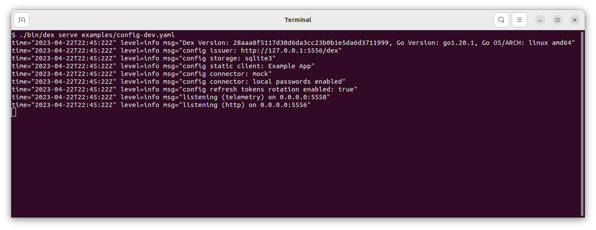
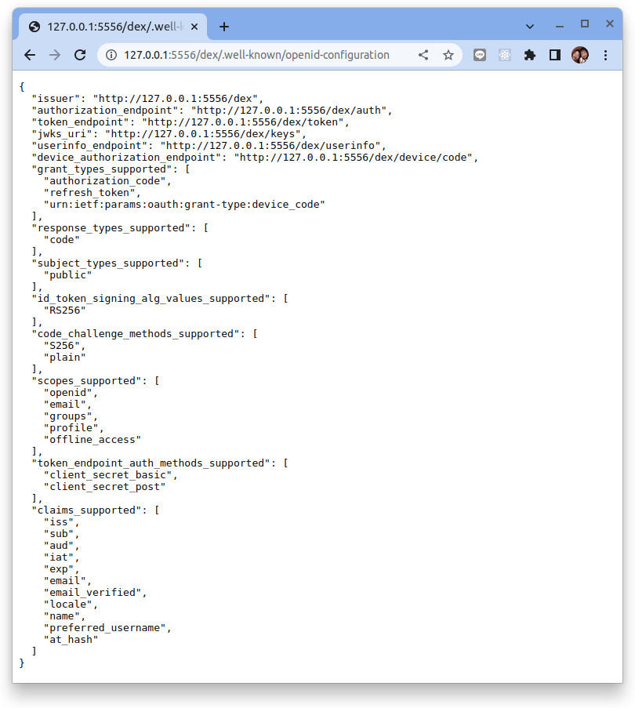
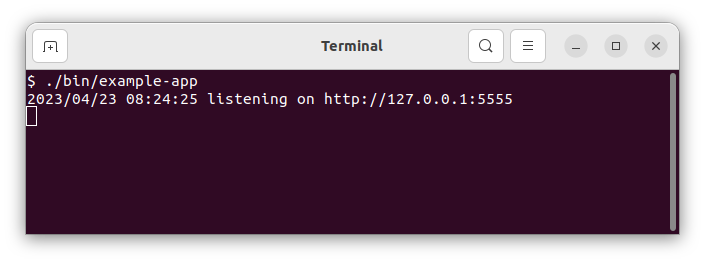
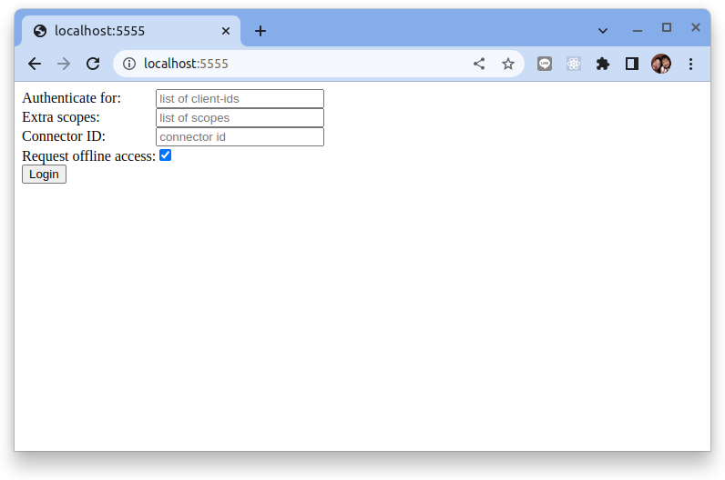
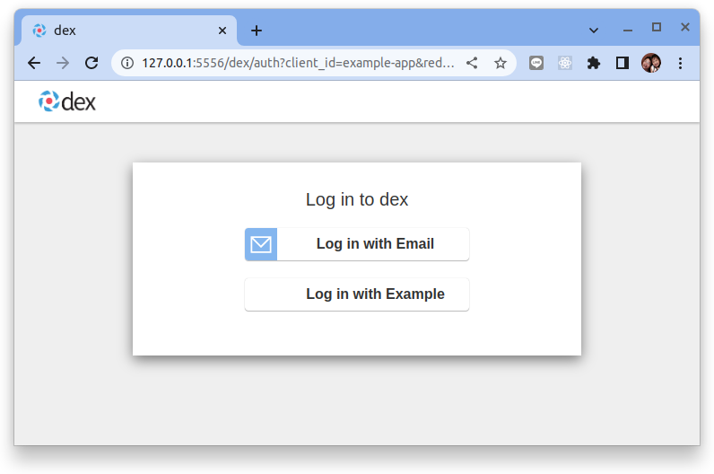
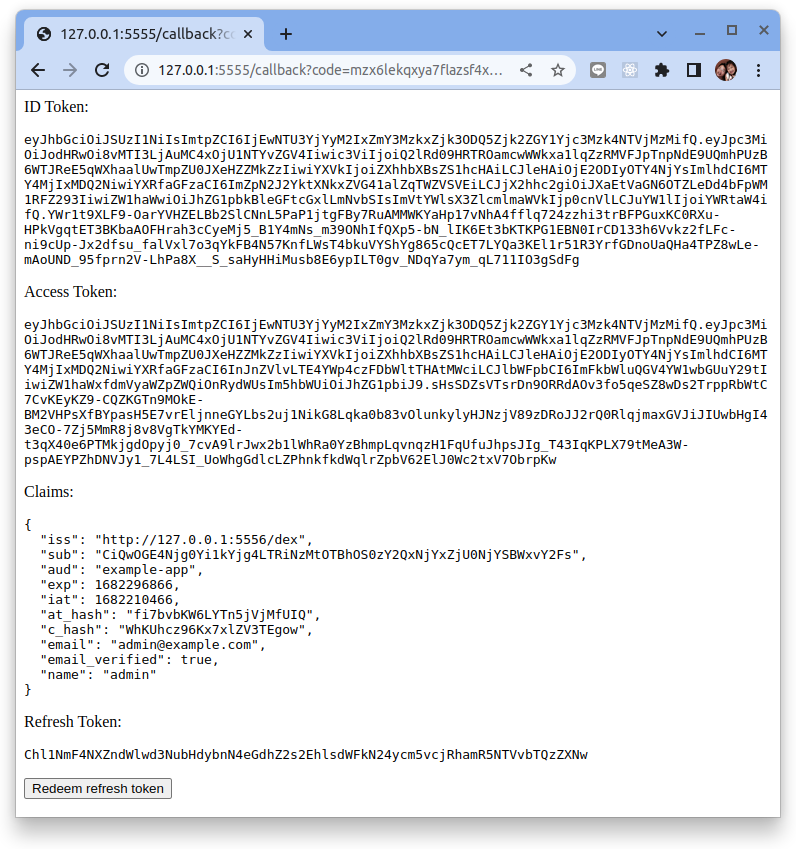
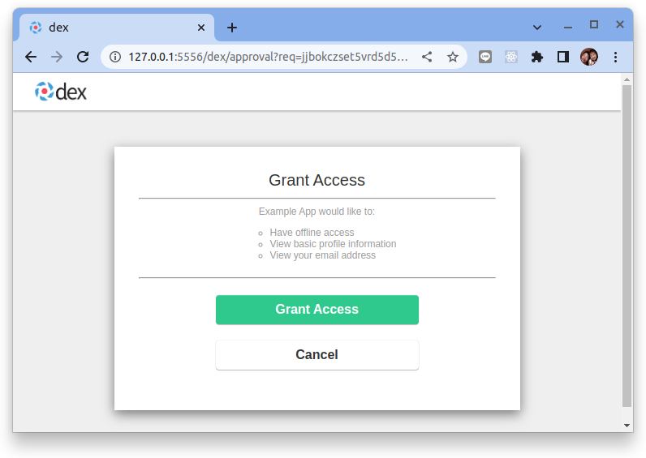

# 入門

## 構建 dex 二進製文件

**先決條件:**

- 安裝好 [Golang](https://go.dev/) 的機器 (在本文中, 使用 Ubuntu 22.04)

要從源代碼構建 dex，請根據[官方文檔](https://go.dev/doc/install) 安裝 1.19 或更高版本的工作 Go 環境。然後克隆存儲庫並使用 `make` 編譯 dex 二進製文件。

```bash
$ git clone https://github.com/dexidp/dex.git
$ cd dex/
$ make build
```

## 配置

Dex 專門從配置文件中提取配置選項。使用 `examples/` 目錄中的示例配置文件啟動一個帶有 sqlite3 數據存儲和一組預定義 OAuth2 客戶端的 dex 實例。

```bash
./bin/dex serve examples/config-dev.yaml
```



範例[配置文件](https://github.com/dexidp/dex/blob/master/examples/config-dev.yaml)通過註釋記錄了許多配置選項。有關其它的配置選項，請查看該文件。

??? example

    ```yaml title="dex/examples/config-dev.yaml"
    # dex 的基本路徑和 OpenID Connect 服務的外部名稱。
    # 這是所有客戶端必須用來引用 dex 的規範 URL。
    issuer: http://127.0.0.1:5556/dex

    # 存儲配置決定了 dex 存儲其狀態的位置。支持的
    # 選項包括 SQL 資料庫和 Kubernetes 第三方資源。
    #
    # 有關詳細信息，請參閱文檔 (https://dexidp.io/docs/storage/)。
    storage:
      type: sqlite3
      config:
        file: examples/dex.db

      # type: mysql
      # config:
      #   host: localhost
      #   port: 3306
      #   database: dex
      #   user: mysql
      #   password: mysql
      #   ssl:
      #     mode: "false"

      # type: postgres
      # config:
      #   host: localhost
      #   port: 5432
      #   database: dex密碼
      #   user: postgres
      #   password: postgres
      #   ssl:
      #     mode: disable

      # type: etcd
      # config:
      #   endpoints:
      #     - http://localhost:2379
      #   namespace: dex/

      # type: kubernetes
      # config:
      #   kubeConfigFile: $HOME/.kube/config

    # HTTP 端點的配置。
    web:
      http: 0.0.0.0:5556
      # 如果要配置 HTTPS 選項請使用下列的註釋。
      # https: 127.0.0.1:5554
      # tlsCert: /etc/dex/tls.crt
      # tlsKey: /etc/dex/tls.key

    # dex外觀的配置
    # frontend:
    #   issuer: dex
    #   logoURL: theme/logo.png
    #   dir: web/
    #   theme: light

    # 遙測配置
    telemetry:
      http: 0.0.0.0:5558
      # enableProfiling: true

    # 取消下列註釋以啟用 gRPC API。這個值必須不同於在 "HTTP 端點的配置"。
    # grpc:
    #   addr: 127.0.0.1:5557
    #   tlsCert: examples/grpc-client/server.crt
    #   tlsKey: examples/grpc-client/server.key
    #   tlsClientCA: examples/grpc-client/ca.crt

    # 取消此區塊註釋以啟用相關token有效持續時間的配置。
    # 可以僅使用 s、m 和 h 後綴指定單位。
    # expiry:
    #   deviceRequests: "5m"
    #   signingKeys: "6h"
    #   idTokens: "24h"
    #   refreshTokens:
    #     reuseInterval: "3s"
    #     validIfNotUsedFor: "2160h" # 90 days
    #     absoluteLifetime: "3960h" # 165 days

    # 用於控制日誌的選項。
    # logger:
    #   level: "debug"
    #   format: "text" # can also be "json"

    # 預設值如下所示
    # oauth2:
        # 使用 ["code", "token", "id_token"] 為 web-only 客戶端啟用 implicit flow
    #   responseTypes: [ "code" ] # also allowed are "token" and "id_token"

        # 默認情況下，Dex 會請求批准與應用程序共享數據
        #（批准從連接的 IdP 到 Dex 的共享數據是 IdP 上的單獨過程）
    #   skipApprovalScreen: false

        # 如果只啟用一種身份驗證方法，則默認行為是直接去吧。
        # 對於已連接的 IdP，這會將瀏覽器重定向到上游 IdP 提供商，例如 Google 登錄頁面
    #   alwaysShowLoginScreen: false

        # 取消下列註釋以使用特定連接器進行密碼授予
    #   passwordConnector: local

    # 若不是從外部存儲讀取，也可使用這個靜態配置的客戶端列表。
    #
    # 如果不使用靜態配置，也可以通過 gRPC API 添加客戶端。
    staticClients:
    - id: example-app
      redirectURIs:
      - 'http://127.0.0.1:5555/callback'
      name: 'Example App'
      secret: ZXhhbXBsZS1hcHAtc2VjcmV0
    #  - id: example-device-client
    #    redirectURIs:
    #      - /device/callback
    #    name: 'Static Client for Device Flow'
    #    public: true

    connectors:
    - type: mockCallback
      id: mock
      name: Example
    # - type: google
    #   id: google
    #   name: Google
    #   config:
    #     issuer: https://accounts.google.com
    #     # Connector config values starting with a "$" will read from the environment.
    #     clientID: $GOOGLE_CLIENT_ID
    #     clientSecret: $GOOGLE_CLIENT_SECRET
    #     redirectURI: http://127.0.0.1:5556/dex/callback
    #     hostedDomains:
    #     - $GOOGLE_HOSTED_DOMAIN

    # 讓 dex 保留一個密碼列表，可以用來登錄 dex。
    enablePasswordDB: true

    # 用於登錄最終用戶的靜態密碼列表。通過在這裡識別，dex
    # 不會在其底層存儲中查找密碼。
    #
    # 如果不是使用此選項，則可以通過 gRPC API 添加用戶與密碼。
    staticPasswords:
    - email: "admin@example.com"
      # bcrypt hash of the string "password": $(echo password | htpasswd -BinC 10 admin | cut -d: -f2)
      hash: "$2a$10$2b2cU8CPhOTaGrs1HRQuAueS7JTT5ZHsHSzYiFPm1leZck7Mc8T4W"
      username: "admin"
      userID: "08a8684b-db88-4b73-90a9-3cd1661f5466"
    ```

## 運行客戶端

Dex 與大多數其他 OAuth2 provider 有著一樣的運作原理。用戶從客戶端應用程序重定向到 dex 以登錄。 Dex 附帶一個客戶端應用程序範例（使用 `make examples` 命令構建），用於測試和演示。

預設情況下，範例客戶端配置有與 `examples/config-dev.yaml` 中定義的相同 `OAuth2 credentials` 以與 dex 通信。運行範例應用程序將觸發它查詢 dex 的 discovery endpoint 並確定 OAuth2 端點。

!!! info
    作為 OpenID Connect 或 OAuth2 的服務 provider, 必需提供很多 endpoint 以滿足各種流程運作需要。
    
    **Discovery endpoint** 正是解決此問題的好方法，它定義 OpenID/OAuth2 Provider 需要一個提供 URL 如：

    ```
    http://example.com/.well-known/openid-configuration
    ```

    例如: 使用瀏覽器到 `http://127.0.0.1:5556/dex/.well-known/openid-configuration` 

    

    從回傳的結果可了解 OpenConnect provider 的元數據與相關服務的 URL 端點資訊。

    詳細的說明可參考: [Standard OAuth 2.0 / OpenID Connect endpoints](https://connect2id.com/products/server/docs/api)


```bash
$ cd dex/
$ make examples
```

接下來讓我們來執行這個客戶端應用程序範例:

```bash
./bin/example-app
```



使用以下步驟通過範例應用程序來體驗如何使用 dex 完成身份驗證並且取得 JWT token。

1. 在瀏覽器中導航到位於 http://localhost:5555/ 的範例應用程序。

    

2. 在範例應用程序上點擊 “login” 以重導向到 dex。

    

3. 選擇下列任一個選項進行身份驗證：

    - “Login with Example” 以使用模擬的用戶數據。
    - “Login with Email” 以使用靜態用戶帳密 `admin@example.com` 和 `password` 填寫表單。

    

4. 批准範例應用程序的請求。

    

    點擊 "Grant Access"。

5. 查看範例應用程序通過 dex 身份驗證後所取回的令牌資訊。

    


參考下列的圖表來了解範例應用程序與 dex (IDP) 互動的過程:


## 延伸閱讀

Dex 通常用作驅動其他應用程序身份驗證的構建模組或元件。請參閱“[編寫使用 Dex 的應用程序](https://dexidp.io/docs/using-dex/)”以了解應用程序如何使用 dex 的概述。

查看文檔目錄以進一步閱讀有關設置不同存儲、與 dex API 交互、OpenID Connect 介紹以及通過其他身份提供者（如 Google、GitHub 或 LDAP）登錄的信息。

