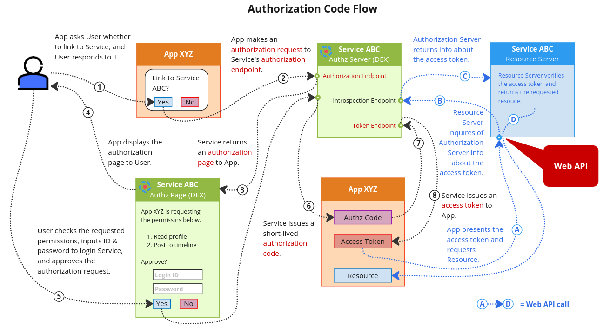

# OpenID Connect 概述

本文試圖提供 [OpenID Connect 協議](https://openid.net/connect/)的一般概述，這是 dex 實現的 OAuth2 的一種風格。雖然本文檔並不完整，但我們希望它提供足夠的信息來幫助用戶啟動和運行。

有關 dex 實現的自定義聲明 (custom claims)、範圍 (scopes) 和客戶端功能 (client features) 的概述，請參閱此[文檔](https://dexidp.io/docs/custom-scopes-claims-clients/)。

## OAuth2

任何使用過類似 “使用 Facebook 登錄” 按鈕的人都應該熟悉 OAuth2。在這些情況下，應用程序選擇讓外部提供商（在本例中為 Facebook）證明您的身份，而不是讓您使用應用程序本身設置用戶名和密碼。

服務器端應用程序的一般流程是：

1. 新用戶訪問應用程序。
2. 該應用程序將用戶重定向到 Facebook。
3. 用戶登錄 Facebook，然後被詢問是否可以讓應用程序查看用戶的個人資料、代表他們貼文等。
4. 如果用戶單擊確定，Facebook 會將用戶重定向回帶有代碼的應用程序。
5. 該應用程序使用提供商兌換該代碼以獲得可用於訪問授權操作的令牌，例如查看用戶個人資料或在他們的貼文。

在這些情況下，dex 充當 Facebook（在 OpenID Connect 中稱為“提供者”），而客戶端應用程序重定向到它以獲得最終用戶的身份。



## ID 令牌

不幸的是，應用程序從 OAuth2 提供者那裡獲得的訪問令牌對客戶端來說是完全不透明的，並且對提供者來說是唯一的。你從 Facebook 收到的令牌將與你從 Twitter 或 GitHub 收到的令牌完全不同。

OpenID Connect 對 OAuth2 的主要擴展是令牌響應中返回的附加令牌，稱為 ID 令牌。此令牌是由 OpenID Connect 服務器簽名的 JSON Web 令牌，具有用戶 ID、姓名、電子郵件等眾所周知的字段。來自 OpenID Connect 的典型令牌響應如下所示：

```bash
HTTP/1.1 200 OK
Content-Type: application/json
Cache-Control: no-store
Pragma: no-cache

{
 "access_token": "SlAV32hkKG",
 "token_type": "Bearer",
 "refresh_token": "8xLOxBtZp8",
 "expires_in": 3600,
 "id_token": "eyJhbGciOiJSUzI1NiIsImtpZCI6IjFlOWdkazcifQ.ewogImlzc
   yI6ICJodHRwOi8vc2VydmVyLmV4YW1wbGUuY29tIiwKICJzdWIiOiAiMjQ4Mjg5
   NzYxMDAxIiwKICJhdWQiOiAiczZCaGRSa3F0MyIsCiAibm9uY2UiOiAibi0wUzZ
   fV3pBMk1qIiwKICJleHAiOiAxMzExMjgxOTcwLAogImlhdCI6IDEzMTEyODA5Nz
   AKfQ.ggW8hZ1EuVLuxNuuIJKX_V8a_OMXzR0EHR9R6jgdqrOOF4daGU96Sr_P6q
   Jp6IcmD3HP99Obi1PRs-cwh3LO-p146waJ8IhehcwL7F09JdijmBqkvPeB2T9CJ
   NqeGpe-gccMg4vfKjkM8FcGvnzZUN4_KSP0aAp1tOJ1zZwgjxqGByKHiOtX7Tpd
   QyHE5lcMiKPXfEIQILVq0pc_E2DzL7emopWoaoZTF_m0_N0YzFC6g6EJbOEoRoS
   K5hoDalrcvRYLSrQAZZKflyuVCyixEoV9GfNQC3_osjzw2PAithfubEEBLuVVk4
   XUVrWOLrLl0nx7RkKU8NXNHq-rvKMzqg"
}
```


該 ID 令牌是一個 JWT，具有三個由點分隔的 base64 字段。第一個是標頭，第二個是有效載荷，第三個是前兩個字段的簽名。解析時我們可以看到這個值的有效載荷是。

```json
{
  "iss": "http://server.example.com",
  "sub": "248289761001",
  "aud": "s6BhdRkqt3",
  "nonce": "n-0S6_WzA2Mj",
  "exp": 1311281970,
  "iat": 1311280970
}
```

這有一些有趣的欄位，例如:

- 頒發此令牌 (iss) 的服務器。
- 令牌的主題（sub）。在這種情況下，最終用戶的唯一 ID。
- 令牌的受眾（aud）。為此頒發的 OAuth2 客戶端的 ID。


## 發現 Discovery

OpenID Connect 服務器具有 OAuth2 端點的發現機制、支持的範圍以及各種其他 OpenID Connect 功能的指示。

```bash hl_lines="3 4 5 6"
$ curl http://127.0.0.1:5556/dex/.well-known/openid-configuration
{
  "issuer": "http://127.0.0.1:5556",
  "authorization_endpoint": "http://127.0.0.1:5556/auth",
  "token_endpoint": "http://127.0.0.1:5556/token",
  "jwks_uri": "http://127.0.0.1:5556/keys",
  "response_types_supported": [
    "code"
  ],
  "subject_types_supported": [
    "public"
  ],
  "id_token_signing_alg_values_supported": [
    "RS256"
  ],
  "scopes_supported": [
    "openid",
    "email",
    "profile"
  ]
}
```

重要的是，我們發現了授權端點、令牌端點和服務器公鑰的位置。 OAuth2 客戶端應該能夠立即使用令牌和身份驗證端點，而 JOSE 庫可用於解析密鑰。 keys 端點返回一個 JSON Web Key Set 公鑰，看起來像這樣：

```bash
$ curl http://127.0.0.1:5556/dex/keys
{
  "keys": [
    {
      "use": "sig",
      "kty": "RSA",
      "kid": "5d19a0fde5547960f4edaa1e1e8293e5534169ba",
      "alg": "RS256",
      "n": "5TAXCxkAQqHEqO0InP81z5F59PUzCe5ZNaDsD1SXzFe54BtXKn_V2a3K-BUNVliqMKhC2LByWLuI-A5ZlA5kXkbRFT05G0rusiM0rbkN2uvRmRCia4QlywE02xJKzeZV3KH6PldYqV_Jd06q1NV3WNqtcHN6MhnwRBfvkEIm7qWdPZ_mVK7vayfEnOCFRa7EZqr-U_X84T0-50wWkHTa0AfnyVvSMK1eKL-4yc26OWkmjh5ALfQFtnsz30Y2TOJdXtEfn35Y_882dNBDYBxtJV4PaSjXCxhiaIuBHp5uRS1INyMXCx2ve22ASNx_ERorv6BlXQoMDqaML2bSiN9N8Q",
      "e": "AQAB"
    }
  ]
}
```

