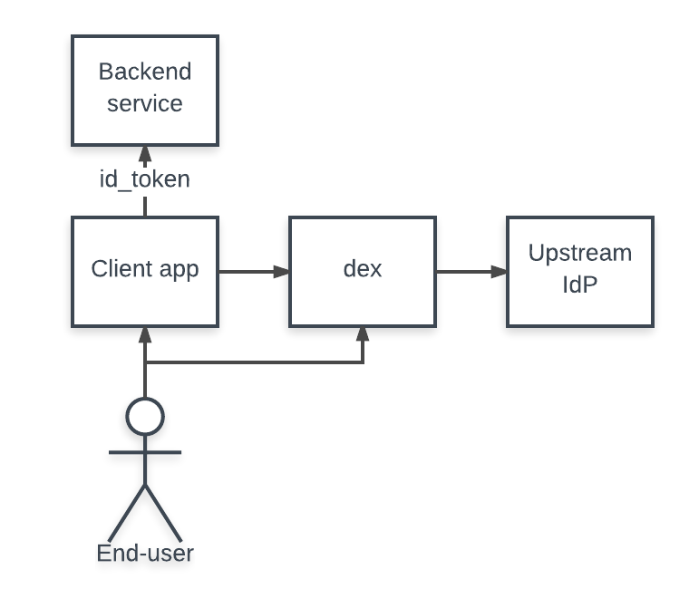

# 編寫使用 Dex 的應用程序

一旦啟動並運行了 dex，下一步就是編寫使用 dex 來驅動身份驗證的應用程序。與 dex 交互的應用程序通常屬於以下兩類之一：

1. 請求 OpenID Connect ID 令牌以驗證用戶身份的應用程序。
    - 用於對最終用戶進行身份驗證。
    - 必須基於 Web-based。

2. 應用程序使用來自其他應用程序的 ID 令牌。
    - 需要驗證客戶端是否代表用戶行事。

第一類應用程序是標準的 OAuth2 客戶端。用戶出現在網站上，應用程序希望通過從 ID 令牌中提取聲明 (claims) 來對這些最終用戶進行身份驗證。

第二類應用使用 ID 令牌作為憑證。這讓另一個服務處理 OAuth2 流程，然後使用從 dex 檢索到的 ID 令牌代表最終用戶來使用某種應用程序。屬於此類別的應用程序示例是 [Kubernetes API 服務器](https://kubernetes.io/docs/reference/access-authn-authz/authentication/#openid-connect-tokens)。

## 從 dex 請求 ID 令牌

直接使用 dex 對用戶進行身份驗證的應用程序使用 OAuth2 的 **code flows** 來請求令牌響應。採取的確切步驟是：

- 用戶訪問客戶端應用程序。
- 客戶端應用程序使用 OAuth2 請求將用戶重定向到 dex。
- Dex 確定用戶的身份。
- Dex 使用代碼將用戶重定向到客戶端。
- 客戶端與 dex 交換代碼以獲得 id_token。


也可參考下面比較詳細的流程圖 (步驟 1 ~ 8):


dex repo 包含一個小型[示例應用程序](https://github.com/dexidp/dex/tree/master/examples/example-app)，它是一個可獨立運行的應用程序，通過它可了解如何執行上述的 OAuth2 流程。

本節的其餘部分將探討有助於解釋如何在您自己的應用程序中實現此邏輯的代碼部分。

### 配置您的應用

示例應用程序使用以下 Go 包來執行 OAuth2 的 **code flows**：

- [github.com/coreos/go-oidc](https://godoc.org/github.com/coreos/go-oidc) 
- [golang.org/x/oauth2](https://godoc.org/golang.org/x/oauth2) 

首先，客戶端(OAuth2 client)詳細信息應該出現在 dex 配置中。例如，我們可以使用以下區塊的配置來在 dex 註冊一個應用程序的 client id：

```yaml title="dex/examples/config-dev.yaml"
...
...
# 若不是從外部存儲讀取，也可使用這個靜態配置的客戶端列表。
#
# 如果不使用靜態配置，也可以通過 gRPC API 添加客戶端。
staticClients:
- id: example-app
  secret: example-app-secret
  name: 'Example App'
  # Where the app will be running.
  redirectURIs:
  - 'http://127.0.0.1:5555/callback'
...
...
```

在這種情況下，Go 代碼將配置為：

```golang
// Initialize a provider by specifying dex's issuer URL.
provider, err := oidc.NewProvider(ctx, "https://dex-issuer-url.com")
if err != nil {
    // handle error
}

// Configure the OAuth2 config with the client values.
oauth2Config := oauth2.Config{
    // client_id and client_secret of the client.
    ClientID:     "example-app",
    ClientSecret: "example-app-secret",

    // The redirectURL.
    RedirectURL: "http://127.0.0.1:5555/callback",

    // Discovery returns the OAuth2 endpoints.
    Endpoint: provider.Endpoint(),

    // "openid" is a required scope for OpenID Connect flows.
    //
    // Other scopes, such as "groups" can be requested.
    Scopes: []string{oidc.ScopeOpenID, "profile", "email", "groups"},
}

// Create an ID token parser.
idTokenVerifier := provider.Verifier(&oidc.Config{ClientID: "example-app"})
```

然後，HTTP 服務器應將未經身份驗證的用戶重定向到 dex 以初始化 OAuth2 流程。

```golang
// handleRedirect is used to start an OAuth2 flow with the dex server.
func handleRedirect(w http.ResponseWriter, r *http.Request) {
    state := newState()
    http.Redirect(w, r, oauth2Config.AuthCodeURL(state), http.StatusFound)
}
```

在 dex 驗證用戶身份後，它會使用可交換 ID 令牌的代碼將用戶重定向回客戶端應用程序。然後可以由上面創建的驗證器解析 ID 令牌。

```golang
func handleOAuth2Callback(w http.ResponseWriter, r *http.Request) {
    state := r.URL.Query().Get("state")

    // Verify state.
    oauth2Token, err := oauth2Config.Exchange(ctx, r.URL.Query().Get("code"))
    if err != nil {
        // handle error
    }

    // Extract the ID Token from OAuth2 token.
    rawIDToken, ok := oauth2Token.Extra("id_token").(string)
    if !ok {
        // handle missing token
    }

    // Parse and verify ID Token payload.
    idToken, err := idTokenVerifier.Verify(ctx, rawIDToken)
    if err != nil {
        // handle error
    }

    // Extract custom claims.
    var claims struct {
        Email    string   `json:"email"`
        Verified bool     `json:"email_verified"`
        Groups   []string `json:"groups"`
    }
    if err := idToken.Claims(&claims); err != nil {
        // handle error
    }
}
```

### State 令牌

state 參數是一個任意字符串，dex 將始終隨 callback 一起返回。它起到安全作用，防止某些類型的 OAuth2 攻擊。具體來說，客戶可以使用它來確保：

- 通過將用戶會話與狀態令牌相關聯，啟動流程的用戶就是完成流程的用戶。例如，通過將狀態設置為 HTTP cookie，然後在用戶返回應用程序時比較它。
- 該請求尚未重播。這可以通過在狀態中關聯一些隨機數來實現。

可以在 [OAuth 2.0 威脅模型和安全注意事項](https://tools.ietf.org/html/rfc6819) RFC 中找到對這些最佳實踐的更透徹的討論。

## 使用 ID 令牌

應用程序還可以選擇使用 ID 令牌，讓其他受信任的客戶端處理 Web 流以進行登錄。客戶端傳遞他們從 dex 收到的 ID 令牌，通常作為不記名令牌，讓他們充當後端服務的用戶。



要接受 ID 令牌作為用戶憑證，應用程序將構建一個與上述示例類似的 OpenID Connect 驗證器。驗證者驗證 ID 令牌的簽名，確保它沒有過期等。這段代碼的一個重要部分是驗證者只信任示例應用程序的客戶端。這確保示例應用程序是使用 ID 令牌的應用程序，而不是另一個不受信任的客戶端。

```golang
// Initialize a provider by specifying dex's issuer URL.
provider, err := oidc.NewProvider(ctx, "https://dex-issuer-url.com")
if err != nil {
    // handle error
}
// Create an ID token parser, but only trust ID tokens issued to "example-app"
idTokenVerifier := provider.Verifier(&oidc.Config{ClientID: "example-app"})
```

然後可以使用驗證器從令牌中提取用戶信息：

```golang
type user struct {
    email  string
    groups []string
}

// authorize verifies a bearer token and pulls user information form the claims.
func authorize(ctx context.Context, bearerToken string) (*user, error) {
    idToken, err := idTokenVerifier.Verify(ctx, bearerToken)
    if err != nil {
        return nil, fmt.Errorf("could not verify bearer token: %v", err)
    }
    // Extract custom claims.
    var claims struct {
        Email    string   `json:"email"`
        Verified bool     `json:"email_verified"`
        Groups   []string `json:"groups"`
    }
    if err := idToken.Claims(&claims); err != nil {
        return nil, fmt.Errorf("failed to parse claims: %v", err)
    }
    if !claims.Verified {
        return nil, fmt.Errorf("email (%q) in returned claims was not verified", claims.Email)
    }
    return &user{claims.Email, claims.Groups}, nil
}
```

接下來如何與 Resource Server 來互動的過程也可參考下面比較詳細的流程圖 (步驟 A ~ D):


