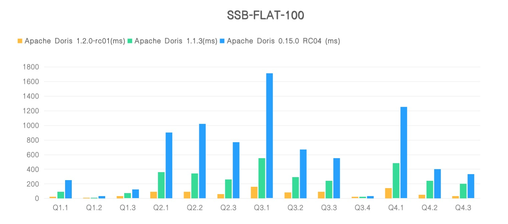
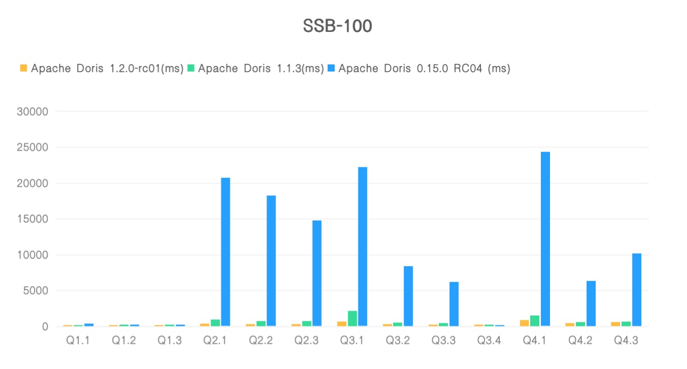

# Star Schema Benchmark

[Star Schema Benchmark(SSB)](https://www.cs.umb.edu/~poneil/StarSchemaB.PDF) 是一個輕量級的數倉 (Data warehouse)場景下的效能測試集。 SSB 基於 [TPC-H](http://www.tpc.org/tpch/) 提供了一個簡化版的星型模型資料集，主要用於測試在星型模型下，多表關聯查詢的效能表現。另外，業界通常也會將 SSB 打平為寬表模型（以下簡稱：SSB flat），來測試查詢引擎的效能，參考[Clickhouse](https://clickhouse.com/docs/zh/getting-started/example-datasets/star-schema)。

本文檔主要介紹 Apache Doris 在 SSB 100G 測試集的效能表現。

!!! info
    - 註1：包含SSB的標準測試集通常和實際業務場景差距增大，部分測試會針對測試集進行參數調優。所以標準測試集的測試結果只能反映資料庫在特定場景下的效能使用者建議使用實際業務數據進行進一步的測試。

    - 註2：本文檔涉及的操作均在 Ubuntu Server 20.04 環境進行，CentOS 7 也可測試。

    - 註3: Doris 從 1.2.2 版本開始，為了減少記憶體佔用，預設關閉了 Page Cache，會對效能有一定影響，所以在進行效能測試時請在 `be.conf` 加入`disable_storage_page_cache=false` 來開啟 Page Cache。

在 SSB 標準測試資料集上的 13 個查詢上，我們基於 Apache Doris 1.2.0-rc01， Apache Doris 1.1.3 和 Apache Doris 0.15.0 RC04 版本進行了對其他測試。

在 SSB FlAT 寬表上，Apache Doris 1.2.0-rc01 上相對 Apache Doris 1.1.3 整體效能提升了近 4 倍，相對於 Apache Doris 0.15.0 RC04，效能提升了近 10 倍。



在標準的 SSB 測試 SQL 上，Apache Doris 1.2.0-rc01 上相對 Apache Doris 1.1.3 整體效能提升了近 2 倍，相對於 Apache Doris 0.15.0 RC04，效能提升了近 31 倍。



## 硬體環境

|機器數量 | 4台騰訊雲主機（1個FE，3個BE） |
| -------- | ------------------------------------------------ |
|中央處理器| AMD EPYC™ 米蘭(2.55GHz/3.5GHz) 16核心 |
|記憶體 | 64G |
|網路頻寬 | 7Gbps |
|磁碟|高效能雲端硬碟|

## 軟體環境

- Doris 部署 3BE 1FE；
- 核心版本: Linux 版本 5.4.0-96-generic (buildd@lgw01-amd64-051)
- 作業系統版本: Ubuntu Server 20.04 LTS 64位
- Doris軟體版本: Apache Doris 1.2.0-rc01、Apache Doris 1.1.3 及 Apache Doris 0.15.0 RC04
- JDK: openjdk 版本 “11.0.14” 2022-01-18

## 測試資料量

| SSB表名 | 行數 | 備註 |
| :------------- | :--------- | :--------------- |
| lineorder | 600,037,902 | 商品訂單明細表 |
| customer | 3,000,000 | 客戶資訊表 |
| part | 1,400,000 | 零件資訊表 |
| supplier | 200,000 | 供應商資訊表 |
| dates | 2,556 | 日期表 |
| lineorder_flat | 600,037,902 | 資料展平後的寬表 |

## SSB 寬表測試結果

這裡我們使用 Apache Doris 1.2.0-rc01、 Apache Doris 1.1.3 及 Apache Doris 0.15.0 RC04 版本進行比較測試，測試結果如下：

| Query | Apache Doris 1.2.0-rc01(ms) | Apache Doris 1.1.3(ms) | Apache Doris 0.15.0 RC04(ms) |
| ----- | ------------- | ------------- | --------------- -- |
| Q1.1 | 20 | 90 | 250 |
| Q1.2 | 10 | 10 | 30 |
| Q1.3 | 30 | 70 | 120 |
| Q2.1 | 90 | 360 | 900 |
| Q2.2 | 90 | 340 | 1020 |
| Q2.3 | 60 | 260 | 770 |
| Q3.1 | 160 | 550 | 1710 |
| Q3.2 | 80 | 290 | 670 |
| Q3.3 | 90 | 240 | 550 |
| Q3.4 | 20 | 20 | 30 |
| Q4.1 | 140 | 480 | 1250 |
| Q4.2 | 50 | 240 | 400 |
| Q4.3 | 30 | 200 | 330 |
| 合計 | 880 | 3150 | 8030 |

**結果說明**

- 測試結果對應的資料集為 scale 100, 約 6 億條。
- 測試環境配置為使用者常用配置，雲端伺服器 4 台，16 核心 64G SSD，1 FE 3 BE 部署。
- 選用使用者常見配置測試以降低使用者選用評估成本，但整個測試過程中不會消耗如此多的硬體資源。

## 標準 SSB 測試結果

這裡我們使用 Apache Doris 1.2.0-rc01、Apache Doris 1.1.3 及 Apache Doris 0.15.0 RC04 版本進行比較測試，測試結果如下：

| Query | Apache Doris 1.2.0-rc01(ms) | Apache Doris 1.1.3 (ms) | Apache Doris 0.15.0 RC04(ms) |
| ----- | ------- | ---------------------- | ------------ ------------------- |
| Q1.1 | 40 | 18 | 350 |
| Q1.2 | 30 | 100 | 80 |
| Q1.3 | 20 | 70 | 80 |
| Q2.1 | 350 | 940 | 20680 |
| Q2.2 | 320 | 750 | 18250 |
| Q2.3 | 300 | 720 | 14760 |
| Q3.1 | 650 | 2150 | 22190 |
| Q3.2 | 260 | 510 | 8360 |
| Q3.3 | 220 | 450 | 6200 |
| Q3.4 | 60 | 70 | 160 |
| Q4.1 | 840 | 1480 | 24320 |
| Q4.2 | 460 | 560 | 6310 |
| Q4.3 | 610 | 660 | 10170 |
| 合計 | 4160 | 8478 | 131910 |

**結果說明**

- 測試結果對應的資料集為 scale 100, 約 6 億條。
- 測試環境配置為使用者常用配置，雲端伺服器 4台，16核心 64G SSD，1 FE 3 BE 部署。
- 選用使用者常見配置測試以降低使用者選用評估成本，但整個測試過程中不會消耗如此多的硬體資源。

## 環境準備

請先參考 [官方文件](../install/standard-deployment.md) 進行 Apache Doris 的安裝部署，以獲得一個正常運作中的 Doris 叢集（至少包含 1 FE 1 BE，建議 1 FE 3 BE）。

以下文件中涉及的腳本都存放在 Apache Doris 程式碼庫：[ssb-tools](https://github.com/apache/doris/tree/master/tools/ssb-tools)

```shell
git clone https://github.com/apache/doris.git
```

## 資料準備

接下來的指令都會在 `doris/tools/ssb-tools` 的目錄下來執行。

```shell
cd doris/tools/ssb-tools
```

### 下載安裝 SSB 資料產生工具。

執行下列腳本下載並編譯 [ssb-dbgen](https://github.com/electrum/ssb-dbgen.git) 工具。

```shell
./bin/build-ssb-dbgen.sh
```

安裝成功後，將在 `ssb-dbgen/` 目錄下產生 `dbgen` 二進位。

!!! tip
    在現在 Doris 版本的 `dbgen` 工具程式在產生 `date` 的數據時會出錯。在尚未被修複之前的可使用下列的版本的 `ssb-dbgen` 來修補:

    - [eyalroz/ssb-dbgen](https://github.com/eyalroz/ssb-dbgen)

    下載上述的 repo 之後, 在目錄下使用 `cmake` 來編譯:

    ```bash
    $ cmake . && cmake --build .
    ```

    之後手動產生 `date.tbl` 數據:

    ```bash
    $ ./dbgen -s 100 -T d
    ```

### 產生 SSB 測試集

執行以下腳本產生 SSB 資料集：

```shell
./bin/gen-ssb-data.sh -s 100 -c 100
```

> 註1：透過 `sh gen-ssb-data.sh -h` 查看腳本幫助。
>
> 註2：資料會以 `.tbl` 為後綴產生在 `ssb-data/` 目錄下。檔案總大小約 60 GB。生成時間可能在數分鐘到 1 小時不等。
>
> 註3：`-s 100` 表示測試集大小係數為 100，`-c 100` 表示並發 100 個執行緒產生 lineorder 資料表的資料。 `-c` 參數也決定了最終 lineorder 資料表的檔案數量。參數越大，檔案數越多，每個檔案越小。

在 `-s 100` 參數下，產生的資料集大小為：

| Table | Rows | Size | File Number |
| --------- | ---------------- | ---- | ----------- |
| lineorder | 6億（600037902） | 60GB | 100 |
| customer | 300萬（3000000） | 277M | 1 |
| part | 140萬（1400000） | 116M | 1 |
| supplier | 20萬（200000） | 17M | 1 |
| dates | 2556 | 228K | 1 |

### 建數據表

#### 準備 `doris-cluster.conf` 檔案。

在呼叫匯入腳本之前，需要將 FE 的 ip 連接埠等資訊寫在 `doris-cluster.conf` 檔案中。

檔案位置在 `${DORIS_HOME}/tools/ssb-tools/conf/` 目錄下 。

文件內容包括 FE 的 ip，HTTP 端口，用戶名，密碼以及待導入資料的 DB 名稱：

```shell
export FE_HOST="xxx"
export FE_HTTP_PORT="8030"
export FE_QUERY_PORT="9030"
export USER="root"
export PASSWORD='xxx'
export DB="ssb"
```

#### 執行下列腳本產生以建立 SSB 表：

```shell
./bin/create-ssb-tables.sh
```

結果:

```shell
$ ./bin/create-ssb-tables.sh 

mysql  Ver 8.0.34-0ubuntu0.20.04.1 for Linux on x86_64 ((Ubuntu))
FE_HOST: 127.0.0.1
FE_QUERY_PORT: 9030
USER: root
DB: ssb
Run DDL from /home/dxlab/opt/doris/tools/ssb-tools/bin/../ddl/create-ssb-tables.sql
Run DDL from /home/dxlab/opt/doris/tools/ssb-tools/bin/../ddl/create-ssb-flat-table.sql
ssb tables has been created
```

或複製[create-ssb-tables.sql](https://github.com/apache/incubator-doris/tree/master/tools/ssb-tools/ddl/create-ssb-tables.sql) 和[create- ssb-flat-table.sql](https://github.com/apache/incubator-doris/tree/master/tools/ssb-tools/ddl/create-ssb-flat-table.sql) 中的建表語句，在MySQL 客戶端中執行。

下面是 `lineorder_flat` 表格建表語句。在上面的 `create-ssb-flat-table.sh` 腳本中建立 `lineorder_flat` 表，並進行了預設分桶數（48個桶)。您可以刪除該表，根據您的叢集規模節點配置對這個分桶數進行調整，這樣可以獲得更好的一個測試效果。


```sql
CREATE TABLE `lineorder_flat` (
  `LO_ORDERDATE` date NOT NULL COMMENT "",
  `LO_ORDERKEY` int(11) NOT NULL COMMENT "",
  `LO_LINENUMBER` tinyint(4) NOT NULL COMMENT "",
  `LO_CUSTKEY` int(11) NOT NULL COMMENT "",
  `LO_PARTKEY` int(11) NOT NULL COMMENT "",
  `LO_SUPPKEY` int(11) NOT NULL COMMENT "",
  `LO_ORDERPRIORITY` varchar(100) NOT NULL COMMENT "",
  `LO_SHIPPRIORITY` tinyint(4) NOT NULL COMMENT "",
  `LO_QUANTITY` tinyint(4) NOT NULL COMMENT "",
  `LO_EXTENDEDPRICE` int(11) NOT NULL COMMENT "",
  `LO_ORDTOTALPRICE` int(11) NOT NULL COMMENT "",
  `LO_DISCOUNT` tinyint(4) NOT NULL COMMENT "",
  `LO_REVENUE` int(11) NOT NULL COMMENT "",
  `LO_SUPPLYCOST` int(11) NOT NULL COMMENT "",
  `LO_TAX` tinyint(4) NOT NULL COMMENT "",
  `LO_COMMITDATE` date NOT NULL COMMENT "",
  `LO_SHIPMODE` varchar(100) NOT NULL COMMENT "",
  `C_NAME` varchar(100) NOT NULL COMMENT "",
  `C_ADDRESS` varchar(100) NOT NULL COMMENT "",
  `C_CITY` varchar(100) NOT NULL COMMENT "",
  `C_NATION` varchar(100) NOT NULL COMMENT "",
  `C_REGION` varchar(100) NOT NULL COMMENT "",
  `C_PHONE` varchar(100) NOT NULL COMMENT "",
  `C_MKTSEGMENT` varchar(100) NOT NULL COMMENT "",
  `S_NAME` varchar(100) NOT NULL COMMENT "",
  `S_ADDRESS` varchar(100) NOT NULL COMMENT "",
  `S_CITY` varchar(100) NOT NULL COMMENT "",
  `S_NATION` varchar(100) NOT NULL COMMENT "",
  `S_REGION` varchar(100) NOT NULL COMMENT "",
  `S_PHONE` varchar(100) NOT NULL COMMENT "",
  `P_NAME` varchar(100) NOT NULL COMMENT "",
  `P_MFGR` varchar(100) NOT NULL COMMENT "",執行下列腳本下載並編譯 [tpch-tools](https://github.com/apache/doris/tree/master/tools/tpch-tools) 工具。

```shell
sh build-tpch-dbgen.sh
```

安裝成功後，將在 `TPC-H_Tools_v3.0.0/` 目錄下產生 `dbgen` 二進位。
  `P_CATEGORY` varchar(100) NOT NULL COMMENT "",
  `P_BRAND` varchar(100) NOT NULL COMMENT "",
  `P_COLOR` varchar(100) NOT NULL COMMENT "",
  `P_TYPE` varchar(100) NOT NULL COMMENT "",
  `P_SIZE` tinyint(4) NOT NULL COMMENT "",
  `P_CONTAINER` varchar(100) NOT NULL COMMENT ""
) ENGINE=OLAP
DUPLICATE KEY(`LO_ORDERDATE`, `LO_ORDERKEY`)
COMMENT "OLAP"
PARTITION BY RANGE(`LO_ORDERDATE`)
(PARTITION p1 VALUES [('0000-01-01'), ('1993-01-01')),
PARTITION p2 VALUES [('1993-01-01'), ('1994-01-01')),
PARTITION p3 VALUES [('1994-01-01'), ('1995-01-01')),
PARTITION p4 VALUES [('1995-01-01'), ('1996-01-01')),
PARTITION p5 VALUES [('1996-01-01'), ('1997-01-01')),
PARTITION p6 VALUES [('1997-01-01'), ('1998-01-01')),
PARTITION p7 VALUES [('1998-01-01'), ('1999-01-01')))
DISTRIBUTED BY HASH(`LO_ORDERKEY`) BUCKETS 48
PROPERTIES (
"replication_num" = "1",
"colocate_with" = "groupxx1",
"in_memory" = "false",
"storage_format" = "DEFAULT"
);
```

### 導入數據

我們使用以下指令完成 SSB 測試集所有資料匯入及 SSB FLAT 寬表資料合成並匯入到表裡。


```shell
./bin/load-ssb-data.sh
```

`-c 5` 表示啟動 10 個並發執行緒導入（預設為 5）。在單 BE 節點情況下，由 `sh gen-ssb-data.sh -s 100 -c 100` 產生的 lineorder 數據，同時會在最後產生 ssb-flat 表的數據，如果開啟更多線程，可以加快導入速度，但會增加額外的記憶體開銷。

!!! info
    註：

    1. 要獲得更快的導入速度，你可以在 `be.conf` 中加入 `flush_thread_num_per_store=10` 後重啟 BE。此配置表示每個資料目錄的寫盤執行緒數，預設為 6。較大的資料可以提升寫入資料吞吐，但可能會增加 IO Util。 （參考值：1 塊機械磁碟，在預設為 2 的情況下，導入過程中的 IO Util 約為 12%，設定為 5 時，IO Util 約為 26%。如果是 SSD 盤，則幾乎為 0）。

    2. flat 表資料採用 `INSERT INTO ... SELECT ... ` 的方式導入。

### 檢查導入數據

```sql
select count(*) from part;
select count(*) from customer;
select count(*) from supplier;
select count(*) from dates;
select count(*) from lineorder;
select count(*) from lineorder_flat;
```

資料量應和產生資料的行數一致。

| Table | Rows | Origin Size | Compacted Size(1 Replica) |
| -------------- | ---------------- | ----------- | ----- -------------------- |
| lineorder_flat | 6億（600037902） | | 59.709 GB |
| lineorder | 6億（600037902） | 60 GB | 14.514 GB |
| customer | 300萬（3000000） | 277 MB | 138.247 MB​​ |
| part | 140萬（1400000） | 116 MB | 12.759 MB |
| supplier | 20萬（200000） | 17 MB | 9.143 MB |
| dates | 2556 | 228 KB | 34.276 KB |

### 查詢測試

SSB-FlAT 查詢語句: [ssb-flat-queries](https://github.com/apache/doris/tree/master/tools/ssb-tools/ssb-flat-queries)


標準 SSB 查詢語句: [ssb-queries](https://github.com/apache/doris/tree/master/tools/ssb-tools/ssb-queries)

#### SSB FLAT 測試 SQL

執行下列命令:

```shell
./bin/run-ssb-flat-queries.sh
```

命令稿會執行下列的 sql 並計算執行時間。

```sql
--Q1.1
SELECT SUM(LO_EXTENDEDPRICE * LO_DISCOUNT) AS revenue
FROM lineorder_flat
WHERE  LO_ORDERDATE >= 19930101  AND LO_ORDERDATE <= 19931231 AND LO_DISCOUNT BETWEEN 1 AND 3  AND LO_QUANTITY < 25;
--Q1.2
SELECT SUM(LO_EXTENDEDPRICE * LO_DISCOUNT) AS revenue
FROM lineorder_flat
WHERE LO_ORDERDATE >= 19940101 AND LO_ORDERDATE <= 19940131  AND LO_DISCOUNT BETWEEN 4 AND 6 AND LO_QUANTITY BETWEEN 26 AND 35;

--Q1.3
SELECT SUM(LO_EXTENDEDPRICE * LO_DISCOUNT) AS revenue
FROM lineorder_flat
WHERE  weekofyear(LO_ORDERDATE) = 6 AND LO_ORDERDATE >= 19940101  AND LO_ORDERDATE <= 19941231 AND LO_DISCOUNT BETWEEN 5 AND 7  AND LO_QUANTITY BETWEEN 26 AND 35;

--Q2.1
SELECT SUM(LO_REVENUE), (LO_ORDERDATE DIV 10000) AS YEAR, P_BRAND
FROM lineorder_flat WHERE P_CATEGORY = 'MFGR#12' AND S_REGION = 'AMERICA'
GROUP BY YEAR, P_BRAND
ORDER BY YEAR, P_BRAND;

--Q2.2
SELECT  SUM(LO_REVENUE), (LO_ORDERDATE DIV 10000) AS YEAR, P_BRAND
FROM lineorder_flat
WHERE P_BRAND >= 'MFGR#2221' AND P_BRAND <= 'MFGR#2228'  AND S_REGION = 'ASIA'
GROUP BY YEAR, P_BRAND
ORDER BY YEAR, P_BRAND;

--Q2.3
SELECT SUM(LO_REVENUE), (LO_ORDERDATE DIV 10000) AS YEAR, P_BRAND
FROM lineorder_flat
WHERE P_BRAND = 'MFGR#2239' AND S_REGION = 'EUROPE'
GROUP BY YEAR, P_BRAND
ORDER BY YEAR, P_BRAND;

--Q3.1
SELECT C_NATION, S_NATION, (LO_ORDERDATE DIV 10000) AS YEAR, SUM(LO_REVENUE) AS revenue
FROM lineorder_flat
WHERE C_REGION = 'ASIA' AND S_REGION = 'ASIA' AND LO_ORDERDATE >= 19920101  AND LO_ORDERDATE <= 19971231
GROUP BY C_NATION, S_NATION, YEAR
ORDER BY YEAR ASC, revenue DESC;

--Q3.2
SELECT C_CITY, S_CITY, (LO_ORDERDATE DIV 10000) AS YEAR, SUM(LO_REVENUE) AS revenue
FROM lineorder_flat
WHERE C_NATION = 'UNITED STATES' AND S_NATION = 'UNITED STATES' AND LO_ORDERDATE >= 19920101 AND LO_ORDERDATE <= 19971231
GROUP BY C_CITY, S_CITY, YEAR
ORDER BY YEAR ASC, revenue DESC;

--Q3.3
SELECT C_CITY, S_CITY, (LO_ORDERDATE DIV 10000) AS YEAR, SUM(LO_REVENUE) AS revenue
FROM lineorder_flat
WHERE C_CITY IN ('UNITED KI1', 'UNITED KI5') AND S_CITY IN ('UNITED KI1', 'UNITED KI5') AND LO_ORDERDATE >= 19920101 AND LO_ORDERDATE <= 19971231
GROUP BY C_CITY, S_CITY, YEAR
ORDER BY YEAR ASC, revenue DESC;

--Q3.4
SELECT C_CITY, S_CITY, (LO_ORDERDATE DIV 10000) AS YEAR, SUM(LO_REVENUE) AS revenue
FROM lineorder_flat
WHERE C_CITY IN ('UNITED KI1', 'UNITED KI5') AND S_CITY IN ('UNITED KI1', 'UNITED KI5') AND LO_ORDERDATE >= 19971201  AND LO_ORDERDATE <= 19971231
GROUP BY C_CITY, S_CITY, YEAR
ORDER BY YEAR ASC, revenue DESC;

--Q4.1
SELECT (LO_ORDERDATE DIV 10000) AS YEAR, C_NATION, SUM(LO_REVENUE - LO_SUPPLYCOST) AS profit
FROM lineorder_flat
WHERE C_REGION = 'AMERICA' AND S_REGION = 'AMERICA' AND P_MFGR IN ('MFGR#1', 'MFGR#2')
GROUP BY YEAR, C_NATION
ORDER BY YEAR ASC, C_NATION ASC;

--Q4.2
SELECT (LO_ORDERDATE DIV 10000) AS YEAR,S_NATION, P_CATEGORY, SUM(LO_REVENUE - LO_SUPPLYCOST) AS profit
FROM lineorder_flat
WHERE C_REGION = 'AMERICA' AND S_REGION = 'AMERICA' AND LO_ORDERDATE >= 19970101 AND LO_ORDERDATE <= 19981231 AND P_MFGR IN ('MFGR#1', 'MFGR#2')
GROUP BY YEAR, S_NATION, P_CATEGORY
ORDER BY YEAR ASC, S_NATION ASC, P_CATEGORY ASC;

--Q4.3
SELECT (LO_ORDERDATE DIV 10000) AS YEAR, S_CITY, P_BRAND, SUM(LO_REVENUE - LO_SUPPLYCOST) AS profit
FROM lineorder_flat
WHERE S_NATION = 'UNITED STATES' AND LO_ORDERDATE >= 19970101 AND LO_ORDERDATE <= 19981231 AND P_CATEGORY = 'MFGR#14'
GROUP BY YEAR, S_CITY, P_BRAND
ORDER BY YEAR ASC, S_CITY ASC, P_BRAND ASC;
```

#### SSB 標準測試 SQL

執行下列命令:

```shell
./bin/run-ssb-queries.sh
```

命令稿會執行下列的 sql 並計算執行時間。

```sql
--Q1.1
SELECT SUM(lo_extendedprice * lo_discount) AS REVENUE
FROM lineorder, dates
WHERE
    lo_orderdate = d_datekey
    AND d_year = 1993
    AND lo_discount BETWEEN 1 AND 3
    AND lo_quantity < 25;
--Q1.2
SELECT SUM(lo_extendedprice * lo_discount) AS REVENUE
FROM lineorder, dates
WHERE
    lo_orderdate = d_datekey
    AND d_yearmonth = 'Jan1994'
    AND lo_discount BETWEEN 4 AND 6
    AND lo_quantity BETWEEN 26 AND 35;
    
--Q1.3
SELECT
    SUM(lo_extendedprice * lo_discount) AS REVENUE
FROM lineorder, dates
WHERE
    lo_orderdate = d_datekey
    AND d_weeknuminyear = 6
    AND d_year = 1994
    AND lo_discount BETWEEN 5 AND 7
    AND lo_quantity BETWEEN 26 AND 35;
    
--Q2.1
SELECT SUM(lo_revenue), d_year, p_brand
FROM lineorder, dates, part, supplier
WHERE
    lo_orderdate = d_datekey
    AND lo_partkey = p_partkey
    AND lo_suppkey = s_suppkey
    AND p_category = 'MFGR#12'
    AND s_region = 'AMERICA'
GROUP BY d_year, p_brand
ORDER BY p_brand;

--Q2.2
SELECT SUM(lo_revenue), d_year, p_brand
FROM lineorder, dates, part, supplier
WHERE
    lo_orderdate = d_datekey
    AND lo_partkey = p_partkey
    AND lo_suppkey = s_suppkey
    AND p_brand BETWEEN 'MFGR#2221' AND 'MFGR#2228'
    AND s_region = 'ASIA'
GROUP BY d_year, p_brand
ORDER BY d_year, p_brand;

--Q2.3
SELECT SUM(lo_revenue), d_year, p_brand
FROM lineorder, dates, part, supplier
WHERE
    lo_orderdate = d_datekey
    AND lo_partkey = p_partkey
    AND lo_suppkey = s_suppkey
    AND p_brand = 'MFGR#2239'
    AND s_region = 'EUROPE'
GROUP BY d_year, p_brand
ORDER BY d_year, p_brand;

--Q3.1
SELECT
    c_nation,
    s_nation,
    d_year,
    SUM(lo_revenue) AS REVENUE
FROM customer, lineorder, supplier, dates
WHERE
    lo_custkey = c_custkey
    AND lo_suppkey = s_suppkey
    AND lo_orderdate = d_datekey
    AND c_region = 'ASIA'
    AND s_region = 'ASIA'
    AND d_year >= 1992
    AND d_year <= 1997
GROUP BY c_nation, s_nation, d_year
ORDER BY d_year ASC, REVENUE DESC;

--Q3.2
SELECT
    c_city,
    s_city,
    d_year,
    SUM(lo_revenue) AS REVENUE
FROM customer, lineorder, supplier, dates
WHERE
    lo_custkey = c_custkey
    AND lo_suppkey = s_suppkey
    AND lo_orderdate = d_datekey
    AND c_nation = 'UNITED STATES'
    AND s_nation = 'UNITED STATES'
    AND d_year >= 1992
    AND d_year <= 1997
GROUP BY c_city, s_city, d_year
ORDER BY d_year ASC, REVENUE DESC;

--Q3.3
SELECT
    c_city,
    s_city,
    d_year,
    SUM(lo_revenue) AS REVENUE
FROM customer, lineorder, supplier, dates
WHERE
    lo_custkey = c_custkey
    AND lo_suppkey = s_suppkey
    AND lo_orderdate = d_datekey
    AND (
        c_city = 'UNITED KI1'
        OR c_city = 'UNITED KI5'
    )
    AND (
        s_city = 'UNITED KI1'
        OR s_city = 'UNITED KI5'
    )
    AND d_year >= 1992
    AND d_year <= 1997
GROUP BY c_city, s_city, d_year
ORDER BY d_year ASC, REVENUE DESC;

--Q3.4
SELECT
    c_city,
    s_city,
    d_year,
    SUM(lo_revenue) AS REVENUE
FROM customer, lineorder, supplier, dates
WHERE
    lo_custkey = c_custkey
    AND lo_suppkey = s_suppkey
    AND lo_orderdate = d_datekey
    AND (
        c_city = 'UNITED KI1'
        OR c_city = 'UNITED KI5'
    )
    AND (
        s_city = 'UNITED KI1'
        OR s_city = 'UNITED KI5'
    )
    AND d_yearmonth = 'Dec1997'
GROUP BY c_city, s_city, d_year
ORDER BY d_year ASC, REVENUE DESC;

--Q4.1
SELECT /*+SET_VAR(parallel_fragment_exec_instance_num=4, enable_vectorized_engine=true, batch_size=4096, enable_cost_based_join_reorder=true, enable_projection=true) */
    d_year,
    c_nation,
    SUM(lo_revenue - lo_supplycost) AS PROFIT
FROM dates, customer, supplier, part, lineorder
WHERE
    lo_custkey = c_custkey
    AND lo_suppkey = s_suppkey
    AND lo_partkey = p_partkey
    AND lo_orderdate = d_datekey
    AND c_region = 'AMERICA'
    AND s_region = 'AMERICA'
    AND (
        p_mfgr = 'MFGR#1'
        OR p_mfgr = 'MFGR#2'
    )
GROUP BY d_year, c_nation
ORDER BY d_year, c_nation;

--Q4.2
SELECT /*+SET_VAR(parallel_fragment_exec_instance_num=2, enable_vectorized_engine=true, batch_size=4096, enable_cost_based_join_reorder=true, enable_projection=true) */  
    d_year,
    s_nation,
    p_category,
    SUM(lo_revenue - lo_supplycost) AS PROFIT
FROM dates, customer, supplier, part, lineorder
WHERE
    lo_custkey = c_custkey
    AND lo_suppkey = s_suppkey
    AND lo_partkey = p_partkey
    AND lo_orderdate = d_datekey
    AND c_region = 'AMERICA'
    AND s_region = 'AMERICA'
    AND (
        d_year = 1997
        OR d_year = 1998
    )
    AND (
        p_mfgr = 'MFGR#1'
        OR p_mfgr = 'MFGR#2'
    )
GROUP BY d_year, s_nation, p_category
ORDER BY d_year, s_nation, p_category;

--Q4.3
SELECT /*+SET_VAR(parallel_fragment_exec_instance_num=2, enable_vectorized_engine=true, batch_size=4096, enable_cost_based_join_reorder=true, enable_projection=true) */
    d_year,
    s_city,
    p_brand,
    SUM(lo_revenue - lo_supplycost) AS PROFIT
FROM dates, customer, supplier, part, lineorder
WHERE
    lo_custkey = c_custkey
    AND lo_suppkey = s_suppkey
    AND lo_partkey = p_partkey
    AND lo_orderdate = d_datekey
    AND s_nation = 'UNITED STATES'
    AND (
        d_year = 1997
        OR d_year = 1998
    )
    AND p_category = 'MFGR#14'
GROUP BY d_year, s_city, p_brand
ORDER BY d_year, s_city, p_brand;
```
