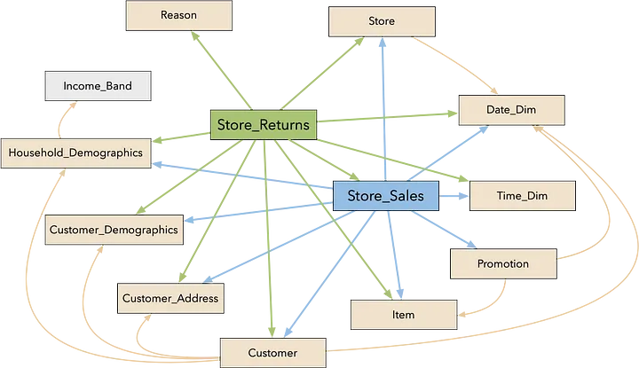

# TPC-DS Benchmark


TPC-DS 是決策支援系統(decision support system) 的包含多維度常規應用模型的決策支援基準，包括查詢(queries) 與資料維護。此基準對被測系統(System Under Test's, SUT)在決策支援系統層面上的表現進行的評估具有代表性。

此基準體現決策支援系統以下特性：

1. 測試大規模資料
2. 對實際商業問題進行解答
3. 執行需求多樣或複雜的查詢（如臨時查詢，報告，迭代 OLAP，資料探勘） 
4. 以高 CPU 和 IO 負載為特徵
5. 透過資料庫維護對OLTP資料庫資源進行週期同步
6. 解決大數據問題，如關聯式資料庫(RDBMS)，或基於 Hadoop/Spark的系統

基準結果用來測量，較為複雜的多用戶決策中，單一用戶模型下的查詢回應時間，多用戶模型下的查詢吞吐量，以及資料維護表現。

TPC-DS採用星型、雪花型等多維資料模式。它包含 7 張事實表，17 張維度表平均每張表含有 18 列。其工作負載包含 99 個 SQL 查詢，涵蓋 SQL99 和 2003 的核心部分以及 OLAP。這個測試集包含對大資料集的統計、報表產生、線上查詢、資料探勘等複雜應用，測試用的資料和值是有傾斜的，與真實資料一致。可以說 TPC-DS 是與真實場景非常接近的測試集，也是難度較高的測試集。

- **資料模型與資料存取**: 採用雪花模型，有一系列的事實表和維度表

        維度表分為以下幾類：
        
        - static（例如日期維度，不會改變）
        - historical（歷史記錄保留，時間戳代表是否合法，例如item維度）
        - non-historical（新紀錄涵蓋歷史記錄，總是使用最新數據，例如customer維度）
        
        事實表有7張:
        
        - store_sales
        - store_returns
        - catalog_sales
        - catalog_returns
        - web_sales
        - web_returns
        - inventory
        
        三個管道(store, catalog & internet)的銷售和利潤數據，以及跟促銷相關的數據，還有 17 張維度表：
        
        - store
        - call_center
        - catalog_page
        - web_site
        - web_page
        - warehouse
        - customer
        - customer_address
        - customer_demographics
        - date_dim
        - household_demographics
        - item，income_band
        - promotion
        - reason
        - ship_mode
        - time_dim。
        
        測試資料大小包含多種 size，1TB，3TB，10TB，30TB，100TB。使用 `SF`（Scale Factor）來控制資料規模。

- **查詢模型**: 包含了多種查詢類型，例如查詢模式比較固定的報表類別查詢，例如 ad-hoc 查詢，例如一些包含多 join 和聚合運算的複雜查詢。分析的資料量大，都是在回答真實場景下的商業問題。



## 測試資料量

整個測試模擬產生 TPC-DS 100G 的資料匯入 Apache Doris 進行測試，以下是表格的相關說明及資料量。

| TPC-DS 表名 | 行數 | 匯入後大小（bytes) | 備註 |
| :-------- | :----- | ---------- | :----------- |
|call_center|30|13,802|服務中心|
|catalog_page|20,400|1274752|郵寄目錄產品頁|
|catalog_returns|14,404,374(1千4百萬)|775205765|郵寄目錄銷售退回|
|catalog_sales|143,997,065 (1億4千3百萬)|9935667192|郵寄目錄銷售|
|customer|2,000,000|117,768,069|客戶主檔|
|customer_address|1,000,000|22,521,560|客戶地址|
|customer_demographics|1,920,800|660025|客戶地理區域|
|date_dim|73,049|1,909,018|日期維度|
|dbgen_version|1|1,198|數據產生器版本|
|household_demographics|7,200|20,756|家戶地理區域|
|income_band|20|703|收入分群|
|inventory|399,330,000|1,021,392,590|存貨|
|item|204,000|26,787,245|商品品項|
|promotion|1,000|75,632|促銷|
|reason|55|7,913|季節維度|
|ship_mode|20|3,287|出貨模式|
|store|402|55,454|商店|
|store_returns|28,795,080 (2千8百萬)|1,177,431,324|商店銷售退回|
|store_sales|287,997,024 (2億8千萬)|13,492,282,490|商店銷售|
|time_dim|86,400|1,139,232|時間維度|
|warehouse|15|5,021|倉庫|
|web_page|2,040|39,487|銷售網頁|
|web_returns|7,197,670 (7百萬)|368,373,384|網路銷售退回|
|web_sales|72,001,237 (7千2百萬)|4,992,298,278|網路銷售|
|web_site|24|11175|銷售網站|

## 測試 SQL

TPC-DS 99 個測試查詢語句: [TPCDS-Query-SQL](https://github.com/apache/doris/tree/master/tools/tpcds-tools/queries)


## 環境準備

請先參考 [官方文件](../install/standard-deployment.md) 進行 Doris 的安裝部署，以獲得一個正常運作中的 Doris 叢集（至少包含 1 FE 1 BE，建議 1 FE 3 BE）。

以下文件中涉及的腳本都存放在 Apache Doris 程式碼庫：[ssb-tools](https://github.com/apache/doris/tree/master/tools/tpcds-tools)

```shell
git clone https://github.com/apache/doris.git
```

## 資料準備

接下來的指令都會在 `doris/tools/tpcds-tools` 的目錄下來執行。

```shell
cd doris/tools/tpcds-tools
```

### 下載安裝 TPC-DS 資料產生工具

執行下列腳本下載並編譯 [tpcds-tools](https://github.com/apache/doris/tree/master/tools/tpcds-tools) 工具。

```shell
./bin/build-tpcds-tools.sh
```

安裝成功後，將在 `tpch-tools/bin/DSGen-software-code-3.2.0rc1/tools/` 目錄下產生 `dbdgen` 二進位執行檔。

### 產生 TPC-DS 測試集

執行以下腳本產生 TPC-DS 資料集：

```shell
./bin/gen-tpcds-data.sh -s 100 -c 10
```

!!! tip
    註1：透過 `./bin/gen-tpcds-data.sh -h` 查看腳本幫助資訊。

    註2：資料會以 `.tbl` 為字尾產生在 `${DORIS_HOME}/tools/tpcds-tools/bin/tpcds-data/` 目錄下。文件總大小約 100GB。生成時間可能在數分鐘到 1 小時不等。

    註3：預設產生 100G 的標準測試資料集

### 產生 TPC-DS 測試 SQL

執行以下腳本產生不同規模(scale)的 TPC-DS 99 個 SQL 查詢:

```shell
./bin/gen-tpcds-queries.sh -s 100
```

### 建數據表

#### 準備 `doris-cluster.conf` 文件

在呼叫匯入腳本之前，需要將 FE 的 ip 連接埠等資訊寫在 `doris-cluster.conf` 檔案中。

檔案位置在 `${DORIS_HOME}/tools/tpcds-tools/conf/` 目錄下。

文件內容包括 FE 的 ip，HTTP 端口，用戶名，密碼以及待導入資料的 DB 名稱：

```shell
# Any of FE host
export FE_HOST='127.0.0.1'
# http_port in fe.conf
export FE_HTTP_PORT=8030
# query_port in fe.conf
export FE_QUERY_PORT=9030
# Doris username
export USER='root'
# Doris password
export PASSWORD=''
# The database where TPC-H tables located
export DB='tpcds'
```

#### 執行下列腳本產生建立 TPC-DS 表

```shell
./bin/create-tpcds-tables.sh -s 100
```

或複製 [create-tpch-tables.sql](https://github.com/apache/doris/tree/master/tools/tpch-tools/ddl/create-tpch-tables.sql) 中的建表語句，在 Doris 中執行。

!!! tip
    在建 table 的命令稿中有一個參數 `-s` 是用來指明產生 tpc-h 測試數據集的 scale 參數。不同數量的參數會產生不同數量的數據，在 Doris 的創建 table 的 ddl 中可設定數據的分割 partition 策略。

### 導入數據

安裝下列兩個工具 (`jq` 與 `curl`):

```shell
sudo apt install curl

sudo apt install jq
```

透過下面的命令執行資料導入：

```shell
./bin/load-tpcds-data.sh
```

### 檢查導入數據

執行下面的 SQL 語句檢查導入的資料與上面的資料量是一致。

```sql
select count(*) from call_center;
select count(*) from catalog_page;
select count(*) from catalog_returns;
select count(*) from catalog_sales;
select count(*) from customer;
select count(*) from customer_address;
select count(*) from customer_demographics;
select count(*) from date_dim;
select count(*) from household_demographics;
select count(*) from income_band;
select count(*) from inventory;
select count(*) from item;
select count(*) from promotion;
select count(*) from reason;
select count(*) from ship_mode;
select count(*) from store;
select count(*) from store_returns;
select count(*) from store_sales;
select count(*) from time_dim;
select count(*) from warehouse;
select count(*) from web_page;
select count(*) from web_returns;
select count(*) from web_sales;
select count(*) from web_site;
```

### 查詢測試

## 執行查詢腳本

執行上面的測試 SQL 或 執行下面的命令

```
./bin/run-tpcds-queries.sh -s 100
```

!!! tip
    注意：

    1. 目前 Doris 的查詢優化器和統計資訊功能還不完善，所以我們在 TPC-H 中重寫了一些查詢以適應 Doris 的執行框架，但不影響結果的正確性
    2. Doris 新的查詢優化器將在後續的版本中發布
    3. 執行查詢之前設定 `set mem_exec_limit=8G`

## 單一 SQL 執行

以下是測試時使用的 SQL 語句，你也可以從程式碼庫中取得最新的 SQL 。最新測試查詢語句位址：[TPC-DS 測試查詢語句](https://github.com/apache/doris/tree/master/tools/tpcds-tools/queries)

相關的 SQL query 檔案位置在 `${DORIS_HOME}/tools/tpcds-tools/queries/` 目錄下。如果去找看會發現有不同的目錄(對應用產生數據的 scale 參數):

```shell
./queries/
├── sf1
├── sf100
├── sf1000
└── sf10000
```

而且在每一個檔案夾裡都包括了 tpc-ds 的 99 個測試的 SQL。

```shell
sf100
├── query10.sql
├── query11.sql
├── query12.sql
├── query13.sql
├── query14.sql
├── query15.sql
├── query16.sql
├── query17.sql
├── query18.sql
├── query19.sql
├── query1.sql
├── query20.sql
├── query21.sql
├── query22.sql
├── query23.sql
├── query24.sql
├── query25.sql
├── query26.sql
├── query27.sql
├── query28.sql
├── query29.sql
├── query2.sql
├── query30.sql
├── query31.sql
├── query32.sql
├── query33.sql
├── query34.sql
├── query35.sql
├── query36.sql
├── query37.sql
├── query38.sql
├── query39.sql
├── query3.sql
├── query40.sql
├── query41.sql
├── query42.sql
├── query43.sql
├── query44.sql
├── query45.sql
├── query46.sql
├── query47.sql
├── query48.sql
├── query49.sql
├── query4.sql
├── query50.sql
├── query51.sql
├── query52.sql
├── query53.sql
├── query54.sql
├── query55.sql
├── query56.sql
├── query57.sql
├── query58.sql
├── query59.sql
├── query5.sql
├── query60.sql
├── query61.sql
├── query62.sql
├── query63.sql
├── query64.sql
├── query65.sql
├── query66.sql
├── query67.sql
├── query68.sql
├── query69.sql
├── query6.sql
├── query70.sql
├── query71.sql
├── query72.sql
├── query73.sql
├── query74.sql
├── query75.sql
├── query76.sql
├── query77.sql
├── query78.sql
├── query79.sql
├── query7.sql
├── query80.sql
├── query81.sql
├── query82.sql
├── query83.sql
├── query84.sql
├── query85.sql
├── query86.sql
├── query87.sql
├── query88.sql
├── query89.sql
├── query8.sql
├── query90.sql
├── query91.sql
├── query92.sql
├── query93.sql
├── query94.sql
├── query95.sql
├── query96.sql
├── query97.sql
├── query98.sql
├── query99.sql
└── query9.sql
```

