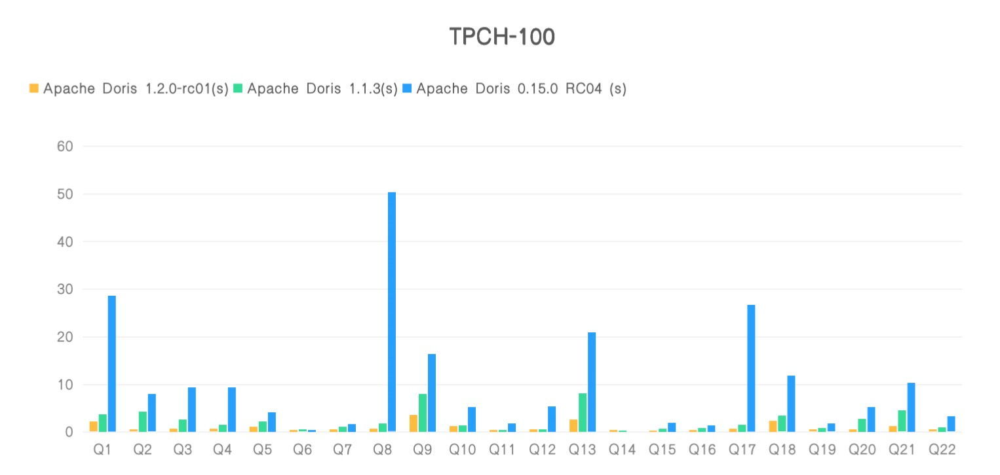

# TPC-H Benchmark

TPC-H 是決策支援基準（Decision Support Benchmark），它由一套面向業務的特別查詢和並發資料修改組成。查詢和填充資料庫的資料具有廣泛的行業相關性。

這個基準測試展示了檢查大量資料、執行高度複雜的查詢並回答關鍵業務問題的決策支援系統。TPC-H 報告的效能指標稱為 TPC-H 每小時複合查詢效能指標(QphH@Size)，反映了系統處理查詢能力的多個面向。

這些面向包括執行查詢時所選擇的資料庫大小，由單一使用者提交查詢時的查詢處理能力，以及由多個並發使用者提交查詢時的查詢吞吐量。

本文檔主要介紹 Doris 在 TPC-H 100G 測試集上的效能表現。

!!! info
    註1：包括 TPC-H 在內的標準測試集通常和實際業務場景差距較大，部分測試會針對測試集進行參數調優。所以標準測試集的測試結果僅能反映資料庫在特定場景下的效能表現。建議使用者使用實際業務資料進行進一步的測試。

    註2：本文檔涉及的操作都在 CentOS 7.x 上進行測試。

    註3: Doris 從 1.2.2 版本開始，為了減少記憶體佔用，預設關閉了 Page Cache，會對效能有一定影響，所以在進行效能測試時請在 `be.conf` 新增 `disable_storage_page_cache=false` 來開啟 Page Cache。

在 TPC-H 標準測試資料集上的 22 個查詢上，我們基於 Apache Doris 1.2.0-rc01， Apache Doris 1.1.3 及 Apache Doris 0.15.0 RC04 版本進行了對別測試， Apache Doris 1.2.0- rc01 上相對 Apache Doris 1.1.3 整體效能提升了將近 3 倍，相對於 Apache Doris 0.15.0 RC04 ,效能提升了將近 11 倍。



## 硬體環境

| 硬體 | 設定說明 |
| -------- | ------------------------------------ |
| 機器數量 | 4 台騰訊雲主機（1 個 FE，3 個 BE） |
| CPU | Intel Xeon(Cascade Lake) Platinum 8269CY 16核心 (2.5 GHz/3.2 GHz) |
| 記憶體 | 64G |
| 網路頻寬 | 5Gbps |
| 磁碟 | ESSD雲端硬碟 |

## 軟體環境

- Doris 部署: 3BE 1FE；
- 核心版本: Linux version 5.4.0-96-generic (buildd@lgw01-amd64-051)
- 作業系統版本: CentOS 7.8
- Doris 軟體版本: Apache Doris 1.2.0-rc01、 Apache Doris 1.1.3 、 Apache Doris 0.15.0 RC04
- JDK: openjdk version "11.0.14" 2022-01-18

## 測試資料量

整個測試模擬產生 TPCH 100G 的資料分別匯入 Apache Doris 1.2.0-rc01， Apache Doris 1.1.3 及 Apache Doris 0.15.0 RC04 版本進行測試，以下是表格的相關說明及資料量。

| TPC-H 表名 | 行數 | 匯入後大小 | 備註 |
| :-------- | :----- | ---------- | :----------- |
| REGION | 5 | 400KB | 區域 |
| NATION | 25 | 7.714 KB | 國家 |
| SUPPLIER | 100萬 | 85.528 MB | 供應商 |
| PART | 2000萬 | 752.330 MB | 零件料號 |
| PARTSUPP | 8000萬 | 4.375 GB | 零件供應商 |
| CUSTOMER | 1500萬 | 1.317 GB | 客戶 |
| ORDERS | 1.5億 | 6.301 GB | 訂單 |
| LINEITEM | 6億 | 20.882 GB | 訂單明細 |

## 測試 SQL

TPCH 22 個測試查詢語句: [TPCH-Query-SQL](https://github.com/apache/doris/tree/master/tools/tpch-tools/queries)

**注意：**

以上 SQL 中的以下四個參數在 Apache Doris 0.15.0 RC04 中不存在，在執行的時候，去掉：

```
1. enable_vectorized_engine=true,
2. batch_size=4096,
3. disable_join_reorder=false
4. enable_projection=true
```

## 測試結果

這裡我們使用 Apache Doris 1.2.0-rc01， Apache Doris 1.1.3 及 Apache Doris 0.15.0 RC04 版本進行比較測試，測試結果如下：

| Query    | Apache Doris 1.2.0-rc01 (s) | Apache Doris 1.1.3 (s) | Apache Doris 0.15.0 RC04 (s) |
| -------- | --------------------------- | ---------------------- | ---------------------------- |
| Q1       | 2.12                        | 3.75                   | 28.63                        |
| Q2       | 0.20                        | 4.22                   | 7.88                         |
| Q3       | 0.62                        | 2.64                   | 9.39                         |
| Q4       | 0.61                        | 1.5                    | 9.3                          |
| Q5       | 1.05                        | 2.15                   | 4.11                         |
| Q6       | 0.08                        | 0.19                   | 0.43                         |
| Q7       | 0.58                        | 1.04                   | 1.61                         |
| Q8       | 0.72                        | 1.75                   | 50.35                        |
| Q9       | 3.61                        | 7.94                   | 16.34                        |
| Q10      | 1.26                        | 1.41                   | 5.21                         |
| Q11      | 0.15                        | 0.35                   | 1.72                         |
| Q12      | 0.21                        | 0.57                   | 5.39                         |
| Q13      | 2.62                        | 8.15                   | 20.88                        |
| Q14      | 0.16                        | 0.3                    |                              |
| Q15      | 0.30                        | 0.66                   | 1.86                         |
| Q16      | 0.38                        | 0.79                   | 1.32                         |
| Q17      | 0.65                        | 1.51                   | 26.67                        |
| Q18      | 2.28                        | 3.364                  | 11.77                        |
| Q19      | 0.20                        | 0.829                  | 1.71                         |
| Q20      | 0.21                        | 2.77                   | 5.2                          |
| Q21      | 1.17                        | 4.47                   | 10.34                        |
| Q22      | 0.46                        | 0.9                    | 3.22                         |
| **合計** | **19.64**                   | **51.253**             | **223.33**                   |

**結果說明**

- 測試結果對應的資料集為 scale 100, 約 6 億條。
- 測試環境配置為使用者常用配置，雲端伺服器 4 台，16 核心 64G SSD，1 FE 3 BE 部署。
- 選用使用者常見配置測試以降低使用者選用評估成本，但整個測試過程中不會消耗如此多的硬體資源。
- Apache Doris 0.15 RC04 在 TPC-H 測試中 Q14 執行失敗，無法完成查詢。

## 環境準備

請先參考 [官方文件](../install/standard-deployment.md) 進行 Doris 的安裝部署，以獲得一個正常運作中的 Doris 叢集（至少包含 1 FE 1 BE，建議 1 FE 3 BE）。

以下文件中涉及的腳本都存放在 Apache Doris 程式碼庫：[ssb-tools](https://github.com/apache/doris/tree/master/tools/tpch-tools)

```shell
git clone https://github.com/apache/doris.git
```

## 資料準備

接下來的指令都會在 `doris/tools/tpch-tools` 的目錄下來執行。

```shell
cd doris/tools/tpch-tools
```

### 下載安裝 TPC-H 資料產生工具

執行下列腳本下載並編譯 [tpch-tools](https://github.com/apache/doris/tree/master/tools/tpch-tools) 工具。

```shell
./bin/build-tpch-dbgen.sh
```

安裝成功後，將在 `tpch-tools/bin/TPC-H_Tools_v3.0.0/dbgen/` 目錄下產生 `dbgen` 二進位執行檔。

### 產生 TPC-H 測試集

執行以下腳本產生 TPC-H 資料集：

```shell
./bin/gen-tpch-data.sh -s 100 -c 10
```

!!! tip
    註1：透過 `./bin/gen-tpch-data.sh -h` 查看腳本幫助資訊。

    註2：資料會以 `.tbl` 為字尾產生在 `${DORIS_HOME}/tools/tpch-tools/bin/tpch-data/` 目錄下。文件總大小約 100GB。生成時間可能在數分鐘到 1 小時不等。

    註3：預設產生 100G 的標準測試資料集

### 建數據表

#### 準備 `doris-cluster.conf` 文件

在呼叫匯入腳本之前，需要將 FE 的 ip 連接埠等資訊寫在 `doris-cluster.conf` 檔案中。

檔案位置在 `${DORIS_HOME}/tools/tpch-tools/conf/` 目錄下。

文件內容包括 FE 的 ip，HTTP 端口，用戶名，密碼以及待導入資料的 DB 名稱：

```shell
# Any of FE host
export FE_HOST='127.0.0.1'
# http_port in fe.conf
export FE_HTTP_PORT=8030
# query_port in fe.conf
export FE_QUERY_PORT=9030
# Doris username
export USER='root'
# Doris password
export PASSWORD=''
# The database where TPC-H tables located
export DB='tpch_test'
```

#### 執行下列腳本產生建立 TPC-H 表

```shell
./bin/create-tpch-tables.sh -s 100
```

或複製 [create-tpch-tables.sql](https://github.com/apache/doris/tree/master/tools/tpch-tools/ddl/create-tpch-tables.sql) 中的建表語句，在 Doris 中執行。

!!! tip
    在建 table 的命令稿中有一個參數 `-s` 是用來指明產生 tpc-h 測試數據集的 scale 參數。不同數量的參數會產生不同數量的數據，在 Doris 的創建 table 的 ddl 中可設定數據的分割 partition 策略。

### 導入數據

透過下面的命令執行資料導入：

```shell
./bin/load-tpch-data.sh
```

### 檢查導入數據

執行下面的 SQL 語句檢查導入的資料與上面的資料量是一致。

```sql
select count(*) from lineitem;
select count(*) from orders;
select count(*) from partsupp;
select count(*) from part;
select count(*) from customer;
select count(*) from supplier;
select count(*) from nation;
select count(*) from region;
select count(*) from revenue0;
```

### 查詢測試

## 執行查詢腳本

執行上面的測試 SQL 或 執行下面的命令

```
./bin/run-tpch-queries.sh -s 100
```

!!! tip
    注意：

    1. 目前 Doris 的查詢優化器和統計資訊功能還不完善，所以我們在 TPC-H 中重寫了一些查詢以適應 Doris 的執行框架，但不影響結果的正確性
    2. Doris 新的查詢優化器將在後續的版本中發布
    3. 執行查詢之前設定 `set mem_exec_limit=8G`

## 單一 SQL 執行

以下是測試時使用的 SQL 語句，你也可以從程式碼庫中取得最新的 SQL 。最新測試查詢語句位址：[TPC-H 測試查詢語句](https://github.com/apache/doris/tree/master/tools/tpch-tools/queries)

相關的 SQL query 檔案位置在 `${DORIS_HOME}/tools/tpch-tools/queries/` 目錄下。如果去找看會發現有不同的目錄(對應用產生數據的 scale 參數):

```
./queries/
├── sf1
│   ├── q10.sql
│   ├── q11.sql
│   ├── q12.sql
│   ├── q13.sql
│   ├── q14.sql
│   ├── q15.sql
│   ├── q16.sql
│   ├── q17.sql
│   ├── q18.sql
│   ├── q19.sql
│   ├── q1.sql
│   ├── q20.sql
│   ├── q21.sql
│   ├── q22.sql
│   ├── q2.sql
│   ├── q3.sql
│   ├── q4.sql
│   ├── q5.sql
│   ├── q6.sql
│   ├── q7.sql
│   ├── q8.sql
│   └── q9.sql
├── sf100
│   ├── q10.sql
│   ├── q11.sql
│   ├── q12.sql
│   ├── q13.sql
│   ├── q14.sql
│   ├── q15.sql
│   ├── q16.sql
│   ├── q17.sql
│   ├── q18.sql
│   ├── q19.sql
│   ├── q1.sql
│   ├── q20.sql
│   ├── q21.sql
│   ├── q22.sql
│   ├── q2.sql
│   ├── q3.sql
│   ├── q4.sql
│   ├── q5.sql
│   ├── q6.sql
│   ├── q7.sql
│   ├── q8.sql
│   └── q9.sql
├── sf1000
│   ├── q10.sql
│   ├── q11.sql
│   ├── q12.sql
│   ├── q13.sql
│   ├── q14.sql
│   ├── q15.sql
│   ├── q16.sql
│   ├── q17.sql
│   ├── q18.sql
│   ├── q19.sql
│   ├── q1.sql
│   ├── q20.sql
│   ├── q21.sql
│   ├── q22.sql
│   ├── q2.sql
│   ├── q3.sql
│   ├── q4.sql
│   ├── q5.sql
│   ├── q6.sql
│   ├── q7.sql
│   ├── q8.sql
│   └── q9.sql
└── sf10000
    ├── q10.sql
    ├── q11.sql
    ├── q12.sql
    ├── q13.sql
    ├── q14.sql
    ├── q15.sql
    ├── q16.sql
    ├── q17.sql
    ├── q18.sql
    ├── q19.sql
    ├── q1.sql
    ├── q20.sql
    ├── q21.sql
    ├── q22.sql
    ├── q2.sql
    ├── q3.sql
    ├── q4.sql
    ├── q5.sql
    ├── q6.sql
    ├── q7.sql
    ├── q8.sql
    └── q9.sql
```

而且在每一個檔案夾裡都包括了 tpc-h 的 22 個測試的 SQL。

```sql
--Q1
select /*+SET_VAR(exec_mem_limit=8589934592, parallel_fragment_exec_instance_num=8, enable_vectorized_engine=true, batch_size=4096, disable_join_reorder=false, enable_cost_based_join_reorder=false, enable_projection=false) */
    l_returnflag,
    l_linestatus,
    sum(l_quantity) as sum_qty,
    sum(l_extendedprice) as sum_base_price,
    sum(l_extendedprice * (1 - l_discount)) as sum_disc_price,
    sum(l_extendedprice * (1 - l_discount) * (1 + l_tax)) as sum_charge,
    avg(l_quantity) as avg_qty,
    avg(l_extendedprice) as avg_price,
    avg(l_discount) as avg_disc,
    count(*) as count_order
from
    lineitem
where
    l_shipdate <= date '1998-12-01' - interval '90' day
group by
    l_returnflag,
    l_linestatus
order by
    l_returnflag,
    l_linestatus;

--Q2
select /*+SET_VAR(exec_mem_limit=8589934592, parallel_fragment_exec_instance_num=1, enable_vectorized_engine=true, batch_size=4096, disable_join_reorder=true, enable_cost_based_join_reorder=false, enable_projection=true) */
    s_acctbal,
    s_name,
    n_name,
    p_partkey,
    p_mfgr,
    s_address,
    s_phone,
    s_comment
from
    partsupp join
    (
        select
            ps_partkey as a_partkey,
            min(ps_supplycost) as a_min
        from
            partsupp,
            part,
            supplier,
            nation,
            region
        where
            p_partkey = ps_partkey
            and s_suppkey = ps_suppkey
            and s_nationkey = n_nationkey
            and n_regionkey = r_regionkey
            and r_name = 'EUROPE'
            and p_size = 15
            and p_type like '%BRASS'
        group by a_partkey
    ) A on ps_partkey = a_partkey and ps_supplycost=a_min ,
    part,
    supplier,
    nation,
    region
where
    p_partkey = ps_partkey
    and s_suppkey = ps_suppkey
    and p_size = 15
    and p_type like '%BRASS'
    and s_nationkey = n_nationkey
    and n_regionkey = r_regionkey
    and r_name = 'EUROPE'

order by
    s_acctbal desc,
    n_name,
    s_name,
    p_partkey
limit 100;

--Q3
select /*+SET_VAR(exec_mem_limit=8589934592, parallel_fragment_exec_instance_num=8, enable_vectorized_engine=true, batch_size=4096, disable_join_reorder=true, enable_cost_based_join_reorder=false, enable_projection=true, runtime_filter_wait_time_ms=10000) */
    l_orderkey,
    sum(l_extendedprice * (1 - l_discount)) as revenue,
    o_orderdate,
    o_shippriority
from
    (
        select l_orderkey, l_extendedprice, l_discount, o_orderdate, o_shippriority, o_custkey from
        lineitem join orders
        where l_orderkey = o_orderkey
        and o_orderdate < date '1995-03-15'
        and l_shipdate > date '1995-03-15'
    ) t1 join customer c 
    on c.c_custkey = t1.o_custkey
    where c_mktsegment = 'BUILDING'
group by
    l_orderkey,
    o_orderdate,
    o_shippriority
order by
    revenue desc,
    o_orderdate
limit 10;

--Q4
select /*+SET_VAR(exec_mem_limit=8589934592, parallel_fragment_exec_instance_num=4, enable_vectorized_engine=true, batch_size=4096, disable_join_reorder=true, enable_cost_based_join_reorder=false, enable_projection=true) */
    o_orderpriority,
    count(*) as order_count
from
    (
        select
            *
        from
            lineitem
        where l_commitdate < l_receiptdate
    ) t1
    right semi join orders
    on t1.l_orderkey = o_orderkey
where
    o_orderdate >= date '1993-07-01'
    and o_orderdate < date '1993-07-01' + interval '3' month
group by
    o_orderpriority
order by
    o_orderpriority;

--Q5
select /*+SET_VAR(exec_mem_limit=8589934592, parallel_fragment_exec_instance_num=8, enable_vectorized_engine=true, batch_size=4096, disable_join_reorder=false, enable_cost_based_join_reorder=false, enable_projection=true) */
    n_name,
    sum(l_extendedprice * (1 - l_discount)) as revenue
from
    customer,
    orders,
    lineitem,
    supplier,
    nation,
    region
where
    c_custkey = o_custkey
    and l_orderkey = o_orderkey
    and l_suppkey = s_suppkey
    and c_nationkey = s_nationkey
    and s_nationkey = n_nationkey
    and n_regionkey = r_regionkey
    and r_name = 'ASIA'
    and o_orderdate >= date '1994-01-01'
    and o_orderdate < date '1994-01-01' + interval '1' year
group by
    n_name
order by
    revenue desc;

--Q6
select /*+SET_VAR(exec_mem_limit=8589934592, parallel_fragment_exec_instance_num=1, enable_vectorized_engine=true, batch_size=4096, disable_join_reorder=false, enable_cost_based_join_reorder=false, enable_projection=true) */
    sum(l_extendedprice * l_discount) as revenue
from
    lineitem
where
    l_shipdate >= date '1994-01-01'
    and l_shipdate < date '1994-01-01' + interval '1' year
    and l_discount between .06 - 0.01 and .06 + 0.01
    and l_quantity < 24;

--Q7
select /*+SET_VAR(exec_mem_limit=458589934592, parallel_fragment_exec_instance_num=2, enable_vectorized_engine=true, batch_size=4096, disable_join_reorder=false, enable_cost_based_join_reorder=false, enable_projection=true) */
    supp_nation,
    cust_nation,
    l_year,
    sum(volume) as revenue
from
    (
        select
            n1.n_name as supp_nation,
            n2.n_name as cust_nation,
            extract(year from l_shipdate) as l_year,
            l_extendedprice * (1 - l_discount) as volume
        from
            supplier,
            lineitem,
            orders,
            customer,
            nation n1,
            nation n2
        where
            s_suppkey = l_suppkey
            and o_orderkey = l_orderkey
            and c_custkey = o_custkey
            and s_nationkey = n1.n_nationkey
            and c_nationkey = n2.n_nationkey
            and (
                (n1.n_name = 'FRANCE' and n2.n_name = 'GERMANY')
                or (n1.n_name = 'GERMANY' and n2.n_name = 'FRANCE')
            )
            and l_shipdate between date '1995-01-01' and date '1996-12-31'
    ) as shipping
group by
    supp_nation,
    cust_nation,
    l_year
order by
    supp_nation,
    cust_nation,
    l_year;

--Q8

select /*+SET_VAR(exec_mem_limit=8589934592, parallel_fragment_exec_instance_num=8, enable_vectorized_engine=true, batch_size=4096, disable_join_reorder=true, enable_cost_based_join_reorder=false, enable_projection=true) */
    o_year,
    sum(case
        when nation = 'BRAZIL' then volume
        else 0
    end) / sum(volume) as mkt_share
from
    (
        select
            extract(year from o_orderdate) as o_year,
            l_extendedprice * (1 - l_discount) as volume,
            n2.n_name as nation
        from
            lineitem,
            orders,
            customer,
            supplier,
            part,
            nation n1,
            nation n2,
            region
        where
            p_partkey = l_partkey
            and s_suppkey = l_suppkey
            and l_orderkey = o_orderkey
            and o_custkey = c_custkey
            and c_nationkey = n1.n_nationkey
            and n1.n_regionkey = r_regionkey
            and r_name = 'AMERICA'
            and s_nationkey = n2.n_nationkey
            and o_orderdate between date '1995-01-01' and date '1996-12-31'
            and p_type = 'ECONOMY ANODIZED STEEL'
    ) as all_nations
group by
    o_year
order by
    o_year;

--Q9
select/*+SET_VAR(exec_mem_limit=37179869184, parallel_fragment_exec_instance_num=2, enable_vectorized_engine=true, batch_size=4096, disable_join_reorder=false, enable_cost_based_join_reorder=false, enable_projection=true, enable_remove_no_conjuncts_runtime_filter_policy=true, runtime_filter_wait_time_ms=100000) */
    nation,
    o_year,
    sum(amount) as sum_profit
from
    (
        select
            n_name as nation,
            extract(year from o_orderdate) as o_year,
            l_extendedprice * (1 - l_discount) - ps_supplycost * l_quantity as amount
        from
            lineitem join orders on o_orderkey = l_orderkey
            join[shuffle] part on p_partkey = l_partkey
            join[shuffle] partsupp on ps_partkey = l_partkey
            join[shuffle] supplier on s_suppkey = l_suppkey
            join[broadcast] nation on s_nationkey = n_nationkey
        where
            ps_suppkey = l_suppkey and 
            p_name like '%green%'
    ) as profit
group by
    nation,
    o_year
order by
    nation,
    o_year desc;

--Q10

select /*+SET_VAR(exec_mem_limit=8589934592, parallel_fragment_exec_instance_num=4, enable_vectorized_engine=true, batch_size=4096, disable_join_reorder=true, enable_cost_based_join_reorder=false, enable_projection=true) */
    c_custkey,
    c_name,
    sum(t1.l_extendedprice * (1 - t1.l_discount)) as revenue,
    c_acctbal,
    n_name,
    c_address,
    c_phone,
    c_comment
from
    customer,
    (
        select o_custkey,l_extendedprice,l_discount from lineitem, orders
        where l_orderkey = o_orderkey
        and o_orderdate >= date '1993-10-01'
        and o_orderdate < date '1993-10-01' + interval '3' month
        and l_returnflag = 'R'
    ) t1,
    nation
where
    c_custkey = t1.o_custkey
    and c_nationkey = n_nationkey
group by
    c_custkey,
    c_name,
    c_acctbal,
    c_phone,
    n_name,
    c_address,
    c_comment
order by
    revenue desc
limit 20;

--Q11
select /*+SET_VAR(exec_mem_limit=8589934592, parallel_fragment_exec_instance_num=2, enable_vectorized_engine=true, batch_size=4096, disable_join_reorder=false, enable_cost_based_join_reorder=true, enable_projection=true) */
    ps_partkey,
    sum(ps_supplycost * ps_availqty) as value
from
    partsupp,
    (
    select s_suppkey
    from supplier, nation
    where s_nationkey = n_nationkey and n_name = 'GERMANY'
    ) B
where
    ps_suppkey = B.s_suppkey
group by
    ps_partkey having
        sum(ps_supplycost * ps_availqty) > (
            select
                sum(ps_supplycost * ps_availqty) * 0.000002
            from
                partsupp,
                (select s_suppkey
                 from supplier, nation
                 where s_nationkey = n_nationkey and n_name = 'GERMANY'
                ) A
            where
                ps_suppkey = A.s_suppkey
        )
order by
    value desc;

--Q12

select /*+SET_VAR(exec_mem_limit=8589934592, parallel_fragment_exec_instance_num=2, enable_vectorized_engine=true, batch_size=4096, disable_join_reorder=false, enable_cost_based_join_reorder=true, enable_projection=true) */
    l_shipmode,
    sum(case
        when o_orderpriority = '1-URGENT'
            or o_orderpriority = '2-HIGH'
            then 1
        else 0
    end) as high_line_count,
    sum(case
        when o_orderpriority <> '1-URGENT'
            and o_orderpriority <> '2-HIGH'
            then 1
        else 0
    end) as low_line_count
from
    orders,
    lineitem
where
    o_orderkey = l_orderkey
    and l_shipmode in ('MAIL', 'SHIP')
    and l_commitdate < l_receiptdate
    and l_shipdate < l_commitdate
    and l_receiptdate >= date '1994-01-01'
    and l_receiptdate < date '1994-01-01' + interval '1' year
group by
    l_shipmode
order by
    l_shipmode;

--Q13
select /*+SET_VAR(exec_mem_limit=45899345920, parallel_fragment_exec_instance_num=16, enable_vectorized_engine=true, batch_size=4096, disable_join_reorder=true, enable_cost_based_join_reorder=true, enable_projection=true) */
    c_count,
    count(*) as custdist
from
    (
        select
            c_custkey,
            count(o_orderkey) as c_count
        from
            orders right outer join customer on
                c_custkey = o_custkey
                and o_comment not like '%special%requests%'
        group by
            c_custkey
    ) as c_orders
group by
    c_count
order by
    custdist desc,
    c_count desc;

--Q14

select /*+SET_VAR(exec_mem_limit=8589934592, parallel_fragment_exec_instance_num=8, enable_vectorized_engine=true, batch_size=4096, disable_join_reorder=true, enable_cost_based_join_reorder=true, enable_projection=true, runtime_filter_mode=OFF) */
    100.00 * sum(case
        when p_type like 'PROMO%'
            then l_extendedprice * (1 - l_discount)
        else 0
    end) / sum(l_extendedprice * (1 - l_discount)) as promo_revenue
from
    part,
    lineitem
where
    l_partkey = p_partkey
    and l_shipdate >= date '1995-09-01'
    and l_shipdate < date '1995-09-01' + interval '1' month;

--Q15
select /*+SET_VAR(exec_mem_limit=8589934592, parallel_fragment_exec_instance_num=8, enable_vectorized_engine=true, batch_size=4096, disable_join_reorder=false, enable_cost_based_join_reorder=true, enable_projection=true) */
    s_suppkey,
    s_name,
    s_address,
    s_phone,
    total_revenue
from
    supplier,
    revenue0
where
    s_suppkey = supplier_no
    and total_revenue = (
        select
            max(total_revenue)
        from
            revenue0
    )
order by
    s_suppkey;

--Q16
select /*+SET_VAR(exec_mem_limit=8589934592, parallel_fragment_exec_instance_num=8, enable_vectorized_engine=true, batch_size=4096, disable_join_reorder=false, enable_cost_based_join_reorder=true, enable_projection=true) */
    p_brand,
    p_type,
    p_size,
    count(distinct ps_suppkey) as supplier_cnt
from
    partsupp,
    part
where
    p_partkey = ps_partkey
    and p_brand <> 'Brand#45'
    and p_type not like 'MEDIUM POLISHED%'
    and p_size in (49, 14, 23, 45, 19, 3, 36, 9)
    and ps_suppkey not in (
        select
            s_suppkey
        from
            supplier
        where
            s_comment like '%Customer%Complaints%'
    )
group by
    p_brand,
    p_type,
    p_size
order by
    supplier_cnt desc,
    p_brand,
    p_type,
    p_size;

--Q17
select /*+SET_VAR(exec_mem_limit=8589934592, parallel_fragment_exec_instance_num=1, enable_vectorized_engine=true, batch_size=4096, disable_join_reorder=false, enable_cost_based_join_reorder=true, enable_projection=true) */
    sum(l_extendedprice) / 7.0 as avg_yearly
from
    lineitem join [broadcast]
    part p1 on p1.p_partkey = l_partkey
where
    p1.p_brand = 'Brand#23'
    and p1.p_container = 'MED BOX'
    and l_quantity < (
        select
            0.2 * avg(l_quantity)
        from
            lineitem join [broadcast]
            part p2 on p2.p_partkey = l_partkey
        where
            l_partkey = p1.p_partkey
            and p2.p_brand = 'Brand#23'
            and p2.p_container = 'MED BOX'
    );

--Q18

select /*+SET_VAR(exec_mem_limit=45899345920, parallel_fragment_exec_instance_num=4, enable_vectorized_engine=true, batch_size=4096, disable_join_reorder=true, enable_cost_based_join_reorder=true, enable_projection=true) */
    c_name,
    c_custkey,
    t3.o_orderkey,
    t3.o_orderdate,
    t3.o_totalprice,
    sum(t3.l_quantity)
from
customer join
(
  select * from
  lineitem join
  (
    select * from
    orders left semi join
    (
      select
          l_orderkey
      from
          lineitem
      group by
          l_orderkey having sum(l_quantity) > 300
    ) t1
    on o_orderkey = t1.l_orderkey
  ) t2
  on t2.o_orderkey = l_orderkey
) t3
on c_custkey = t3.o_custkey
group by
    c_name,
    c_custkey,
    t3.o_orderkey,
    t3.o_orderdate,
    t3.o_totalprice
order by
    t3.o_totalprice desc,
    t3.o_orderdate
limit 100;

--Q19

select /*+SET_VAR(exec_mem_limit=8589934592, parallel_fragment_exec_instance_num=2, enable_vectorized_engine=true, batch_size=4096, disable_join_reorder=false, enable_cost_based_join_reorder=false, enable_projection=true) */
    sum(l_extendedprice* (1 - l_discount)) as revenue
from
    lineitem,
    part
where
    (
        p_partkey = l_partkey
        and p_brand = 'Brand#12'
        and p_container in ('SM CASE', 'SM BOX', 'SM PACK', 'SM PKG')
        and l_quantity >= 1 and l_quantity <= 1 + 10
        and p_size between 1 and 5
        and l_shipmode in ('AIR', 'AIR REG')
        and l_shipinstruct = 'DELIVER IN PERSON'
    )
    or
    (
        p_partkey = l_partkey
        and p_brand = 'Brand#23'
        and p_container in ('MED BAG', 'MED BOX', 'MED PKG', 'MED PACK')
        and l_quantity >= 10 and l_quantity <= 10 + 10
        and p_size between 1 and 10
        and l_shipmode in ('AIR', 'AIR REG')
        and l_shipinstruct = 'DELIVER IN PERSON'
    )
    or
    (
        p_partkey = l_partkey
        and p_brand = 'Brand#34'
        and p_container in ('LG CASE', 'LG BOX', 'LG PACK', 'LG PKG')
        and l_quantity >= 20 and l_quantity <= 20 + 10
        and p_size between 1 and 15
        and l_shipmode in ('AIR', 'AIR REG')
        and l_shipinstruct = 'DELIVER IN PERSON'
    );

--Q20
select /*+SET_VAR(exec_mem_limit=8589934592, parallel_fragment_exec_instance_num=2, enable_vectorized_engine=true, batch_size=4096, disable_join_reorder=true, enable_cost_based_join_reorder=true, enable_projection=true, runtime_bloom_filter_size=551943) */
s_name, s_address from
supplier left semi join
(
    select * from
    (
        select l_partkey,l_suppkey, 0.5 * sum(l_quantity) as l_q
        from lineitem
        where l_shipdate >= date '1994-01-01'
            and l_shipdate < date '1994-01-01' + interval '1' year
        group by l_partkey,l_suppkey
    ) t2 join
    (
        select ps_partkey, ps_suppkey, ps_availqty
        from partsupp left semi join part
        on ps_partkey = p_partkey and p_name like 'forest%'
    ) t1
    on t2.l_partkey = t1.ps_partkey and t2.l_suppkey = t1.ps_suppkey
    and t1.ps_availqty > t2.l_q
) t3
on s_suppkey = t3.ps_suppkey
join nation
where s_nationkey = n_nationkey
    and n_name = 'CANADA'
order by s_name;

--Q21
select /*+SET_VAR(exec_mem_limit=8589934592, parallel_fragment_exec_instance_num=4, enable_vectorized_engine=true, batch_size=4096, disable_join_reorder=true, enable_cost_based_join_reorder=true, enable_projection=true) */
s_name, count(*) as numwait
from
  lineitem l2 right semi join
  (
    select * from
    lineitem l3 right anti join
    (
      select * from
      orders join lineitem l1 on l1.l_orderkey = o_orderkey and o_orderstatus = 'F'
      join
      (
        select * from
        supplier join nation
        where s_nationkey = n_nationkey
          and n_name = 'SAUDI ARABIA'
      ) t1
      where t1.s_suppkey = l1.l_suppkey and l1.l_receiptdate > l1.l_commitdate
    ) t2
    on l3.l_orderkey = t2.l_orderkey and l3.l_suppkey <> t2.l_suppkey  and l3.l_receiptdate > l3.l_commitdate
  ) t3
  on l2.l_orderkey = t3.l_orderkey and l2.l_suppkey <> t3.l_suppkey 

group by
    t3.s_name
order by
    numwait desc,
    t3.s_name
limit 100;

--Q22

with tmp as (select
                    avg(c_acctbal) as av
                from
                    customer
                where
                    c_acctbal > 0.00
                    and substring(c_phone, 1, 2) in
                        ('13', '31', '23', '29', '30', '18', '17'))

select /*+SET_VAR(exec_mem_limit=8589934592, parallel_fragment_exec_instance_num=4,runtime_bloom_filter_size=4194304) */
    cntrycode,
    count(*) as numcust,
    sum(c_acctbal) as totacctbal
from
    (
	select
            substring(c_phone, 1, 2) as cntrycode,
            c_acctbal
        from
             orders right anti join customer c on  o_custkey = c.c_custkey join tmp on c.c_acctbal > tmp.av
        where
            substring(c_phone, 1, 2) in
                ('13', '31', '23', '29', '30', '18', '17')
    ) as custsale
group by
    cntrycode
order by
    cntrycode;

```
