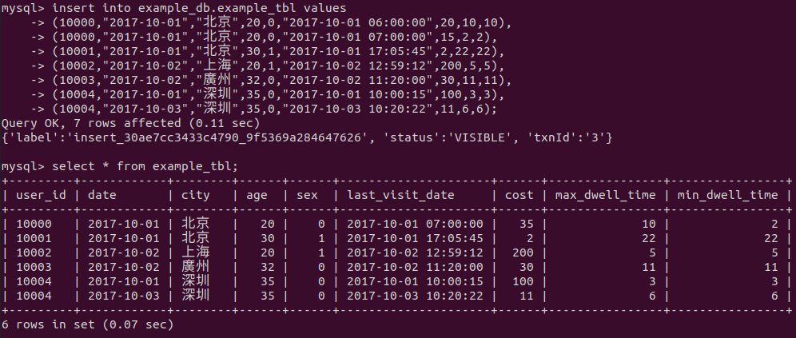
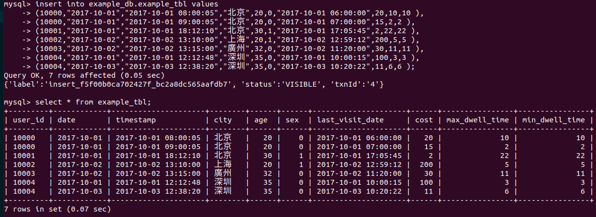
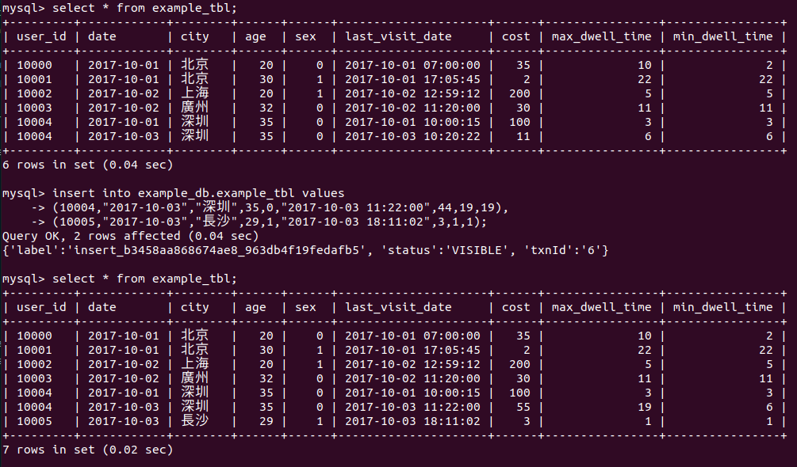

# 數據模型

本文檔主要從邏輯層面，描述 Doris 的數據模型，以幫助使用者更好的使用 Doris 來應對不同的業務場景。

## 基本概念

在 Doris 中，數據以 **表格（Table）** 的形式進行邏輯上的描述。
一張表格包括 **行（Row）** 和 **列（Column）**。 `Row` 即使用者的一行數據。 `Column` 用於描述一行數據中不同的欄位。

`Column` 可以分為兩大類： **Key** 和 **Value**。從業務角度來看，`Key` 和 `Value` 可以分別對應維度列和指標列。 Doris 的 `Key` 列是建表語句中指定的列，建表語句中的關鍵字 `unique key` 或 `aggregate key` 或 `duplicate key` 後面的列就是 `Key` 列，除了 `Key` 列剩下的就是 `Value` 列。

Doris 的數據模型主要分為 3 類:

- **Aggregate 模型**
- **Unique 模型**
- **Duplicate 模型**

下面我們分別介紹。

## Aggregate 模型

我們以實際的例子來說明什麼是 Aggregate 模型，以及如何正確的使用 Aggregate 模型。

### 範例 1：導入數據聚合

假設業務有下列數據表模式：

| ColumnName | Type | AggregationType | Comment |
| --------------- | ----------- | --------------- | ----- --------------- |
| user_id | LARGEINT | | 使用者id |
| date | DATE | | 數據載入的日期 |
| city | VARCHAR(20) | | 使用者所在城市 |
| age | SMALLINT | | 使用者年齡 |
| sex | TINYINT | | 使用者性別 |
| last_visit_date | DATETIME | `REPLACE` | 使用者最後一次造訪時間 |
| cost | BIGINT | `SUM` | 用戶總消費 |
| max_dwell_time | INT | `MAX` | 使用者最大停留時間 |
| min_dwell_time | INT | `MIN` | 使用者最小停留時間 |

如果轉換成建表語句則如下（省略建表語句中的 `Partition` 和 `Distribution` 資訊）

```sql hl_lines="13"
CREATE TABLE IF NOT EXISTS example_db.example_tbl
(
    `user_id` LARGEINT NOT NULL COMMENT "使用者id",
    `date` DATE NOT NULL COMMENT "數據載入日期時間",
    `city` VARCHAR(20) COMMENT "使用者所在城市",
    `age` SMALLINT COMMENT "用戶年齡",
    `sex` TINYINT COMMENT "用戶性別",
    `last_visit_date` DATETIME REPLACE DEFAULT "1970-01-01 00:00:00" COMMENT "使用者最後一次造訪時間",
    `cost` BIGINT SUM DEFAULT "0" COMMENT "用戶總消費",
    `max_dwell_time` INT MAX DEFAULT "0" COMMENT "使用者最大停留時間",
    `min_dwell_time` INT MIN DEFAULT "99999" COMMENT "使用者最小停留時間"
)
AGGREGATE KEY(`user_id`, `date`, `city`, `age`, `sex`)
DISTRIBUTED BY HASH(`user_id`) BUCKETS 1
PROPERTIES (
"replication_allocation" = "tag.location.default: 1"
);
```

可以看到，這是一個典型的使用者資訊和存取行為的事實表 (fact table)。

在一般星型模型中，使用者資訊和存取行為一般分別存放在維度表 (dimension table) 和事實表 (fact table) 中。這裡我們為了更方便的解釋 Doris 的數據模型，將兩部分資訊統一存放在一張表中。

表中的欄位依照是否設定了 `AggregationType`，分成 Key (維度列) 和 Value（指標列）。沒有設定 `AggregationType` 的，如 `user_id`、`date`、`age` ... 等稱為 **Key**，而設定了 `AggregationType` 的稱為 **Value**。

當我們匯入數據時，對於 Key 列相同的行會聚合成一行，而 Value 欄位會依照設定的 `AggregationType` 進行聚合。 `AggregationType` 目前有以下幾種聚合方式和agg_state：

1. `SUM`：求和，多行的 Value 進行累加。
2. `REPLACE`：替代，下一批數據中的 Value 會取代先前匯入的行中的 Value。
3. `MAX`：保留最大值。
4. `MIN`：保留最小值。
5. `REPLACE_IF_NOT_NULL`：非空值替換。而 REPLACE 的差別在於對於null值，不做替換。
6. `HLL_UNION：` HLL 類型的列的聚合方式，透過 HyperLogLog 演算法聚合。
7. `BITMAP_UNION`：BITMAP 類型的列的聚合方式，透過 bitmap 算法進行 union 聚合。

如果這幾種聚合方式無法滿足需求，則可以選擇使用 `agg_state` 類型。


假設我們有以下導入數據（原始數據）：

| user_id | date | city | age | sex | last_visit_date | cost | max_dwell_time | min_dwell_time |
| ------- | ---------- | ---- | ---- | ---- | --------------- ---- | ---- | -------------- | -------------- |
| 10000 | 2017-10-01 | 北京 | 20 | 0 | 2017-10-01 06:00:00 | 20 | 10 | 10 |
| 10000 | 2017-10-01 | 北京 | 20 | 0 | 2017-10-01 07:00:00 | 15 | 2 | 2 |
| 10001 | 2017-10-01 | 北京 | 30 | 1 | 2017-10-01 17:05:45 | 2 | 22 | 22 |
| 10002 | 2017-10-02 | 上海 | 20 | 1 | 2017-10-02 12:59:12 | 200 | 5 | 5 |
| 10003 | 2017-10-02 | 廣州 | 32 | 0 | 2017-10-02 11:20:00 | 30 | 11 | 11 |
| 10004 | 2017-10-01 | 深圳 | 35 | 0 | 2017-10-01 10:00:15 | 100 | 3 | 3 |
| 10004 | 2017-10-03 | 深圳 | 35 | 0 | 2017-10-03 10:20:22 | 11 | 6 | 6 |

透過 sql 語法來導入數據：

```sql
insert into example_db.example_tbl values
(10000,"2017-10-01","北京",20,0,"2017-10-01 06:00:00",20,10,10),
(10000,"2017-10-01","北京",20,0,"2017-10-01 07:00:00",15,2,2),
(10001,"2017-10-01","北京",30,1,"2017-10-01 17:05:45",2,22,22),
(10002,"2017-10-02","上海",20,1,"2017-10-02 12:59:12",200,5,5),
(10003,"2017-10-02","廣州",32,0,"2017-10-02 11:20:00",30,11,11),
(10004,"2017-10-01","深圳",35,0,"2017-10-01 10:00:15",100,3,3),
(10004,"2017-10-03","深圳",35,0,"2017-10-03 10:20:22",11,6,6);
```

我們假設這是記錄使用者造訪某商品頁面行為的表格。我們以第一行數據為例，解釋如下：

| 數據 | 說明 |
| ------------------- | ----------------------------- --------- |
| 10000 | 使用者 id，每位使用者唯一識別 id |
| 2017-10-01 | 數據載入時間，精確到日期 |
| 北京 | 用戶所在城市 |
| 20 | 用戶年齡 |
| 0 | 性別男（1 代表女性） |
| 2017-10-01 06:00:00 | 使用者本次造訪該頁面的時間，精確到秒 |
| 20 | 用戶本次造訪所產生的消費 |
| 10 | 使用者本次訪問，駐留該頁面的時間 |
| 10 | 用戶本次訪問，駐留該頁面的時間（冗餘） |

那麼當這批數據正確匯入到 Doris 後，Doris 中最終會儲存如下：

| user_id | date | city | age | sex | last_visit_date | cost | max_dwell_time | min_dwell_time |
| ------- | ---------- | ---- | ---- | ---- | --------------- ---- | ---- | -------------- | -------------- |
| 10000 | 2017-10-01 | 北京 | 20 | 0 | 2017-10-01 07:00:00 | 35 | 10 | 2 |
| 10001 | 2017-10-01 | 北京 | 30 | 1 | 2017-10-01 17:05:45 | 2 | 22 | 22 |
| 10002 | 2017-10-02 | 上海 | 20 | 1 | 2017-10-02 12:59:12 | 200 | 5 | 5 |
| 10003 | 2017-10-02 | 廣州 | 32 | 0 | 2017-10-02 11:20:00 | 30 | 11 | 11 |
| 10004 | 2017-10-01 | 深圳 | 35 | 0 | 2017-10-01 10:00:15 | 100 | 3 | 3 |
| 10004 | 2017-10-03 | 深圳 | 35 | 0 | 2017-10-03 10:20:22 | 11 | 6 | 6 |



可以看到，使用者 10000 只剩下了一行 **聚合後** 的數據。而其餘用戶的數據和原始數據保持一致。這裡先解釋下用戶 10000 聚合後的數據：

前 5 列沒有變化，從第 6 列 `last_visit_date` 開始：

- last_visit_date: `2017-10-01 07:00:00` - 因為 `last_visit_date` 列的聚合方式為 **REPLACE**，所以 `2017-10-01 07:00:00` 取代了 `2017-10-01 06:00: 00` 保存了下來。
    !!! info
        在同一個導入批次中的數據，對於 **REPLACE** 這種聚合方式，替換順序不做保證。譬如在這個例子中，最終保存下來的，也有可能是 `2017-10-01 06:00:00`。而對於不同導入批次中的數據，可以保證，後一批次的數據會取代前一批次。

- cost: `35` - 因為 `cost` 列的聚合類型為 **SUM**，所以由 20 + 15 累加得到 35。

- max_dwell_time: `10` - 因為 `max_dwell_time` 欄位的聚合類型為 **MAX**，所以 10 和 2 取最大值，得到 10。

- min_dwell_time: `2` - 因為 `min_dwell_time` 欄位的聚合類型為 **MIN**，所以 10 和 2 取最小值，得到 2。

經過聚合，Doris 中最終只會儲存聚合後的數據。換句話說，也就是明細數據會遺失，使用者不能夠再查詢到聚合前的明細數據了。

### 範例 2：保留明細數據

接續著範例1，我們將表格結構修改如下：

| ColumnName | Type | AggregationType | Comment |
| --------------- | ----------- | --------------- | ----- ----------------- |
| user_id | LARGEINT | | 使用者id |
| date | DATE | | 數據載入日期 |
| timestamp | DATETIME | | 數據載入時間，精確到秒 |
| city | VARCHAR(20) | | 使用者所在城市 |
| age | SMALLINT | | 使用者年齡 |
| sex | TINYINT | | 使用者性別 |
| last_visit_date | DATETIME | `REPLACE` | 使用者最後一次造訪時間 |
| cost | BIGINT | `SUM` | 用戶總消費 |
| max_dwell_time | INT | `MAX` | 使用者最大停留時間 |
| min_dwell_time | INT | `MIN` | 使用者最小停留時間 |

即增加了一列 `timestamp`，記錄精確到秒的數據灌入時間。

同時，將 `AGGREGATE KEY` 設定為 `AGGREGATE KEY(user_id, date, timestamp, city, age, sex)`

```sql hl_lines="14"
CREATE TABLE IF NOT EXISTS example_db.example_tbl
(
    `user_id` LARGEINT NOT NULL COMMENT "使用者id",
    `date` DATE NOT NULL COMMENT "數據載入日期時間",
    `timestamp` DATETIME COMMENT "數據載入時間，精確到秒",
    `city` VARCHAR(20) COMMENT "使用者所在城市",
    `age` SMALLINT COMMENT "用戶年齡",
    `sex` TINYINT COMMENT "用戶性別",
    `last_visit_date` DATETIME REPLACE DEFAULT "1970-01-01 00:00:00" COMMENT "使用者最後一次造訪時間",
    `cost` BIGINT SUM DEFAULT "0" COMMENT "用戶總消費",
    `max_dwell_time` INT MAX DEFAULT "0" COMMENT "使用者最大停留時間",
    `min_dwell_time` INT MIN DEFAULT "99999" COMMENT "使用者最小停留時間"
)
AGGREGATE KEY(`user_id`, `date`, `timestamp`, `city`, `age`, `sex`)
DISTRIBUTED BY HASH(`user_id`) BUCKETS 1
PROPERTIES (
"replication_allocation" = "tag.location.default: 1"
);
```

導入數據如下：

| user_id | date | timestamp | city | age | sex | last_visit_date | cost | max_dwell_time | min_dwell_time |
| ------- | ---------- | ------------------- | ---- | ---- | ---- | ------------------- | ---- | -------------- | ----- --------- |
| 10000 | 2017-10-01 | 2017-10-01 08:00:05 | 北京 | 20 | 0 | 2017-10-01 06:00:00 | 20 | 10 | 10 |
| 10000 | 2017-10-01 | 2017-10-01 09:00:05 | 北京 | 20 | 0 | 2017-10-01 07:00:00 | 15 | 2 | 2 |
| 10001 | 2017-10-01 | 2017-10-01 18:12:10 | 北京 | 30 | 1 | 2017-10-01 17:05:45 | 2 | 22 | 22 |
| 10002 | 2017-10-02 | 2017-10-02 13:10:00 | 上海 | 20 | 1 | 2017-10-02 12:59:12 | 200 | 5 | 5 |
| 10003 | 2017-10-02 | 2017-10-02 13:15:00 | 廣州 | 32 | 0 | 2017-10-02 11:20:00 | 30 | 11 | 11 |
| 10004 | 2017-10-01 | 2017-10-01 12:12:48 | 深圳 | 35 | 0 | 2017-10-01 10:00:15 | 100 | 3 | 3 |
| 10004 | 2017-10-03 | 2017-10-03 12:38:20 | 深圳 | 35 | 0 | 2017-10-03 10:20:22 | 11 | 6 | 6 |

透過 sql 導入數據：

```sql
insert into example_db.example_tbl values
(10000,"2017-10-01","2017-10-01 08:00:05","北京",20,0,"2017-10-01 06:00:00",20,10,10 ),
(10000,"2017-10-01","2017-10-01 09:00:05","北京",20,0,"2017-10-01 07:00:00",15,2,2 ),
(10001,"2017-10-01","2017-10-01 18:12:10","北京",30,1,"2017-10-01 17:05:45",2,22,22 ),
(10002,"2017-10-02","2017-10-02 13:10:00","上海",20,1,"2017-10-02 12:59:12",200,5,5 ),
(10003,"2017-10-02","2017-10-02 13:15:00","廣州",32,0,"2017-10-02 11:20:00",30,11,11 ),
(10004,"2017-10-01","2017-10-01 12:12:48","深圳",35,0,"2017-10-01 10:00:15",100,3,3 ),
(10004,"2017-10-03","2017-10-03 12:38:20","深圳",35,0,"2017-10-03 10:20:22",11,6,6 );
```

那麼當這批數據正確匯入到 Doris 後，Doris 中最終會儲存如下：

| user_id | date | timestamp | city | age | sex | last_visit_date | cost | max_dwell_time | min_dwell_time |
| ------- | ---------- | ------------------- | ---- | ---- | ---- | ------------------- | ---- | -------------- | ----- --------- |
| 10000 | 2017-10-01 | 2017-10-01 08:00:05 | 北京 | 20 | 0 | 2017-10-01 06:00:00 | 20 | 10 | 10 |
| 10000 | 2017-10-01 | 2017-10-01 09:00:05 | 北京 | 20 | 0 | 2017-10-01 07:00:00 | 15 | 2 | 2 |
| 10001 | 2017-10-01 | 2017-10-01 18:12:10 | 北京 | 30 | 1 | 2017-10-01 17:05:45 | 2 | 22 | 22 |
| 10002 | 2017-10-02 | 2017-10-02 13:10:00 | 上海 | 20 | 1 | 2017-10-02 12:59:12 | 200 | 5 | 5 |
| 10003 | 2017-10-02 | 2017-10-02 13:15:00 | 廣州 | 32 | 0 | 2017-10-02 11:20:00 | 30 | 11 | 11 |
| 10004 | 2017-10-01 | 2017-10-01 12:12:48 | 深圳 | 35 | 0 | 2017-10-01 10:00:15 | 100 | 3 | 3 |
| 10004 | 2017-10-03 | 2017-10-03 12:38:20 | 深圳 | 35 | 0 | 2017-10-03 10:20:22 | 11 | 6 | 6 |



我們可以看到，儲存的數據，和導入數據完全一樣，沒有發生任何聚合。這是因為，這批數據中，因為加入了 `timestamp` 列，所有行的 Key 都 **不完全相同**。也就是說，只要保證導入的數據中，每一行的 Key 都不完全相同，那麼即使在 Aggregate 模型下，Doris 也可以保存完整的明細數據。

### 範例 3：導入數據與已有數據聚合

接續著範例1。假設現在表中已有數據如下：

| user_id | date | city | age | sex | last_visit_date | cost | max_dwell_time | min_dwell_time |
| ------- | ---------- | ---- | ---- | ---- | --------------- ---- | ---- | -------------- | -------------- |
| 10000 | 2017-10-01 | 北京 | 20 | 0 | 2017-10-01 07:00:00 | 35 | 10 | 2 |
| 10001 | 2017-10-01 | 北京 | 30 | 1 | 2017-10-01 17:05:45 | 2 | 22 | 22 |
| 10002 | 2017-10-02 | 上海 | 20 | 1 | 2017-10-02 12:59:12 | 200 | 5 | 5 |
| 10003 | 2017-10-02 | 廣州 | 32 | 0 | 2017-10-02 11:20:00 | 30 | 11 | 11 |
| 10004 | 2017-10-01 | 深圳 | 35 | 0 | 2017-10-01 10:00:15 | 100 | 3 | 3 |
| 10004 | 2017-10-03 | 深圳 | 35 | 0 | 2017-10-03 10:20:22 | 11 | 6 | 6 |

我們再導入一批新的數據：

| user_id | date | city | age | sex | last_visit_date | cost | max_dwell_time | min_dwell_time |
| ------- | ---------- | ---- | ---- | ---- | --------------- ---- | ---- | -------------- | -------------- |
| 10004 | 2017-10-03 | 深圳 | 35 | 0 | 2017-10-03 11:22:00 | 44 | 19 | 19 |
| 10005 | 2017-10-03 | 長沙 | 29 | 1 | 2017-10-03 18:11:02 | 3 | 1 | 1 |

透過 sql 導入數據：

```sql
insert into example_db.example_tbl values
(10004,"2017-10-03","深圳",35,0,"2017-10-03 11:22:00",44,19,19),
(10005,"2017-10-03","長沙",29,1,"2017-10-03 18:11:02",3,1,1);
```

那麼當這批數據正確匯入到 Doris 後，Doris 中最終會儲存如下：

| user_id | date | city | age | sex | last_visit_date | cost | max_dwell_time | min_dwell_time |
| ------- | ---------- | ---- | ---- | ---- | --------------- ---- | ---- | -------------- | -------------- |
| 10000 | 2017-10-01 | 北京 | 20 | 0 | 2017-10-01 07:00:00 | 35 | 10 | 2 |
| 10001 | 2017-10-01 | 北京 | 30 | 1 | 2017-10-01 17:05:45 | 2 | 22 | 22 |
| 10002 | 2017-10-02 | 上海 | 20 | 1 | 2017-10-02 12:59:12 | 200 | 5 | 5 |
| 10003 | 2017-10-02 | 廣州 | 32 | 0 | 2017-10-02 11:20:00 | 30 | 11 | 11 |
| 10004 | 2017-10-01 | 深圳 | 35 | 0 | 2017-10-01 10:00:15 | 100 | 3 | 3 |
| 10004 | 2017-10-03 | 深圳 | 35 | 0 | 2017-10-03 11:22:00 | 55 | 19 | 6 |
| 10005 | 2017-10-03 | 長沙 | 29 | 1 | 2017-10-03 18:11:02 | 3 | 1 | 1 |



可以看到，使用者 10004 的已有數據和新匯入的數據發生了聚合。同時新增了 10005 用戶的數據。

數據的聚合，在 Doris 有以下三個階段發生：

1. 每批數據導入的 ETL 階段。此階段會在每一批次匯入的數據內部進行聚合。
2. 底層 BE 進行數據 Compaction 的階段。此階段，BE 會對已匯入的不同批次的數據進行進一步的聚合。
3. 數據查詢階段。在數據查詢時，對於查詢所涉及的數據，會進行對應的聚合。

數據在不同時間，可能聚合的程度不一致。例如一批數據剛導入時，可能還未與先前已存在的數據進行聚合。但是對於使用者而言，使用者 **只能查詢到** 聚合後的數據。即不同的聚合程度對於使用者查詢而言是透明的。使用者需要始終認為數據以 **最終的完成的聚合程度** 存在，而 **不應假設某些聚合還未發生**。 （可參閱 **Aggregate 模型的限制** 一節以獲得更多詳情。）

### `agg_state` 數據型別

!!! info
    `agg_state` 不能當作 key 列使用，建表時需要同時宣告聚合函數。

    使用者不需要指定長度和預設值。實際儲存的數據大小與函數實作有關。

建數據表:

```sql hl_lines="8"
set enable_agg_state=true;

create table aggstate(
    k1 int null,
    k2 agg_state sum(int),
    k3 agg_state group_concat(string)
)
aggregate key (k1)
distributed BY hash(k1) buckets 3
properties("replication_num" = "1");
```

其中 `agg_state` 用於宣告數據型別為 `agg_state`，`max_by`/`group_concat` 為聚合函數名稱。

注意 `agg_state` 是一種數據型別，如同 `int`/`array`/`string` 型別。

`agg_state` 只能配合 [state](../sql-manual/sql-functions/combinators/state.md)/[merge](../sql-manual/sql-functions/combinators/merge.md)/[union](../sql-manual/sql-functions/combinators/union.md) 函數組合器使用。

`agg_state` 是聚合函數的中間結果，例如，聚合函數 `sum`，則 `agg_state` 可以表示 `sum(1,2,3,4,5)` 的這個中間狀態，而不是最終的結果。

`agg_state` 類型需要使用 `state` 函數來生成，而對於目前的這個表，則為 `sum_state`,`group_concat_state`。

```sql
insert into aggstate values(1,sum_state(1),group_concat_state('a'));
insert into aggstate values(1,sum_state(2),group_concat_state('b'));
insert into aggstate values(1,sum_state(3),group_concat_state('c'));
```

此時表只有一行 (注意，下面的表格只是示意圖，不是真的可以 `select` 顯示出來)

| k1 | k2 | k3 |
| --------------- | ----------- | --------------- |
| 1 | sum(1,2,3) | group_concat_state(a,b,c) |

再插入一條數據

```sql
insert into aggstate values(2,sum_state(4),group_concat_state('d'));
```

此時數據表的結構為:

| k1 | k2 | k3 |
| --------------- | ----------- | --------------- |
| 1 | sum(1,2,3) | group_concat_state(a,b,c) |
| 2 | sum(4) | group_concat_state(d) |

我們可以透過 `merge` 操作來合併多個 `state`，並且傳回最終聚合函數計算的結果

```
mysql> select sum_merge(k2) from aggstate;
+---------------+
| sum_merge(k2) |
+---------------+
|            10 |
+---------------+
```

`sum_merge` 會先把 `sum(1,2,3)` 和 `sum(4)` 合併成 `sum(1,2,3,4)`，並回傳計算的結果。

因為 `group_concat` 對於順序有要求，所以結果是不穩定的。

```
mysql> select group_concat_merge(k3) from aggstate;
+------------------------+
| group_concat_merge(k3) |
+------------------------+
| c,b,a,d |
+------------------------+
```

如果不想要聚合的最終結果，可以使用union來合併多個聚合的中間結果，產生一個新的中間結果。

```sql
insert into aggstate select 3,sum_union(k2),group_concat_union(k3) from aggstate ;
```
此時的表結構為:

| k1 | k2 | k3 |
| --------------- | ----------- | --------------- |
| 1 | sum(1,2,3) | group_concat_state(a,b,c) |
| 2 | sum(4) | group_concat_state(d) |
| 3 | sum(1,2,3,4) | group_concat_state(a,b,c,d) |

可以透過查詢:

```
mysql> select sum_merge(k2) , group_concat_merge(k3)from aggstate;
+--------------+------------------------+
| sum_merge(k2) | group_concat_merge(k3) |
+--------------+------------------------+
| 20 | c,b,a,d,c,b,a,d |
+--------------+------------------------+

mysql> select sum_merge(k2) , group_concat_merge(k3)from aggstate where k1 != 2;
+--------------+------------------------+
| sum_merge(k2) | group_concat_merge(k3) |
+--------------+------------------------+
| 16 | c,b,a,d,c,b,a |
+--------------+------------------------+
```
使用者可以透過 `agg_state` 做出跟細緻的聚合函數操作。

注意 `agg_state` 存在一定的效能開銷

## Unique 模型

在某些多維分析場景下，使用者更關注的是如何保證 Key 的唯一性，即如何獲得 Primary Key 唯一性約束。因此，我們引入了 `Unique` 數據模型。在 1.2 版本之前，該模型本質上是Aggregate 模型的一個特例，也是一種簡化的表結構表示方式。

由於 Aggregate 模型的實作方式是讀時合併（merge on read)，因此在一些聚合查詢上表現不佳，在 1.2 版本我們引入了 Unique 模型新的實作方式，寫時合併（merge on write），透過在寫入時做一些額外的工作，實現了最優的查詢效能。寫入時合併將在未來替換讀取時合併成為 Unique 模型的預設實作方式，兩者將會短暫的共存一段時間。以下將對兩種實作方式分別舉例進行說明。

### 讀時合併 (merge on read)

!!! info
    與 Aggregate 模型相同的實作方式。

| ColumnName | Type | IsKey | Comment |
| ------------- | ------------ | ----- | ------------ |
| user_id | BIGINT | Yes | 使用者id |
| username | VARCHAR(50) | Yes | 使用者暱稱 |
| city | VARCHAR(20) | No | 使用者所在城市 |
| age | SMALLINT | No | 使用者年齡 |
| sex | TINYINT | No | 使用者性別 |
| phone | LARGEINT | No | 用戶電話 |
| address | VARCHAR(500) | No | 用戶住址 |
| register_time | DATETIME | No | 使用者註冊時間 |

這是一個典型的使用者基礎資訊表。這類數據 {==沒有聚合需求，只需保證主鍵唯一性==}。(這裡的主鍵為 `user_id` + `username`)。那麼我們的建表語句如下：

```sql hl_lines="12"
CREATE TABLE IF NOT EXISTS example_db.example_tbl
(
    `user_id` LARGEINT NOT NULL COMMENT "使用者id",
    `username` VARCHAR(50) NOT NULL COMMENT "使用者暱稱",
    `city` VARCHAR(20) COMMENT "使用者所在城市",
    `age` SMALLINT COMMENT "用戶年齡",
    `sex` TINYINT COMMENT "用戶性別",
    `phone` LARGEINT COMMENT "用戶電話",
    `address` VARCHAR(500) COMMENT "使用者位址",
    `register_time` DATETIME COMMENT "使用者註冊時間"
)
UNIQUE KEY(`user_id`, `username`)
DISTRIBUTED BY HASH(`user_id`) BUCKETS 1
PROPERTIES (
"replication_allocation" = "tag.location.default: 1"
);
```

而這個表結構，完全同等於以下使用 Aggregate 模型所描述的表結構：

| ColumnName | Type | AggregationType | Comment |
| ------------- | ------------ | --------------- | ------ ------ |
| user_id | BIGINT | | 使用者id |
| username | VARCHAR(50) | | 使用者暱稱 |
| city | VARCHAR(20) | `REPLACE` | 使用者所在城市 |
| age | SMALLINT | `REPLACE` | 使用者年齡 |
| sex | TINYINT | `REPLACE` | 使用者性別 |
| phone | LARGEINT | `REPLACE` | 用戶電話 |
| address | VARCHAR(500) | `REPLACE` | 使用者住址 |
| register_time | DATETIME | `REPLACE` | 使用者註冊時間 |

及建表語句：

```sql hl_lines="12"
CREATE TABLE IF NOT EXISTS example_db.example_tbl
(
    `user_id` LARGEINT NOT NULL COMMENT "使用者id",
    `username` VARCHAR(50) NOT NULL COMMENT "使用者暱稱",
    `city` VARCHAR(20) REPLACE COMMENT "使用者所在城市",
    `age` SMALLINT REPLACE COMMENT "使用者年齡",
    `sex` TINYINT REPLACE COMMENT "使用者性別",
    `phone` LARGEINT REPLACE COMMENT "用戶電話",
    `address` VARCHAR(500) REPLACE COMMENT "使用者位址",
    `register_time` DATETIME REPLACE COMMENT "使用者註冊時間"
)
AGGREGATE KEY(`user_id`, `username`)
DISTRIBUTED BY HASH(`user_id`) BUCKETS 1
PROPERTIES (
"replication_allocation" = "tag.location.default: 1"
);
```

即 Unique 模型的讀時合併(merge on read)實作完全可以用 Aggregate 模型中的 `REPLACE` 方式取代。其內部的實作方式和數據儲存方式也完全一樣。這裡不再繼續舉例說明。

### 寫時合併 (merge on write)

Unique 模型的寫入時合併(merge on write)實現，與 Aggregate 模型就是完全不同的兩種模型了，查詢效能更接近 Duplicate 模型，在有主鍵約束需求的場景上相比 Aggregate 模型有較大的查詢效能優勢，尤其是在聚合查詢以及需要用索引過濾大量數據的查詢中。

在 1.2.0 版本中，作為一個新的 feature，寫入時合併預設關閉，使用者可以透過新增下面的 property 來開啟

```
"enable_unique_key_merge_on_write" = "true"
```

> 注意：
> 1. 建議使用 1.2.4 以上版本，此版本修復了一些bug和穩定性問題
> 2. 在 `be.conf` 中新增組態項目： `disable_storage_page_cache=false`。不新增此配置項目可能會對數據導入效能產生較大影響

仍然以上面的表格為例，建表語句為

```sql hl_lines="16"
CREATE TABLE IF NOT EXISTS example_db.example_tbl
(
    `user_id` LARGEINT NOT NULL COMMENT "使用者id",
    `username` VARCHAR(50) NOT NULL COMMENT "使用者暱稱",
    `city` VARCHAR(20) COMMENT "使用者所在城市",
    `age` SMALLINT COMMENT "用戶年齡",
    `sex` TINYINT COMMENT "用戶性別",
    `phone` LARGEINT COMMENT "用戶電話",
    `address` VARCHAR(500) COMMENT "使用者位址",
    `register_time` DATETIME COMMENT "使用者註冊時間"
)
UNIQUE KEY(`user_id`, `username`)
DISTRIBUTED BY HASH(`user_id`) BUCKETS 1
PROPERTIES (
"replication_allocation" = "tag.location.default: 1",
"enable_unique_key_merge_on_write" = "true"
);
```

使用這種建表語句建出來的表結構，與 Aggregate 模型就完全不同了：

| ColumnName | Type | AggregationType | Comment |
| ------------- | ------------ | --------------- | ------ ------ |
| user_id | BIGINT | | 使用者id |
| username | VARCHAR(50) | | 使用者暱稱 |
| city | VARCHAR(20) | NONE | 使用者所在城市 |
| age | SMALLINT | NONE | 使用者年齡 |
| sex | TINYINT | NONE | 使用者性別 |
| phone | LARGEINT | NONE | 用戶電話 |
| address | VARCHAR(500) | NONE | 用戶住址 |
| register_time | DATETIME | NONE | 使用者註冊時間 |

在開啟了寫入時合併選項的 Unique 表上，數據會在匯入階段去將被覆寫和被更新的數據進行標記刪除，同時將新的數據寫入新的檔案。在查詢的時候，所有被標記刪除的數據都會在文件級別被過濾掉，讀取出來的數據就都是最新的數據，消除掉了讀時合併中的數據聚合過程，並且能夠在很多情況下支持多種謂詞的下推。因此在許多場景都能帶來比較大的效能提升，尤其是有聚合查詢的情況。

!!! info
    1. 新的 Merge-on-write 實作預設為關閉，且只能在建表時透過指定 property 的方式開啟。
    2. 舊的 Merge-on-read 的實現無法無縫升級到新版本的實現（數據組織方式完全不同），如果需要改為使用寫時合併的實現版本，需要手動執行 `insert into unique-mow- table select * from source table`.
    3. 在 Unique 模型上獨有的 `delete sign` 和 `sequence col`，在寫入時合併的新版實作中仍可以正常使用，用法沒有變化。

## Duplicate 模型

在某些場景下，數據既沒有主鍵，也沒有聚合需求。因此，我們引入 Duplicate 數據模型來滿足這類需求。舉例說明。

| ColumnName | Type | SortKey | Comment |
| ---------- | ------------- | ------- | ------------ |
| timestamp | DATETIME | Yes | 日誌時間 |
| type | INT | Yes | 日誌類型 |
| error_code | INT | Yes | 錯誤碼 |
| error_msg | VARCHAR(1024) | No | 錯誤詳細數據 |
| op_id | BIGINT | No | 負責人id |
| op_time | DATETIME | No | 處理時間 |

建表語句如下：

```sql hl_lines="10"
CREATE TABLE IF NOT EXISTS example_db.example_tbl
(
    `timestamp` DATETIME NOT NULL COMMENT "日誌時間",
    `type` INT NOT NULL COMMENT "日誌類型",
    `error_code` INT COMMENT "錯誤碼",
    `error_msg` VARCHAR(1024) COMMENT "錯誤詳細數據",
    `op_id` BIGINT COMMENT "負責人id",
    `op_time` DATETIME COMMENT "處理時間"
)
DUPLICATE KEY(`timestamp`, `type`, `error_code`)
DISTRIBUTED BY HASH(`type`) BUCKETS 1
PROPERTIES (
"replication_allocation" = "tag.location.default: 1"
);
```

這種數據模型區別於 Aggregate 和 Unique 模型。數據完全按照導入文件中的數據進行存儲，不會有任何聚合。即使兩行數據完全相同，也都會保留。{==而在建表語句中指定的 DUPLICATE KEY，只是用來指明底層數據依照那些欄位進行排序。==} (更貼切的名稱應該是 `Sorted Column`，這裡取名 DUPLICATE KEY 只是用以明確表示所用的數據模型。關於 `Sorted Column` 的更多解釋，可以參閱[前綴索引](./index/prefix-index.md)）。在 DUPLICATE KEY 的選擇上，我們建議適當的選擇前 2-4 列就可以。

這種數據模型適用於既沒有聚合需求，也沒有主鍵唯一性約束的原始數據的儲存。更多使用場景，可參閱 **Aggregate 模型的限制** 小節。

### 無排序列 Duplicate 模型

當建立表格的時候沒有指定 Unique、Aggregate 或 Duplicate 時，就會預設建立一個 Duplicate 模型的表，並自動指定排序列。

當使用者並沒有排序需求的時候，可以透過在表格屬性中配置：

```
"enable_duplicate_without_keys_by_default" = "true"
```

然後再建立預設模型的時候，就會不再指定排序列，也不會給該表建立前綴索引，以此減少在匯入和儲存上額外的開銷。

建表語句如下：

```sql hl_lines="13"
CREATE TABLE IF NOT EXISTS example_db.example_tbl
(
    `timestamp` DATETIME NOT NULL COMMENT "日誌時間",
    `type` INT NOT NULL COMMENT "日誌類型",
    `error_code` INT COMMENT "錯誤碼",
    `error_msg` VARCHAR(1024) COMMENT "錯誤詳細數據",
    `op_id` BIGINT COMMENT "負責人id",
    `op_time` DATETIME COMMENT "處理時間"
)
DISTRIBUTED BY HASH(`type`) BUCKETS 1
PROPERTIES (
"replication_allocation" = "tag.location.default: 1",
"enable_duplicate_without_keys_by_default" = "true"
);

MySQL > desc example_tbl;
+------------+---------------+------+-------+---------+-------+
| Field      | Type          | Null | Key   | Default | Extra |
+------------+---------------+------+-------+---------+-------+
| timestamp  | DATETIME      | No   | false | NULL    | NONE  |
| type       | INT           | No   | false | NULL    | NONE  |
| error_code | INT           | Yes  | false | NULL    | NONE  |
| error_msg  | VARCHAR(1024) | Yes  | false | NULL    | NONE  |
| op_id      | BIGINT        | Yes  | false | NULL    | NONE  |
| op_time    | DATETIME      | Yes  | false | NULL    | NONE  |
+------------+---------------+------+-------+---------+-------+
6 rows in set (0.01 sec)
```

##  數據模型聚合的局限性

### Aggregate 模型

這裡我們針對 Aggregate 模型，來介紹下 Aggregate 模型的限制。

在 Aggregate 模型中，模型對外展現的，是 **最終聚合後的** 數據。也就是說，任何還未聚合的數據（比如說兩個不同導入批次的數據），都必須透過某種方式，以確保對外展示的一致性。我們舉例說明。

假設表結構如下：

| ColumnName | Type | AggregationType | Comment |
| ---------- | -------- | --------------- | ------------ |
| user_id | LARGEINT | | 使用者 id |
| date | DATE | | 數據灌入日期 |
| cost | BIGINT | SUM | 用戶總消費 |

假設儲存引擎中有以下兩個已經匯入完成的批次的數據：

**batch 1**

| user_id | date | cost |
| ------- | ---------- | ---- |
| 10001 | 2017-11-20 | 50 |
| 10002 | 2017-11-21 | 39 |

**batch 2**

| user_id | date | cost |
| ------- | ---------- | ---- |
| 10001 | 2017-11-20 | 1 |
| 10001 | 2017-11-21 | 5 |
| 10003 | 2017-11-22 | 22 |

可以看到，使用者 10001 分屬在兩個匯入批次中的數據還沒有聚合。但為了保證使用者只能查詢到以下最終聚合後的數據：

| user_id | date | cost |
| ------- | ---------- | ---- |
| 10001 | 2017-11-20 | 51 |
| 10001 | 2017-11-21 | 5 |
| 10002 | 2017-11-21 | 39 |
| 10003 | 2017-11-22 | 22 |

我們在查詢引擎中加入了聚合算子，來確保數據對外的一致性。

另外，在聚合列（Value）上，執行與聚合類型不一致的聚合類別查詢時，要注意語意。例如我們在如上範例中執行以下查詢：

```sql
SELECT MIN(cost) FROM table;
```

得到的結果是 5，而不是 1。

同時，這種一致性保證，在某些查詢中，會極大的降低查詢效率。

我們以最基本的 `count(*)` 查詢為例：

```sql
SELECT COUNT(*) FROM table;
```

在其他數據庫中，這類查詢都會很快的回傳結果。因為在實現上，我們可以透過如 “導入時對行進行計數，保存 `count` 的統計信息”，或者在查詢時 “僅掃描某一列數據，獲得 `count` 值”的方式，只需很小的開銷，即可取得查詢結果。但是在 Doris 的 Aggregate 模型中，這種查詢的開銷**非常大**。

我們以剛才的數據為例：

**batch 1**

| user_id | date | cost |
| ------- | ---------- | ---- |
| 10001 | 2017-11-20 | 50 |
| 10002 | 2017-11-21 | 39 |

**batch 2**

| user_id | date | cost |
| ------- | ---------- | ---- |
| 10001 | 2017-11-20 | 1 |
| 10001 | 2017-11-21 | 5 |
| 10003 | 2017-11-22 | 22 |

因為最終的聚合結果為：

| user_id | date | cost |
| ------- | ---------- | ---- |
| 10001 | 2017-11-20 | 51 |
| 10001 | 2017-11-21 | 5 |
| 10002 | 2017-11-21 | 39 |
| 10003 | 2017-11-22 | 22 |

所以，`select count(*) from table;` 的正確結果應該是 **4**。但如果我們只掃描 `user_id` 這一列，如果加上查詢時聚合，最終得到的結果是 **3**（10001, 10002, 10003）。而如果不加查詢時聚合，則得到的結果是 **5**（兩批次一共 5 行數據）。可見這兩個結果都是不對的。

為了得到正確的結果，我們必須同時讀取 `user_id` 和 `date` 這兩列的數據，**再加上查詢時聚合**，才能傳回 **4** 這個正確的結果。也就是說，在 `count(*)` 查詢中，Doris 必須掃描所有的 AGGREGATE KEY 欄位（這裡是 `user_id` 和 `date`），並且聚合後，才能得到語意正確的結果。當聚合列非常多時，`count(*)` 查詢需要掃描大量的數據。

因此，當業務上有頻繁的 `count(*)` 查詢時，我們建議使用者透過增加一個 **值恆為 1 的，聚合類型為 SUM 的列來模擬 count(\*)**。如剛才的例子中的表格結構，我們修改如下：

| ColumnName | Type | AggregateType | Comment |
| ---------- | ------ | ------------- | ------------- |
| user_id | BIGINT | | 使用者id |
| date | DATE | | 數據灌入日期 |
| cost | BIGINT | SUM | 用戶總消費 |
| count | BIGINT | SUM | 用於計算count |

增加一個 count 列，並且匯入數據中，該列值 **恆為 1**。則 `select count(*) from table;` 的結果等價於 `select sum(count) from table;`。而後者的查詢效率將遠高於前者。不過這種方式也有使用限制，就是使用者需要自行保證，不會重複匯入 AGGREGATE KEY 欄位都相同的行。否則，`select sum(count) from table;` 只能表述原始匯入的行數，而不是 `select count(*) from table;` 的語意。

另一種方式，就是 **將如上的 `count` 列的聚合類型改為 REPLACE，且仍值恆為 1**。那麼 `select sum(count) from table;` 和 `select count(*) from table;` 的結果將會是一致的。並且這種方式，沒有導入重複行的限制。

### Unique 模型

Unique 模型的寫入時合併實作沒有 Aggregate 模型的局限性，還是以剛才的數據為例，寫入時合併為每次匯入的 rowset 增加了對應的 delete bitmap，來標記哪些數據被覆蓋。第一批數據導入後狀態如下

**batch 1**

| user_id | date | cost | delete bit |
| ------- | ---------- | ---- | ---------- |
| 10001 | 2017-11-20 | 50 | false |
| 10002 | 2017-11-21 | 39 | false |

當第二批數據匯入完成後，第一批數據中重複的行就會被標記為已刪除，此時兩批數據狀態如下

**batch 1**

| user_id | date | cost | delete bit |
| ------- | ---------- | ---- | ---------- |
| 10001 | 2017-11-20 | 50 | **true** |
| 10002 | 2017-11-21 | 39 | false |

**batch 2**

| user_id | date | cost | delete bit |
| ------- | ---------- | ---- | ---------- |
| 10001 | 2017-11-20 | 1 | false |
| 10001 | 2017-11-21 | 5 | false |
| 10003 | 2017-11-22 | 22 | false |

在查詢時，所有在 `delete bitmap` 中被標記刪除的數據都不會讀出來，因此也無需進行做任何數據聚合，上述數據中有效的行數為4行，查詢出的結果也應該是4行，也就可以採取開銷最小的方式來取得結果，即前面提到的 {==僅掃描某一列數據，獲得 count(*) 值==} 的方式。

在測試環境中，`count(*)` 查詢在 Unique 模型的寫入時合併實作上的效能，相較於 Aggregate 模型有 10 倍以上的提升。

### Duplicate 模型

Duplicate 模型沒有 Aggregate 模型的這個限制。因為模型不涉及聚合語意，在做 `count(*)` 查詢時，任意選擇一列查詢，即可得到語意正確的結果。

## Key 列

Duplicate、Aggregate、Unique 模型，都會在建表時指定 `key` 列，然而實際上在不同的類型的數據模型裡這個 `key` 的作用是有所區別的：對於 Duplicate 模型，表的 key 列，可以認為只是 “排序列”，並非起到唯一標識的作用。而 Aggregate、Unique 模型這種聚合類型的表，key 列是兼顧 “排序列” 和 “唯一識別列”，是真正意義上的 “key 列”。

## 數據模型的選擇建議

因為數據模型在建表時就已經確定，且　**無法修改**。所以，選擇一個合適的數據模型 **非常重要**。

1. Aggregate 模型可以透過預先聚合，大幅降低聚合查詢時所需掃描的數據量和查詢的計算量，非常適合有固定模式的報表類別查詢情境。但是該模型對 `count(*)` 查詢很不友善。同時因為固定了 Value 欄位上的聚合方式，在進行其他類型的聚合查詢時，需要考慮語意正確性。

2. Unique 模型針對需要唯一主鍵約束的場景，可以保證主鍵唯一性約束。但是無法利用 ROLLUP 等預先聚合帶來的查詢優勢。

  - 對於聚合查詢有較高效能需求的用戶，建議使用自1.2版本加入的寫入時合併實作。

  - Unique 模型僅支援整行更新，如果使用者既需要唯一主鍵約束，又需要更新部分列（例如將多張來源表匯入到一張 doris 表的情形），則可以考慮使用 Aggregate 模型，同時將非主鍵列的聚合類型設定為 `REPLACE_IF_NOT_NULL`。具體的用法可以參考[語法手冊](../sql-manual/sql-reference/Data-Definition-Statements/Create/CREATE-TABLE.md)

3. Duplicate 模型適合任意維度的 Ad-hoc 查詢。雖然同樣無法利用預先聚合的特性，但不受 Aggregate 模型的約束，可以發揮列存模型的優勢（只讀取相關列，而不需要讀取所有 Key 列）。