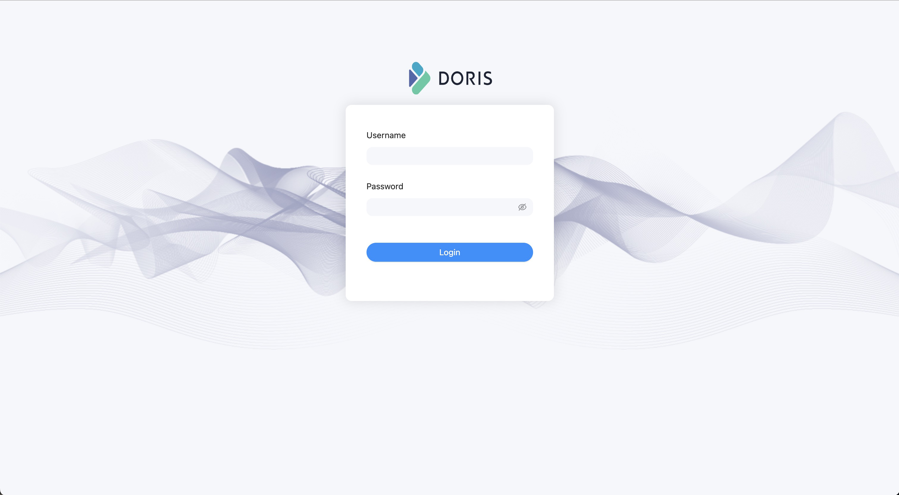

# 快速開始

Apache Doris 是一個基於MPP 架構的高效能、即時的分析型資料庫，以極速易用的特點被人們所熟知，僅需亞秒級回應時間即可返回海量資料下的查詢結果，不僅可以支援高並發的點查詢場景，也能支援高吞吐的複雜分析場景，這個簡短的指南將告訴你如何下載 Doris 最新穩定版本，在單節點上安裝並運行它，包括創建資料庫、資料表、導入資料及查詢等。

## 下載 Doris

Doris 運行在 Linux 環境中，推薦 CentOS 7.x 或 Ubuntu 16.04 以上版本，同時你需要安裝 Java 運行環境（JDK 版本要求為 8），要檢查你所安裝的 Java 版本，請執行以下命令：

```
java -version
```

接下來，[下載 Doris 的最新二進位版本](https://doris.apache.org/zh-CN/download)，然後解壓縮。

```
tar xf apache-doris-x.x.x.tar.xz
```

## 配置 Doris

### 設定 FE

我們進入到 `apache-doris-x.x.x/fe` 目錄

```
cd apache-doris-x.x.x/fe
```

修改FE 設定檔`conf/fe.conf` ，這裡我們主要修改兩個參數：`priority_networks` 及`meta_dir` ，如果你需要更多最佳化配置，請參考[FE 參數設定](../admin-manual /config/fe-config.md)說明，進行調整。

1. 新增 priority_networks 參數

```
priority_networks=172.23.16.0/24
```

>注意：
>
>這個參數我們在安裝的時候是必須要設定的，特別是當一台機器擁有多個IP位址的時候，我們要為 FE 指定唯一的 IP 位址。

> 這裡假設你的節點 IP 是 `172.23.16.32`，那麼我們可以透過遮罩的方式設定為 `172.23.16.0/24`。

2. 新增元資料目錄

```
meta_dir=/path/your/doris-meta
```

>注意：
>
>這裡你可以不配置，預設是在你的 Doris FE 安裝目錄下的 doris-meta，
>
>單獨配置元資料目錄，需要你事先建立好你指定的目錄

### 啟動 FE

在 FE 安裝目錄下執行下面的指令，來完成 FE 的啟動。

```
./bin/start_fe.sh --daemon
```

#### 查看 FE 運作狀態

你可以透過下面的命令來檢查 Doris 是否啟動成功

```
curl http://127.0.0.1:8030/api/bootstrap
```

這裡 IP 和 連接埠分別是 FE 的 IP 和 http_port（預設8030），如果是你在 FE 節點執行，直接執行上面的指令即可。

如果傳回結果中帶有 `"msg":"success"` 字樣，則表示啟動成功。

你也可以透過 Doris FE 提供的 Web UI 來檢查，在瀏覽器中輸入位址

http://fe_ip:8030

可以看到下面的介面，說明 FE 啟動成功



>注意：
>
>1. 這裡我們使用 Doris 內建的預設使用者 root 進行登錄，密碼是空
>2. 這是一個 Doris 的管理介面，只能擁有管理權限的使用者才能登錄，而一般使用者不能登入。

#### 連接 FE

我們下面透過 MySQL 用戶端來連接 Doris FE，下載免安裝的[MySQL 用戶端](https://doris-build-hk.oss-cn-hongkong.aliyuncs.com/mysql-client/mysql-5.7.22 -linux-glibc2.12-x86_64.tar.gz)

解壓縮剛才下載的 MySQL 用戶端，在 `bin/` 目錄下可以找到 `mysql` 命令列工具。然後執行下面的命令連接 Doris。

```
mysql -u root -P 9030 -h 127.0.0.1
```

>注意：
>
>1. 這裡使用的 root 用戶是 doris 內建的預設用戶，也是超級管理員用戶，具體的用戶權限檢視 [權限管理](../admin-manual/privilege-ldap/user-privilege.md)
>2. -P ：這裡是我們連接 Doris 的查詢端口，預設端口是 9030，對應的是 fe.conf 裡的 `query_port`。
>3. -h ： 這裡是我們連接的 FE IP位址，如果你的客戶端和 FE 安裝在同一個節點可以使用127.0.0.1。

執行下面的命令查看 FE 運行狀態

```sql
show frontends\G;
```

然後你可以看到類似下面的結果：

```sql
mysql> show frontends\G
*************************** 1. row ******************** *******
             Name: 172.21.32.5_9010_1660549353220
               IP: 172.21.32.5
      EditLogPort: 9010
         HttpPort: 8030
        QueryPort: 9030
          RpcPort: 9020
ArrowFlightSqlPort: 9040
             Role: FOLLOWER
         IsMaster: true
        ClusterId: 1685821635
             Join: true
            Alive: true
ReplayedJournalId: 49292
    LastHeartbeat: 2022-08-17 13:00:45
         IsHelper: true
           ErrMsg:
          Version: 1.1.2-rc03-ca55ac2
 CurrentConnected: Yes
1 row in set (0.03 sec)
```

- 如果 IsMaster、Join 和 Alive 三列均為 true，則表示節點正常。

#### 加密連線 FE

Doris 支援基於 SSL 的加密連接，目前支援 TLS1.2，TLS1.3 協議，可透過以下配置開啟 Doris 的 SSL 模式：
修改 FE 設定檔 `conf/fe.conf`，加入 `enable_ssl = true`即可。

接下來透過 `mysql` 客戶端連線 Doris，mysql 支援五種 SSL 模式：

- `mysql -uroot -P9030 -h127.0.0.1` 與 `mysql --ssl-mode=PREFERRED -uroot -P9030 -h127.0.0.1` 一樣，都是一開始試圖建立 SSL 加密連接，如果失敗，則嘗試使用普通連線。

- `mysql --ssl-mode=DISABLE -uroot -P9030 -h127.0.0.1`，不使用 SSL 加密連接，直接使用普通連接。

- `mysql --ssl-mode=REQUIRED -uroot -P9030 -h127.0.0.1`，強制使用 SSL 加密連線。

- `mysql --ssl-mode=VERIFY_CA --ssl-ca=ca.pem -uroot -P9030 -h127.0.0.1`，強制使用 SSL 加密連接，並且透過指定CA 憑證驗證服務端身分是否有效。

- `mysql --ssl-mode=VERIFY_CA --ssl-ca=ca.pem --ssl-cert=client-cert.pem --ssl-key=client-key.pem -uroot -P9030 -h127.0.0 .1`，強制使用 SSL 加密連接，雙向驗證。


>注意：
>`--ssl-mode`參數 是 mysql 5.7.11 版本引入的，低於此版本的mysql 客戶端請參考[這裡](https://dev.mysql.com/doc/connector-j/8.0/en/connector-j-connp-props-security.html)。

Doris 開啟 SSL 加密連線需要金鑰憑證檔案驗證，預設的金鑰憑證檔案位於 `Doris/fe/mysql_ssl_default_certificate/` 下。密鑰憑證檔案的產生請參考[密鑰憑證設定](../admin-manual/certificate.md)。

#### 停止 FE 節點

Doris FE 的停止可以透過下面的指令完成

```
./bin/stop_fe.sh
```

### 設定 BE

我們進入到 `apache-doris-x.x.x/be` 目錄

```
cd apache-doris-x.x.x/be
```

修改 BE 設定檔 `conf/be.conf` ，這裡我們主要修改兩個參數：`priority_networks` 及 `storage_root` ，如果你需要更多最佳化配置，請參考 [BE 參數設定](../admin-manual/config/be-config.md) 說明，調整。

1. 新增 priority_networks 參數

```
priority_networks=172.23.16.0/24
```

>注意：
>
>這個參數我們在安裝的時候是必須要設定的，特別是當一台機器擁有多個IP位址的時候，我們要為 BE 指定唯一的IP位址。

2. 配置 BE 資料儲存目錄

```
storage_root_path=/path/your/data_dir
```

>注意：
>
>- 預設目錄在 BE安裝目錄的 storage 目錄下。
>- BE 配置的儲存目錄必須先建立好

3. 配置 JAVA_HOME 環境變量

> Doris 從 1.2 版本開始支援 Java UDF 函數，BE 依賴 Java 環境。所以要預先配置 `JAVA_HOME` 環境變量，也可以在 `start_be.sh` 啟動腳本第一行加入 `export JAVA_HOME=your_java_home_path` 來新增環境變數。

4. 安裝 Java UDF 函數

> 因為 Doris 從 1.2 版本開始支援 Java UDF 函數，需要從官網下載 Java UDF 函數的 JAR 套件放到 BE 的 lib 目錄下，否則可能會啟動失敗。

### 啟動 BE

在 BE 安裝目錄下執行下面的指令，來完成 BE 的啟動。

```
./bin/start_be.sh --daemon
```

#### 新增 BE 節點到集群

透過 MySQL 用戶端連接到 FE 之後執行下面的 SQL，將 BE 新增到叢集中

```sql
ALTER SYSTEM ADD BACKEND "be_host_ip:heartbeat_service_port";
```

- `be_host_ip`：這裡是你 BE 的 IP 位址，和你在 `be.conf` 裡的 `priority_networks` 匹配
- `heartbeat_service_port`：這裡是你 BE 的心跳上報端口，和你在 `be.conf` 裡的 `heartbeat_service_port` 匹配，預設是 `9050`。

#### 查看 BE 運作狀態

你可以在 MySQL 命令列下執行下面的命令查看 BE 的運作狀態。

```sql
SHOW BACKENDS\G
```

範例：

```sql
mysql> SHOW BACKENDS\G
*************************** 1. row ***************************
            BackendId: 10003
              Cluster: default_cluster
                   IP: 172.21.32.5
        HeartbeatPort: 9050
               BePort: 9060
             HttpPort: 8040
             BrpcPort: 8060
   ArrowFlightSqlPort: 8070
        LastStartTime: 2022-08-16 15:31:37
        LastHeartbeat: 2022-08-17 13:33:17
                Alive: true
 SystemDecommissioned: false
ClusterDecommissioned: false
            TabletNum: 170
     DataUsedCapacity: 985.787 KB
        AvailCapacity: 782.729 GB
        TotalCapacity: 984.180 GB
              UsedPct: 20.47 %
       MaxDiskUsedPct: 20.47 %
                  Tag: {"location" : "default"}
               ErrMsg:
              Version: 1.1.2-rc03-ca55ac2
               Status: {"lastSuccessReportTabletsTime":"2022-08-17 13:33:05","lastStreamLoadTime":-1,"isQueryDisabled":false,"isLoadDisabled":false}
1 row in set (0.01 sec)
```

- `Alive`: true 表示節點運作正常

#### 停止 BE 節點

Doris BE 的停止可以透過下面的指令完成

```
./bin/stop_be.sh
```

## 建立資料表

1. 建立一個資料庫

```sql
create database demo;
```

2. 建立資料表

```sql
use demo;

CREATE TABLE IF NOT EXISTS demo.example_tbl
(
    `user_id` LARGEINT NOT NULL COMMENT "使用者id",
    `date` DATE NOT NULL COMMENT "資料灌入日期時間",
    `city` VARCHAR(20) COMMENT "使用者所在城市",
    `age` SMALLINT COMMENT "用戶年齡",
    `sex` TINYINT COMMENT "用戶性別",
    `last_visit_date` DATETIME REPLACE DEFAULT "1970-01-01 00:00:00" COMMENT "使用者最後一次造訪時間",
    `cost` BIGINT SUM DEFAULT "0" COMMENT "用戶總消費",
    `max_dwell_time` INT MAX DEFAULT "0" COMMENT "使用者最大停留時間",
    `min_dwell_time` INT MIN DEFAULT "99999" COMMENT "使用者最小停留時間"
)
AGGREGATE KEY(`user_id`, `date`, `city`, `age`, `sex`)
DISTRIBUTED BY HASH(`user_id`) BUCKETS 1
PROPERTIES (
    "replication_allocation" = "tag.location.default: 1"
);
```

3. 範例數據

```
10000,2017-10-01,北京,20,0,2017-10-01 06:00:00,20,10,10
10000,2017-10-01,北京,20,0,2017-10-01 07:00:00,15,2,2
10001,2017-10-01,北京,30,1,2017-10-01 17:05:45,2,22,22
10002,2017-10-02,上海,20,1,2017-10-02 12:59:12,200,5,5
10003,2017-10-02,廣州,32,0,2017-10-02 11:20:00,30,11,11
10004,2017-10-01,深圳,35,0,2017-10-01 10:00:15,100,3,3
10004,2017-10-03,深圳,35,0,2017-10-03 10:20:22,11,6,6
```

將上面的資料保存在`test.csv`檔案中。

4. 導入數據

這裡我們透過 `Stream load`` 方式將上面儲存到檔案中的資料匯入到我們剛剛建立的表裡。

```
curl --location-trusted -u root: -T test.csv -H "column_separator:," http://127.0.0.1:8030/api/demo/example_tbl/_stream_load
```

- -T test.csv : 這裡使我們剛才保存的資料文件，如果路徑不一樣，請指定完整路徑
- -u root : 這裡是使用者名稱密碼，我們使用預設使用者 root，密碼是空
- 127.0.0.1:8030 : 分別是 fe 的 ip 和 http_port

執行成功之後我們可以看到下面的回傳訊息


```json
{
    "TxnId": 30303,
    "Label": "8690a5c7-a493-48fc-b274-1bb7cd656f25",
    "TwoPhaseCommit": "false",
    "Status": "Success",
    "Message": "OK",
    "NumberTotalRows": 7,
    "NumberLoadedRows": 7,
    "NumberFilteredRows": 0,
    "NumberUnselectedRows": 0,
    "LoadBytes": 399,
    "LoadTimeMs": 381,
    "BeginTxnTimeMs": 3,
    "StreamLoadPutTimeMs": 5,
    "ReadDataTimeMs": 0,
    "WriteDataTimeMs": 191,
    "CommitAndPublishTimeMs": 175
}
```

- `NumberLoadedRows`: 表示已經匯入的資料記錄數
- `NumberTotalRows`: 表示要匯入的總資料量
- `Status` :Success 表示導入成功

到這裡我們已經完成的資料導入，以下就可以根據我們自己的需求來查詢資料分析了。

## 查詢數據

我們上面完成了建立資料表並將範例資料導入，下面我們就可以體驗 Doris 的資料快速查詢分析能力。

```sql
mysql> select * from example_tbl;
+---------+------------+--------+------+------+---------------------+------+----------------+----------------+
| user_id | date       | city   | age  | sex  | last_visit_date     | cost | max_dwell_time | min_dwell_time |
+---------+------------+--------+------+------+---------------------+------+----------------+----------------+
| 10000   | 2017-10-01 | 北京   |   20 |    0 | 2017-10-01 07:00:00 |   35 |             10 |              2 |
| 10001   | 2017-10-01 | 北京   |   30 |    1 | 2017-10-01 17:05:45 |    2 |             22 |             22 |
| 10002   | 2017-10-02 | 上海   |   20 |    1 | 2017-10-02 12:59:12 |  200 |              5 |              5 |
| 10003   | 2017-10-02 | 廣州   |   32 |    0 | 2017-10-02 11:20:00 |   30 |             11 |             11 |
| 10004   | 2017-10-01 | 深圳   |   35 |    0 | 2017-10-01 10:00:15 |  100 |              3 |              3 |
| 10004   | 2017-10-03 | 深圳   |   35 |    0 | 2017-10-03 10:20:22 |   11 |              6 |              6 |
+---------+------------+--------+------+------+---------------------+------+----------------+----------------+
6 rows in set (0.02 sec)

mysql> select * from example_tbl where city='上海';
+---------+------------+--------+------+------+---------------------+------+----------------+----------------+
| user_id | date       | city   | age  | sex  | last_visit_date     | cost | max_dwell_time | min_dwell_time |
+---------+------------+--------+------+------+---------------------+------+----------------+----------------+
| 10002   | 2017-10-02 | 上海   |   20 |    1 | 2017-10-02 12:59:12 |  200 |              5 |              5 |
+---------+------------+--------+------+------+---------------------+------+----------------+----------------+
1 row in set (0.05 sec)

mysql> select city, sum(cost) as total_cost from example_tbl group by city;
+--------+------------+
| city   | total_cost |
+--------+------------+
| 廣州   |         30 |
| 上海   |        200 |
| 北京   |         37 |
| 深圳   |        111 |
+--------+------------+
4 rows in set (0.05 sec)
```

到這裡我們整個快速開始就結束了，我們從 Doris 安裝部署、啟動/停止、創建庫表、資料導入及查詢，完整的體驗了 Doris 的操作流程，下面開始我們 Doris 使用之旅。