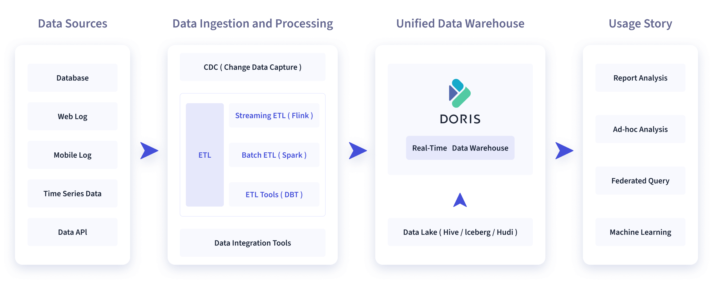
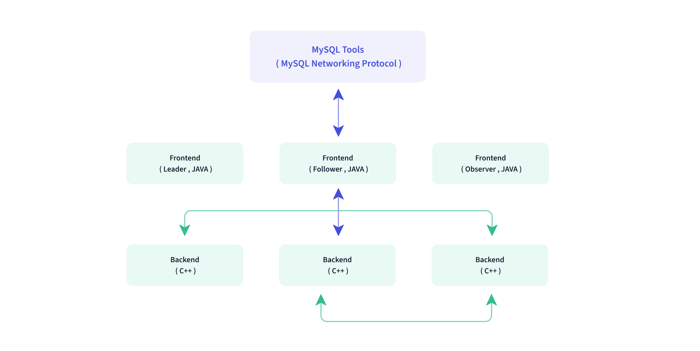
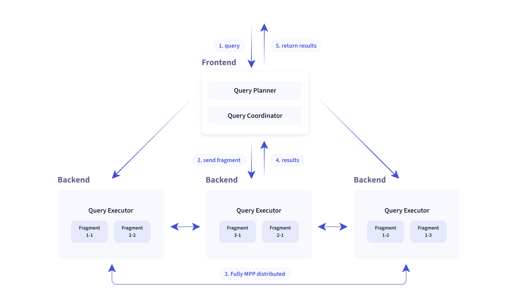
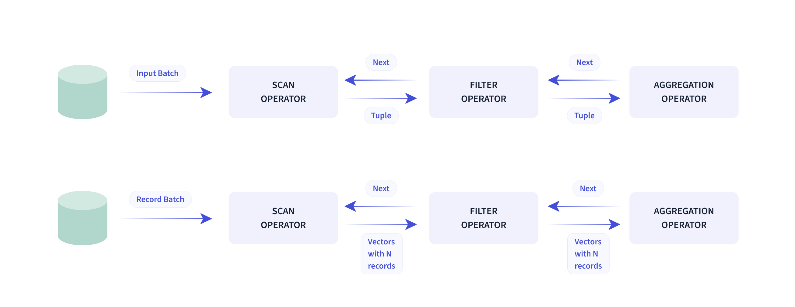

# Doris 介紹

Apache Doris 是一個基於 MPP 架構的高效能、即時的分析型資料庫，以極速易用的特點被人們所熟知，僅需亞秒級回應時間即可返回海量資料下的查詢結果，不僅可以支援高並發的點查詢場景，也能支援高吞吐的複雜分析場景。基於此，Apache Doris 能夠較好的滿足報表分析、即席查詢、統一數倉建置、資料湖聯邦查詢加速等使用場景，使用者可在此之上建立使用者行為分析、AB 實驗平台、日誌檢索分析、使用者畫像分析、訂單分析等應用程式。

Apache Doris 最早是誕生於百度廣告報表業務的 Palo 專案，2017 年正式對外開源，2018 年 7 月由百度捐贈給 Apache 基金會進行孵化，之後在 Apache 導師的指導下由孵化器項目管理委員會成員進行孵化和運營。目前 Apache Doris 社群已經聚集了來自不同行業數百家企業的 400 餘位貢獻者，每月活躍貢獻者人數也超過 100 位。 2022 年 6 月，Apache Doris 成功從 Apache 孵化器畢業，正式成為 Apache 頂級專案（Top-Level Project，TLP）。

Apache Doris 如今在中國乃至全球範圍內都擁有廣泛的用戶群體，截止目前， Apache Doris 已經在全球超過 2000 家企業的生產環境中得到應用，在中國市值或估值排行前 50 的互聯網公司中，有超過 80% 長期使用 Apache Doris，包括百度、美團、小米、京東、位元組跳動、騰訊、網易、快手、微博、貝殼等。同時在一些傳統產業如金融、能源、製造、電信等領域也有豐富的應用。

## 使用場景

如下圖所示，資料來源經過各種資料整合和加工處理後，通常會入庫到即時數倉 Doris 和離線湖倉（Hive, Iceberg, Hudi 中），Apache Doris 被廣泛應用在以下場景中。

- 報表分析
    - 即時看板（Dashboards）
    - 企業內部分析師與管理者的報表
    - 面向使用者或客戶的高並發報表分析（Customer Facing Analytics）。例如針對網站主的網站分析、廣告主的廣告報表，並發通常要求成千上萬的 QPS ，查詢延遲要求毫秒級回應。著名的電商公司京東在廣告報表中使用 Apache Doris ，每天寫入 100 億行數據，查詢並發 QPS 上萬，99 分位的查詢延時 150ms。

- 即席查詢（Ad-hoc Query）：分析師的自助分析，查詢模式不固定，要求較高的吞吐。小米公司基於Doris 建構了成長分析平台（Growing Analytics，GA），利用使用者行為資料對業務進行成長分析，平均查詢延時10s，95 分位的查詢延時30s 以內，每天的SQL 查詢量為數萬條。

- 統一數倉建置：一個平台滿足統一的資料倉儲需求，簡化繁瑣的大數據軟體堆疊。海底撈基於 Doris 建構的統一數倉，取代了原先由 Spark、Hive、Kudu、Hbase、Phoenix 組成的舊架構，架構大大簡化。

- 資料湖聯邦查詢：透過外表的方式聯邦分析位於 Hive、Iceberg、Hudi 中的數據，在避免資料拷貝的前提下，查詢效能大幅提升。

## 技術概述

Doris **整體架構** 如下圖所示，Doris 架構非常簡單，只有兩類進程

- **Frontend（FE）**，主要負責使用者要求的存取、查詢解析規劃、元資料的管理、節點管理相關工作。

- **Backend（BE）**，主要負責資料儲存、查詢計畫的執行。

這兩類進程都是可以橫向擴展的，單集群可以支援到數百台機器，數十 PB 的儲存容量。而這兩類進程透過一致性協定來確保服務的高可用和資料的高可靠度。這種高度整合的架構設計極大的降低了一款分散式系統的運維成本。

在 **使用介面** 方面，Doris 採用 MySQL 協議，高度相容 MySQL 語法，支援標準 SQL，使用者可以透過各類用戶端工具來存取 Doris，並支援與 BI 工具的無縫對接。 Doris 目前支援多種主流的 BI 產品，包括不限於 SmartBI、DataEase、FineBI、Tableau、Power BI、SuperSet 等，只要支援 MySQL 協定的 BI 工具，Doris 就可以作為資料來源提供查詢支援。

在 **儲存引擎** 方面，Doris 採用列式存儲，按列進行資料的編碼壓縮和讀取，能夠實現極高的壓縮比，同時減少大量非相關資料的掃描，從而更加有效利用 IO 和 CPU 資源。

Doris 也支援比較豐富的索引結構，來減少資料的掃描：

- `Sorted Compound Key Index`: 可以指定最多三個列組成複合排序鍵，透過該索引，能夠有效進行資料裁剪，從而能夠更好地支援高並發的報表場景
- `Z-order Index`: 使用 Z-order 索引，可以有效率地對資料模型中的任一欄位組合進行範圍查詢
- `Min/Max`: 有效過濾數值類型的等值和範圍查詢
- `Bloom Filter`: 對高基數列的等值過濾裁切非常有效
- `Invert Index`: 能夠對任意欄位實現快速檢索

在儲存模型方面，Doris 支援多種儲存模型，針對不同的場景做了針對性的最佳化：

- `Aggregate Key 模型`: 相同 Key 的 Value 列合併，透過提前聚合大幅提升效能
- `Unique Key 模型`: Key 唯一，相同 Key 的資料覆蓋，實現行級資料更新
- `Duplicate Key 模型`: 明細資料模型，滿足事實表的明細存儲

Doris 也支援強一致的物化視圖，物化視圖的更新和選擇都在系統內自動進行，不需要使用者手動選擇，從而大幅減少了物化視圖維護的代價。

在 **查詢引擎** 方面，Doris 採用 MPP 的模型，節點間和節點內都並行執行，也支援多個大表的分散式 Shuffle Join，從而能夠更好地應對複雜查詢。

**Doris 查詢引擎是向量化** 的查詢引擎，所有的記憶體結構能夠按照列式佈局，能夠達到大幅減少虛函數呼叫、提升 Cache 命中率，高效利用 SIMD 指令的效果。在寬表聚合場景下效能是非向量化引擎的 5-10 倍。

**Doris 採用了Adaptive Query Execution 技術** 可以根據 Runtime Statistics 來動態調整執行計劃，例如透過 Runtime Filter 技術能夠在運行時產生 Filter 推到Probe 側，並且能夠將 Filter 自動穿透到 Probe 側最底層的 Scan 節點，進而大幅減少 Probe 的資料量，加速 Join 效能。 Doris 的 Runtime Filter 支援 In/Min/Max/Bloom Filter。

在 **優化器** 方面 Doris 使用 CBO 和 RBO 結合的優化策略，RBO 支援常數折疊、子查詢改寫、謂詞下推等，CBO 支援 Join Reorder。目前 CBO 仍在持續優化中，主要集中在更精準的統計資訊收集與推導，更精準的代價模型預估等。

