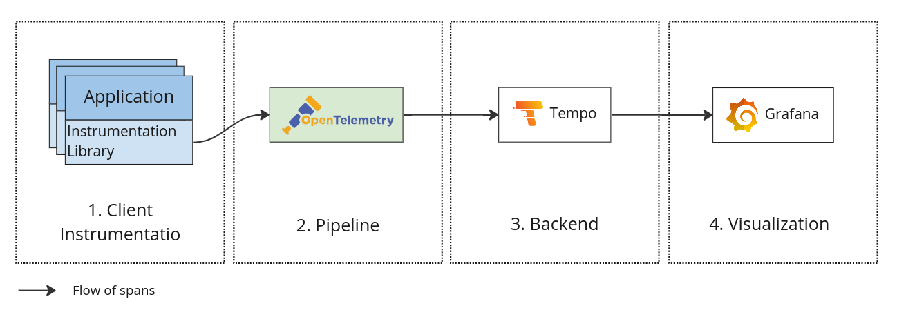
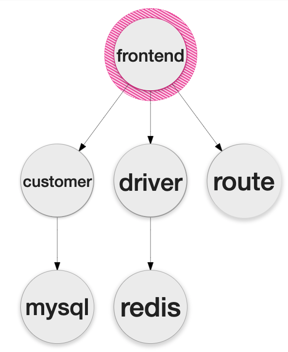
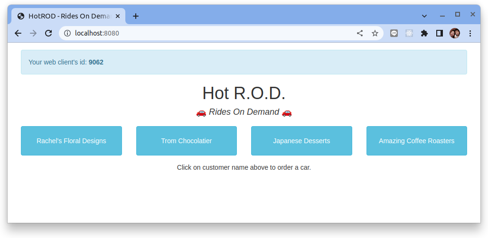
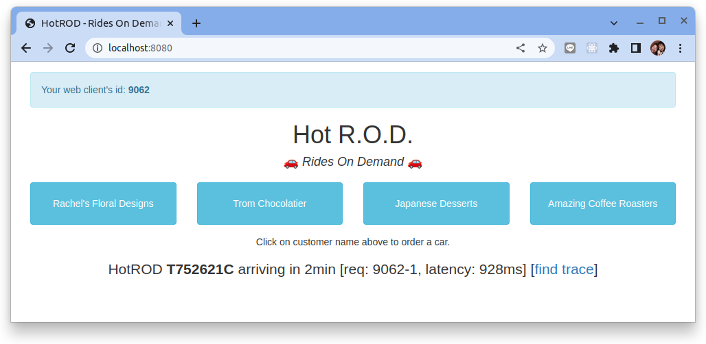
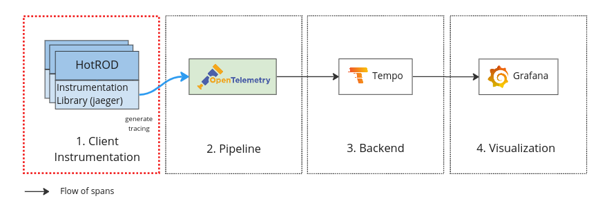
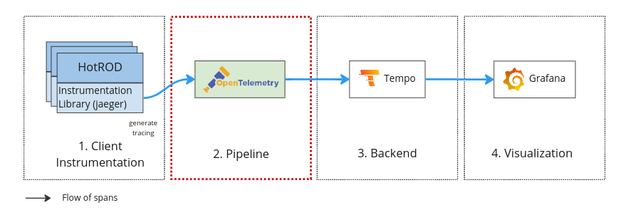
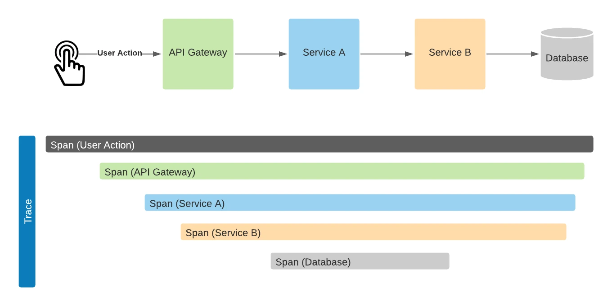
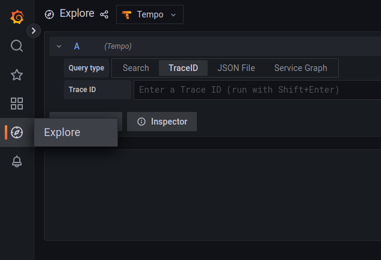
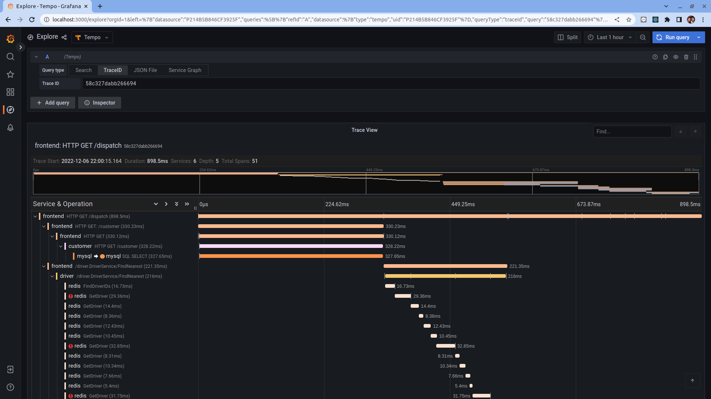

# 開始使用 Grafana Tempo

原文:[Get started with Grafana Tempo](https://grafana.com/docs/tempo/latest/getting-started/)


分佈式鏈路追踪可將應用程序對於某種服務的請求的歷程(通過一組不同應用程序時的生命週期)可視化出來。有關鏈路追踪的更多信息，請參閱[什麼是鏈路追踪](https://grafana.com/docs/tempo/latest/getting-started/traces/)？。

Grafana Tempo 是一個開源、易於使用且大規模的分佈式跟踪後端。 Tempo 允許您搜索跟踪、從跨度生成指標，並將跟踪數據與日誌和指標相關聯。

請跟隨本教程安裝、配置並了解 Grafana Tempo　如何與其它元件整合來支援 Observability (Tracking) 能力的提升。

!!! tip
    本教程所使用的 Grafa Tempo 的版本是 `v1.5.0`, 在 [ObservabilityCON 2022](https://grafana.com/blog/2022/11/30/traceql-a-first-of-its-kind-query-language-to-accelerate-trace-analysis-in-tempo-2.0/) 中 Grafana 己經宣佈 Tempo 2.0 即將 GA。

    Tempo 2.0 除了儲存核心的改善之外, **TraceQL** 提供了一個 query language (從PromQL來取經) 來提供對於 tracing 數據的強大查詢功能。

下圖說明了本教程跟踪系統的結構：



## 步驟 01 - 環境安裝

環境的搭建主要要使用到下列幾個關鍵元件:

- Kubernetes
- [Grafana Tempo](https://grafana.com/docs/tempo/latest/)
- [Prometheus Operator](https://prometheus-operator.dev/)
    - grafana
- [OpenTelemetry Collector](https://opentelemetry.io/docs/collector/)

### Kubernetes

本教程使用 K3D 來構建實驗 K8S 集群, 詳細說明請參考: 

- [使用 K3D 設置 Kubernetes 集群](../../kubernetes/01-getting-started/learning-env/k3d/k3s-kubernetes-cluster-setup-with-k3d.md)

執行下列命令來創建實驗 Kubernetes 集群:

```bash
k3d cluster create --api-port 6443 \
--port 8080:80@loadbalancer --port 8443:443@loadbalancer
```

確認 Kubernetes 及 Kubectl 是否成功安裝：

```bash
kubectl cluster-info
```
(輸出結果)

```bash
Kubernetes control plane is running at https://0.0.0.0:6443
CoreDNS is running at https://0.0.0.0:6443/api/v1/namespaces/kube-system/services/kube-dns:dns/proxy
Metrics-server is running at https://0.0.0.0:6443/api/v1/namespaces/kube-system/services/https:metrics-server:/proxy
```

### Grafana Tempo

使用以下命令添加 Tempo 的 chart 存儲庫：

```bash
helm repo add grafana https://grafana.github.io/helm-charts

helm repo update
```

將 Tempo 安裝到 tracing 命名空間中：

```bash
helm upgrade --install --create-namespace --namespace tracing tempo grafana/tempo
```

安裝之後檢查:

```bash
$ kubectl get all
NAME          READY   STATUS    RESTARTS   AGE
pod/tempo-0   2/2     Running   0          2m11s

NAME            TYPE        CLUSTER-IP     EXTERNAL-IP   PORT(S)                                                                                                                       AGE
service/tempo   ClusterIP   10.43.243.96   <none>        3100/TCP,1668additionalDataSources
statefulset.apps/tempo   1/1     2m11s
```

Grafana Tempo 支持許多不同 protocol 來接收 tracing 的資料:

|Port|Description|
|----|-----------|
|4317/TCP|Default endpoint for OpenTelemetry gRPC receiver.<br/>OpenTelemetry gRPC 接收協議的默認端點。|
|4318/TCP|Default endpoint for OpenTelemetry HTTP receiver.<br/>OpenTelemetry HTTP 接收器的默認端點。|
|6831/UDP|Default endpoint for Jaeger (thrift compact) receiver.<br/>Jaeger (thrift compact) 接收器的默認端點。|
|6832/UDP|Default endpoint for Jaeger (thrift binary) receiver.<br/>Jaeger（thrift 二進制）接收器的默認端點。|
|9411/TCP|Default endpoint for Zipkin receiver.<br/>Zipkin 接收器的默認端點。|
|14250/TCP|Default endpoint for Jaeger gRPC receiver.<br/>Jaeger gRPC 接收器的默認端點。|
|14268/TCP|Default endpoint for Jaeger (thrift) HTTP receiver.<br/>Jaeger (thrift) HTTP 接收器的默認端點。|
|16686/TCP|Default endpoint for Jaeger UUI query.<br/>Jaeger UUI 查詢的默認端點。|
|55678/TCP|Default endpoint for Opencensus receiver.<br/>Opencensus 接收器的默認端點。|
|55680/TCP|efault endpoint for legacy OpenTelemetry gRPC receiver.<br/>舊版 OpenTelemetry gRPC 接收器的默認端點。|
|55681/TCP|efault endpoint for legacy OpenTelemetry HTTP receiver.<br/>舊版 OpenTelemetry HTTP 接收器。的默認端點|


### kube-prometheus-stack

本教程使用 `kube-prometheus-stack` 來構建可觀測性的相關元件, 詳細說明請參additionalDataSources

- [Prometheus 簡介](../../prometheus/prometheus/overview.md)
- [Prometheus Operator 簡介](../../prometheus/operator/install.md)

添加 Prometheus-Community helm 存儲庫並更新本地緩存：

```bash
$ helm repo add prometheus-community https://prometheus-community.github.io/helm-charts
$ helm repo update 
```

創建要配置的 vlaues 檔案:

```yaml title="kube-stack-prometheus-values.yaml"
grafana:
  # change timezone setting base on browser
  defaultDashboardsTimezone: browser
  # create tempo datasource for tracing data store
  additionalDataSources:
    - name: Tempo
      type: tempo
      url: http://tempo.tracing:3100
      access: proxy
  grafana.ini:
    users:
      viewers_can_edit: true
    auth:
      disable_login_form: false
      disable_signout_menu: false
    auth.anonymous:
      enabled: true
      org_role: Viewer
  sidecar:
    datasources:
      logLevel: "DEBUG"
      enabled: true
      searchNamespace: "ALL"
    dashboards:
      logLevel: "DEBUG"
      # enable the cluster wide search for dashbaords and adds/updates/deletes them in grafana
      enabled: true
      searchNamespace: "ALL"
      label: grafana_dashboard
      labelValue: "1"

prometheus:
  prometheusSpec:
    # enable the cluster wide search for ServiceMonitor CRD
    serviceMonitorSelectorNilUsesHelmValues: false
    # enable the cluster wide search for PodMonitor CRD
    podMonitorSelectorNilUsesHelmValues: false
    # enable the cluster wide search for PrometheusRule CRD
    ruleSelectorNilUsesHelmValues: false
    probeSelectorNilUsesHelmValues: false
```

!!! info
    在設定 `kube-stack-prometheus` 的設定中定義了 Tempo 在 grafana 中的 Data Source 的設定:
    
    ```yaml
    grafana:
      # change timezone setting base on browser
      defaultDashboardsTimezone: browser
      additionalDataSources:
        - name: Tempo
          type: tempo
          url: http://tempo.tracing:3100
          access: proxy    
    ...
    ...
    ```

使用 Helm 在命名空間監控中部署 `kube-stack-prometheus` chart：

```bash
helm upgrade --install --wait --create-namespace --namespace monitoring  \
kube-stack-prometheus prometheus-community/kube-prometheus-stack \
--values kube-stack-prometheus-values.yaml
```

該 Helm chart 安裝了 Prometheus 組件和 Operator、Grafana 以及以下 exporters：

- [prometheus-node-exporter](https://github.com/prometheus/node_exporter) 暴露底層硬件和操作系統的相關指標
- [kube-state-metrics](https://github.com/kubernetes/kube-state-metrics) 監聽 Kubernetes API 服務器並生成有關對象狀態的指標

有關 `kube-stack-prometheus` 的詳細說明:

- [Prometheus Operator](../../prometheus/operator/install.md)

#### 連接到 Grafana

Grafana Web UI 可通過以下命令通過端口轉發訪問：

```bash
kubectl port-forward --namespace monitoring \
svc/kube-stack-prometheus-grafana 3000:80 --address="0.0.0.0"
```

打開瀏覽器並轉到 http://localhost:3000 並填寫前一個命令所取得的用戶名/密碼。預設的帳號是:

- `username`: admin
- `password`: prom-operator


### Opentelemetry Collector

使用以下命令添加 Opentelemetry operator 與 cert-manager 的 chart 存儲庫：

```bash
helm repo add jetstack https://charts.jetstack.io
helm repo add open-telemetry https://open-telemetry.github.io/opentelemetry-helm-charts

helm repo update
```

安裝 Cert-Manager:

```bash
helm upgrade --install --create-namespace --namespace cert-manager \
cert-manager jetstack/cert-manager \
--version v1.10.1  --set installCRDs=true
```

將 Opentelemetry operator 安裝起來：

```bash
helm upgrade --install --create-namespace --namespace otel-system  \
opentelemetry-operator open-telemetry/opentelemetry-operator
```

一旦 `opentelemetry-operator` 部署準備就緒，您就可以在我們的 Kubernetes 集群中部署 OpenTelemetry Collector。

Collector 可以部署為四種模式之一：`Deployment`、`DaemonSet`、`StatefulSet` 和 `Sidecar`。默認模式是 `Deployment`。

#### Deployment Mode

如果您想更好地控制 OpenTelemetry Collector 並創建一個獨立的應用程序，`Deployment` 將是您的選擇。通過 Deployment，您可以相對輕鬆地擴展 Collector 以監視更多目標、在發生任何意外情況時回滾到早期版本、暫停 Collector 等。通常，您可以像管理應用程序一樣管理 Collector 實例。

以下示例配置將收集器部署為 `Deployment`。接收器是 Jaeger 接收器，導出器是日誌導出器。

```bash
kubectl apply -n otel-system -f -<<EOF
apiVersion: opentelemetry.io/v1alpha1
kind: OpenTelemetryCollector
metadata:
  name: otel-collector
spec:
  mode: deployment # This configuration is omittable.
  config: |
    receivers:
      jaeger:
        protocols:
          grpc:
          thrift_compact:
    processors:
      batch:

    exporters:
      otlp:
        # otlp http protocol
        endpoint: tempo.tracing:4317
        tls:
          insecure: true
      jaeger:
        endpoint: tempo.tracing:14250
        tls:
          insecure: true
      logging:
        loglevel: debug

    service:
      pipelines:
        traces:
          receivers: [jaeger]
          processors: []
          exporters: [logging, otlp]
EOF
```

## 步驟 02 - 範例應用程序

`HotROD` 是一個演示用的應用程序，由多個微服務組成，並說明了 OpenTracing API 的使用。它可以獨立運行，但需要 Jaeger 後端才能查看鏈路追踪的結果。

- HotRod 是專為 Jaeger (一種tracking backend)設計的用於演示追踪的搭車共享的應用程序。
- HotRod 應用程序是使用 Go 語言來實現。
- HotRod 源碼: https://github.com/jaegertracing/jaeger/blob/main/examples/hotrod/README.md

`HotROD` 由四個微服務和兩個數據庫組成：

微服務：

  - Frontend
  - Customer
  - Driver
  - Route

數據庫:

- Mysql
- Redis

前端是服務於 UI 和 RPC 調用其他三個微服務的根服務。數據流圖如下所示：



### 部署 `Hot R.O.D` 應用

執行下列命令來佈署 `Hot R.O.D` 應用:

創建 Deployment manifest:

```bash title="Deployment"
kubectl apply -f -<<EOF
apiVersion: apps/v1
kind: Deployment
metadata:
  labels:
    app: example-hotrod
  name: example-hotrod
spec:
  replicas: 1
  selector:
    matchLabels:
      app: example-hotrod
  strategy: {}
  template:
    metadata:
      labels:
        app: example-hotrod
    spec:
      containers:
      - image: jaegertracing/example-hotrod:latest
        name: example-hotrod
        args: ["all"]
        env:
          - name: JAEGER_AGENT_HOST
            # endpoint for tracing data collector
            value: otel-collector-collector.otel-system.svc.cluster.local
          - name: JAEGER_AGENT_PORT
            value: "6831"
        ports:
          - containerPort: 8080
            name: frontend
          - containerPort: 8081
            name: customer
          - containerPort: 8083
            name: route
        resources:
          limits:
            cpu: 100m
            memory: 100M
          requests:
            cpu: 100m
            memory: 100M
EOF
```

創建 Service manifest:

```bash title="Service"
kubectl apply -f -<<EOF
apiVersion: v1
kind: Service
metadata:
  name: example-hotrod
spec:
  selector:
    app: example-hotrod
  ports:
    - name: frontend
      protocol: TCP
      port: 8080
      targetPort: frontend
EOF
```

### 對外部暴露應用程序

```bash
kubectl port-forward service/example-hotrod 8080:8080 --address=0.0.0.0
```

### 訪問應用

使用瀏覽器指向 `http://localhost:8080` 來打開 HotROD 應用的 UI:




### 驗證

#### 1. 應用程序產生 tracing data

點擊 "Rachel's Floral Designs" 的地點, 會看到一筆新的叫車單送了出來:



這個時候 HotROD 應用會通過 Jaeger (cliet sdk) 來發送 tracing 的數據給預設定的收集器。



#### 2. Opentelemetry Collector 收集處理轉發

Opentelemetry Collector 用來收集不同協議的 tracing data　並且可進行一系列的數據處理與轉發至下游的存儲服務。在本教程中我們配置了:

- `receivers: [jaeger]` 代表者 Otel Collector 可接收 Jaeger 協議的 tracking 數據
- `processors: []` 沒有設定任何的數據處理
- `exporters: [logger, otlp]` 轉發出去的數據會日誌的形式打印到 stdout 並且使用 `otlp` 的協議轉發給下遊 

```yaml
...
...
      pipelines:
        traces:
          receivers: [jaeger]
          processors: []
          exporters: [logging, otlp]
...
...
```

因此驗證 Otel Collector 是否有正常工作的簡單手法就是去看它的日誌, 接著讓我們看一下 `Opentelemetry Collector` 的日誌:

```bash
$ kubectl get pod -n otel-system
NAME                                                         READY   STATUS    RESTARTS   AGE
opentelemetry-operator-controller-manager-5654cdc886-8qtbl   2/2     Running   0          99m
otel-collector-collector-599f45f999-gs4hf                    1/1     Running   0          97m

$ kubectl logs -n otel-system otel-collector-collector-599f45f999-gs4hf --tail=20
```

結果:

```bash hl_lines="4"
Span #14
    Trace ID       : 000000000000000058c327dabb266694
    Parent ID      : 
    ID             : 58c327dabb266694
    Name           : HTTP GET /dispatch
    Kind           : Server
    Start time     : 2022-12-06 14:00:15.164379 +0000 UTC
    End time       : 2022-12-06 14:00:16.062878 +0000 UTC
    Status code    : Unset
    Status message : 
Attributes:
     -> sampler.type: Str(const)
     -> sampler.param: Bool(true)
     -> http.status_code: Int(200)
     -> http.method: Str(GET)
     -> http.url: Str(/dispatch?customer=123&nonse=0.8047647031625786)
     -> component: Str(net/http)
Events:
SpanEvent #0
     -> Name: HTTP request received
     -> Timestamp: 2022-12-06 14:00:15.164493 +0000 UTC
     -> DroppedAttributesCount: 0
     -> Attributes::
          -> url: Str(/dispatch?customer=123&nonse=0.8047647031625786)
          -> level: Str(info)
          -> method: Str(GET)
...
...
```

在上面的日誌中可看見許多的事件與鏈路追踪訊息, 其中比較重要的是 `Trace ID: 58c327dabb266694`。



#### 3. 鏈路追踪訊息查看

查看 tracing 數據的手法主要要通過 UI 來把特定的服務間相互溝通的鏈路追踪訊息整理出來。



登入 Grafana UI (http://localhost:3000) 並且在左側菜單圖示點擊 `Explorer` 然後在 Data Source 的下拉清單中選擇 `Tempo`:



在 `Trace ID` 的輸入欄位中鍵入在上一步驟查看到的 `Trace ID: 58c327dabb266694`:



由 Grafana 中可查看到完成一個 rquest 的服務呼叫鏈路順序與處理時間。


## 結論

分佈式鏈路追踪對微服務的可觀測性功能的導入非常重要。選擇合適的元件來整合並提供使用者友善介面來應用相關的鏈路追踪是讓落地的關鍵。