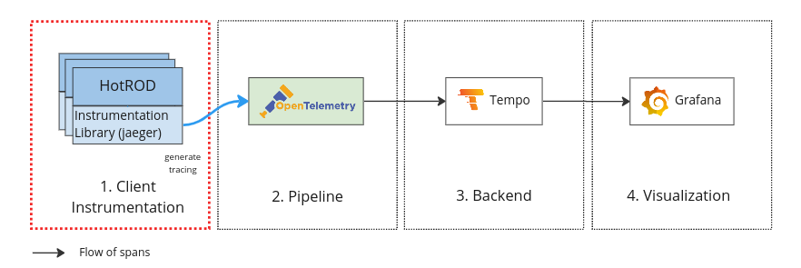
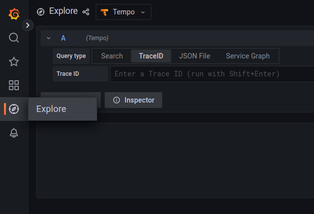
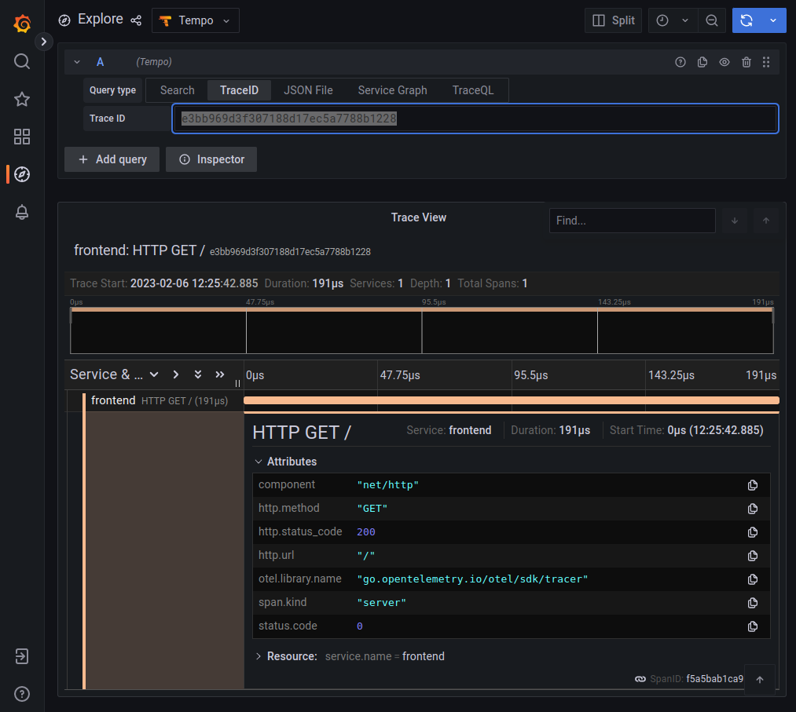

# 開始使用 Grafana Tempo (v2)

原文:[Get started with Grafana Tempo](https://grafana.com/docs/tempo/latest/getting-started/)


分佈式鏈路追踪可將應用程序對於某種服務的請求的歷程(通過一組不同應用程序時的生命週期)可視化出來。有關鏈路追踪的更多信息，請參閱[什麼是鏈路追踪](https://grafana.com/docs/tempo/latest/getting-started/traces/)？。

Grafana Tempo 是一個開源、易於使用且大規模的分佈式跟踪後端。 Tempo 允許您搜索跟踪、從跨度生成指標，並將跟踪數據與日誌和指標相關聯。

請跟隨本教程安裝、配置並了解 Grafana Tempo　如何與其它元件整合來支援 Observability (Tracing) 能力的提升。

!!! tip
    本教程所使用的 Grafa Tempo 的版本是 [`v2.0.0`](https://github.com/grafana/tempo/releases/tag/v2.0.0)。

    Tempo 2.0 除了儲存核心([Parquet]())的改善之外, **TraceQL** 提供了一個 query language (從PromQL來取經) 來提供對於 tracing 數據的強大查詢功能。

    - [parquet-go](https://github.com/segmentio/parquet-go)
    - [parquet-format](https://github.com/apache/parquet-format)
    - [TraceQL Phase 1 support](https://grafana.com/docs/tempo/latest/traceql/)


下圖說明了本教程跟踪系統的結構：


## 步驟 01 - 環境安裝

環境的搭建主要要使用到下列幾個關鍵元件:

- Kubernetes
- [Grafana Tempo v2.0](https://grafana.com/docs/tempo/latest/)
- [Prometheus Operator](https://prometheus-operator.dev/)
    - grafana
- [OpenTelemetry Collector](https://opentelemetry.io/docs/collector/)

### Kubernetes

本教程使用 K3D 來構建實驗 K8S 集群, 詳細說明請參考: 

- [使用 K3D 設置 Kubernetes 集群](../../kubernetes/01-getting-started/learning-env/k3d/k3s-kubernetes-cluster-setup-with-k3d.md)

執行下列命令來創建實驗 Kubernetes 集群:

```bash
k3d cluster create --api-port 6443 \
--port 8080:80@loadbalancer --port 8443:443@loadbalancer
```

確認 Kubernetes 及 Kubectl 是否成功安裝：

```bash
kubectl cluster-info
```
(輸出結果)

```bash
Kubernetes control plane is running at https://0.0.0.0:6443
CoreDNS is running at https://0.0.0.0:6443/api/v1/namespaces/kube-system/services/kube-dns:dns/proxy
Metrics-server is running at https://0.0.0.0:6443/api/v1/namespaces/kube-system/services/https:metrics-server:/proxy
```

### Grafana Tempo

使用以下命令添加 Tempo 的 chart 存儲庫：

```bash
helm repo add grafana https://grafana.github.io/helm-charts

helm repo update
```

將 Tempo (v2) 安裝到 tracing 命名空間中：

```bash
helm upgrade --install \
     --create-namespace --namespace tracing \
     tempo grafana/tempo
```

??? info "Tempo v2 Helm 設定參考"

    設定值說明請見:[Grafana Temp Github](https://github.com/grafana/helm-charts/tree/main/charts/tempo#values)

    ```yaml
    # -- Overrides the chart's name
    nameOverride: ""

    # -- Overrides the chart's computed fullname
    fullnameOverride: ""

    # -- Define the amount of instances
    replicas: 1

    # -- Annotations for the StatefulSet
    annotations: {}

    tempo:
      repository: grafana/tempo
      tag: 2.0.0
      pullPolicy: IfNotPresent
      ## Optionally specify an array of imagePullSecrets.
      ## Secrets must be manually created in the namespace.
      ## ref: https://kubernetes.io/docs/tasks/configure-pod-container/pull-image-private-registry/
      ##
      # pullSecrets:
      #   - myRegistryKeySecretName

      updateStrategy: RollingUpdate
      resources: {}
      #  requests:
      #    cpu: 1000m
      #    memory: 4Gi
      #  limits:
      #    cpu: 2000m
      #    memory: 6Gi

      memBallastSizeMbs: 1024
      multitenancyEnabled: false
      # -- If true, Tempo will report anonymous usage data about the shape of a deployment to Grafana Labs
      reportingEnabled: true
      metricsGenerator:
        # -- If true, enables Tempo's metrics generator (https://grafana.com/docs/tempo/next/metrics-generator/)
        enabled: false
        remoteWriteUrl: "http://prometheus.monitoring:9090/api/v1/write"
      # -- Configuration options for the ingester
      ingester: {}
      # -- Configuration options for the querier
      querier: {}
      # -- Configuration options for the query-fronted
      queryFrontend: {}
      retention: 24h
      # Global overrides
      global_overrides:
        per_tenant_override_config: /conf/overrides.yaml
      overrides: {}

      # Tempo server configuration
      # Refers to https://grafana.com/docs/tempo/latest/configuration/#server
      server:
        # -- HTTP server listen port
        http_listen_port: 3100
      storage:
        trace:
          # tempo storage backend
          # refer https://github.com/grafana/tempo/tree/master/docs/tempo/website/configuration
          ## Use s3 for example
          # backend: s3
          # store traces in s3
          # s3:
          #   bucket: tempo                                   # store traces in this bucket
          #   endpoint: s3.dualstack.us-east-2.amazonaws.com  # api endpoint
          #   access_key: ...                                 # optional. access key when using static credentials.
          #   secret_key: ...                                 # optional. secret key when using static credentials.
          #   insecure: false                                 # optional. enable if endpoint is http
          backend: local
          local:
            path: /var/tempo/traces
          wal:
            path: /var/tempo/wal
      # this configuration will listen on all ports and protocols that tempo is capable of.
      # the receives all come from the OpenTelemetry collector.  more configuration information can
      # be found there: https://github.com/open-telemetry/opentelemetry-collector/tree/master/receiver
      receivers:
        jaeger:
          protocols:
            grpc:
              endpoint: 0.0.0.0:14250
            thrift_binary:
              endpoint: 0.0.0.0:6832
            thrift_compact:
              endpoint: 0.0.0.0:6831
            thrift_http:
              endpoint: 0.0.0.0:14268
        opencensus:
        otlp:
          protocols:
            grpc:
              endpoint: "0.0.0.0:4317"
            http:
              endpoint: "0.0.0.0:4318"
      securityContext: {}
        # allowPrivilegeEscalation: false
        #  capabilities:
        #    drop:
        #    - ALL
        # readOnlyRootFilesystem: true
      ## Additional container arguments
      extraArgs: {}
      # -- Environment variables to add
      extraEnv: []
      # -- Environment variables from secrets or configmaps to add to the ingester pods
      extraEnvFrom: []
      # -- Volume mounts to add
      extraVolumeMounts: []
      # - name: extra-volume
      #   mountPath: /mnt/volume
      #   readOnly: true
      #   existingClaim: volume-claim

    # -- Tempo configuration file contents
    # @default -- Dynamically generated tempo configmap
    config: |
        multitenancy_enabled: {{ .Values.tempo.multitenancyEnabled }}
        usage_report:
          reporting_enabled: {{ .Values.tempo.reportingEnabled }}
        compactor:
          compaction:
            block_retention: {{ .Values.tempo.retention }}
        distributor:
          receivers:
            {{- toYaml .Values.tempo.receivers | nindent 8 }}
        ingester:
          {{- toYaml .Values.tempo.ingester | nindent 6 }}
        server:
          {{- toYaml .Values.tempo.server | nindent 6 }}
        storage:
          {{- toYaml .Values.tempo.storage | nindent 6 }}
        querier:
          {{- toYaml .Values.tempo.querier | nindent 6 }}
        query_frontend:
          {{- toYaml .Values.tempo.queryFrontend | nindent 6 }}
        overrides:
          {{- toYaml .Values.tempo.global_overrides | nindent 6 }}
          {{- if .Values.tempo.metricsGenerator.enabled }}
              metrics_generator_processors:
              - 'service-graphs'
              - 'span-metrics'
        metrics_generator:
              storage:
                path: "/tmp/tempo"
                remote_write:
                  - url: {{ .Values.tempo.metricsGenerator.remoteWriteUrl }}
          {{- end }}
    tempoQuery:
      repository: grafana/tempo-query
      tag: 2.0.0
      pullPolicy: IfNotPresent
      ## Optionally specify an array of imagePullSecrets.
      ## Secrets must be manually created in the namespace.
      ## ref: https://kubernetes.io/docs/tasks/configure-pod-container/pull-image-private-registry/
      ##
      # pullSecrets:
      #   - myRegistryKeySecretName

      # -- if False the tempo-query container is not deployed
      enabled: true

      resources: {}
      #  requests:
      #    cpu: 1000m
      #    memory: 4Gi
      #  limits:
      #    cpu: 2000m
      #    memory: 6Gi

      ## Additional container arguments
      extraArgs: {}
      # -- Environment variables to add
      extraEnv: []
      # -- Volume mounts to add
      extraVolumeMounts: []
      # - name: extra-volume
      #   mountPath: /mnt/volume
      #   readOnly: true
      #   existingClaim: volume-claim
      securityContext: {}
        # allowPrivilegeEscalation: false
        #  capabilities:
        #    drop:
        #    - ALL
        # readOnlyRootFilesystem: false # fails if true, do not enable

    # -- securityContext for container
    securityContext: {}
      # runAsUser: 65532
      # runAsGroup: 65532
      # fsGroup: 65532
      # runAsNonRoot: true

    serviceAccount:
      # -- Specifies whether a ServiceAccount should be created
      create: true
      # -- The name of the ServiceAccount to use.
      # If not set and create is true, a name is generated using the fullname template
      name: null
      # -- Image pull secrets for the service account
      imagePullSecrets: []
      # -- Annotations for the service account
      annotations: {}
      # -- Labels for the service account
      labels: {}
      automountServiceAccountToken: true

    service:
      type: ClusterIP
      annotations: {}
      labels: {}

    serviceMonitor:
      enabled: false
      interval: ""
      additionalLabels: {}
      annotations: {}
      # scrapeTimeout: 10s

    persistence:
      enabled: false
      # storageClassName: local-path
      accessModes:
        - ReadWriteOnce
      size: 10Gi

    # -- Pod Annotations
    podAnnotations: {}

    # -- Pod (extra) Labels
    podLabels: {}

    # -- Volumes to add
    extraVolumes: []

    # -- Node labels for pod assignment. See: https://kubernetes.io/docs/user-guide/node-selection/
    nodeSelector: {}

    # -- Tolerations for pod assignment. See: https://kubernetes.io/docs/concepts/configuration/taint-and-toleration/
    tolerations: []

    # -- Affinity for pod assignment. See: https://kubernetes.io/docs/concepts/configuration/assign-pod-node/#affinity-and-anti-affinity
    affinity: {}

    # -- The name of the PriorityClass
    priorityClassName: null
    ```

安裝之後檢查:

```bash
kubectl get all -n tracing
```

結果:

```
NAME          READY   STATUS    RESTARTS   AGE
pod/tempo-0   2/2     Running   0          2m36s

NAME            TYPE        CLUSTER-IP    EXTERNAL-IP   PORT(S)                                                                                                                       AGE
service/tempo   ClusterIP   10.43.52.38   <none>        3100/TCP,16687/TCP,16686/TCP,6831/UDP,6832/UDP,14268/TCP,14250/TCP,9411/TCP,55680/TCP,55681/TCP,4317/TCP,4318/TCP,55678/TCP   2m36s

NAME                     READY   AGE
statefulset.apps/tempo   1/1     2m36s
```

檢查 Tempo 版本:

```bash
kubectl describe statefulset/tempo  -n tracing
```

結果:

``` hl_lines="8 22"
Name:               tempo
Namespace:          tracing
CreationTimestamp:  Sun, 05 Feb 2023 11:17:02 +0800
Selector:           app.kubernetes.io/instance=tempo,app.kubernetes.io/name=tempo
Labels:             app.kubernetes.io/instance=tempo
                    app.kubernetes.io/managed-by=Helm
                    app.kubernetes.io/name=tempo
                    app.kubernetes.io/version=2.0.0
                    helm.sh/chart=tempo-1.0.0
Annotations:        meta.helm.sh/release-name: tempo
                    meta.helm.sh/release-namespace: tracing
Replicas:           1 desired | 1 total
Update Strategy:    RollingUpdate
Pods Status:        1 Running / 0 Waiting / 0 Succeeded / 0 Failed
Pod Template:
  Labels:           app.kubernetes.io/instance=tempo
                    app.kubernetes.io/name=tempo
  Annotations:      checksum/config: 439e9f45b8b5fc03c92d7c77f01a6e595a4cd2ef69a778e6b7e55bb702103b2c
  Service Account:  tempo
  Containers:
   tempo:
    Image:       grafana/tempo:2.0.0
    Ports:       3100/TCP, 6831/UDP, 6832/UDP, 14268/TCP, 14250/TCP, 9411/TCP, 55680/TCP, 4317/TCP, 55681/TCP, 55678/TCP
    Host Ports:  0/TCP, 0/UDP, 0/UDP, 0/TCP, 0/TCP, 0/TCP, 0/TCP, 0/TCP, 0/TCP, 0/TCP
    Args:
      -config.file=/conf/tempo.yaml
      -mem-ballast-size-mbs=1024
    Environment:  <none>
    Mounts:
      /conf from tempo-conf (rw)
   tempo-query:
    Image:       grafana/tempo-query:2.0.0
    Ports:       16686/TCP, 16687/TCP
    Host Ports:  0/TCP, 0/TCP
    Args:
      --query.base-path=/
      --grpc-storage-plugin.configuration-file=/conf/tempo-query.yaml
    Environment:  <none>
    Mounts:
      /conf from tempo-query-conf (rw)
    ...
    ...
```

Grafana Tempo 支持許多不同 protocol 來接收 tracing 的資料:

|Port|Description|
|----|-----------|
|4317/TCP|Default endpoint for OpenTelemetry gRPC receiver.<br/>OpenTelemetry gRPC 接收協議的默認端點。|
|4318/TCP|Default endpoint for OpenTelemetry HTTP receiver.<br/>OpenTelemetry HTTP 接收器的默認端點。|
|6831/UDP|Default endpoint for Jaeger (thrift compact) receiver.<br/>Jaeger (thrift compact) 接收器的默認端點。|
|6832/UDP|Default endpoint for Jaeger (thrift binary) receiver.<br/>Jaeger（thrift 二進制）接收器的默認端點。|
|9411/TCP|Default endpoint for Zipkin receiver.<br/>Zipkin 接收器的默認端點。|
|14250/TCP|Default endpoint for Jaeger gRPC receiver.<br/>Jaeger gRPC 接收器的默認端點。|
|14268/TCP|Default endpoint for Jaeger (thrift) HTTP receiver.<br/>Jaeger (thrift) HTTP 接收器的默認端點。|
|16686/TCP|Default endpoint for Jaeger UUI query.<br/>Jaeger UUI 查詢的默認端點。|
|55678/TCP|Default endpoint for Opencensus receiver.<br/>Opencensus 接收器的默認端點。|
|55680/TCP|efault endpoint for legacy OpenTelemetry gRPC receiver.<br/>舊版 OpenTelemetry gRPC 接收器的默認端點。|
|55681/TCP|efault endpoint for legacy OpenTelemetry HTTP receiver.<br/>舊版 OpenTelemetry HTTP 接收器。的默認端點|


### kube-prometheus-stack

本教程使用 `kube-prometheus-stack` 來構建可觀測性的相關元件, 詳細說明請參additionalDataSources

- [Prometheus 簡介](../../prometheus/prometheus/overview.md)
- [Prometheus Operator 簡介](../../prometheus/operator/install.md)

添加 Prometheus-Community helm 存儲庫並更新本地緩存：

```bash
helm repo add prometheus-community https://prometheus-community.github.io/helm-charts

helm repo update 
```

**Grafana TraceQL query editor:**

借助 Tempo 2.0，您可以使用 Tempo 數據源中的 `TraceQL` viewer 和查詢編輯器來構建查詢並向下鑽取結果集。該編輯器在 Grafana 的 Explore 界面中可取得使用。


!!! tip
    要使用 TraceQL 查詢編輯器，您需要啟用 `traceqlEditor` 功能旗標。此功能從 Grafana **9.3.2** 開始支持。預計從 Grafana 9.4.0 之後 `traceqlEditor` 就不需要特別設定開啟。

創建要配置的 prometheus stack 的設定檔案(使用任何文字編輯器來創建):

```yaml title="kube-stack-prometheus-values.yaml" hl_lines="4 8-12 22-23"
grafana:
  # specify tag to ensure grafana version
  image:
    tag: "9.3.6"
  # change timezone setting base on browser
  defaultDashboardsTimezone: browser
  # create tempo datasource for tracing data store
  additionalDataSources:
    - name: Tempo
      type: tempo
      url: http://tempo.tracing:3100
      access: proxy
  grafana.ini:
    users:
      viewers_can_edit: true
    auth:
      disable_login_form: false
      disable_signout_menu: false
    auth.anonymous:
      enabled: true
      org_role: Viewer
    feature_toggles:
      enable: traceqlEditor
  sidecar:
    datasources:
      logLevel: "DEBUG"
      enabled: true
      searchNamespace: "ALL"
    dashboards:
      logLevel: "DEBUG"
      # enable the cluster wide search for dashbaords and adds/updates/deletes them in grafana
      enabled: true
      searchNamespace: "ALL"
      label: grafana_dashboard
      labelValue: "1"

prometheus:
  prometheusSpec:
    # enable the cluster wide search for ServiceMonitor CRD
    serviceMonitorSelectorNilUsesHelmValues: false
    # enable the cluster wide search for PodMonitor CRD
    podMonitorSelectorNilUsesHelmValues: false
    # enable the cluster wide search for PrometheusRule CRD
    ruleSelectorNilUsesHelmValues: false
    probeSelectorNilUsesHelmValues: false
```

- `feature_toggles.enable: traceqlEditor` 在 Grafana 啟用 TraceQL 查詢編輯器

!!! info
    在設定 `kube-stack-prometheus` 的設定中定義了 Tempo 在 grafana 中的 Data Source 的設定:
    
    ```yaml
    grafana:
      # change timezone setting base on browser
      defaultDashboardsTimezone: browser
      additionalDataSources:
        - name: Tempo
          type: tempo
          url: http://tempo.tracing:3100
          access: proxy    
    ...
    ...
    ```

使用 Helm 在命名空間監控中部署 `kube-stack-prometheus` chart:

```bash
helm upgrade --install \
  --create-namespace --namespace monitoring \
  kube-stack-prometheus prometheus-community/kube-prometheus-stack \
  --values kube-stack-prometheus-values.yaml
```

該 Helm chart 安裝了 Prometheus 組件和 Operator、Grafana 以及以下 exporters:

- [prometheus-node-exporter](https://github.com/prometheus/node_exporter) 暴露底層硬件和操作系統的相關指標
- [kube-state-metrics](https://github.com/kubernetes/kube-state-metrics) 監聽 Kubernetes API 服務器並生成有關對象狀態的指標

有關 `kube-stack-prometheus` 的詳細說明:

- [Prometheus Operator](../../prometheus/operator/install.md)

#### 連接到 Grafana

Grafana Web UI 可通過以下命令通過端口轉發訪問:

```bash
kubectl port-forward --namespace monitoring \
  svc/kube-stack-prometheus-grafana 3000:80 \
  --address="0.0.0.0"
```

打開瀏覽器並轉到 http://localhost:3000 並填寫前一個命令所取得的用戶名/密碼。預設的帳號是:

- `username`: admin
- `password`: prom-operator


點選左側的導引欄上的 Explore 圖示後，在資料源下拉選單中點選 `Tempo`:


如果在 Grafana 的 Explorer 介面上有看到 `TraceQL` 的頁籤的話代表設定正確。

### Opentelemetry Collector

使用以下命令添加 Opentelemetry operator 與 cert-manager 的 chart 存儲庫：

```bash
helm repo add jetstack https://charts.jetstack.io

helm repo add open-telemetry https://open-telemetry.github.io/opentelemetry-helm-charts

helm repo update
```

安裝 Cert-Manager:

```bash
helm upgrade --install --create-namespace --namespace cert-manager \
  cert-manager jetstack/cert-manager \
  --version v1.10.1 \
  --set installCRDs=true
```

將 Opentelemetry operator 安裝起來：

```bash
helm upgrade --install --create-namespace --namespace otel-system  \
  opentelemetry-operator open-telemetry/opentelemetry-operator
```

一旦 `opentelemetry-operator` 部署準備就緒，您就可以在我們的 Kubernetes 集群中部署 OpenTelemetry Collector。

Collector 可以部署為四種模式之一：`Deployment`、`DaemonSet`、`StatefulSet` 和 `Sidecar`。默認模式是 `Deployment`。

#### Deployment Mode

如果您想更好地控制 OpenTelemetry Collector 並創建一個獨立的應用程序，`Deployment` 將是您的選擇。通過 Deployment，您可以相對輕鬆地擴展 Collector 以監視更多目標、在發生任何意外情況時回滾到早期版本、暫停 Collector 等。通常，您可以像管理應用程序一樣管理 Collector 實例。

以下示例配置將收集器部署為 `Deployment`。接收器是 Jaeger protocol compliant 的接收器，導出器是日誌導出器。

```bash hl_lines="14-19"
kubectl apply -n otel-system -f -<<EOF
apiVersion: opentelemetry.io/v1alpha1
kind: OpenTelemetryCollector
metadata:
  name: otel-collector
spec:
  mode: deployment # This configuration is omittable.
  config: |
    receivers:
      otlp:
        protocols:
          grpc:
          http:
      jaeger:
        protocols:
          grpc:
          thrift_binary:
          thrift_compact:
          thrift_http:

    processors:
      batch:

    exporters:
      otlp:
        # otlp http protocol
        endpoint: tempo.tracing:4317
        tls:
          insecure: true
      jaeger:
        endpoint: tempo.tracing:14250
        tls:
          insecure: true
      logging:
        loglevel: debug

    service:
      pipelines:
        traces:
          receivers: [otlp, jaeger]
          processors: []
          exporters: [logging, otlp]
EOF
```

!!! tip
    由於 HotRod 使用 Jaeger 的 Protocol 來拋出 tracking 的數據, 根據 [opentelemetry-collector-contrib/receiver/jaegerreceiver/](https://github.com/open-telemetry/opentelemetry-collector-contrib/tree/main/receiver/jaegerreceiver) 的定義, 我們可在 OTEL 裡設定下列四種協議:

    - grpc (default endpoint = 0.0.0.0:14250)
    - thrift_binary (default endpoint = 0.0.0.0:6832)
    - thrift_compact (default endpoint = 0.0.0.0:6831)
    - thrift_http (default endpoint = 0.0.0.0:14268)


## 步驟 02 - 範例應用程序

`HotROD` 是一個演示用的應用程序，由多個微服務組成，並說明了 OpenTracing API 的使用。它可以獨立運行，但需要 Jaeger protocol compliant 的後端才能查看鏈路追踪的結果。

- HotRod 是專為 Jaeger (一種tracking backend)設計的用於演示追踪的搭車共享的應用程序。
- HotRod 應用程序是使用 Go 語言來實現。
- HotRod 源碼: https://github.com/jaegertracing/jaeger/blob/main/examples/hotrod/README.md

`HotROD` 由四個微服務和兩個數據庫組成：

微服務：

  - Frontend
  - Customer
  - Driver
  - Route

數據庫:

- Mysql
- Redis

前端是服務於 UI 和 RPC 調用其他三個微服務的根服務。數據流圖如下所示：


!!! info
    自從 Jaeger v1.42.0 開始，此應用程序已升級為使用 `OpenTelemetry SDK` 進行跟踪。
    因此在佈署 `HotROD` 時要宣告 `OTEL_EXPORTER_JAEGER_ENDPOINT` 的環境變數來指向 OTEL 的 collector。       

    |Environment variable	|Option	|Default value|
    |---------------------|-------|-------------|
    |OTEL_EXPORTER_JAEGER_ENDPOINT	|WithEndpoint	|http://localhost:14268/api/traces|

### 部署 `Hot R.O.D` 應用

執行下列命令來佈署 `Hot R.O.D` 應用:

創建 Deployment manifest:

```bash title="Deployment" hl_lines="24-26"
kubectl apply -f -<<EOF
apiVersion: apps/v1
kind: Deployment
metadata:
  labels:
    app: example-hotrod
  name: example-hotrod
spec:
  replicas: 1
  selector:
    matchLabels:
      app: example-hotrod
  strategy: {}
  template:
    metadata:
      labels:
        app: example-hotrod
    spec:
      containers:
      - image: jaegertracing/example-hotrod:latest
        name: example-hotrod
        args: ["all"]
        env:
          - name: OTEL_EXPORTER_JAEGER_ENDPOINT
            # endpoint for tracing data collector
            value: http://otel-collector-collector.otel-system.svc.cluster.local:14268/api/traces
        ports:
          - containerPort: 8080
            name: frontend
          - containerPort: 8081
            name: customer
          - containerPort: 8083
            name: route
        resources:
          limits:
            cpu: 100m
            memory: 100M
          requests:
            cpu: 100m
            memory: 100M
EOF
```

創建 Service manifest:

```bash title="Service"
kubectl apply -f -<<EOF
apiVersion: v1
kind: Service
metadata:
  name: example-hotrod
spec:
  selector:
    app: example-hotrod
  ports:
    - name: frontend
      protocol: TCP
      port: 8080
      targetPort: frontend
EOF
```

### 對外部暴露應用程序

```bash
kubectl port-forward service/example-hotrod 7080:8080 --address=0.0.0.0
```

!!! info
    由於 K3D 會使用 8080 port 來給 Load Balancer 使用, 因此我們映射 hotrod 的服務到 `7080` port。

### 訪問應用

使用瀏覽器指向 `http://localhost:7080` 來打開 HotROD 應用的 UI:


### 驗證

#### 1. 應用程序產生 tracing data

點擊 "Rachel's Floral Designs" 的地點, 會看到一筆新的叫車單送了出來:


這個時候 HotROD 應用會通過 Jaeger (cliet sdk) 來發送 tracing 的數據給預設定的收集器。



#### 2. Opentelemetry Collector 收集處理轉發

Opentelemetry Collector 用來收集不同協議的 tracing data　並且可進行一系列的數據處理與轉發至下游的存儲服務。在本教程中我們配置了:

- `receivers: [otlp, jaeger]` 代表者 Otel Collector 可接收 `otlp` 與　`jaeger` 協議的 tracing 數據
- `processors: []` 沒有設定任何的數據處理
- `exporters: [logger, otlp]` 轉發出去的數據會日誌的形式打印到 stdout 並且使用 `otlp` 的協議轉發給下游的服務

```yaml
...
...
      pipelines:
        traces:
          receivers: [jaeger, otlp]
          processors: []
          exporters: [logging, otlp]
...
...
```

因此驗證 Otel Collector 是否有正常工作的簡單手法就是去看它的日誌, 接著讓我們看一下 `Opentelemetry Collector` 的日誌:

```bash
kubectl get pod -n otel-system
```

結果:

```
NAME                                                         READY   STATUS    RESTARTS   AGE
opentelemetry-operator-controller-manager-8586b44ffb-bcgst   2/2     Running   0          6m37s
otel-collector-collector-765fdb7dd4-zt6z8                    1/1     Running   0          5m42s
```

檢查 otel collector 的日誌:

```bash
kubectl logs -n otel-system otel-collector-collector-765fdb7dd4-zt6z8
```

結果:

```bash hl_lines="4 20"
...
...
Span #0
    Trace ID       : e3bb969d3f307188d17ec5a7788b1228
    Parent ID      : 
    ID             : f5a5bab1ca93cbea
    Name           : HTTP GET /
    Kind           : Server
    Start time     : 2023-02-06 04:25:42.885933 +0000 UTC
    End time       : 2023-02-06 04:25:42.886124 +0000 UTC
    Status code    : Unset
    Status message :
Attributes:
     -> http.method: Str(GET)
     -> http.url: Str(/)
     -> component: Str(net/http)
     -> http.status_code: Int(200)
     -> otel.library.name: Str(go.opentelemetry.io/otel/sdk/tracer)
Span #1
    Trace ID       : 2ddc789bb52a3d48ee2345e10177aa92
    Parent ID      :
    ID             : e13e55608cf97426
    Name           : HTTP GET /
    Kind           : Server
    Start time     : 2023-02-06 04:25:42.897794 +0000 UTC
    End time       : 2023-02-06 04:25:42.897958 +0000 UTC
    Status code    : Unset
    Status message :
Attributes:
     -> http.method: Str(GET)
     -> http.url: Str(/jquery-3.1.1.min.js)
     -> component: Str(net/http)
     -> http.status_code: Int(200)
     -> otel.library.name: Str(go.opentelemetry.io/otel/sdk/tracer)
        {"kind": "exporter", "data_type": "traces", "name": "logging"}
...
...
```

在上面的日誌中可看見許多的事件與鏈路追踪訊息, 其中比較重要的是 `Trace ID: e3bb969d3f307188d17ec5a7788b1228`。


#### 3. 鏈路追踪訊息查看。
登入 Grafana UI (http://localhost:3000) 並且在左側菜單圖示點擊 `Explorer` 然後在 Data Source 的下拉清單中選擇 `Tempo`:



在 `Trace ID` 的輸入欄位中鍵入在上一步驟查看到的 `Trace ID: e3bb969d3f307188d17ec5a7788b1228`:



**TraceQL query editor:**

Tempo 2.0 很重大的改變就是增加了 `TraceQL` 的功能。

`TraceQL` 是一種全新設計的語言，用於查詢/過瀘/計算鏈路追蹤的資訊。它受到 `LogQL` 和 `PromQL` 的啟發，因此使用者的學習曲線能夠積累而不必從頭學習。 `TraceQL` 提供了其他開源鏈路追蹤解決方案所沒有的功能，使其成為準確在鏈路追蹤中尋找的內容的新方法。

使用 TraceQL，您可以輕鬆搜索所有成功的 HTTP 狀態代碼，並立即跳轉到與您的問題匹配的範圍。點選 `TraceQL` 的頁籤並且輸入下列的 Query:

```
{ span.http.status_code >= 200 && span.http.status_code < 300 }
```

點選其中時間比較長的 `Trace ID`, 然後在右方 Grafana 會出現這個 `Trace ID` 的服務呼叫鏈路順序與處理時間。


## 結論

分佈式鏈路追踪對微服務的可觀測性功能的導入非常重要。選擇合適的元件來整合並提供使用者友善介面來應用相關的鏈路追踪是讓落地的關鍵。

Ｇrafana Tempo (v2) 使用了 Parquet 改善了存儲的性能並且開啟了 `TraceQL` 的實現。

雖然說在當下 `TraceQL` 的完整性還有待後續的迭代與改善，但是從過往 Grafana 在 Loki 實現的 `LogQL` 的結果來看，`TraceQL` 的後續發展很令人期待。
