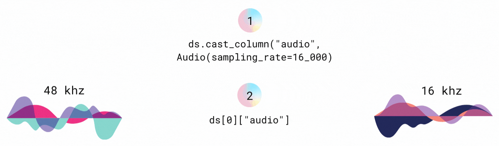

# Process audio data

本指南展示了處理音頻數據集的具體方法。了解如何：

- 重新採樣採樣率。
- 將 `map()` 與音頻數據集結合使用。

## Cast

[`cast_column()`](https://huggingface.co/docs/datasets/v2.14.1/en/package_reference/main_classes#datasets.Dataset.cast_column) 函數用於將列轉換為另一個要解碼的 feature。當將此函數與 [Audio](https://huggingface.co/docs/datasets/v2.14.1/en/package_reference/main_classes#datasets.Audio) feature 一起使用時，您可以重新採樣採樣率：

```python
from datasets import load_dataset, Audio

dataset = load_dataset("PolyAI/minds14", "en-US", split="train")
dataset = dataset.cast_column("audio", Audio(sampling_rate=16000))
```

音頻文件會即時解碼和重新採樣，因此下次訪問樣本時，音頻文件會重新採樣為 16kHz：

```python
print(dataset[0]["audio"])
```

結果:

```bash
{'array': array([ 2.3443763e-05,  2.1729663e-04,  2.2145823e-04, ...,
         3.8356509e-05, -7.3497440e-06, -2.1754686e-05], dtype=float32),
 'path': '/root/.cache/huggingface/datasets/downloads/extracted/f14948e0e84be638dd7943ac36518a4cf3324e8b7aa331c5ab11541518e9368c/en-US~JOINT_ACCOUNT/602ba55abb1e6d0fbce92065.wav',
 'sampling_rate': 16000}
```



## Map

`map()` 函數有助於一次性預處理整個數據集。根據您使用的模型類型，您需要加載 [feature extractor](https://huggingface.co/docs/transformers/model_doc/auto#transformers.AutoFeatureExtractor) 或 [processor](https://huggingface.co/docs/transformers/model_doc/auto#transformers.AutoProcessor)。

1. 對於預訓練的語音識別模型，加載特徵提取器和分詞器並將它們組合在處理器中：

    ```python
    from transformers import AutoTokenizer, AutoFeatureExtractor, AutoProcessor

    model_checkpoint = "facebook/wav2vec2-large-xlsr-53"

    # after defining a vocab.json file you can instantiate a tokenizer object:
    tokenizer = AutoTokenizer("./vocab.json", unk_token="[UNK]", pad_token="[PAD]", word_delimiter_token="|")

    feature_extractor = AutoFeatureExtractor.from_pretrained(model_checkpoint)

    processor = AutoProcessor.from_pretrained(feature_extractor=feature_extractor, tokenizer=tokenizer)
    ```

2. 對於微調的語音識別模型，您只需要加載一個處理器：

    ```python
    from transformers import AutoProcessor

    processor = AutoProcessor.from_pretrained("facebook/wav2vec2-base-960h")
    ```

當您將 `map()` 與預處理函數一起使用時，請包含音頻列以確保您實際上正在重新採樣音頻數據：

```python
def prepare_dataset(batch):
    audio = batch["audio"]
    batch["input_values"] = processor(audio["array"], sampling_rate=audio["sampling_rate"]).input_values[0]
    batch["input_length"] = len(batch["input_values"])
    with processor.as_target_processor():
        batch["labels"] = processor(batch["sentence"]).input_ids
    return batch
    
dataset = dataset.map(prepare_dataset, remove_columns=dataset.column_names)
```