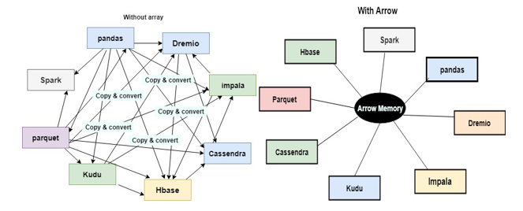
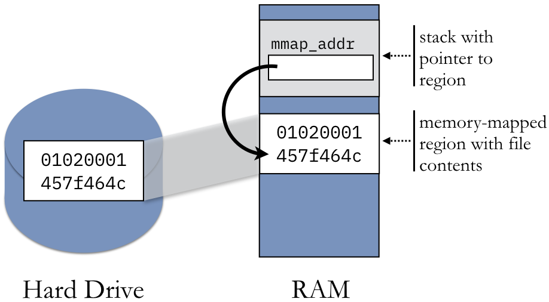
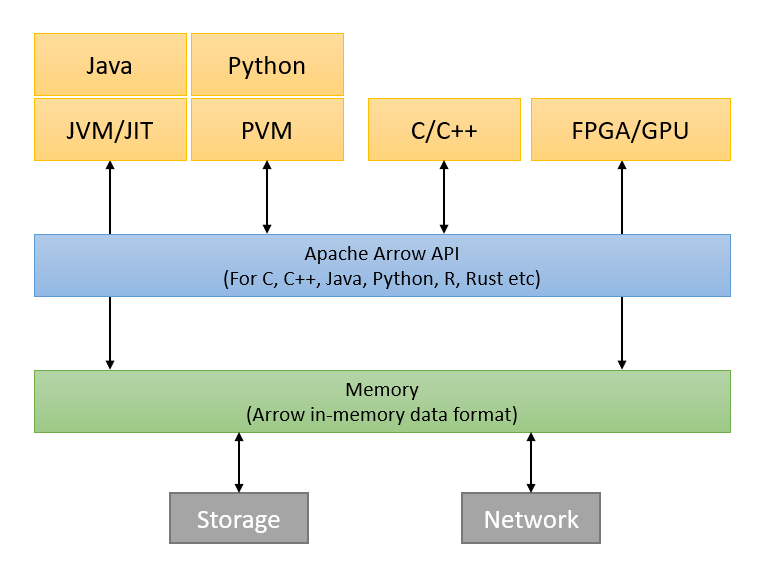

# Datasets 🤝 Arrow

## What is Arrow?

Arrow 可以快速處理和移動大量數據。它是一種以列式(columnar)內存佈局存儲數據的特定數據格式。這提供了幾個顯著的優點：

- Arrow 的標準格式允許 [zero-copy reads](https://en.wikipedia.org/wiki/Zero-copy)，這幾乎消除了所有序列化開銷。
- Arrow 與開發語言無關，因此它支持不同的編程語言。
- Arrow 是面向列(columnar)的，因此查詢和處理數據切片或列的速度更快。
- Arrow 允許無複製地在不同的標準機器學習工具數據格式轉換，例如 NumPy、Pandas、PyTorch 和 TensorFlow。
- Arrow 支持許多（可能是嵌套的）列(columnar)類型。



## Memory-mapping

🤗 數據集使用 Arrow 作為其本地緩存系統。它允許數據集由磁盤緩存支持，該緩存經過內存映射以實現快速查找。這種架構允許在設備內存相對較小的機器上使用大型數據集。





例如，加載完整的英文維基百科數據集只需要幾 MB 的 RAM：

```python
import os; import psutil; import timeit
from datasets import load_dataset

# Process.memory_info is expressed in bytes, so convert to megabytes 
mem_before = psutil.Process(os.getpid()).memory_info().rss / (1024 * 1024)
wiki = load_dataset("wikipedia", "20220301.en", split="train")
mem_after = psutil.Process(os.getpid()).memory_info().rss / (1024 * 1024)

print(f"RAM memory used: {(mem_after - mem_before)} MB")
```

這是可能的，因為 Arrow 數據實際上是從磁盤進行內存映射，而不是加載到內存中。內存映射允許訪問磁盤上的數據，並利用虛擬內存功能進行快速查找。

## Performance

使用 Arrow 迭代內存映射數據集速度很快。在筆記本電腦上迭代 Wikipedia 可為您提供 1-3 Gbit/s 的速度：

```python
s = """batch_size = 1000
for batch in wiki.iter(batch_size):
    ...
"""

time = timeit.timeit(stmt=s, number=1, globals=globals())

print(f"Time to iterate over the {wiki.dataset_size >> 30} GB dataset: {time:.1f} sec, "
      f"ie. {float(wiki.dataset_size >> 27)/time:.1f} Gb/s")
```