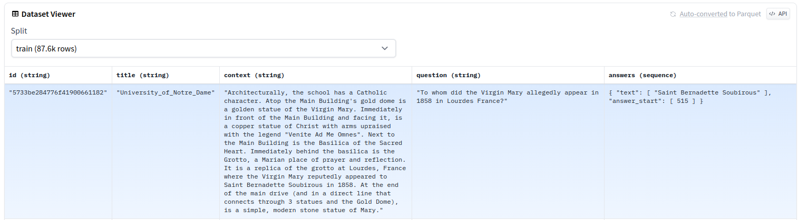

# Dataset features

特徵(features)定義了數據集的內部結構。它用於指定底層序列化格式。但對您來說更有趣的是，[Features](https://huggingface.co/docs/datasets/v2.14.1/en/package_reference/main_classes#datasets.Features) 包含從列名和類型到 [ClassLabel](https://huggingface.co/docs/datasets/v2.14.1/en/package_reference/main_classes#datasets.ClassLabel) 等所有內容的詳細信息。您可以將　[Features](https://huggingface.co/docs/datasets/v2.14.1/en/package_reference/main_classes#datasets.Features)　視為數據集的支柱。

[Features](https://huggingface.co/docs/datasets/v2.14.1/en/package_reference/main_classes#datasets.Features)的格式很簡單：`dict[column_name, column_type]`。它是列名和列數據類型鍵值對的字典物件。列數據類型(column type)提供了廣泛的選項來讓你描述您擁有的數據類型。

??? info "class datasets.Features"

    定義 dataset 內部結構的特殊字典。

    使用 `dict[str, FieldType]` 類型的字典實例化，其中 **鍵** 是所需的列名稱，**值** 是該列的類型。

    `FieldType` 可以是以下之一：

    - [`Value`](https://huggingface.co/docs/datasets/v2.14.1/en/package_reference/main_classes#datasets.Value) feature 指定單個類型的值，例如 `int64` 或 `string`。
    - [`ClassLabel`](https://huggingface.co/docs/datasets/v2.14.1/en/package_reference/main_classes#datasets.ClassLabel) feature 指定具有一組預定義類別的欄位，這些類可以具有與其關聯的標籤，並將作為整數存儲在數據集中。
    - 一個 python `dict`，指定該欄位是一個嵌套欄位，包含子欄位到子欄位特徵的映射。可以以任意方式擁有嵌套欄位的嵌套欄位。
    - python `list` 或 [`Sequence`](https://huggingface.co/docs/datasets/v2.14.1/en/package_reference/main_classes#datasets.Sequence) 指定該欄位包含 object 列表。Python `list` 或 `Sequence` 應提供單個 sub-feature，作為此列表中託管的功能類型的示例。
    - 多維數組的 [`Array2D`](https://huggingface.co/docs/datasets/v2.14.1/en/package_reference/main_classes#datasets.Array2D)、[`Array3D`](https://huggingface.co/docs/datasets/v2.14.1/en/package_reference/main_classes#datasets.Array3D)、[`Array4D`](https://huggingface.co/docs/datasets/v2.14.1/en/package_reference/main_classes#datasets.Array4D) 或 [`Array5D`](https://huggingface.co/docs/datasets/v2.14.1/en/package_reference/main_classes#datasets.Array5D) feature。
    - [`Audio`](https://huggingface.co/docs/datasets/v2.14.1/en/package_reference/main_classes#datasets.Audio) feature，用於存儲音頻文件的絕對路徑或字典以及音頻文件的相對路徑（“path” 鍵）及其字節內容（“bytes” 鍵）。此功能提取音頻數據。
    - [`Image`](https://huggingface.co/docs/datasets/v2.14.1/en/package_reference/main_classes#datasets.Image) feature，用於存儲圖像文件的絕對路徑、`np.ndarray` 物件、`PIL.Image.Image` 物件或圖像文件相對路徑（“path” 鍵）及其字節內容（“bytes” 鍵）。此功能提取圖像數據。
    - [Translation](https://huggingface.co/docs/datasets/v2.14.1/en/package_reference/main_classes#datasets.Translation) 和 [TranslationVariableLanguages](https://huggingface.co/docs/datasets/v2.14.1/en/package_reference/main_classes#datasets.TranslationVariableLanguages)，這是機器翻譯特有的兩個 features。


我們來看看 [GLUE](https://huggingface.co/datasets/glue) 基準測試中的 MRPC 數據集的 features：

```python
from datasets import load_dataset

dataset = load_dataset('glue', 'mrpc', split='train')

print(dataset.features)
```

結果:

```bash
{'idx': Value(dtype='int32', id=None),
 'label': ClassLabel(num_classes=2, names=['not_equivalent', 'equivalent'], names_file=None, id=None),
 'sentence1': Value(dtype='string', id=None),
 'sentence2': Value(dtype='string', id=None),
}
```

[Value](https://huggingface.co/docs/datasets/v2.14.1/en/package_reference/main_classes#datasets.Value) 特徵告訴 🤗 數據集：

- `idx` 數據類型為 `int32`
- `Sentence1` 和 `Sentence2` 數據類型是 `string`。

🤗 數據集支持許多其他數據類型，例如 bool、float32 和 binary 等。

??? info "class datasets.Value"

    可用來定義 Value 的 `dtypes` 列表如下：

    - `null`
    - `bool`
    - `int8`
    - `int16`
    - `int32`
    - `int64`
    - `uint8`
    - `uint16`
    - `uint32`
    - `uint64`
    - `float16`
    - `float32 (alias float)`
    - `float64 (alias double)`
    - `time32[(s|ms)]`
    - `time64[(us|ns)]`
    - `timestamp[(s|ms|us|ns)]`
    - `timestamp[(s|ms|us|ns), tz=(tzstring)]`
    - `date32`
    - `date64`
    - `duration[(s|ms|us|ns)]`
    - `decimal128(precision, scale)`
    - `decimal256(precision, scale)`
    - `binary`
    - `large_binary`
    - `string`
    - `large_string`

    範例:

    ```python
    from datasets import Features

    features = Features({'stars': Value(dtype='int32')})

    print(features)
    ```

    結果:

    ```bash
    {'stars': Value(dtype='int32', id=None)}
    ```

[ClassLabel](https://huggingface.co/docs/datasets/v2.14.1/en/package_reference/main_classes#datasets.ClassLabel) feature 代表 🤗 數據集 `label` 列包含兩個類別(category)。這些類別被標記為 `not_equivalent` 和 `equivalent`。`Labels` 以整數形式存儲在數據集中。當您檢索 `label` 時，[`ClassLabel.int2str()`](https://huggingface.co/docs/datasets/v2.14.1/en/package_reference/main_classes#datasets.ClassLabel.int2str) 和 [`ClassLabel.str2int()`](https://huggingface.co/docs/datasets/v2.14.1/en/package_reference/main_classes#datasets.ClassLabel.str2int) 執行從整數值到標籤名稱的轉換，反之亦然。

如果您的數據類型包含物件列表(list of objects)，那麼您需要使用 [Sequence](https://huggingface.co/docs/datasets/v2.14.1/en/package_reference/main_classes#datasets.Sequence) feature。還記得 [SQuAD](https://huggingface.co/datasets/squad) 數據集嗎？

```python
from datasets import load_dataset

dataset = load_dataset('squad', split='train')

print(dataset.features)
```

結果:

```bash
{'answers': Sequence(feature={'text': Value(dtype='string', id=None), 'answer_start': Value(dtype='int32', id=None)}, length=-1, id=None),
'context': Value(dtype='string', id=None),
'id': Value(dtype='string', id=None),
'question': Value(dtype='string', id=None),
'title': Value(dtype='string', id=None)}
```



`answers` 欄位是使用 `Sequence` feature 來構建的，因為它包含兩個子欄位：`text` 和 `answer_start`，它們分別是 `string` 和 `int32` 的列表。

`array` feature 類型對於創建各種大小的陣列非常有用。您可以使用 [Array2D](https://huggingface.co/docs/datasets/v2.14.1/en/package_reference/main_classes#datasets.Array2D) 創建二維陣列，甚至使用 [Array5D](https://huggingface.co/docs/datasets/v2.14.1/en/package_reference/main_classes#datasets.Array5D) 創建五維陣列。

```python
features = Features({'a': Array2D(shape=(1, 3), dtype='int32')})
```

`array` feature 類型還允許陣例的第一維是動態的。這對於處理可變長度的序列（例如句子）非常有用，而無需將輸入填充或截斷為統一的形狀。

```python
features = Features({'a': Array3D(shape=(None, 5, 2), dtype='int32')})
```

## Audio feature

音頻數據集有一個類型為 [Audio](https://huggingface.co/docs/datasets/v2.14.1/en/package_reference/main_classes#datasets.Audio) 的列，其中包含三個重要欄位：

- `array`：解碼後的音頻數據，表示為 1-dimensional array。
- `path`：下載的音頻文件的路徑。
- `sample_rate`：音頻數據的採樣率。

當您加載音頻數據集並調用音頻列時，音頻功能會自動對音頻文件進行解碼和重新採樣：

```python
from datasets import load_dataset, Audio

dataset = load_dataset("PolyAI/minds14", "en-US", split="train")

print(dataset[0]["audio"])
```

結果:

```bash
{'array': array([ 0.        ,  0.00024414, -0.00024414, ..., -0.00024414,
         0.        ,  0.        ], dtype=float32),
 'path': '/root/.cache/huggingface/datasets/downloads/extracted/f14948e0e84be638dd7943ac36518a4cf3324e8b7aa331c5ab11541518e9368c/en-US~JOINT_ACCOUNT/602ba55abb1e6d0fbce92065.wav',
 'sampling_rate': 8000}
```

!!! warning
    首先使用行索引，然後使用音頻列對音頻數據集進行索引 - `dataset[0]["audio"]` - 以避免對數據集中的所有音頻文件進行解碼和重新採樣。否則，如果您有大量數據集，這可能是一個緩慢且耗時的過程。

當 `decode=False` 時，音頻類型只是為您提供音頻文件的路徑或字節，而不將其解碼為陣列，

```python
dataset = load_dataset("PolyAI/minds14", "en-US", split="train").cast_column("audio", Audio(decode=False))

print(dataset[0])
```

結果:

```bash
{'audio': {'bytes': None,
  'path': '/root/.cache/huggingface/datasets/downloads/extracted/f14948e0e84be638dd7943ac36518a4cf3324e8b7aa331c5ab11541518e9368c/en-US~JOINT_ACCOUNT/602ba55abb1e6d0fbce92065.wav'},
 'english_transcription': 'I would like to set up a joint account with my partner',
 'intent_class': 11,
 'lang_id': 4,
 'path': '/root/.cache/huggingface/datasets/downloads/extracted/f14948e0e84be638dd7943ac36518a4cf3324e8b7aa331c5ab11541518e9368c/en-US~JOINT_ACCOUNT/602ba55abb1e6d0fbce92065.wav',
 'transcription': 'I would like to set up a joint account with my partner'}
```

## Image feature

Image datasets 有一個 [`Image`](https://huggingface.co/docs/datasets/v2.14.1/en/package_reference/main_classes#datasets.Image) 類型的列，它從存儲為字節的圖像中加載 `PIL.Image` 物件：

當您加載 image dataset 並調用 image column 時，`Image` feature 會自動解碼圖像文件：

```python
from datasets import load_dataset, Image

dataset = load_dataset("beans", split="train")

print(dataset[0]["image"])
```

結果:

```bash
<PIL.JpegImagePlugin.JpegImageFile image mode=RGB size=500x500 at 0x125506CF8>
```

!!! warning
    首先使用行索引，然後使用圖像列對圖像數據集進行索引 - `dataset[0]["image"]` - 以避免解碼數據集中的所有圖像文件。否則，如果您有大量數據集，這可能是一個緩慢且耗時的過程。

當 `decode=False` 時，`Image` feature 只為您提供圖像文件的路徑或字節，而不將其解碼為 `PIL.Image`，

```python
dataset = load_dataset("beans", split="train").cast_column("image", Image(decode=False))

dataset[0]["image"]
```

結果:

```bash
{'bytes': None,
 'path': '/Users/username/.cache/huggingface/datasets/downloads/extracted/772e7c1fba622cff102b85dd74bcce46e8168634df4eaade7bedd3b8d91d3cd7/train/healthy/healthy_train.265.jpg'}
```

根據數據集，您可能會獲取本地下載圖像的路徑，或者如果數據集不是由單個文件組成，則可能會獲取以字節為單位的圖像內容。

您還可以從 `numpy arrays` 定義圖像數據集：

```python
ds = Dataset.from_dict({"i": [np.zeros(shape=(16, 16, 3), dtype=np.uint8)]}, features=Features({"i": Image()}))
```

在這種情況下，numpy array 被編碼為 `PNG`（如果像素值精度很重要，則編碼為 `TIFF`）。

對於 `RGB` 或 `RGBA` 等多通道數組，僅支持 `uint8`。如果使用更大的精度，則會收到警告，並且數組會向下轉換為 `uint8`。對於灰度圖像，您可以使用所需的整數或浮點精度，只要它與 `Pillow` 兼容即可。如果圖像整數或浮點精度太高，則會顯示警告，在這種情況下，數組會向下轉換：`int64` 數組向下轉換為 `int32`，`float64` 數組向下轉換為 `float32`。