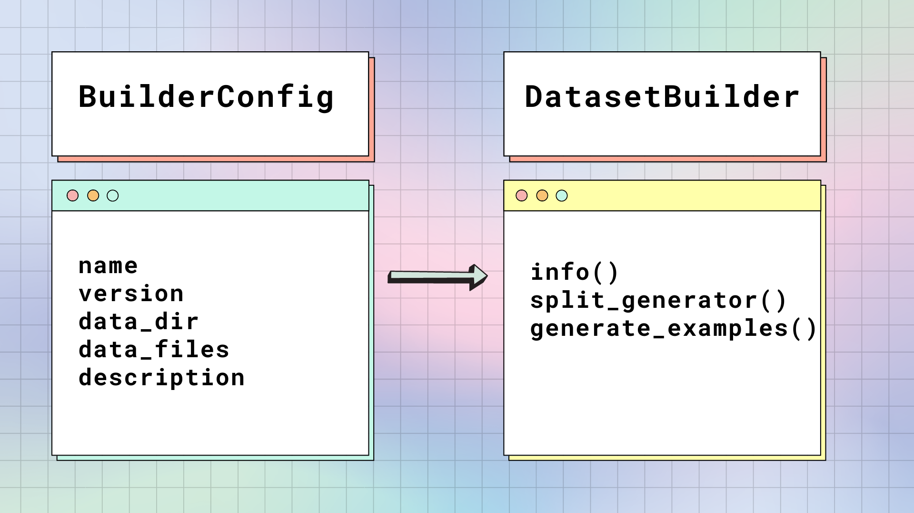
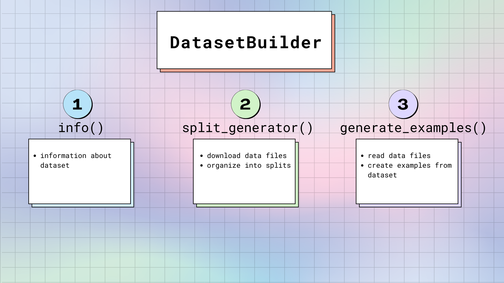

# 構建並加載

幾乎每個深度學習工作流程都從加載 datasets 開始，這使其成為最重要的步驟之一。 🤗 數據集提供了超過 900 個數據集，可幫助您開始 NLP 任務。您所要做的就是調用：`load_dataset()` 來邁出第一步。從任何意義上講，該函數都是真正的主力，因為它構建並加載您使用的每個數據集。

## `load_dataset`

一個 `dataset` 是包含以下內容的目錄：

- 一些通用格式的數據文件（JSON、CSV、Parquet、文本等）
- 名為 `README.md` 的數據集訊息卡，其中包含有關數據集的文檔以及用於定義數據集標籤和配置的 YAML 標頭
- 可選的 dataset script（如果需要一些程式碼來讀取數據文件）。這有時用於加載特定格式和結構的文件。

`load_dataset()` 函數在本地或從 Hugging Face Hub 獲取請求的數據集。Hugging Face Hub 是一個中央存儲庫，其中存儲了所有 Hugging Face 數據集和模型。

如果數據集僅包含數據文件，則 `load_dataset()` 會自動推斷如何從擴展名（json、csv、parquet、txt 等）加載數據文件。在底層，🤗 數據集將根據數據文件格式使用適當的 [DatasetBuilder](https://huggingface.co/docs/datasets/v2.14.1/en/package_reference/builder_classes#datasets.DatasetBuilder)。 🤗 數據集中每種數據文件格式都存在一個構建器。

🤗 數據集中每種數據文件格式都存在一個構建器：

- [`datasets.packaged_modules.text.Text`](https://huggingface.co/docs/datasets/v2.14.1/en/package_reference/loading_methods#datasets.packaged_modules.text.Text) 對應到 text
- [`datasets.packaged_modules.csv.Csv`](https://huggingface.co/docs/datasets/v2.14.1/en/package_reference/loading_methods#datasets.packaged_modules.csv.Csv) 對應到 CSV 與 TSV
- [`datasets.packaged_modules.json.Json`](https://huggingface.co/docs/datasets/v2.14.1/en/package_reference/loading_methods#datasets.packaged_modules.json.Json) 對應到 JSON 與 JSONL
- [`datasets.packaged_modules.parquet.Parquet`](https://huggingface.co/docs/datasets/v2.14.1/en/package_reference/loading_methods#datasets.packaged_modules.parquet.Parquet) 對應到 Parquet
- [`datasets.packaged_modules.arrow.Arrow`](https://huggingface.co/docs/datasets/v2.14.1/en/package_reference/loading_methods#datasets.packaged_modules.arrow.Arrow) 對應到 Arrow (streaming file format)
- [`datasets.packaged_modules.sql.Sql`](https://huggingface.co/docs/datasets/v2.14.1/en/package_reference/loading_methods#datasets.packaged_modules.sql.Sql) 對應到 SQL databases
- [`datasets.packaged_modules.imagefolder.ImageFolder`](https://huggingface.co/docs/datasets/v2.14.1/en/package_reference/loading_methods#datasets.packaged_modules.imagefolder.ImageFolder) 對應到 image folders
- [`datasets.packaged_modules.audiofolder.AudioFolder`](https://huggingface.co/docs/datasets/v2.14.1/en/package_reference/loading_methods#datasets.packaged_modules.audiofolder.AudioFolder) 對應到 audio folders

如果數據集有 `dataset script`，則會從 Hugging Face Hub 下載並導入它。數據集腳本中的程式碼定義了一個自定義的 [`DatasetBuilder`](https://huggingface.co/docs/datasets/v2.14.1/en/package_reference/builder_classes#datasets.DatasetBuilder) 數據集信息（描述、功能、原始文件的 URL 等），並告訴 🤗 數據集如何生成和顯示樣本。

🤗 Datasets 從原始 URL 下載數據集文件，生成數據集並將其緩存在驅動器上的 Arrow 表中。如果您之前下載過數據集，那麼🤗 Datasets 會從緩存中重新加載它，省去您再次下載的麻煩。

現在您已經對數據集的構建方式有了較高的了解，讓我們仔細看看這一切的工作原理。

## 構建一個 dataset

當您第一次加載數據集時，🤗 數據集會獲取原始數據文件並將其構建為行和類型列的表。有兩個主要類別負責構建數據集：[BuilderConfig](https://huggingface.co/docs/datasets/v2.14.1/en/package_reference/builder_classes#datasets.BuilderConfig) 和 [DatasetBuilder](https://huggingface.co/docs/datasets/v2.14.1/en/package_reference/builder_classes#datasets.DatasetBuilder)。

###　BuilderConfig

[BuilderConfig](https://huggingface.co/docs/datasets/v2.14.1/en/package_reference/builder_classes#datasets.BuilderConfig) 是 [DatasetBuilder](https://huggingface.co/docs/datasets/v2.14.1/en/package_reference/builder_classes#datasets.DatasetBuilder) 的配置類。 `BuilderConfig` 包含有關數據集的以下基本屬性：

|Attribute	|Description|
|-----------|-----------|
|`name`	|數據集的簡稱。|
|`version`	|數據集版本標識符。|
|`data_dir`	|存儲包含數據文件的本地文件夾的路徑。|
|`data_files`	|存儲本地數據文件的路徑。|
|`description`	|數據集的描述。|

如果要向數據集添加其他屬性（例如類別標籤），可以對 `BuilderConfig` base class 進行 subclass。有兩種方法可以擴充 `BuilderConfig` class 或 subclass 的屬性：

- 在數據集 `DatasetBuilder.BUILDER_CONFIGS()` 屬性中提供預定義 `BuilderConfig` class（或 sub-class）實例的列表。
- 當您調用 `load_dataset()` 時，任何非特定於該方法的關鍵字參數都將用於設置 `BuilderConfig` class 的關聯屬性。如果選擇了特定配置，這將覆蓋預定義的屬性。

您還可以將 `DatasetBuilder.BUILDER_CONFIG_CLASS` 設置為 `BuilderConfig` 的任何自定義子類。

### DatasetBuilder

[DatasetBuilder](https://huggingface.co/docs/datasets/v2.14.1/en/package_reference/builder_classes#datasets.DatasetBuilder) 訪問 [BuilderConfig](https://huggingface.co/docs/datasets/v2.14.1/en/package_reference/builder_classes#datasets.BuilderConfig) 中的所有屬性來構建實際的數據集。

[`DatasetBuilder`](https://huggingface.co/docs/datasets/v2.14.1/en/package_reference/builder_classes#datasets.DatasetBuilder) 中主要有3個方法：

1. `DatasetBuilder._info()` 負責定義數據集屬性。當您調用 `dataset.info` 時，🤗 Datasets 返回此處存儲的信息。同樣，此處也指定了功能。請記住，特徵就像數據集的骨架。它提供每列的名稱和類型。

2. `DatasetBuilder._split_generator` 下載或檢索請求的數據文件，將它們組織成片段，並定義生成過程的特定參數。

    此方法有一個 [DownloadManager](https://huggingface.co/docs/datasets/v2.14.1/en/package_reference/builder_classes#datasets.DownloadManager)，可以下載文件或從本地文件系統獲取文件。
    
    在 `DownloadManager` 中，有一個 `DownloadManager.download_and_extract()` 方法，它接受原始數據文件的 URL 字典，並下載所請求的文件。接受的輸入包括：單個 URL 或路徑，或者 URL 或路徑的列表/字典。任何壓縮文件類型（例如 TAR、GZIP 和 ZIP 存檔）都會自動解壓。

    下載文件後，[`SplitGenerator`](https://huggingface.co/docs/datasets/v2.14.1/en/package_reference/builder_classes#datasets.SplitGenerator) 將它們組織成多個片段。`SplitGenerator` 包含拆分的名稱以及提供給 `DatasetBuilder._generate_examples` 方法的任何關鍵字參數。關鍵字參數可以特定於每個分割，並且通常至少包括每個分割的數據文件的本地路徑。

    !!! info
        `DownloadManager.download_and_extract()` 可以從各種來源下載文件。如果數據文件託管在特殊的訪問服務器上，則應使用 `DownloadManger.download_custom`。有關更多詳細信息，請參閱 [`DownloadManager`](https://huggingface.co/docs/datasets/v2.14.1/en/package_reference/builder_classes#datasets.DownloadManager) 的參考。

3. `DatasetBuilder._generate_examples` 讀取並解析數據文件以進行拆分。然後它根據 `DatasetBuilder._info()` 的 **feature** 中指定的格式生成數據集樣本。`DatasetBuilder._generate_examples` 的輸入實際上是最後一個方法的關鍵字參數中提供的文件路徑。

    數據集是使用 Python generator 生成的，它不會加載內存中的所有數據。因此，generator 可以處理大型數據集。但是，在將生成的樣本刷新到磁盤上的數據集文件之前，它們會存儲在 ArrowWriter 緩衝區中。這意味著生成的樣本是批量寫入的。如果您的數據集樣本消耗大量內存（圖像或視頻），請確保在 `DatasetBuilder` 中為 `DEFAULT_WRITER_BATCH_SIZE` 屬性指定較低的值。我們建議大小不要超過 200 MB。

## 保持完整

為了確保數據集完整，`load_dataset()` 將對下載的文件執行一系列測試，以確保所有內容都存在。這樣，當您請求的數據集未按預期生成時，您就不會遇到任何意外。 `load_dataset()` 驗證：

- 生成的 `DatasetDict` 中的拆分數量
- 生成的 `DatasetDict`` 的每個分割中的樣本數
- 下載文件的列表
- 下載文件的 SHA256 校驗

如果數據集未通過驗證，則很可能數據集的原始主機對數據文件進行了一些更改。

## 安全

Hub 上的數據集存儲庫會被掃描是否存在惡意軟件，請在此處查看更多信息。

此外，沒有命名空間的數據集（最初貢獻在我們的 GitHub 存儲庫上）都已經過我們的維護人員的審查。這些數據集的代碼被認為是安全的。它涉及不在命名空間下的數據集，例如 “squad” 或 “glue”，與其他名為 “username/dataset_name” 或 “org/dataset_name” 的數據集不同。