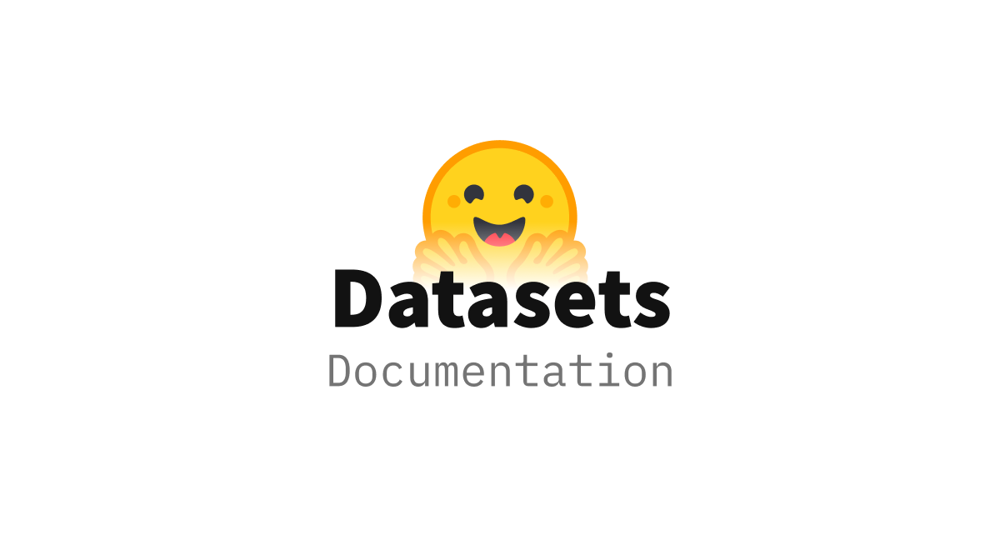

# Datasets

Huggingface Datasets 是一個用於輕鬆訪問和共享音頻、計算機視覺和自然語言處理 (NLP) 任務數據集的套件。

只需一行程式碼即可加載數據集，並使用它強大的數據處理方法快速讓您的數據集準備好在深度學習模型中進行訓練。在 [Apache Arrow](https://arrow.apache.org/) 格式的支持下，通過零拷貝讀取處理大型數據集，沒有任何內存限制，并獲得最佳速度和效率。它還可與 [Hugging Face Hub](https://huggingface.co/datasets) 進行深度集成，讓您可以輕鬆加載數據集並與更廣泛的機器學習社區共享數據集。

