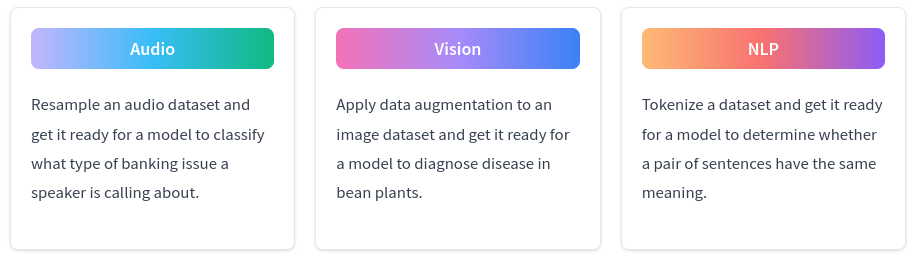

# Quickstart

本快速入門適用於準備深入研究程式碼並查看如何將 🤗 數據集集成到模型訓練工作流程中的範例的開發人員。如果您是初學者，我們建議您從 Huggingface 的教程開始，您將獲得更全面的介紹。

每個數據集都是唯一的，並且根據任務的不同，某些數據集可能需要額外的步驟來準備訓練。但您始終可以使用 🤗 數據集工具來加載和處理數據集。最快、最簡單的入門方法是從 Hugging Face Hub 加載現有數據集。有數千個數據集可供選擇，涵蓋許多任務。選擇您想要使用的數據集類型，然後開始吧！



首先安裝🤗數據集套件：

```bash
pip install datasets
```

要使用音頻數據集，請安裝額外 `Audio`功能：

```bash
pip install datasets[audio]
```

要使用圖像數據集，請安裝額外 `Image` 功能：

```bash
pip install datasets[vision]
```

## Audio

音頻數據集的加載方式與文本數據集一樣。然而，音頻數據集的預處理有點不同。您需要一個 **特徵提取器**，而不是 **分詞器**。音頻輸入可能還需要重新採樣其採樣率，以匹配您正在使用的預訓練模型的採樣率。在本快速入門中，您將準備 [MInDS-14](https://huggingface.co/datasets/PolyAI/minds14) 數據集用於模型訓練並對客戶遇到的銀行問題進行分類。

1. 通過向 `load_dataset()` 函數提供數據集名稱、數據集配置（並非所有數據集都有配置）和數據集拆分來加載 MInDS-14 數據集：

    ```python
    from datasets import load_dataset, Audio

    dataset = load_dataset("PolyAI/minds14", "en-US", split="train")
    ```

2. 接下來，從 🤗 Transformers 套件加載預訓練的 [Wav2Vec2](https://huggingface.co/facebook/wav2vec2-base) 模型及其相應的特徵提取器。加載模型後看到有關某些權重未初始化的警告是完全正常的。這是預期的，因為您正在加載此模型 check-point 以用於另一任務的訓練。

    ```python
    from transformers import AutoModelForAudioClassification, AutoFeatureExtractor

    model = AutoModelForAudioClassification.from_pretrained("facebook/wav2vec2-base")
    feature_extractor = AutoFeatureExtractor.from_pretrained("facebook/wav2vec2-base")
    ```

3. [MInDS-14](https://huggingface.co/datasets/PolyAI/minds14) 數據集資訊顯示採樣率為 8kHz，但 Wav2Vec2 模型是在 16kHZ 採樣率上預訓練的。您需要使用`cast_column()` 函數和音頻功能對音頻列進行上採樣，以匹配模型的採樣率。

    ```python
    dataset = dataset.cast_column("audio", Audio(sampling_rate=16000))
    dataset[0]["audio"]
    ```

    結果:

    ```
    {'array': array([ 2.3443763e-05,  2.1729663e-04,  2.2145823e-04, ...,
            3.8356509e-05, -7.3497440e-06, -2.1754686e-05], dtype=float32),
    'path': '/root/.cache/huggingface/datasets/downloads/extracted/f14948e0e84be638dd7943ac36518a4cf3324e8b7aa331c5ab11541518e9368c/en-US~JOINT_ACCOUNT/602ba55abb1e6d0fbce92065.wav',
    'sampling_rate': 16000}
    ```

4. 創建一個函數來使用特徵提取器預處理音頻數組，並將序列截斷並填充為整齊的矩形張量。要記住的最重要的事情是在特徵提取器中調用音頻數組，因為該數組（實際的語音信號）是模型輸入。

    擁有預處理函數後，可以使用 `map()` 函數將該函數應用於數據集中的批量數據來加快處理速度。

    ```python
    def preprocess_function(examples):
        audio_arrays = [x["array"] for x in examples["audio"]]
        inputs = feature_extractor(
            audio_arrays,
            sampling_rate=16000,
            padding=True,
            max_length=100000,
            truncation=True,
        )
        return inputs

    dataset = dataset.map(preprocess_function, batched=True)
    ```

5. 使用 `rename_column()` 函數將 `intent_class` 列重命名為 `labels`，這是 **Wav2Vec2ForSequenceClassification** 中預期的輸入名稱：

    ```python
    dataset = dataset.rename_column("intent_class", "labels")
    ```

6. 根據您使用的機器學習框架設置數據集格式。

    ??? info "Pytorch"

        使用 `set_format()` 函數將數據集格式設置為 `torch` 並指定要設置格式的列。此函數即時應用格式。轉換為 PyTorch 張量後，將數據集包裝在 `torch.utils.data.DataLoader` 中：

        ```python
        from torch.utils.data import DataLoader

        dataset.set_format(type="torch", columns=["input_values", "labels"])
        dataloader = DataLoader(dataset, batch_size=4)
        ```

    ??? info "Tensorflow"

        使用 `to_tf_dataset()` 函數設置數據集格式以與 TensorFlow 兼容。您還需要從 🤗 Transformers 導入數據整理器，以將不同的序列長度組合成一批相同長度的：

        ```python
        import tensorflow as tf

        tf_dataset = dataset.to_tf_dataset(
            columns=["input_values"],
            label_cols=["labels"],
            batch_size=4,
            shuffle=True)
        ```

7. 開始使用機器學習框架進行訓練！查看 🤗 Transformers [audio classification guide](https://huggingface.co/docs/transformers/tasks/audio_classification)，了解如何在音頻數據集上訓練模型的端到端示例。

## Vision

圖像數據集的加載就像文本數據集一樣。但是，您需要一個 **feature extractor** 來預處理數據集，而不是標記器。將數據增強應用於圖像在計算機視覺中很常見，以使模型更穩健地防止過度擬合。您可以自由使用任何您想要的數據增強庫，然後您可以通過🤗 數據集應用增強。在本快速入門中，您將加載 [Beans 數據集](https://huggingface.co/datasets/beans)並準備好讓模型訓練並從葉子圖像中識別疾病。

1. 通過向`load_dataset()` 函數提供數據集名稱和數據集拆分來加載 Beans 數據集：

    ```python
    from datasets import load_dataset, Image

    dataset = load_dataset("beans", split="train")
    ```

2. 現在您可以使用您喜歡的任何套件（[Albumentations](https://albumentations.ai/)、[imgaug](https://imgaug.readthedocs.io/en/latest/)、[Kornia](https://kornia.readthedocs.io/en/latest/）來添加一些數據增強。在這裡，您將使用 [torchvision](https://pytorch.org/vision/stable/transforms.html) 隨機更改圖像的顏色屬性：

    ```python
    from torchvision.transforms import Compose, ColorJitter, ToTensor

    jitter = Compose(
        [ColorJitter(brightness=0.5, hue=0.5), ToTensor()]
    )
    ```

3. 創建一個函數以將變換應用到數據集並生成模型輸入：`pixel_values`。

    ```python
    def transforms(examples):
        examples["pixel_values"] = [jitter(image.convert("RGB")) for image in examples["image"]]
        return examples
    ```

4. 使用 `with_transform()` 函數即時應用數據增強：

    ```python
    dataset = dataset.with_transform(transforms)
    ```

5. 根據您使用的機器學習框架設置數據集格式。

    ??? info "Pytorch"

        將數據集包裝在 `torch.utils.data.DataLoader` 中。您還需要創建一個整理函數來將樣本整理成批次：

        ```python
        from torch.utils.data import DataLoader

        def collate_fn(examples):
            images = []
            labels = []
            for example in examples:
                images.append((example["pixel_values"]))
                labels.append(example["labels"])
                
            pixel_values = torch.stack(images)
            labels = torch.tensor(labels)
            return {"pixel_values": pixel_values, "labels": labels}

        dataloader = DataLoader(dataset, collate_fn=collate_fn, batch_size=4)
        ```

6. 開始使用機器學習框架進行訓練！查看 🤗 Transformers [image classification guide](https://huggingface.co/docs/transformers/tasks/image_classification)，了解如何在圖像數據集上訓練模型的端到端示例。

## NLP

文本需要由分詞器分詞為單獨的分詞。在快速入門中，您將加載 [Microsoft Research Paraphrase Corpus (MRPC)](https://huggingface.co/datasets/glue/viewer/mrpc) 訓練數據集來訓練模型，以確定一對句子是否表示相同的意思。

1. 通過向 `load_dataset()` 函數提供數據集名稱、數據集配置（並非所有數據集都有配置）和數據集分割來加載 MRPC 數據集：

    ```python
    from datasets import load_dataset

    dataset = load_dataset("glue", "mrpc", split="train")
    ```

2. 接下來，從 🤗 Transformers 套件加載預訓練的 [BERT](https://huggingface.co/bert-base-uncased) 模型及其相應的分詞器。加載模型後看到有關某些權重未初始化的警告是完全正常的。這是預期的，因為您正在加載此模型 check-point 以用於另一任務的訓練。

    ??? info "Pytorch"

        ```python
        from transformers import AutoModelForSequenceClassification, AutoTokenizer

        model = AutoModelForSequenceClassification.from_pretrained("bert-base-uncased")
        tokenizer = AutoTokenizer.from_pretrained("bert-base-uncased")
        ```

    ??? info "Tensorflow"

        ```python
        from transformers import TFAutoModelForSequenceClassification, AutoTokenizer

        model = TFAutoModelForSequenceClassification.from_pretrained("bert-base-uncased")
        tokenizer = AutoTokenizer.from_pretrained("bert-base-uncased")    
        ```

3. 創建一個函數來標記數據集，您還應該將文本截斷並填充為整齊的矩形張量。分詞器在數據集中生成三個新列：`input_ids`、`token_type_ids` 和 `attention_mask`。這些是模型輸入。

    使用 `map()` 函數通過將標記化函數應用於數據集中的批量示例來加快處理速度：

    ```python
    def encode(examples):
        return tokenizer(examples["sentence1"], examples["sentence2"], truncation=True, padding="max_length")

    dataset = dataset.map(encode, batched=True)

    dataset[0]
    ```

    結果:

    ```bash
    {'sentence1': 'Amrozi accused his brother , whom he called " the witness " , of deliberately distorting his evidence .',
    'sentence2': 'Referring to him as only " the witness " , Amrozi accused his brother of deliberately distorting his evidence .',
    'label': 1,
    'idx': 0,
    'input_ids': array([  101,  7277,  2180,  5303,  4806,  1117,  1711,   117,  2292, 1119,  1270,   107,  1103,  7737,   107,   117,  1104,  9938, 4267, 12223, 21811,  1117,  2554,   119,   102, 11336,  6732, 3384,  1106,  1140,  1112,  1178,   107,  1103,  7737,   107, 117,  7277,  2180,  5303,  4806,  1117,  1711,  1104,  9938, 4267, 12223, 21811,  1117,  2554,   119,   102]),
    'token_type_ids': array([0, 0, 0, 0, 0, 0, 0, 0, 0, 0, 0, 0, 0, 0, 0, 0, 0, 0, 0, 0, 0, 0, 0, 0, 0, 1, 1, 1, 1, 1, 1, 1, 1, 1, 1, 1, 1, 1, 1, 1, 1, 1, 1, 1, 1, 1, 1, 1, 1, 1, 1, 1]),
    'attention_mask': array([1, 1, 1, 1, 1, 1, 1, 1, 1, 1, 1, 1, 1, 1, 1, 1, 1, 1, 1, 1, 1, 1, 1, 1, 1, 1, 1, 1, 1, 1, 1, 1, 1, 1, 1, 1, 1, 1, 1, 1, 1, 1, 1, 1, 1, 1, 1, 1, 1, 1, 1, 1])}
    ```

4. 將標籤列重命名為 `labels`，這是 [BertForSequenceClassification](https://huggingface.co/docs/transformers/main/en/model_doc/bert#transformers.BertForSequenceClassification) 中預期的輸入名稱：

    ```python
    dataset = dataset.map(lambda examples: {"labels": examples["label"]}, batched=True)
    ```

5. 根據您使用的機器學習框架設置數據集格式。

    ??? info "Pytorch"

        使用 `set_format()` 函數將數據集格式設置為 `torch` 並指定要設置格式的列。此函數即時應用格式。轉換為 PyTorch 張量後，將數據集包裝在 `torch.utils.data.DataLoader` 中：

        ```python
        import torch

        dataset.set_format(type="torch", columns=["input_ids", "token_type_ids", "attention_mask", "labels"])
        dataloader = torch.utils.data.DataLoader(dataset, batch_size=32)    
        ```

    ??? info "Tensorflow"

        使用 `to_tf_dataset()` 函數設置數據集格式以與 TensorFlow 兼容。您還需要從 🤗 Transformers 導入數據整理器，以將不同的序列長度組合成一批相同長度的：

        ```python
        import tensorflow as tf
        from transformers import DataCollatorWithPadding

        data_collator = DataCollatorWithPadding(tokenizer=tokenizer, return_tensors="tf")

        tf_dataset = dataset.to_tf_dataset(
            columns=["input_ids", "token_type_ids", "attention_mask"],
            label_cols=["labels"],
            batch_size=2,
            collate_fn=data_collator,
            shuffle=True)
        ```

6. 開始使用機器學習框架進行訓練！查看 🤗 Transformers [text classification guide](https://huggingface.co/docs/transformers/tasks/sequence_classification)，了解如何在文本數據集上訓練模型的端到端示例。

## 下一步是什麼？

🤗 數據集快速入門到此結束！您可以使用單個函數加載任何文本、音頻或圖像數據集，並為模型訓練做好準備。

對於後續步驟，請查看我們的[操作指南](https://huggingface.co/docs/datasets/how_to)，了解如何執行更具體的操作，例如加載不同的數據集格式、對齊標籤和流式傳輸大型數據集。如果您有興趣了解有關 🤗 數據集核心概念的更多信息，請喝杯咖啡並閱讀我們的[概念指南](https://huggingface.co/docs/datasets/about_arrow)！
