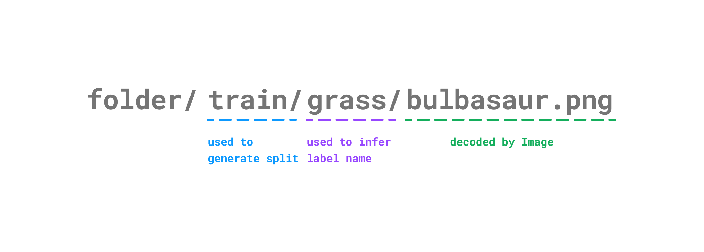

# Create a dataset

有時，如果您使用自己的數據，則可能需要創建數據集。使用 🤗 Datasets 創建數據集可以為您的數據集賦予該庫的所有優勢：快速加載和處理、流式傳輸巨大的數據集、內存映射等等。您可以使用 🤗 數據集低代碼方法輕鬆快速地創建數據集，從而減少開始訓練模型所需的時間。在許多情況下，只需將數據文件拖放到 Hub 上的數據集存儲庫中即可。

在本教程中，您將學習如何使用 🤗 數據集低代碼方法來創建所有類型的數據集：

- `Folder-based builders` 的構建器，用於快速創建圖像或音頻數據集
- `from_` 從本地文件創建數據集的方法

## Folder-based builders

Huggingface 定義了兩種 folder-based 的構建器：`ImageFolder` 和 `AudioFolder`。這些是低代碼方法，用於快速創建包含數千個示例的圖像或語音和音頻數據集。它們非常適合在擴展到更大的數據集之前快速構建計算機視覺和語音模型原型。基於文件夾的構建器獲取您的數據並自動生成數據集的特徵、分割和標籤。

在這些 folder-based 構建器的底層：

- `ImageFolder` 使用 [Image feature](https://huggingface.co/docs/datasets/v2.14.0/en/package_reference/main_classes#datasets.Image) 來解碼圖像文件。支持許多圖像擴展檔案格式，例如 `jpg` 和 `png`，但也支持其他檔案格式。您可以查看支持的圖像檔案格式擴展名的[完整列表](https://github.com/huggingface/datasets/blob/b5672a956d5de864e6f5550e493527d962d6ae55/src/datasets/packaged_modules/imagefolder/imagefolder.py#L39)。
- `AudioFolder` 使用[Audio feature](https://huggingface.co/docs/datasets/v2.14.0/en/package_reference/main_classes#datasets.Audio)來解碼音頻文件。支持 `wav` 和 `mp3` 等音頻擴展名，您可以查看支持的音頻擴展名的[完整列表](https://github.com/huggingface/datasets/blob/b5672a956d5de864e6f5550e493527d962d6ae55/src/datasets/packaged_modules/audiofolder/audiofolder.py#L39)。

數據集分割是從存儲庫結構生成的，標籤名稱是從目錄名稱自動推斷出來的。

例如，如果您的圖像數據集（與音頻數據集相同）存儲如下：

```bash
pokemon/train/grass/bulbasaur.png
pokemon/train/fire/charmander.png
pokemon/train/water/squirtle.png

pokemon/test/grass/ivysaur.png
pokemon/test/fire/charmeleon.png
pokemon/test/water/wartortle.png
```

然後，這就是 folder-based 構建器生成示例的方式：



通過在 [load_dataset()](https://huggingface.co/docs/datasets/v2.14.0/en/package_reference/loading_methods#datasets.load_dataset) 中指定 `imagefolder` 創建圖像數據集：

```python
from datasets import ImageFolder

dataset = load_dataset("imagefolder", data_dir="/path/to/pokemon")
```

音頻數據集的創建方式相同，只不過您在 [load_dataset()](https://huggingface.co/docs/datasets/v2.14.0/en/package_reference/loading_methods#datasets.load_dataset) 中指定了音頻文件夾：

```python
from datasets import AudioFolder

dataset = load_dataset("audiofolder", data_dir="/path/to/folder")
```

有關數據集的任何其他信息（例如文本標題或轉錄）都可以包含在包含數據集的文件夾中的 `metadata.csv` 文件中。元數據文件需要有一個 `file_name` 列，用於將圖像或音頻文件鏈接到其相應的元數據：

```csv title="metadata.csv"
file_name, text
bulbasaur.png, There is a plant seed on its back right from the day this Pokémon is born.
charmander.png, It has a preference for hot things.
squirtle.png, When it retracts its long neck into its shell, it squirts out water with vigorous force.
```

要了解有關每個基於文件夾的構建器的更多信息，請查看 [ImageFolder](https://huggingface.co/docs/datasets/image_dataset#imagefolder) 或 [AudioFolder](https://huggingface.co/docs/datasets/audio_dataset#audiofolder) 指南。

## From local files

您還可以通過指定數據文件的路徑從本地文件創建數據集。您可以通過兩種方式使用 **from_** 方法創建數據集：

- 由於 [generator](https://wiki.python.org/moin/Generators) 的迭代行為，[`from_generator()`](https://huggingface.co/docs/datasets/v2.14.0/en/package_reference/main_classes#datasets.Dataset.from_generator) 方法是{==從生成器創建數據集的最節省內存==}的方法。當您處理可能無法放入內存的非常大的數據集時，這尤其有用，因為數據集是在磁盤上逐步生成的，然後進行內存映射。

    ```python
    from datasets import Dataset

    def gen():
        yield {"pokemon": "bulbasaur", "type": "grass"}
        yield {"pokemon": "squirtle", "type": "water"}

    ds = Dataset.from_generator(gen)

    print(ds[0])
    ```

    結果:

    ```bash
    {"pokemon": "bulbasaur", "type": "grass"}
    ```

    基於生成器的 [IterableDataset](https://huggingface.co/docs/datasets/v2.14.0/en/package_reference/main_classes#datasets.IterableDataset) 需要使用 `for loop` 進行迭代，例如：

    ```python
    from datasets import IterableDataset

    ds = IterableDataset.from_generator(gen)

    for example in ds:
        print(example)
    ```

- [`from_dict()`](https://huggingface.co/docs/datasets/v2.14.0/en/package_reference/main_classes#datasets.Dataset.from_dict) 方法是從 Python dict 物件來創建數據集的直接方法：

```python
from datasets import Dataset

ds = Dataset.from_dict({"pokemon": ["bulbasaur", "squirtle"], "type": ["grass", "water"]})

ds[0]
```

要創建圖像或音頻數據集，請將 [`cast_column()`](https://huggingface.co/docs/datasets/v2.14.0/en/package_reference/main_classes#datasets.Dataset.cast_column) 方法與 [`from_dict()`](https://huggingface.co/docs/datasets/v2.14.0/en/package_reference/main_classes#datasets.Dataset.from_dict)  鏈接起來，並指定列和 feature 類型。例如，要創建音頻數據集：

```python
audio_dataset = Dataset.from_dict({"audio": ["path/to/audio_1", ..., "path/to/audio_n"]}).cast_column("audio", Audio())
```

## Next steps

我們在教程中沒有提到另外一種的手法: 使用 `loading script` 創建數據集。`loading script` 是一種用於創建數據集的手動宣告和需要把撰寫一些程式碼的方法，跟其它兩種方法比起來，它似乎需要花多一點時間來學習，但它也為您提供了最大的靈活性和對數據集生成方式的控制。

`loading script` 允許您配置其他選項來優化數據集的使用埸景，例如在數據集中創建多個配置，或啟用數據集流式傳輸。

要了解有關如何編寫 `loading script` 的更多信息，請查看 [image loading script](https://huggingface.co/docs/datasets/main/en/image_dataset#loading-script)、[audio loading script](https://huggingface.co/docs/datasets/main/en/audio_dataset) 和 [text loading script](https://huggingface.co/docs/datasets/main/en/dataset_script) 指南。

繼續下一部分，了解如何共享數據集。