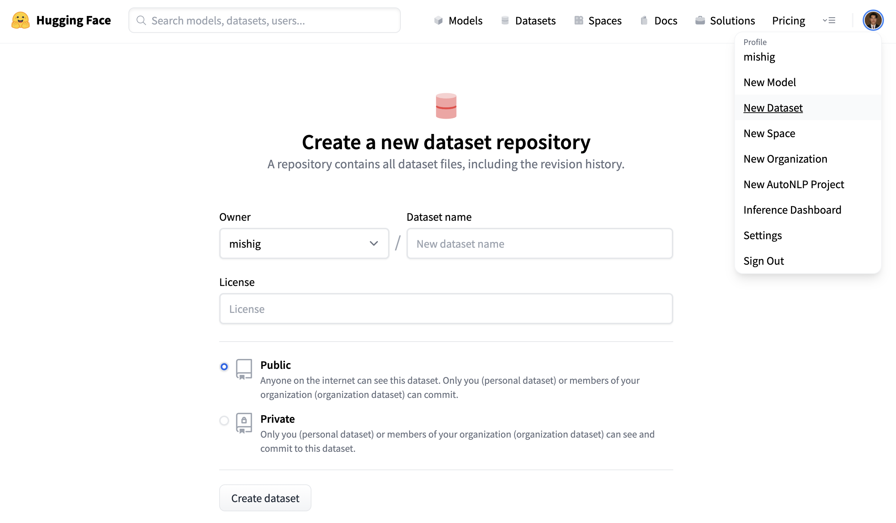
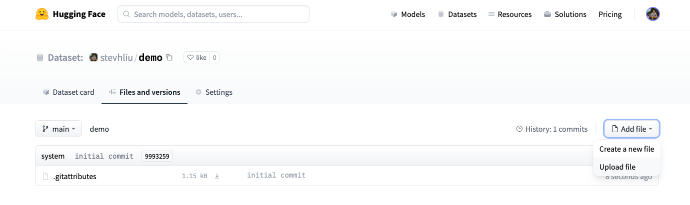
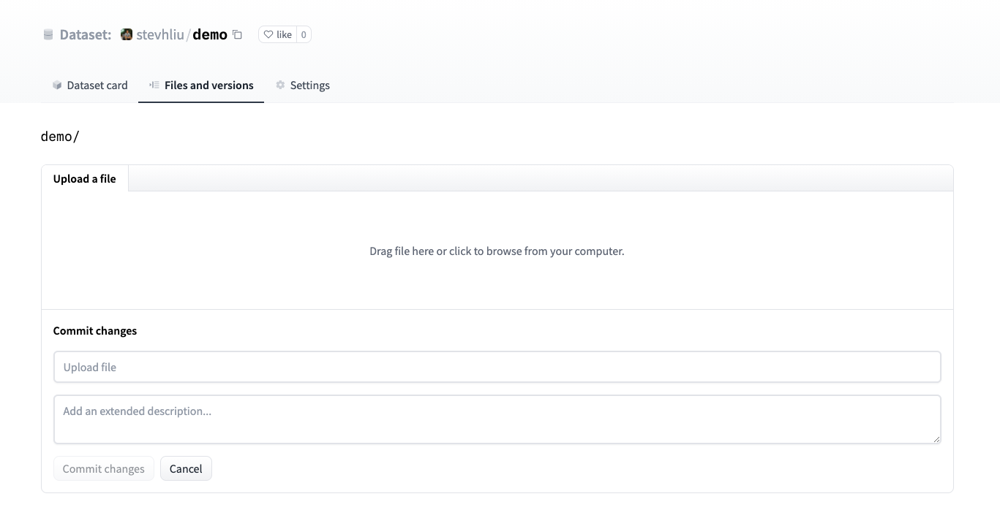
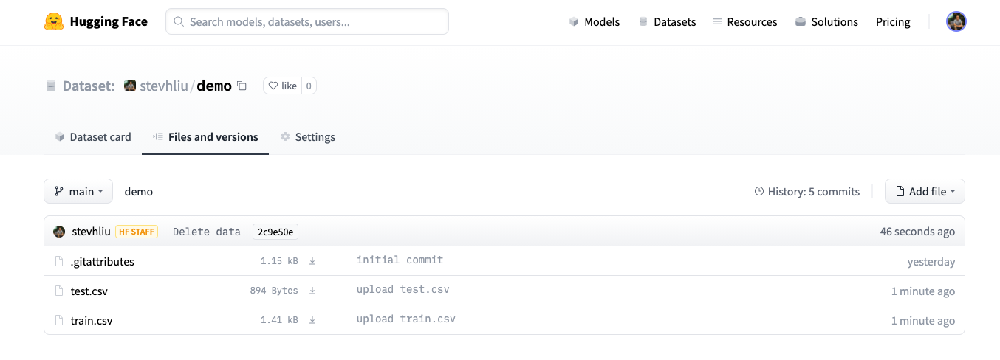
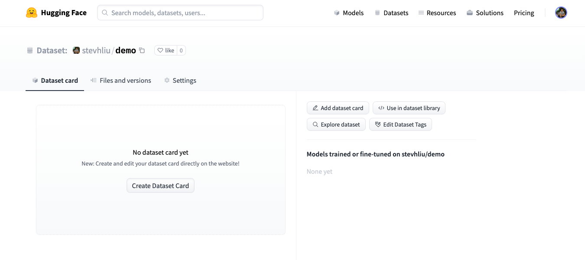
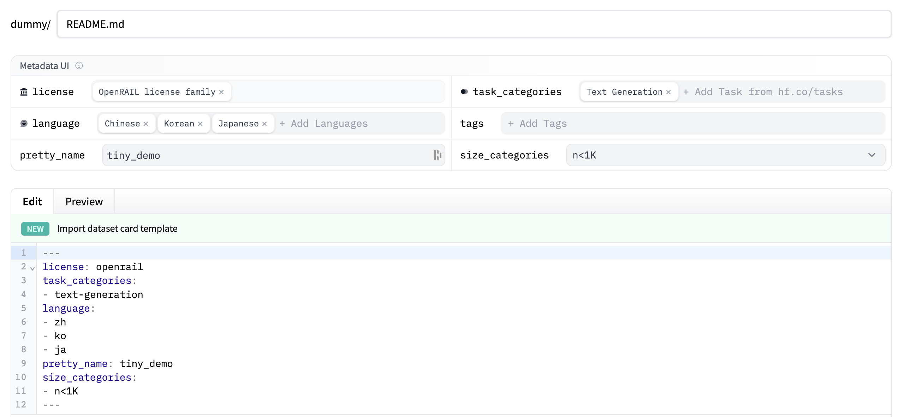

# Share a dataset to the Hub

Huggingface 的 [Hub](https://huggingface.co/datasets) 擁有大量社區策劃的熱門研究數據集。我們鼓勵您將數據集分享到 Hub，以幫助發展 ML 社區並加快每個人的進步。歡迎所有貢獻；添加數據集只需拖放即可！

如果您還沒有 [Hugging Face Hub 帳戶](https://huggingface.co/join)，請首先創建一個。

## Upload with the Hub UI

Huggingface 的 [Hub](https://huggingface.co/datasets) 是基於網路的 Web 界面允許沒有任何開發經驗的用戶上傳數據集。

### Create a repository

存儲庫託管所有數據集文件，包括修訂歷史記錄，從而可以存儲多個數據集版本。

1. 單擊您的個人資料並選擇 **New Dataset** 以創建新的數據集存儲庫。
2. 為您的數據集選擇一個名稱，然後選擇它是公共數據集還是私有數據集。公共數據集對任何人都可見，而私有數據集只能由您或您組織的成員查看。



### Upload dataset

1. 創建存儲庫後，導航到 `Files and versions` 頁籤來添加文件。選擇 `Add file` 以上傳數據集文件。Huggingface 支持許多文本、音頻和圖像數據擴展名，例如 `.csv`、`.mp3` 和 `.jpg` 等。對於 `.csv`、`.json`、`.jsonl` 和 `.txt` 等文本數據擴展名，我們建議在上傳到 Hub 之前對其進行壓縮（例如，壓縮為 `.zip` 或 `.gz` 文件擴展名）。

    默認情況下，`Git LFS` 不跟踪文本文件擴展名，如果它們大於 `10MB`，則不會提交和上傳。查看存儲庫中的 `.gitattributes` 文件以獲取跟踪文件擴展名的完整列表。對於本教程，您可以使用以下示例 `.csv` 文件，因為它們很小： `train.csv`、`test.csv`。

    !!! tip

        對於其他 dataset configuration 的選項，例如定義多個配置或啟用流式傳輸，您需要編寫 `dataset loading script`。查看如何為 [text](https://huggingface.co/docs/datasets/dataset_script#create-a-dataset-loading-script)、[audio](https://huggingface.co/docs/datasets/audio_dataset#loading-script) 和 [image](https://huggingface.co/docs/datasets/image_dataset#loading-script) 數據集編寫數據集加載腳本。

    

2. 拖接本地數據集文件並添加簡短的描述性 commit 訊息。

    

3. 上傳數據集文件後，它們將存儲在您的數據集存儲庫中。

    

### Create a Dataset card

添加數據集卡對於幫助用戶找到您的數據集並了解如何負責任地使用它非常有價值。

1. 點擊 `Create Dataset Card` 以創建 `Dataset card`。此按鈕會在您的存儲庫中創建一個 `README.md` 文件。

    

2. 在頂部，您將看到元數據 UI，其中包含多個可供選擇的欄位，例如許可證、語言和任務類別。這些是幫助用戶在 Hub 上發現您的數據集的最重要標籤。當您從每個欄位中選擇一個選項時，它們將自動添加到數據集卡的頂部。

    您還可以查看 `Dataset card` 規範，其中有一整組（但不是必需的）標籤選項，例如 `annotations_creators`，以幫助您選擇合適的標籤。

    

3. 點擊編輯器頂部的 `Import dataset card template` 鏈接可自動創建 `Dataset card` 模板。填寫模板是將您的數據集介紹給社區並幫助用戶了解如何使用它的好方法。有關良好　`Dataset card`　應是什麼樣子的詳細示例，請查看 [CNN DailyMail Dataset card](https://huggingface.co/datasets/cnn_dailymail)。

### Load dataset

一旦您的數據集存儲在 Hub 上，任何人都可以使用 `load_dataset()` 函數加載它：

```python
from datasets import load_dataset

dataset = load_dataset("stevhliu/demo")
```

## Upload with Python

喜歡以編程方式上傳數據集的用戶可以使用 [huggingface_hub](https://huggingface.co/docs/huggingface_hub/index) 套件。該套件允許用戶通過 Python 與 Hub 交互。

1. 首先安裝套件：

    ```python
    pip install huggingface_hub
    ```

2. 要使用 Python 在 Hub 上傳數據集，您需要登錄您的 Hugging Face 帳戶：

    ```bash
    huggingface-cli login
    ```

3. 使用 `push_to_hub()` 函數來幫助您添加、提交和推送文件到您的存儲庫：

    ```python
    from datasets import load_dataset

    dataset = load_dataset("stevhliu/demo")
    dataset.push_to_hub("stevhliu/processed_demo")
    ```

要將數據集設置為私有，請將 `private` 參數設置為 `True`。僅當您第一次創建存儲庫時，此參數才有效。

```python
dataset.push_to_hub("stevhliu/private_processed_demo", private=True)
```

### Privacy

私有數據集只能由您訪問。同樣，如果您在組織內共享數據集，則組織的成員也可以訪問該數據集。

通過向 token 參數提供您的身份驗證令牌來加載私有數據集：

```python
from datasets import load_dataset

# Load a private individual dataset
dataset = load_dataset("stevhliu/demo", token=True)

# Load a private organization dataset
dataset = load_dataset("organization/dataset_name", token=True)
```

## What's next?

恭喜，您已完成教程！

從這裡，您可以繼續：

1. 詳細了解如何使用 🤗 數據集其他函數來處理數據集。
2. 流式傳輸大型數據集，無需在本地先行下載。
3. 定義您的數據集分割和配置或加載腳本，並與社區共享您的數據集。


