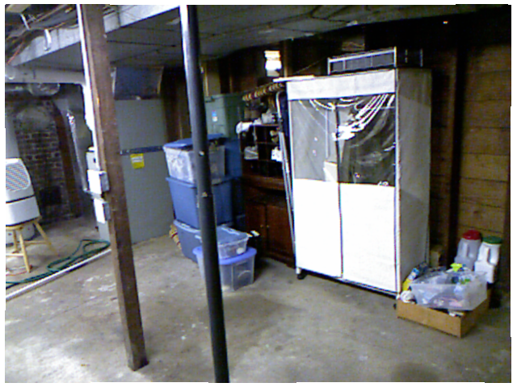
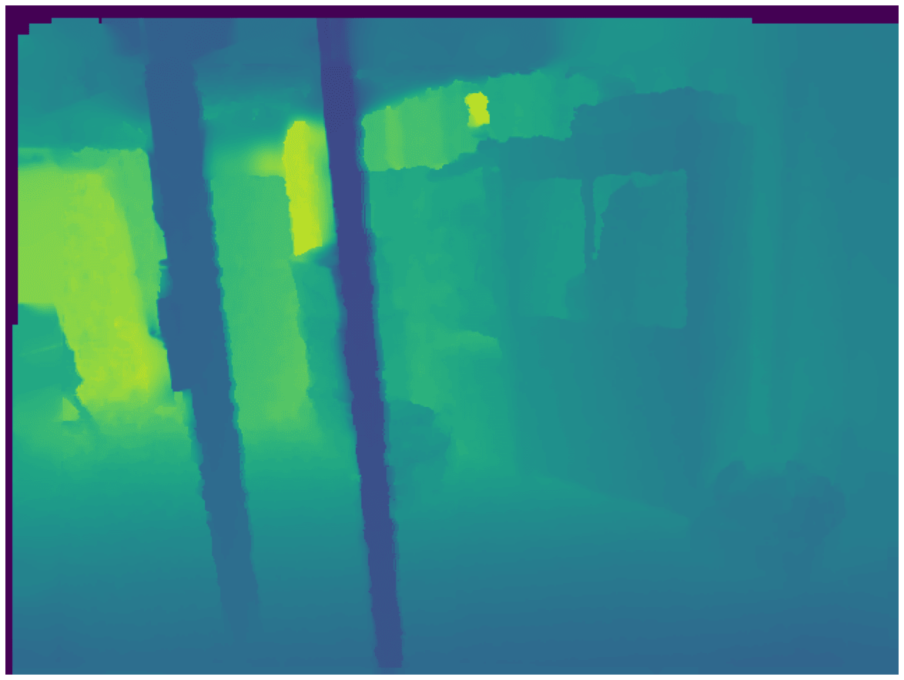
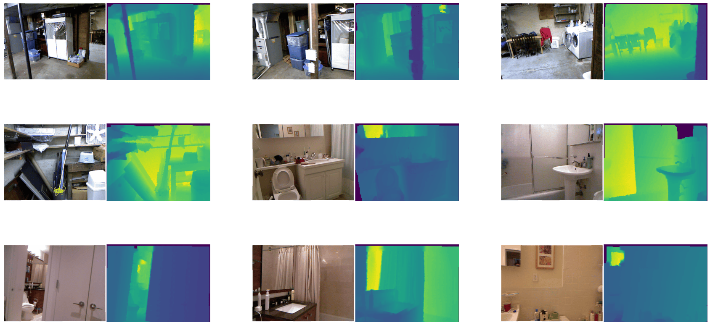
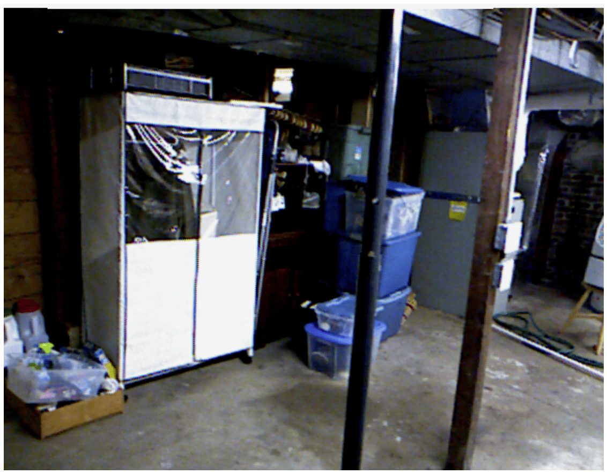
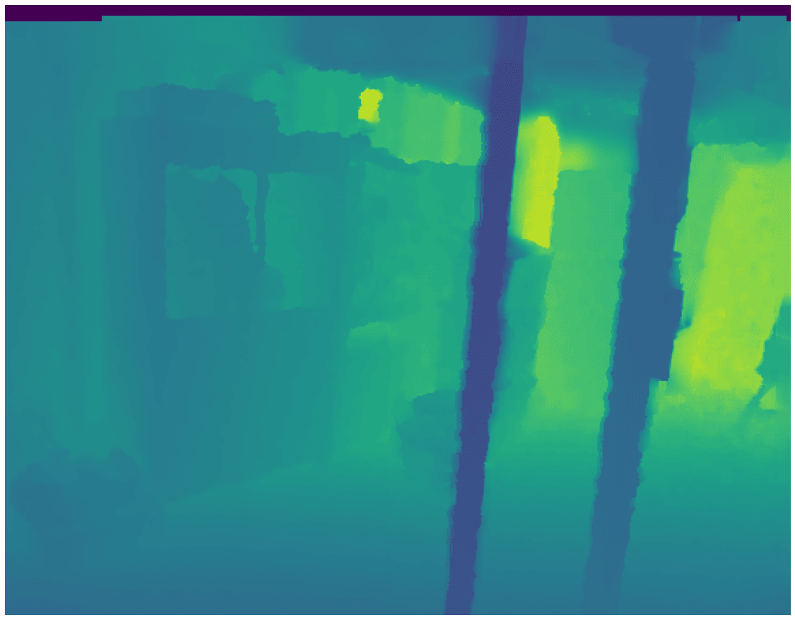
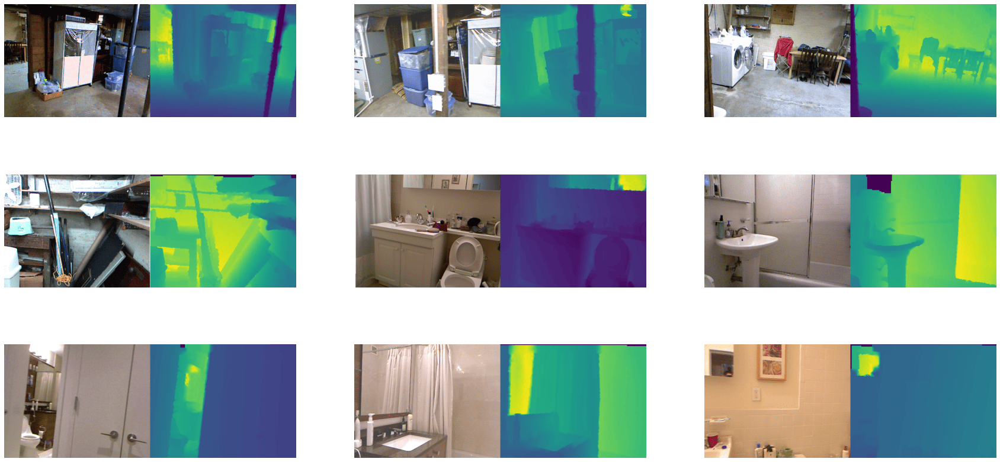

# Depth estimation

Depth estimation dataset 用於訓練模型來近似圖像中每個像素與相機的相對距離（也稱為深度）。這些數據集支持的應用主要集中在視覺機器感知和機器人感知等領域。範例應用包括為自動駕駛汽車繪製街道地圖。本指南將向您展示如何將 transformation 應用於 depth estimation dataset。

在開始之前，請確保您安裝了最新版本的 [albumentations](https://pypi.org/project/albumentations/) 套件：

```bash
pip install -U albumentations 
```

[Albumentations](https://albumentations.ai/) 是一個用於執行計算機視覺數據增強的 Python 套件。它支持各種計算機視覺任務，例如圖像分類、物件檢測、分割和關鍵點估計。

本指南使用 [NYU Depth V2](https://huggingface.co/datasets/sayakpaul/nyu_depth_v2) 數據集，該數據集由 RGB 和深度相機記錄的各種室內場景的視頻序列組成。該數據集由來自 3 個城市的場景組成，並提供圖像及其深度圖作為標籤。

加載數據集的 `train` 分割並看一個樣本：

```python
from datasets import load_dataset

train_dataset = load_dataset("sayakpaul/nyu_depth_v2", split="train")

index = 17

example = train_dataset[index]

print(example)
```

結果:

```bash
{'image': <PIL.PngImagePlugin.PngImageFile image mode=RGB size=640x480>,
 'depth_map': <PIL.TiffImagePlugin.TiffImageFile image mode=F size=640x480>}
```

數據集有兩個欄位：

- `image`: 具有 uint8 數據類型的 PIL PNG image object。
- `depth_map`: 具有 float32 數據類型的 PIL Tiff image object，它是圖像的深度圖。

值得一提的是，`JPEG/PNG` 格式只能存儲 `uint8` 或 `uint16` 數據。由於深度圖是 `float32` 數據，因此不能使用 `PNG/JPEG` 存儲。但是，我們可以使用 `TIFF` 格式保存深度圖，因為它支持更廣泛的數據類型，包括 `float32` 數據。

接下來，使用以下命令檢查圖像：

```python
from PIL import Image

example["image"].show()
```



在查看深度圖之前，我們需要首先使用 `.convert('RGB')` 將其數據類型轉換為 `uint8`，因為 PIL 無法顯示 `float32` 圖像。現在看一下它對應的深度圖：

```python
example["depth_map"].convert("RGB")
```


都是黑的！您需要向深度圖添加一些顏色才能正確可視化它。為此，我們可以使用 `plt.imshow()` 在顯示過程中自動應用顏色，或者使用 `plt.cm` 創建彩色深度圖，然後顯示它。在此示例中，我們使用了後一種，因為我們可以稍後保存/寫入彩色深度圖。(下面的實用程序取自 FastDepth 存儲庫)。

```python
import numpy as np
import matplotlib.pyplot as plt

cmap = plt.cm.viridis

def colored_depthmap(depth, d_min=None, d_max=None):
    if d_min is None:
        d_min = np.min(depth)
    if d_max is None:
        d_max = np.max(depth)
    depth_relative = (depth - d_min) / (d_max - d_min)
    return 255 * cmap(depth_relative)[:,:,:3]

def show_depthmap(depth_map):
   if not isinstance(depth_map, np.ndarray):
       depth_map = np.array(depth_map)
   if depth_map.ndim == 3:
       depth_map = depth_map.squeeze()

   d_min = np.min(depth_map)
   d_max = np.max(depth_map)
   depth_map = colored_depthmap(depth_map, d_min, d_max)

   plt.imshow(depth_map.astype("uint8"))
   plt.axis("off")
   plt.show()

show_depthmap(example["depth_map"])
```



您還可以可視化幾個不同的圖像及其相應的深度圖。

```python
def merge_into_row(input_image, depth_target):
    if not isinstance(input_image, np.ndarray):
        input_image = np.array(input_image)
    d_min = np.min(depth_target)
    d_max = np.max(depth_target)
    depth_target_col = colored_depthmap(depth_target, d_min, d_max)
    img_merge = np.hstack([input_image, depth_target_col])
    return img_merge

random_indices = np.random.choice(len(train_dataset), 9).tolist()
plt.figure(figsize=(15, 6))
for i, idx in enumerate(random_indices):
    example = train_dataset[idx]
    ax = plt.subplot(3, 3, i + 1)
    image_viz = merge_into_row(
        example["image"], example["depth_map"]
    )
    plt.imshow(image_viz.astype("uint8"))
    plt.axis("off")
```



現在應用一些 albumentations 的圖像增強。增強變換包括：

- Random horizontal flipping
- Random cropping
- Random brightness and contrast
- Random gamma correction
- Random hue saturation

```python
import albumentations as A

crop_size = (448, 576)
transforms = [
    A.HorizontalFlip(p=0.5),
    A.RandomCrop(crop_size[0], crop_size[1]),
    A.RandomBrightnessContrast(),
    A.RandomGamma(),
    A.HueSaturationValue()
]
```

此外，定義映射以更好地反映目標鍵名稱。

```python
additional_targets = {"depth": "mask"}

aug = A.Compose(transforms=transforms, additional_targets=additional_targets)
```

定義了 `extra_targets` 後，您可以將目標深度圖傳遞給 `aug` 而不是 `mask` 的深度參數。您會注意到下面定義的 `apply_transforms()` 函數中的這個改變。

創建一個函數以將變換應用於圖像及其深度圖：

```python
def apply_transforms(examples):
    transformed_images, transformed_maps = [], []
    for image, depth_map in zip(examples["image"], examples["depth_map"]):
        image, depth_map = np.array(image), np.array(depth_map)
        transformed = aug(image=image, depth=depth_map)
        transformed_images.append(transformed["image"])
        transformed_maps.append(transformed["depth"])
    examples["pixel_values"] = transformed_images
    examples["labels"] = transformed_maps
    return examples
```

使用 `set_transform()` 函數將轉換即時應用於數據集批次，以消耗更少的磁盤空間：

```python
train_dataset.set_transform(apply_transforms)
```

您可以通過索引示例圖像的像素值和標籤來驗證轉換是否有效：

```python
example = train_dataset[index]

plt.imshow(example["pixel_values"])

plt.axis("off")

plt.show()
```



在圖像相應的深度圖上可視化相同的變換：

```python
show_depthmap(example["labels"])
```



您還可以使用之前的 `random_indices` 來可視化多個訓練樣本：

```python
plt.figure(figsize=(15, 6))

for i, idx in enumerate(random_indices):
    ax = plt.subplot(3, 3, i + 1)
    example = train_dataset[idx]
    image_viz = merge_into_row(
        example["pixel_values"], example["labels"]
    )
    plt.imshow(image_viz.astype("uint8"))
    plt.axis("off")
```



