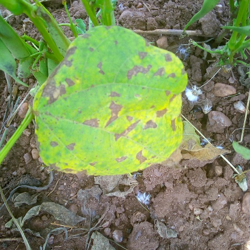
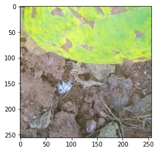

# Image classification

Image classification datasets 用於訓練模型以對整個圖像進行分類。這些數據集支持多種應用，例如識別瀕危野生動物物種或在醫學圖像中篩查疾病。本指南將向您展示如何將 transformations 應用於圖像分類數據集。

在開始之前，請確保您安裝了最新版本的 `albumentations` 和 `cv2`：

```bash
pip install -U albumentations opencv-python
```

本指南使用 [Beans](https://huggingface.co/datasets/beans) 數據集根據葉子圖像識別豆類植物病害的類型。

加載數據集並看一個樣本：

```python
from datasets import load_dataset

dataset = load_dataset("beans")

print(dataset["train"][10])
```

結果:

```bash
{'image': <PIL.JpegImagePlugin.JpegImageFile image mode=RGB size=500x500 at 0x7F8D2F4D7A10>,
 'image_file_path': '/root/.cache/huggingface/datasets/downloads/extracted/b0a21163f78769a2cf11f58dfc767fb458fc7cea5c05dccc0144a2c0f0bc1292/train/angular_leaf_spot/angular_leaf_spot_train.204.jpg',
 'labels': 0}
```

數據集包​​含三個欄位：

- `image`: 一個 PIL image object
- `image_file_path`: 圖像文件的路徑
- `labels`: 圖像的標籤或類別

接下來，查看圖像：



現在應用 `albumentations` 來作圖像增強(augmentations)。您將隨機裁剪圖像、水平翻轉並調整其亮度。

```python
import cv2
import albumentations
import numpy as np

transform = albumentations.Compose([
    albumentations.RandomCrop(width=256, height=256),
    albumentations.HorizontalFlip(p=0.5),
    albumentations.RandomBrightnessContrast(p=0.2),
])
```

創建一個函數以將 transformation 應用於圖像：

```python
def transforms(examples):
    examples["pixel_values"] = [
        transform(image=np.array(image))["image"] for image in examples["image"]
    ]

    return examples
```

使用 `set_transform()` 函數將轉換即時應用於數據集批次，以消耗更少的磁盤空間：

```python
dataset.set_transform(transforms)
```

您可以通過索引第一個示例的 `pixel_values` 來驗證轉換是否有效：

```python
import numpy as np
import matplotlib.pyplot as plt

img = dataset["train"][0]["pixel_values"]

plt.imshow(img)
```



!!! info
    現在您已經知道如何處理圖像分類數據集，接下來了解 [how to train an image classification model](https://colab.research.google.com/github/huggingface/notebooks/blob/main/examples/image_classification.ipynb) 並將其用於推理。