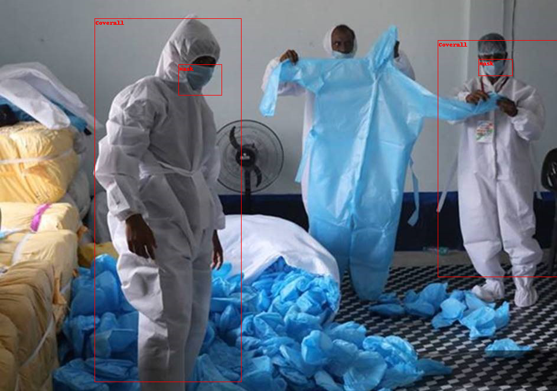
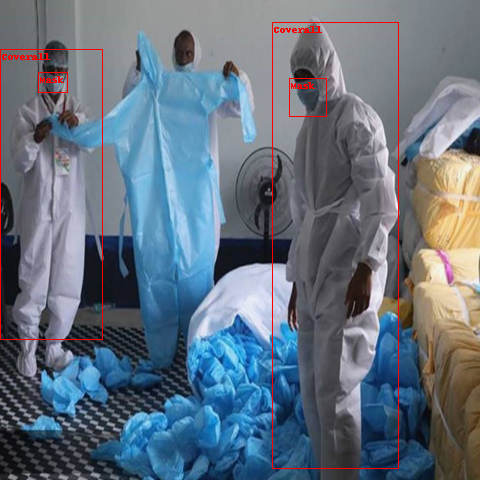
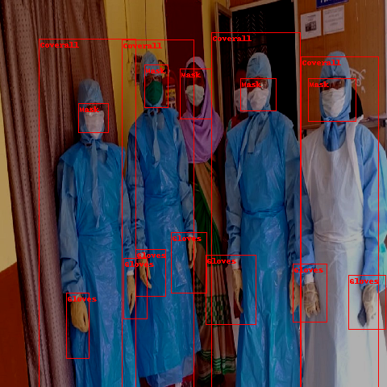

# Object detection

對象檢測模型識別圖像中的某些內容，對象檢測數據集用於自動駕駛和檢測野火等自然災害等應用。本指南將向您展示如何按照 Albumentations 的教程將轉換應用於對象檢測數據集。

在開始之前，請確保您安裝了最新版本的 `albumentations` 和 `cv2`：

```bash
pip install -U albumentations opencv-python
```

在此範例中，您將使用 [cppe-5](https://huggingface.co/datasets/cppe-5) 數據集來識別 COVID-19 大流行背景下的醫療個人防護裝備 (PPE)。

加載數據集並看一個樣本：

```python
ds = load_dataset("cppe-5")

example = ds['train'][0]

print(example)
```

結果:

```bash
{'height': 663,
 'image': <PIL.JpegImagePlugin.JpegImageFile image mode=RGB size=943x663 at 0x7FC3DC756250>,
 'image_id': 15,
 'objects': {'area': [3796, 1596, 152768, 81002],
  'bbox': [[302.0, 109.0, 73.0, 52.0],
   [810.0, 100.0, 57.0, 28.0],
   [160.0, 31.0, 248.0, 616.0],
   [741.0, 68.0, 202.0, 401.0]],
  'category': [4, 4, 0, 0],
  'id': [114, 115, 116, 117]},
 'width': 943}
```

數據集具有以下欄位：

- `image`: PIL.Image.Image object containing the image.
- `image_id`: The image ID.
- `height`: The image height.
- `width`: The image width.
- `objects`: A dictionary containing bounding box metadata for the objects in the image:
    - `id`: The annotation id.
    - `area`: The area of the bounding box.
    - `bbox`: The object’s bounding box (in the coco format).
    - `category`: The object’s category, with possible values including Coverall (0), Face_Shield (1), Gloves (2), Goggles (3) and Mask (4).


您可以使用一些 torch utilities 可視化圖像上的框(`bboxes`)。為此，您需要引用與類別 ID 關聯的 [`ClassLabel`](https://huggingface.co/docs/datasets/v2.14.1/en/package_reference/main_classes#datasets.ClassLabel) 功能，以便您可以查找字符串標籤：

```python
import torch
from torchvision.ops import box_convert
from torchvision.utils import draw_bounding_boxes
from torchvision.transforms.functional import pil_to_tensor, to_pil_image

categories = ds['train'].features['objects'].feature['category']

boxes_xywh = torch.tensor(example['objects']['bbox'])
boxes_xyxy = box_convert(boxes_xywh, 'xywh', 'xyxy')

labels = [categories.int2str(x) for x in example['objects']['category']]

to_pil_image(
    draw_bounding_boxes(
        pil_to_tensor(example['image']),
        boxes_xyxy,
        colors="red",
        labels=labels,
    )
)
```



通過 `albumentations`，您可以用來影響圖像的變換，同時也相應地更新 `bbox`。在本例中，圖像大小調整為 (480, 480)，水平翻轉並加亮。

`albumentations` 期望圖像採用 **BGR** 格式，而不是 **RGB**，因此您必須在應用轉換之前轉換圖像。

```python
import albumentations
import numpy as np

transform = albumentations.Compose([
    albumentations.Resize(480, 480),
    albumentations.HorizontalFlip(p=1.0),
    albumentations.RandomBrightnessContrast(p=1.0),
], bbox_params=albumentations.BboxParams(format='coco',  label_fields=['category']))

# RGB PIL Image -> BGR Numpy array
image = np.flip(np.array(example['image']), -1)

out = transform(
    image=image,
    bboxes=example['objects']['bbox'],
    category=example['objects']['category'],
)
```

現在，當您可視化結果時，圖像應該翻轉，但框應該仍然位於正確的位置。

```python
image = torch.tensor(out['image']).flip(-1).permute(2, 0, 1)

boxes_xywh = torch.stack([torch.tensor(x) for x in out['bboxes']])

boxes_xyxy = box_convert(boxes_xywh, 'xywh', 'xyxy')

labels = [categories.int2str(x) for x in out['category']]

to_pil_image(
    draw_bounding_boxes(
        image,
        boxes_xyxy,
        colors='red',
        labels=labels
    )
)
```



創建一個函數以將轉換應用於一批樣本：

```python
def transforms(examples):
    images, bboxes, categories = [], [], []

    for image, objects in zip(examples['image'], examples['objects']):
        image = np.array(image.convert("RGB"))[:, :, ::-1]
        out = transform(
            image=image,
            bboxes=objects['bbox'],
            category=objects['category']
        )
        images.append(torch.tensor(out['image']).flip(-1).permute(2, 0, 1))
        bboxes.append(torch.tensor(out['bboxes']))
        categories.append(out['category'])

    return {'image': images, 'bbox': bboxes, 'category': categories}
```

使用 `set_transform()` 函數即時應用轉換，這會消耗更少的磁盤空間。如果您兩次訪問同一示例，數據增強的隨機性可能會返回不同的圖像。在訓練多個 epochs 的模型時，它特別有用。

```python
ds['train'].set_transform(transforms)
```

您可以通過可視化第 10 個樣本來驗證轉換是否有效：

```python
example = ds['train'][10]

to_pil_image(
    draw_bounding_boxes(
        example['image'],
        box_convert(example['bbox'], 'xywh', 'xyxy'),
        colors='red',
        labels=[categories.int2str(x) for x in example['category']]
    )
)
```



!!! info
    現在您已經知道如何處理用於對象檢測的數據集，接下來了解 [how to train an object detection model](https://colab.research.google.com/github/NielsRogge/Transformers-Tutorials/blob/master/YOLOS/Fine_tuning_YOLOS_for_object_detection_on_custom_dataset_(balloon).ipynb) 並將其用於推理。