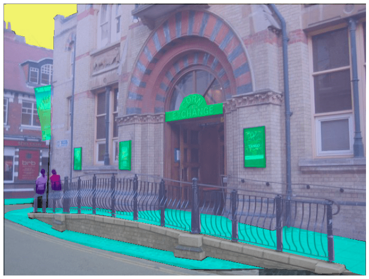
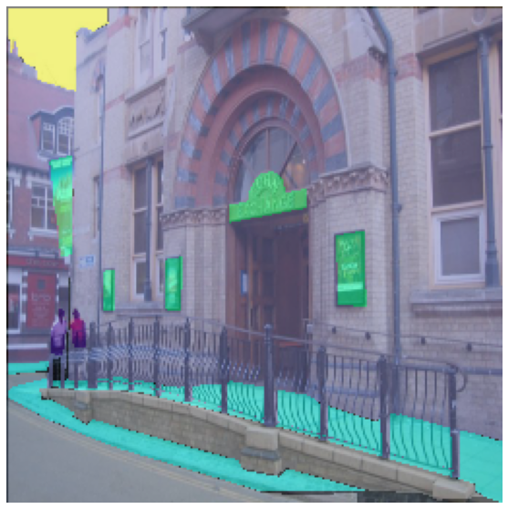
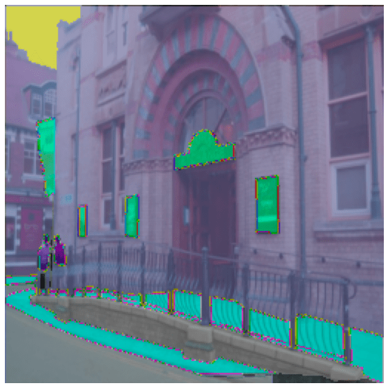

# Semantic segmentation

Semantic segmentation datasets 用於訓練模型對圖像中的每個像素進行分類。這些數據集支持多種應用，例如圖像背景去除、圖像風格化或自動駕駛場景理解。本指南將向您展示如何將轉換應用於圖像分割數據集。

在開始之前，請確保您安裝了最新版本的 `albumentations` 和 `cv2`：

```bash
pip install -U albumentations opencv-python
```

[Albumentations](https://albumentations.ai/) 是一個用於執行計算機視覺數據增強的 Python 套件。它支持各種計算機視覺任務，例如圖像分類、物件檢測、分割和關鍵點估計。

本指南使用 [Scene Parsing](https://huggingface.co/datasets/scene_parse_150) 數據集將圖像分割並解析為與語義類別相關的不同圖像區域，例如天空、道路、人物和床。

加載數據集的 `train` 分割並看一個樣本：

```python
from datasets import load_dataset

dataset = load_dataset("scene_parse_150", split="train")

index = 10

print(dataset[index])
```

結果:

```bash
{'image': <PIL.JpegImagePlugin.JpegImageFile image mode=RGB size=683x512 at 0x7FB37B0EC810>,
 'annotation': <PIL.PngImagePlugin.PngImageFile image mode=L size=683x512 at 0x7FB37B0EC9D0>,
 'scene_category': 927}
```

數據集包​​含三個欄位：

- `image`: 一個 PIL image object.
- `annotation`: Image 的　segmentation mask
- `scene_category`: 圖像的標籤或場景類別（例如“廚房”或“辦公室”）

接下來，使用以下命令檢查圖像：

```python
dataset[index]["image"]
```


同樣，您可以查看相應的 segmentation mask：

```python
dataset[index]["annotation"]
```


我們還可以在 segmentation mask 上添加調色板並將其覆蓋在原始圖像的頂部以可視化數據集：

```python
import matplotlib.pyplot as plt

def visualize_seg_mask(image: np.ndarray, mask: np.ndarray):
   color_seg = np.zeros((mask.shape[0], mask.shape[1], 3), dtype=np.uint8)
   palette = np.array(create_ade20k_label_colormap())
   for label, color in enumerate(palette):
       color_seg[mask == label, :] = color
   color_seg = color_seg[..., ::-1]  # convert to BGR

   img = np.array(image) * 0.5 + color_seg * 0.5  # plot the image with the segmentation map
   img = img.astype(np.uint8)

   plt.figure(figsize=(15, 10))
   plt.imshow(img)
   plt.axis("off")
   plt.show()


visualize_seg_mask(
    np.array(dataset[index]["image"]),
    np.array(dataset[index]["annotation"])
)
```



現在應用 `albumentations` 進行圖像增強。您將首先調整圖像大小並調整其亮度。

```python
import albumentations

transform = albumentations.Compose(
    [
        albumentations.Resize(256, 256),
        albumentations.RandomBrightnessContrast(brightness_limit=0.3, contrast_limit=0.3, p=0.5),
    ]
)
```

創建一個函數以將變換應用於圖像：

```python
def transforms(examples):
    transformed_images, transformed_masks = [], []
    for image, seg_mask in zip(examples["image"], examples["annotation"]):
        image, seg_mask = np.array(image), np.array(seg_mask)
        transformed = transform(image=image, mask=seg_mask)
        transformed_images.append(transformed["image"])
        transformed_masks.append(transformed["mask"])
    examples["pixel_values"] = transformed_images
    examples["label"] = transformed_masks
    return examples
```

使用 `set_transform()` 函數將轉換即時應用於數據集批次，以消耗更少的磁盤空間：

```python
dataset.set_transform(transforms)
```

您可以通過索引示例的像素值和標籤來驗證轉換是否有效：

```python
image = np.array(dataset[index]["pixel_values"])
mask = np.array(dataset[index]["label"])

visualize_seg_mask(image, mask)
```



在本指南中，您使用了 `albumentations` 來擴充數據集。還可以使用 `torchvision` 來應用一些類似的變換。

```python
from torchvision.transforms import Resize, ColorJitter, Compose

transformation_chain = Compose([
    Resize((256, 256)),
    ColorJitter(brightness=0.25, contrast=0.25, saturation=0.25, hue=0.1)
])
resize = Resize((256, 256))

def train_transforms(example_batch):
    example_batch["pixel_values"] = [transformation_chain(x) for x in example_batch["image"]]
    example_batch["label"] = [resize(x) for x in example_batch["annotation"]]
    return example_batch

dataset.set_transform(train_transforms)

image = np.array(dataset[index]["pixel_values"])
mask = np.array(dataset[index]["label"])

visualize_seg_mask(image, mask)
```



!!! tip
    現在您已經知道如何處理數據集以進行語義分割，接下來了解 [how to train a semantic segmentation model](https://huggingface.co/docs/transformers/tasks/semantic_segmentation) 並將其用於推理。