# 從 Prefix Tuning 到 LLaMA-Adapter

原文:[From Prefix Tuning to LLaMA-Adapters](https://lightning.ai/pages/community/article/understanding-llama-adapters/)

在快速發展的人工智能領域，高效利用大型語言模型變得越來越重要。

參數高效的微調(parameter-efficient finetuning)處於這一追求的最前沿，使研究人員和從業者能夠重複使用預訓練的模型，同時最大限度地減少其計算和資源佔用。它還使我們能夠在更廣泛的硬件上訓練人工智能模型，包括計算能力有限的設備，例如筆記本電腦、智能手機和物聯網設備。最後，隨著人們對環境可持續性的日益關注，參數高效的微調可以減少與訓練大規模人工智能模型相關的能源消耗和碳足跡。

本文解釋了微調的廣泛概念，並討論了流行的參數高效替代方案，例如 `prefix tuning` 和 `adapters`。最後，我們將看看最近的 `LLaMA-Adapter` 方法，看看如何在實踐中使用它。

## 微調大型語言模型

自 GPT-2（[Radford 等人](https://d4mucfpksywv.cloudfront.net/better-language-models/language_models_are_unsupervised_multitask_learners.pdf)）和 GPT-3（[Brown 等人](https://arxiv.org/abs/2005.14165)）以來，我們已經看到在通用文本語料庫上預訓練的生成式大語言模型 (LLM) 能夠進行上下文學習，但如果我們想要執行 LLM 未明確培訓的特定或新任務，則我們得進一步訓練或微調預訓練的 LLM。

除了重訓練或微調模型，我們可以通過輸入提示直接提供目標任務的一些示例來讓 LLM 有機會回答出我們想要的結果，如下例所示。

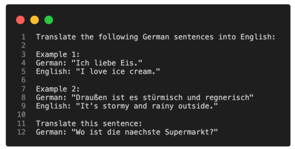

對於直接訪問大語言模型 LLM 受到限制的情況(例如通過 API 或用戶界面與 LLM 交互時)，上下文學習(in-context learning)是一種有價值且用戶友好的方法。

然而，如果我們能夠訪問 LLM，使用目標領域的數據在目標任務上對其進行調整和微調通常會帶來更好的結果。那麼，我們如何使模型適應新的目標任務呢？下圖概述了三種傳統方法。

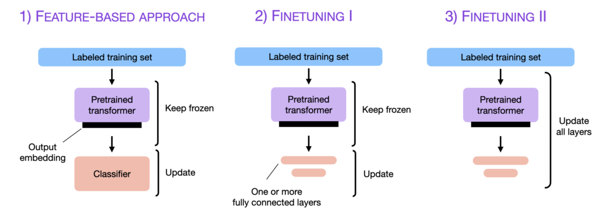

上述這些方法與 GPT 等生成（解碼器風格）模型和 BERT 等以嵌入為中心的（編碼器風格）模型兼容。與這三種方法相反，情境學習(in-context learning)僅適用於生成模型。還值得強調的是，當我們微調生成模型時，我們使用並構建它們創建的嵌入(embeddings)，而不是生成的輸出文本。

### Feature-Based 方法

在基於特徵的方法中，我們加載預訓練的 LLM 並將其應用到我們的目標數據集。在這裡，我們特別感興趣的是生成訓練集的輸出嵌入(output embeddings)，我們可以將其用作輸入特徵來訓練分類模型。雖然這種方法對於像 BERT 這樣專注於嵌入的模型特別常見，但我們也可以從生成式 GPT 樣式模型中提取嵌入。

分類模型可以是邏輯回歸模型、隨機森林或 XGBoost——無論我們想要什麼。(但是，根據我的經驗，邏輯回歸等線性分類器在這裡表現最好。)

從概念上講，我們可以使用以下代碼來說明基於特徵的方法：

```python
model = AutoModel.from_pretrained("distilbert-base-uncased")

# ...
# tokenize dataset
# ...

# generate embeddings
@torch.inference_mode()
def get_output_embeddings(batch):
    output = model(
        batch["input_ids"],
        attention_mask=batch["attention_mask"]
    ).last_hidden_state[:, 0]
return {"features": output}

dataset_features = dataset_tokenized.map(
  get_output_embeddings, batched=True, batch_size=10)

X_train = np.array(dataset_features["train"]["features"])
y_train = np.array(dataset_features["train"]["label"])

X_val = np.array(dataset_features["validation"]["features"])
y_val = np.array(dataset_features["validation"]["label"])

X_test = np.array(dataset_features["test"]["features"])
y_test = np.array(dataset_features["test"]["label"])

# train classifier
from sklearn.linear_model import LogisticRegression

clf = LogisticRegression()
clf.fit(X_train, y_train)

print("Training accuracy", clf.score(X_train, y_train))
print("Validation accuracy", clf.score(X_val, y_val))
print("test accuracy", clf.score(X_test, y_test))
```

有興趣的讀者可以在這裡找到完整的[代碼示例](https://github.com/rasbt/blog-finetuning-llama-adapters/blob/main/three-conventional-methods/1_distilbert-feature-extractor.ipynb)。


### Finetuning I — 更新輸出層

與上述基於特徵的方法相關的一種流行方法是微調輸出層（我們將這種方法稱為 `finetuning I`）。與基於特徵的方法類似，我們保持預訓練 LLM 的參數凍結。我們只訓練新添加的輸出層，類似於在嵌入特徵上訓練邏輯回歸分類器或小型多層感知器。

在代碼中，這將如下所示：

```python

model = AutoModelForSequenceClassification.from_pretrained(
    "distilbert-base-uncased",
     num_labels=2  # suppose target task is a binary classification task
) 

# freeze all layers
for param in model.parameters():
    param.requires_grad = False

# then unfreeze the two last layers (output layers)
for param in model.pre_classifier.parameters():
    param.requires_grad = True

for param in model.classifier.parameters():
    param.requires_grad = True

# finetune model
lightning_model = CustomLightningModule(model)

trainer = L.Trainer(
    max_epochs=3,
    ...
)

trainer.fit(
  model=lightning_model,
  train_dataloaders=train_loader,
  val_dataloaders=val_loader)

# evaluate model
trainer.test(lightning_model, dataloaders=test_loader)
```

有興趣的讀者可以在[這裡](https://github.com/rasbt/blog-finetuning-llama-adapters/blob/main/three-conventional-methods/2_finetune-last-layers.ipynb)找到完整的代碼示例。

理論上，這種方法在建模性能和速度方面應該與基於特徵的方法表現得相似，因為我們使用相同的凍結骨幹模型。然而，由於基於特徵的方法使得預先計算和存儲訓練數據集的嵌入特徵變得稍微容易一些，因此基於特徵的方法對於特定的實際場景可能更方便。

### Finetuning II — 更新所有層

雖然原始 BERT 論文（Devlin 等人）報告稱，僅微調輸出層可以獲得與微調所有層相當的建模性能，但由於涉及更多參數，因此成本要高得多。例如，BERT 基礎模型大約有 1.1 億個參數。然而，用於二元分類的 BERT 基礎模型的最後一層僅包含 1,500 個參數。此外，BERT 基礎模型的最後兩層包含 60,000 個參數，僅佔模型總大小的 0.6% 左右。

我們調整模型的難度將根據我們的目標任務和目標域與模型預訓練數據集的相似程度而有所不同。但在實踐中，微調所有層幾乎總是會帶來卓越的建模性能。

因此，在優化建模性能時，使用預訓練的 LLM 的黃金標準是更新所有層（這裡稱為 `finetuning II`）。從概念上講，`finetuning II` 與 `finetuning I` 非常相似。唯一的區別是我們不凍結預訓練的 LLM 的參數，而是對它們進行微調：

```python
model = AutoModelForSequenceClassification.from_pretrained(
    "distilbert-base-uncased",
     num_labels=2  # suppose target task is a binary classification task
) 

# don't freeze layers
# for param in model.parameters():
#    param.requires_grad = False

# finetune model
lightning_model = LightningModel(model)

trainer = L.Trainer(
    max_epochs=3,
    ...
)

trainer.fit(
  model=lightning_model,
  train_dataloaders=train_loader,
  val_dataloaders=val_loader)

# evaluate model
trainer.test(lightning_model, dataloaders=test_loader)
```

有興趣的讀者可以在[這裡](https://github.com/rasbt/blog-finetuning-llama-adapters/blob/main/three-conventional-methods/3_finetuning-all-layers.ipynb)找到完整的代碼示例。

如果您對一些現實世界的結果感到好奇，上面的代碼片段用於使用預訓練的 DistilBERT 基本模型來訓練電影評論分類器:

- Feature-based approach的邏輯回歸方法: 測試準確率 83%
- Finetuning I，更新最後 2 層：87% 準確率
- Finetuning II，更新所有層：92% 準確度。

這些結果與一般經驗法則一致，即微調更多層通常會帶來更好的性能，但成本也會增加。

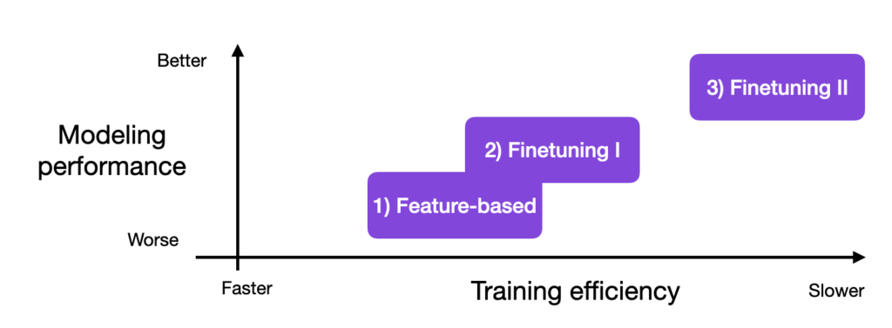

## Parameter-Efficient Finetuning

在前面的部分中，我們了解到微調更多層通常會帶來更好的結果。現在，上面的實驗都是基於 DistilBERT 模型，這個模型相對較小。如果我們想要微調僅勉強適合 GPU 內存的較大模型（例如最新的生成 LLM）怎麼辦？

當然，我們可以使用上面基於特徵或微調的方法。但是假設我們想要獲得與 `finetune II` 類似的建模質量呢？

多年來，研究人員開發了多種技術（[Lialin 等人](https://arxiv.org/abs/2303.15647)）來微調 LLM，使其具有高建模性能，同時只需要訓練少量參數。這些方法通常稱為 **參數高效微調技術(PEFT)**。

下圖總結了一些最廣泛使用的 PEFT 技術。

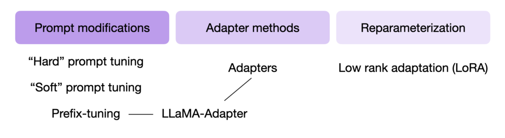

最近引起轟動的一項 PEFT 技術是 LLaMA-Adapter，它是為 Meta 流行的LLaMA 模型（[Touvron 等人](https://arxiv.org/abs/2302.13971)）提出的——然而，雖然 LLaMA-Adapter 是在 LLaMA 的背景下提出的，但這個手法是可套用到其它模型的微調上。

為了理解 LLaMA-Adapter 的工作原理，我們必須回顧兩種稱為 `prefix tuning` 和 `adapters` 的相關技術 - [LLaMA-Adapter](https://arxiv.org/abs/2303.16199) 結合並擴展了這兩種想法。

因此，在本文的其餘部分中，我們將討論 prompt modifications 的各種概念，以了解`prefix tuning` 和 `adapters` 方法，然後再仔細研究 LLaMA-Adapter。

### Prompt Tuning 與 Prefix Tuning

Prompt tuning 的最初概念是指改變輸入提示以獲得更好的建模結果的技術。例如，假設我們有興趣將英語句子翻譯成德語。我們可以通過各種不同的方式詢問模型，如下所示。

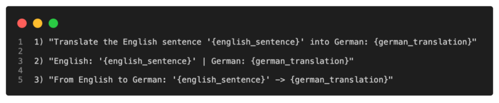

現在，上面說明的這個概念被稱為 `hard prompt tuning`，因為我們直接更改離散輸入標記，這些標記是不可微分的。

與 `hard prompt tuning` 相反，`soft prompt tuning` 將輸入標記的嵌入(embedding)與可訓練的張量連接起來，該張量可以通過反向傳播進行優化，以提高目標任務的建模性能。

Prompt tuning 的一種特殊形式是 `prefix tuning`（[Li 和Liang](https://arxiv.org/abs/2101.00190)）。`Prefix tuning` 的想法是向每個 **transformer block** 添加一個可訓練的張量，而不是像 `soft prompt tuning` 那樣僅添加輸入嵌入。

下圖說明了 regular transformer block 和使用 `prefix tuning` 修改的 `transformer block` 之間的區別。

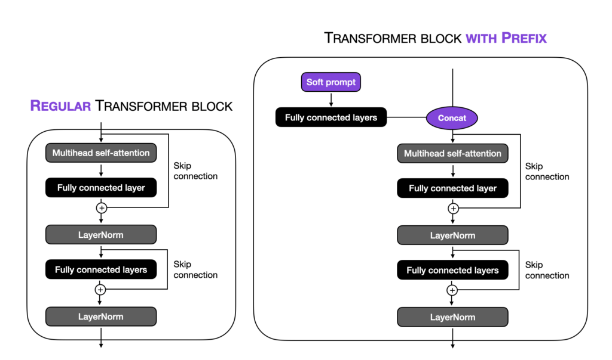


請注意，在上圖中，"fully connected layers" 指的是一個小型多層感知器（兩個全連接層，中間有一個非線性激活函數）。這些完全連接的層將 soft prompt 嵌入到與 transformer-block 輸入具有相同維度的特徵空間中，以確保串聯的兼容性。

使用（Python）偽代碼，我們可以說明常規 transformer block 和 prefix-modified transformer block 之間的區別，如下所示：

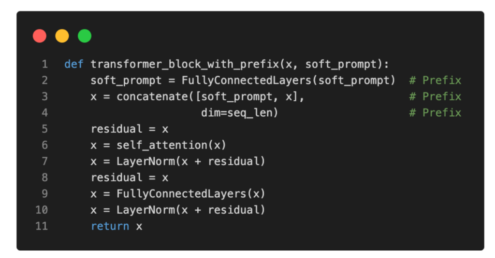

根據原始的 [prefix tuning 論文](https://arxiv.org/abs/2101.00190)，`prefix tuning` 實現了與微調所有層相當的模型性能，同時只需要訓練 `0.1%` 的參數—實驗基於 GPT-2 模型。此外，在許多情況下，`prefix tuning` 甚至優於所有層的微調，這可能是因為涉及的參數較少，這有助於減少對較小目標數據集的過度擬合。

最後，為了澄清在 inference 過程中 `soft prompts` 的使用：在學習 `soft prompts` 之後，我們必須在執行我們微調模型的特定任務時將其作為 `prefix` 提供。這使得模型能夠根據特定任務定制其響應。此外，我們可以有多個 `soft prompts` ，每個 `soft prompts` 對應不同的任務，並在 inference 過程中提供適當的 `prefix`，以實現特定任務的最佳結果。

## Adapters

原始的 `adapter` 方法（[Houlsby 等人](https://arxiv.org/abs/1902.00751)）與前面提到的 `prefix tuning` 有些相關，因為它們還向每個 transformer block 添加了額外的參數。但是，`adapter` 方法不是在輸入嵌入前面添加前綴，而是在兩個位置添加 `adapter` 層，如下圖所示。

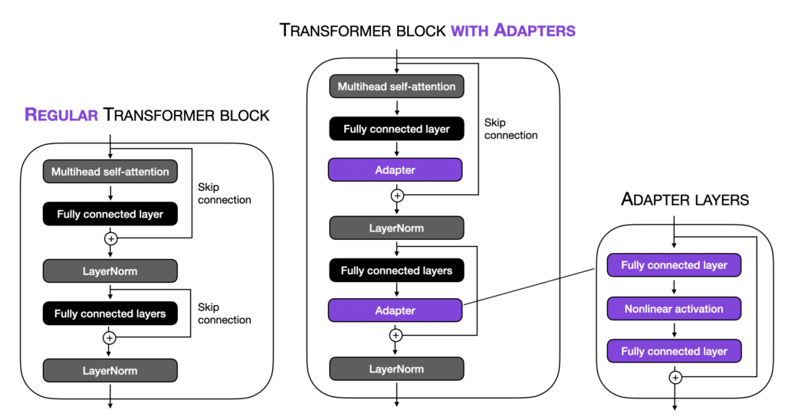

對於喜歡（Python）偽代碼的讀者，`adapter` 層可以編寫如下：

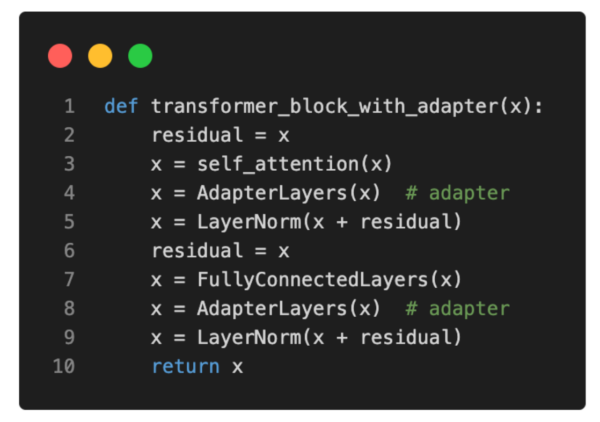

請注意，`adapter` 的全連接層通常相對較小，並且具有類似於自動編碼器的瓶頸結構。每個`adapter` block 的第一個全連接層將輸入投影到低維表示上。第二個全連接層將輸入投影回輸入維度。這個參數的效率如何？

例如，假設第一個全連接層將 1024 維輸入投影到 24 維，第二個全連接層將其投影回 1024 維。這意味著我們引入了 1,024 x 24 + 24 x 1,024 = 49,152 個權重參數。

相比之下，將 1024 維輸入重新投影到 1,024 維空間的單個全連接層將具有 1,024 x 1024 = 1,048,576 個參數。

根據最初的 [adapter paper](https://arxiv.org/abs/1902.00751)，使用 `adapter` 方法訓練的 BERT 模型達到了與完全微調的 BERT 模型相當的建模性能，而只需要訓練 `3.6%` 的參數。

現在的問題是 `adapter` 方法與 `prefix tuning` 相比如何。基於原來的 `prefix tuning` 論文，當調優模型參數總數的 0.1% 時，`adapter` 方法的表現比 `prefix tuning` 方法稍差。然而，當使用 `adapter` 方法調整 `3%` 的模型參數時，該方法與 `0.1%` 的模型參數的 `prefix tuning` 差不多。因此，我們可以得出結論，`prefix tuning` 方法是兩者中更有效的。

## LLaMA-Adapter

擴展了 `prefix tuning` 和原始 `adapter` 方法的思想，研究人員最近提出了 LLaMA-Adapter（[Zhang 等人](https://arxiv.org/abs/2303.16199)），這是一種 LLaMA 的參數高效微調方法（[LLaMA](https://github.com/facebookresearch/llama) 是 Meta 開發的 GPT 替代方案）。

與 `prefix tuning` 類似，LLaMA-Adapter 方法將可調整提示張量添加到嵌入輸入之前。值得注意的是，在 LLaMA-Adapter 方法中，`prefix` 是在嵌入表中學習和維護的，而不是外部提供的。模型中的每個 transformer block 都有自己獨特的學習 `prefix`，允許跨不同模型層進行更定制的適應。

此外，LLaMA-Adapter 引入了與 `gating` 相結合的 `zero-initialized attention` 機制。這種所謂的零初始化注意力和門控背後的動機是，`adapter` 和 `prefix tuning` 可能會通過合併隨機初始化的張量（前綴提示或適配器層）來破壞預訓練LLM 的語言知識，從而導致不穩定的微調和高損失值在初始訓練階段。

與前綴調整和原始適配器方法相比的另一個區別是 LLaMA-Adapter 僅將可學習的自適應提示添加到 `L` 個最上面的 transformer 層而不是所有 transformer 層。作者認為，這種方法可以更有效地調整專注於更高級別語義信息的語言表示。

雖然 LLaMA-Adapter 方法的基本思想與 prefix tuning 有關，但其實現方式還存在一些額外的細微差別。例如，只有 self-attention 輸入的鍵和值序列通過可調軟提示進行修改。然後，根據門控因子（在訓練開始時設置為零），使用或不使用前綴修改的注意力。這個概念在下面的可視化中得到了說明。

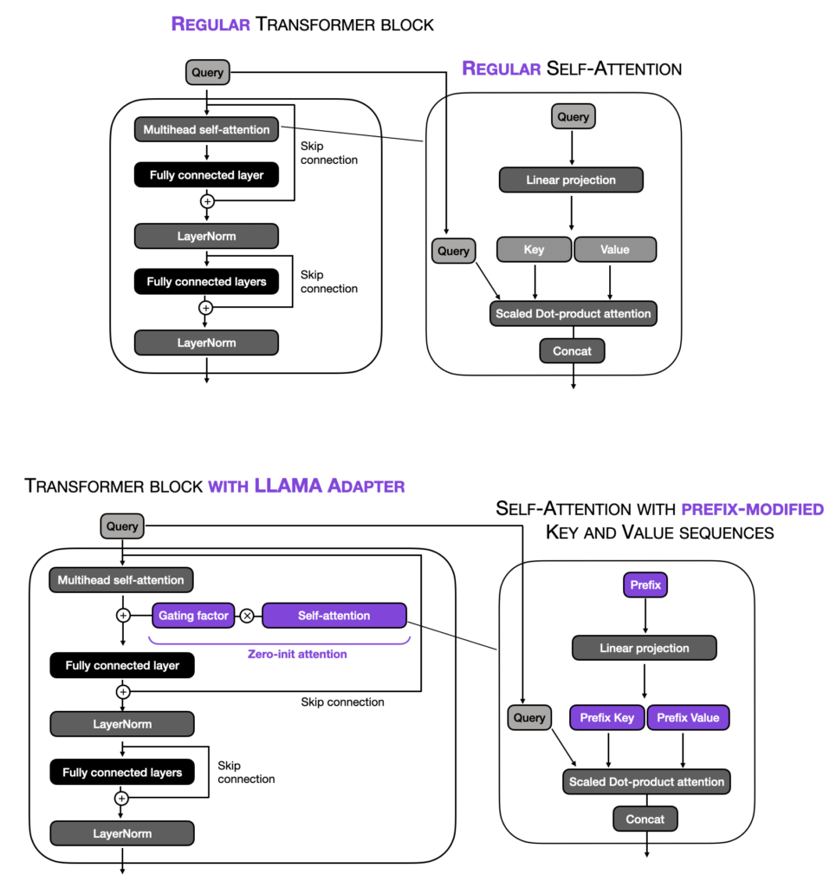

在偽代碼中，我們可以將其表達如下：

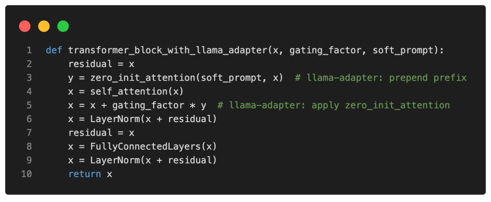

簡而言之，LLaMA-Adapter 和常規 `prefix tuning` 之間的區別在於 LLaMA-Adapter 僅修改頂部（即前幾個）transformer block，並引入門控機制來穩定訓練。雖然研究人員專門對 LLaMA 進行了實驗，但他們提出的 Adapter 方法是一種通用方法，也可以應用於其他類型的 LLM（如 GPT）。

使用 LLaMA-Adapter 方法，研究人員能夠在僅 1 小時內（使用 8 個 A100 GPU）在由 52k 指令對組成的數據集上微調 70 億個參數的 LLaMA 模型。此外，經過微調的 LLaMA-Adapter 模型在問答任務方面優於本研究中比較的所有其他模型，而僅需要微調 1.2 M 參數（適配器層）。

如果您想查看 LLaMA-Adapter 方法，您可以在[此處](https://github.com/ZrrSkywalker/LLaMA-Adapter)找到 GPL 許可的 LLaMA 代碼之上的原始實現。

或者，如果您的用例與 GPL 許可證不兼容（這要求您在類似許可證下開源所有衍生作品），請查看 [Lit-LLaMA GitHub 存儲庫](https://github.com/Lightning-AI/lit-llama)。 Lit-LLaMA 是基於 Apache 許可的 nanoGPT 代碼之上的 LLaMA 的可讀實現，其許可條款限制較少。

具體來說，如果您有興趣使用 LLaMA-Apapter 方法微調 LLaMA 模型，您可以運行

```python
python finetune_adapter.py
```

來自 [Lit-LLaMA GitHub 存儲庫](https://github.com/Lightning-AI/lit-llama)的腳本。

## 結論

微調預訓練的大型語言模型 (LLM) 是一種有效的方法，可以定制這些模型以滿足特定的業務需求並將其與目標領域數據保持一致。此過程涉及使用與所需領域相關的較小數據集調整模型參數，這使得模型能夠學習特定領域的知識和詞彙。

然而，由於 LLM “很大”，更新 transformer 模型中的多個層可能非常昂貴，因此研究人員開始開發參數高效的替代方案。

在本文中，我們討論了傳統 LLM 微調機制的幾種參數有效的替代方案。特別是，我們介紹了通過前綴調整和插入附加適配器層來預先設置可調軟提示。

最後，我們討論了最近流行的 LLaMA-Adapter 方法，該方法預先考慮可調軟提示，並引入額外的門控機制來穩定訓練。

如果您想在實踐中嘗試一下，請查看 [Lit-LLaMA 存儲庫](https://github.com/Lightning-AI/lit-llama)。