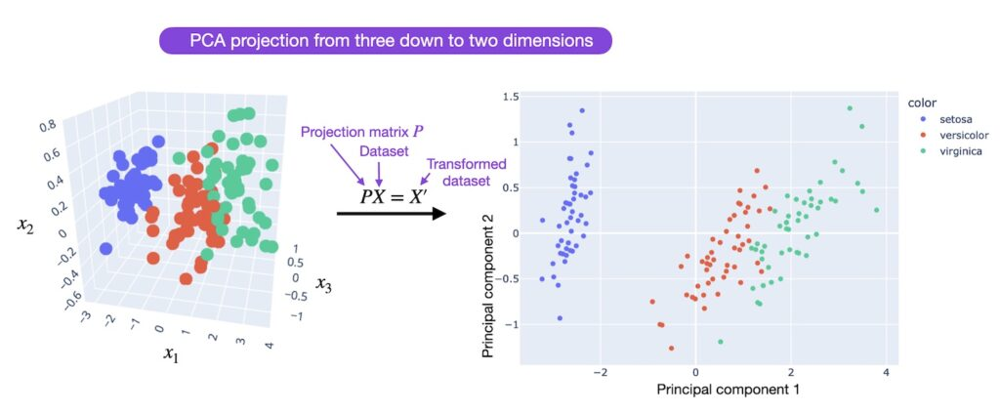
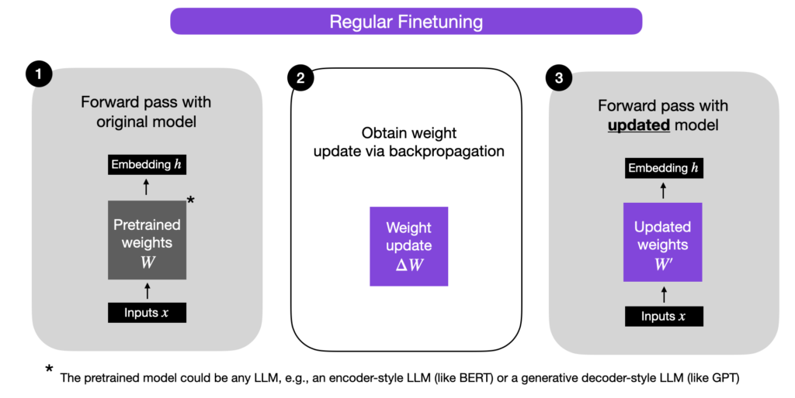
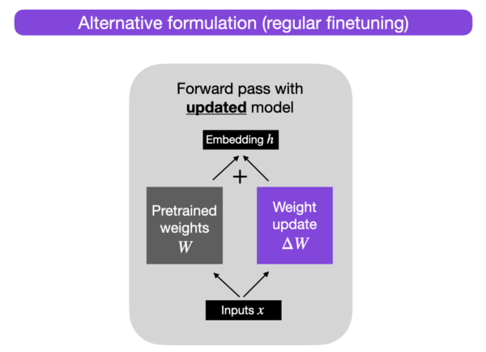
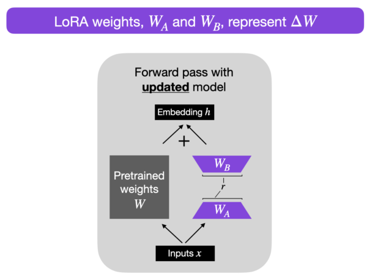
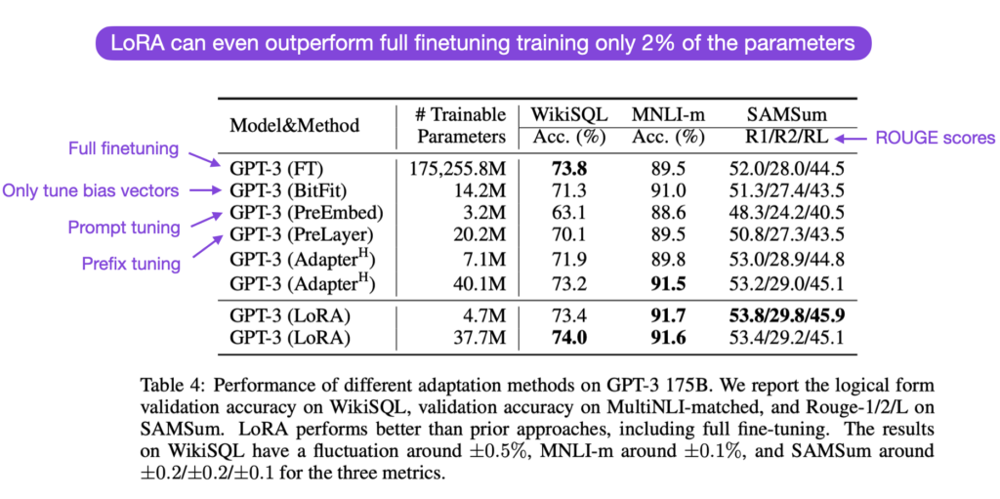
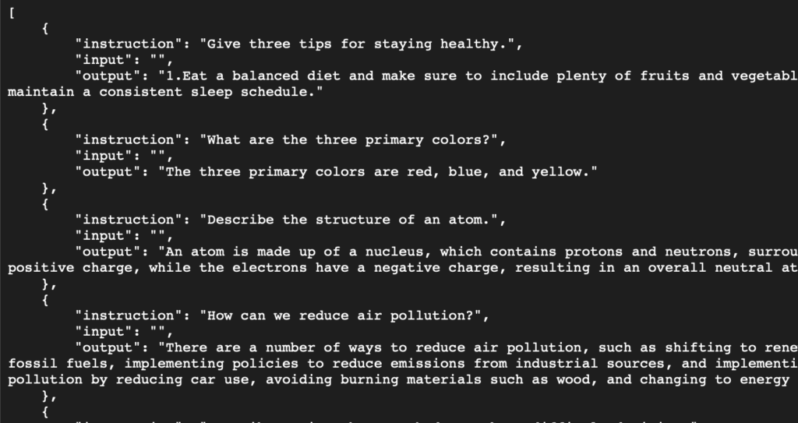
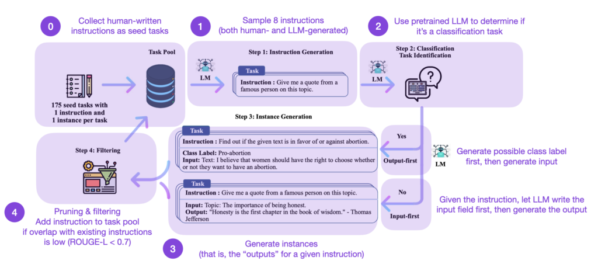

# LoRA 實現大模型 LLM 微調

原文:[Parameter-Efficient LLM Finetuning With Low-Rank Adaptation (LoRA)](https://lightning.ai/pages/community/article/lora-llm/)

在快速發展的人工智能領域，高效、有效地使用大型語言模型變得越來越重要。在本文中，您將學習如何以計算高效的方式通過 Low-Rank Adaptation (LoRA) 來微調 LLM！

## 為什麼要進行微調？

在快速發展的人工智能領域中，以高效和有效的方式使用大型語言模型變得越來越重要。預訓練的大型語言模型通常被稱為優秀的基礎模型，原因在於它們在各種任務上表現出色，

而大模型微調是將其適應到特定的目標任務或領域中。儘管預訓練的大型語言模型在各種任務上表現出色，但它們並不是為特定任務而設計的。通過微調，我們可以根據目標任務的需求對模型進行調整，使其在該任務上的性能得到進一步提升。

微調使我們能夠將模型調整到目標領域和目標任務。然而，它在計算上可能非常昂貴-模型越大，更新其層的成本就越高。作為更新所有層的替代方法，已經開發了參數高效(Parameter-Efficient Finetuning)的方法，例如前綴調整和適配器。

參考:[Understanding Parameter-Efficient Finetuning of Large Language Models: From Prefix Tuning to LLaMA-Adapters](https://lightning.ai/pages/community/article/understanding-llama-adapters/)

現在，又出現了一種更流行的參數高效微調技術：

[Low-rank adaptation (LoRA)](https://arxiv.org/abs/2106.09685)。 LoRA 是什麼？ 它是如何工作的？ 與其他流行的微調方法相比如何？讓我們在本文中回答所有這些問題！

## LoRA 思路

低秩適應（Low-Rank Adaptation）是一種參數高效的微調技術，其核心思想是對大型模型的權重矩陣進行隱式的低秩轉換。

什麼是低秩轉換呢？

整體的想法和概念與主成分分析（PCA）和奇異值分解（SVD）有關，我們{==通過一個較低維度的表示來近似表示一個高維矩陣或數據集==}。

換句話說，我們試圖找到原始特徵空間（或矩陣）中少數維度的（線性）組合，能夠捕捉數據集中大部分的信息。

如下圖所示：



### 提高權重更新效率

[LoRA: Low-Rank Adaptation of Large Language Models](https://arxiv.org/abs/2106.09685) 這篇論文提出了將權重變化

在我們深入了解 LoRA 之前，先簡要解釋一下正常微調期間的訓練過程。權重 ΔW

假設 W 表示神經網絡層中的權重矩陣。

使用常規的反向傳播，我們可以得到權重更新 ΔW，通常計算為損失的負梯度乘以學習率：

ΔW = α ( -∇ LW)

然後，當我們有了 ΔW ,之後，我們可以按照以下方式更新原始權重：

W‘ = W + ΔW

下圖中展示了這個過程，為了方便理解 LoRA 的思想，我們將權重更新矩陣和原始保持分開展示，並按照以下方式計算輸出：

h = Wx + ΔWx



其中 x 代表輸入，如下所示。



因此，當我們訓練神經網絡中全連接（即 "dense"）層時，如上所示，權重矩陣通常具有滿秩(full rank)，這是一個技術術語，意味著矩陣裡的行或列不具有任何線性相關性的行或列。相反於滿秩，低秩(low rank) 意味著矩陣具有冗餘的行或列。

詳細理解如下：

!!! quote

    在深度學習中，權重矩陣通常具有滿秩(full rank)，這意味著權重矩陣的行或列之間沒有線性相關關係，也就是說，每個權重在模型中承擔了不同的作用，沒有冗餘。這種情況下，權重矩陣能夠充分表達模型的複雜性和豐富的特徵表示能力。

    權重矩陣具有滿秩(full rank)的好處是，模型可以通過學習到的權重進行準確的預測和分類。每個權重都對模型的輸出產生影響，而且沒有多餘的冗餘信息。

    然而，在某些情況下，滿秩(full rank)的權重矩陣可能會導致一些問題。例如，當訓練數據量較少或數據噪聲較多時，權重矩陣可能會過擬合，導致模型泛化能力下降。此外，權重矩陣中的大量參數可能會導致計算和存儲的開銷很大。

    因此，在一些參數效率方面的研究中，人們開始關注如何利用低秩(low rank)矩陣來表示權重矩陣。通過使用低秩矩陣，我們可以降低參數的數量，減少計算和存儲的開銷，並且仍然保留了大部分原始權重矩陣的關鍵信息。這樣，我們可以在保持模型性能的同時，提高計算效率和模型的可解釋性。


因此，雖然預訓練模型的權重在預訓練任務中具有滿秩(full rank)，但 LoRA 的作者指出，當預訓練的大型語言模型適應新任務時，其內在維度(intrinsic dimension)很低，這是根據 [Aghajanyan 等人的研究(2020)](https://arxiv.org/abs/2012.13255) 得出的。換句話說：實際微調後的權重其實對比原始模型，能用到的權重其實很少。

低秩(low rank)維度意味著數據可以通過較低維度的空間有效表示或近似，同時保留其大部分重要信息或結構。換句話說，這意味著我們可以將適應任務的新權重矩陣分解為較低維度(較小)的矩陣，而不會丟失太多重要信息。

例如，假設 ΔW 是權重矩陣 A × B 的權重更新。然後，我們可以將權重更新矩陣劃分為幾個較小的矩陣：ΔW = WA x WB，其中 WA 是 `A × r-dimensional 矩陣`。

而 WB 是 `r × B-dimensional` 矩陣。

在這裡，我們保持原始權重 W 不變(frozen)，只訓練新的矩陣 WA 和 WB。簡言之，這就是 LoRA 方法的核心思想，如下圖所示。



### 決定 rank 參數

如上圖所展示 `r` 是一個超參數，我們可以用它來指定微調過程中所使用的 low-rank 矩陣的等級(rank)。較小的 `r` 會導致簡化的 low-rank 矩陣，從而減少微調過程中需要學習的參數數量。

這可以加快訓練速度，也可減少算力的需求。然而，較小 `r` 的會降低 low-rank 矩陣捕捉特定任務信息的能力。這可能導致質量降低，模型在新任務上的表現可能不如先前的好。

綜上所述，在 LoRA 中選擇較小的存在的模型複雜性、適應能力以及 underfitting 或 overfitting 的風險之間的權衡。因此，需要嘗試不同的大小的 `r` 值，以找到適合新任務所需性能的合適平衡點。

### LoRA 實現

LoRA 的實現相對簡單。我們可以將其視為對 LLM 模型的全連接層的 forward pass 結構的修改。讓我們使用 pseudo-code 來展示這個修改：

```python
input_dim = 768  # e.g., pre-trained model 該 layer 的 input 維度大小
output_dim = 768  # e.g., 該 layer 的 output 維度大小
rank = 8  # low-rank adaptation 的 rank (r 值) 大小設定

W = ... # 從 pretrained network 該層的權重矩陣 shape input_dim x output_dim

W_A = nn.Parameter(torch.empty(input_dim, rank)) # LoRA weight A
W_B = nn.Parameter(torch.empty(rank, output_dim)) # LoRA weight B

# 初始化 LoRA weights
nn.init.kaiming_uniform_(W_A, a=math.sqrt(5))
nn.init.zeros_(W_B)

# 原始的 forward-pass 的矩陣計算邏輯
def regular_forward_matmul(x, W):
    h = x @ W
    return h

# 加入 LoRA 後的 forward-pass 的矩陣計算邏輯
def lora_forward_matmul(x, W, W_A, W_B):
    h = x @ W  # regular matrix multiplication
    h += x @ (W_A @ W_B)*alpha # use scaled LoRA weights
    return h
```

在上面的 pseudo-code 中，`alpha` 是一個縮放因子，用於調整組合結果(原始模型輸出加上 low-rank adaptation)的大小。這參數是用來平衡預訓練模型的知識和新的特定任務的調適-默認情況下，`alpha` 通常設置為 `1`。另請注意，雖然 WA 初始化為隨機權重，但 WB 初始化為 `0`，以使訓練開始時 ΔW = WA x WB = 0，這意味著我們用原始權重開始訓練。

## 參數效率

當我們引入新的權重矩陣 (LoRA)，這個參數的效率如何？ 新矩陣 WA 和 WB 可以非常小。例如，假設 A=100，B=500，則 ΔW 的大小為 100×500=50,000。現在，如果我們將其分解為兩個較小的矩陣，即 100×5 維矩陣 WA 和 5×500 維矩陣 WB。這兩個矩陣總共只有 5×100 + 5×500 = 3,000 個參數。

## 降低推論開銷

請注意，在實踐中，如果我們在訓練後將原始權重 W 以及矩陣 WA 和 WB 分開，如上所示，我們將在推理過程中會產生額外的效率損失，因為 LoRA 引入了額外的計算步驟。相反，我們可以在訓練後通過 W' = W + WA x WB 更新權重，這類似於前面提到的 W' = W + ΔW。

然而，將權重矩陣 WA 和 WB 分開可能具有實際優勢。例如，假設我們希望將預訓練模型保留為各種客戶的基本模型，並且希望從基本模型開始為每個客戶創建一個經過微調的 LLM。在這種情況下，我們不需要為每個客戶存儲完整的權重矩陣 W'，其中存儲模型的所有權重 W' = W + WA x WB 對於 LLM 來說可能非常大，因為 LLM 通常有數十億到數万億的權重參數。因此，我們可以保留原始模型 W，只需要存儲新的輕量級矩陣 WA 和 WB。

為了用具體的數字來說明這一點，一個完整的 7B LLaMA 檢查點需要 23 GB 的存儲容量，而如果我們選擇 `r=8` 的 rank，LoRA 權重可以小至 8 MB。

## 在實踐中效果如何?

LoRA 在實踐中效果有多好？ 它與完全微調和其他參數高效方法相比如何？ 

根據 [LoRA 論文](https://arxiv.org/abs/2106.09685)，在多個特定任務的基準測試中，使用 LoRA 的模型的建模性能略好於使用 [Adapters](https://arxiv.org/abs/2110.07280)、[prompt tuning](https://arxiv.org/abs/2104.08691) 或 [prefix tuning](https://arxiv.org/abs/2101.00190) 的模型。

通常，LoRA 的性能甚至比微調所有層的效果還要好，如下面 LoRA 論文中的註釋表所示。(ROUGE 是評估語言翻譯性能的指標，我在[這裡](https://twitter.com/rasbt/status/1639625228622917632?s=20)更詳細地解釋了它。)



在這裡，值得注意的是 LoRA 與其他微調方法是互不影響的，這意味著它也可以與其它微調技術結合使用。

## LoRA 與 LLaMA

現在，讓我們使用 LoRA 的實現來微調 Meta 流行的 LLaMA 模型。由於這已經是一篇很長的文章，我不會在本文中包含詳細的代碼，但我建議查看 [Lit-LLaMA 存儲庫](https://github.com/Lightning-AI/lit-llama)，它是 Meta 流行的 LLaMA 模型的簡單、可讀的重新實現。

除了用於訓練和運行 LLaMA 本身的代碼（使用原始的 Meta LLaMA 權重）之外，它還包含使用 [LLaMA-Adapter](https://github.com/Lightning-AI/lit-llama/blob/main/finetune_adapter.py) 和 [LoRA](https://github.com/Lightning-AI/lit-llama/blob/main/finetune_lora.py) 微調 LLaMA 的代碼。

首先，我推薦以下操作方法文件：

1. 下載預訓練權重 [[download_weights.md](https://github.com/Lightning-AI/lit-llama/blob/main/howto/download_weights.md)]
2. 使用 LoRA 進行微調 [[finetune_lora.md](https://github.com/Lightning-AI/lit-llama/blob/main/howto/finetune_lora.md)]
3. 使用適配器進行微調 [[finetune_adapter.md](https://github.com/Lightning-AI/lit-llama/blob/main/howto/finetune_adapter.md)]（可選，用於比較研究）

在下一節中，我們將比較 7B LLaMA 基礎模型與使用 LoRA 和 LLaMA-Adapter 微調的 7B LLaMA 基礎模型。 （請注意，這需要具有至少 24 Gb RAM 的 GPU）。(關於LLaMA-Adapter方法的更多詳細內容請看[From Prefix Tuning to LLaMA-Adapters](https://lightning.ai/pages/community/article/understanding-llama-adapters/))

## 計算性能基準比對

在本節中，我們將比較 LLaMA 7B 基礎模型與使用 LoRA 和 LLaMA-Adapter 微調的基礎模型的計算性能。

微調數據集是[這裡](https://github.com/tatsu-lab/stanford_alpaca#data-release)描述的 Alpaca 52k 指令數據集，其結構如下：



數據集本身是按照 [Self-Instruct 論文](https://arxiv.org/abs/2212.10560)中描述的方法生成的，由 49,759 個訓練示例和 2000 個驗證示例組成。Self-Instruct 程序可概括為 4 個步驟：

1. 包含一組人工編寫指令（本例中為 175 條）和示例指令的種子任務池
2. 使用預訓練的 LLM（如 GPT-3）來確定任務類別
3. 給定新指令，讓預訓練的 LLM 生成響應
4. 在將響應添加到任務池之前要進行收集、修剪和過濾響應



請注意，Alpaca 52k 數據集是使用上述自動 self-instruct 程序收集出來的。但是，您也可以使用替代數據集進行比較。例如，一個有趣的候選者是最近發布的開源 [databricks-dolly-15k 數據集](https://github.com/databrickslabs/dolly/tree/master/data)，其中包含由 Databricks 員工編寫的約 15k instruction/response 微調記錄。 Lit-LLaMA 存儲庫包含一個數據集準備腳本，如果您想使用 Dolly 15k 數據集而不是 Alpaca 52k 數據集。

給定以下超參數設置(block size、batch size 和 LoRA `r`)，Adapter 和 LoRA 都可以使用 `bfloat-16` 混合精度訓練在具有 24 Gb RAM 的單個 GPU 上微調 7B 參數 LLaMA 基本模型。

### LoRA

```python
learning_rate = 3e-4
batch_size = 128
micro_batch_size = 4
gradient_accumulation_steps = batch_size // micro_batch_size
epoch_size = 50000 # train dataset size
num_epochs = 5
max_iters = num_epochs * epoch_size // micro_batch_size // devices
weight_decay = 0.0
block_size = 512
lora_r = 8
lora_alpha = 16
lora_dropout = 0.05
warmup_steps = 100
```

### LaMA Adapter

```python
learning_rate = 9e-3
batch_size = 128 / devices
micro_batch_size = 4
gradient_accumulation_steps = batch_size // micro_batch_size
epoch_size = 50000 # train dataset size
num_epochs = 5
max_iters = num_epochs * epoch_size // micro_batch_size // devices
weight_decay = 0.02
block_size = 512
warmup_steps = epoch_size * 2 // micro_batch_size // devices
```

如果將來代碼發生變化，我會將代碼（帶有超參數設置）包含在 GitHub 上。

Adapter 使用了大約 22 Gb，並在 A100 上於 162 分鐘內完成了 62,400 次迭代。 LoRA 使用 21 Gb 內存並在 192 分鐘內完成。總之，基於 Lit-LLaMA 實現，Adapter 和 LoRA 使用大致相同數量的 RAM，並且具有大致相同的訓練時間。(請注意，這是在單個 GPU 上進行的，但如果您有多個 GPU，只需將 devices 參數更改為 > 1 即可獲得額外的加速！)

相比之下，完全微調 (LLaMA 7B consists of 32 transformer blocks and 3 fully connected output layers) 需要至少 2 個具有至少 30 Gb 的 GPU 和完全分片的訓練來分配權重。或者，您可以使用 4 個 GPU，每個 GPU 的最大內存使用量為 22 Gb。在 4 個 GPU 上進行訓練，訓練時間為 1956 分鐘。這在單個 GPU 上至少需要 6,000 分鐘，這比參數高效的 LLaMA-Adapter 或 LoRA 替代方案貴 30-40 倍。

接下來，讓我們看看應用不同的微調策略後的模型輸出。

## 模型性能評估

有多種指標可用於評估 LLM 生成的文本。例如，perplexity、BLEU 和 ROUGE 分數是自然語言處理中最常用的一些評估指標，用於評估 LLM 在各種任務中的表現。然而，所有這些指標都有很大的缺點，而人工評估仍然是黃金標準—人工評估的缺點是創建成本高昂且難以自動化。

由於這已經是一篇很長的文章，因此我將不再詳細討論模型評估方法，並將在將來將其推遲到另一篇文章中。在未來的文章中，我們將研究不同的問答數據集包括:

- [wikitext](https://paperswithcode.com/dataset/wikitext-2)
- [c4](https://paperswithcode.com/dataset/c4)
- [ptb](https://www.kaggle.com/datasets/bjoernjostein/ptbxl-electrocardiography-database)

以及上述指標。因此，為了簡單起見，我們將僅關注下面的 qualitative 模型比較，查看各種模型生成的一些輸出。

### 定性比較

為了定性地比較模型，我們將使用提示 "Please explain how weight decay works"

**Base model**

```python
$ python generate.py \
    --checkpoint_path checkpoints/lit-llama/7B/lit-llama.pth
```

結果:

```bash
Please explain how weight decay works…and why it sometimes seems to work and sometimes doesn’t!

In the simplest terms, weight decay removes features from the model (as a function of how important they are). It is also known as regularization.

Regularization has

Time for inference 1: 4.18 sec total, 11.95 tokens/sec
```

正如我們所看到的，模型開始通過附加 "…and why it sometimes seems to work and sometimes doesn’t!" 來繼續提示。這是因為基本模型僅針對下一個單詞預測任務進行了訓練，並且沒有經過專門訓練來遵循 instruction。儘管如此，它還是嘗試在下面進一步解釋。該解釋總體上對正則化做出了一些正確的陳述，但它並沒有真正抓住權重衰減的關鍵機制。

**LLaMA-Adapter**

```python
$ python generate_adapter.py \
    --adapter_path out/adapter/alpaca/lit-llama-adapter-finetuned.pth \
    --pretrained_path checkpoints/lit-llama/7B/lit-llama.pth
```


結果:

```bash
Weight decay is a way to penalize terms for their word-count. By choosing sentences with fewer words, a model is more likely to select those sentences, which may provide important information.

Time for inference: 7.04 sec total, 14.21 tokens/sec

Memory used: 13.56 GB
```

這個解釋在語法上是合理的，但還不是我們想要的。

**LoRA**

```python
$ python generate_lora.py \
    --lora_path out/lora/alpaca/lit-llama-lora-finetuned.pth \
    --pretrained_path checkpoints/lit-llama/7B/lit-llama.pth
```

結果:

```bash
Weight decay is an algorithm parameter used in machine learning models to reduce overfitting. It is a process where the weights of the model are adjusted in order to decrease the influence of less-important features in the model and prevent overfitting. Weight decay is used by adding a small amount of noise to the weights to reduce the impact of the model on the training data. This process encourages the model to focus more on the features that are more important to the predictive task.

Time for inference: 3.25 sec total, 30.76 tokens/sec

Memory used: 27.65 GB
```

結果越來越近了；當我們考慮廣義線性模型時，這種解釋確實有意義，在廣義線性模型中，我們迫使模型學習與輸入特徵相乘的較小權重參數。在神經網絡中，這通常應用於模型中的所有權重參數。

請注意，在推論的過程中使用 LoRA 的方法是目前使用最多內存。然而，我們可以通過將 LoRA 權重與預訓練模型權重合併來減少內存使用量，如前所述。

這種定性概述只是這些模型功能的一小部分，因為評估 LLM 本身就是一個大主題。我們將在以後的更詳細的文章中重新討論這個主題。但作為這裡的要點，LoRA 可用於以相對經濟高效的方式在 instruction dataset 上微調 LLM。

## 結論

在本文中，我們討論了 low-rank adaptation(LoRA)，這是一種 parameter-efficient 的完全微調替代方案。我們看到，使用 LoRA 在單個 GPU 上可以在幾個小時內完成對 LLaMA 等相對較大模型的微調，這對於那些不想在 GPU 資源上花費數千美元的人來說特別有吸引力。 LoRA 的特別之處在於，我們可以選擇將新的 LoRA 權重矩陣與原始的預訓練權重合併，這樣我們就不會在推理過程中產生額外的開銷或複雜性。

隨著越來越多 ChatGPT 或 GPT-4 的開源替代方案的出現，針對特定目標數據集或目標對這些 LLM 進行微調和定制將在各個研究領域和行業中變得越來越有吸引力。 LoRA 等參數高效的微調技術使微調更加資源高效且易於訪問。

[Lit-LLaMA 存儲庫](https://github.com/Lightning-AI/lit-llama)中提供了 LoRA 和 LLaMA-Adapter 等參數高效的微調技術。