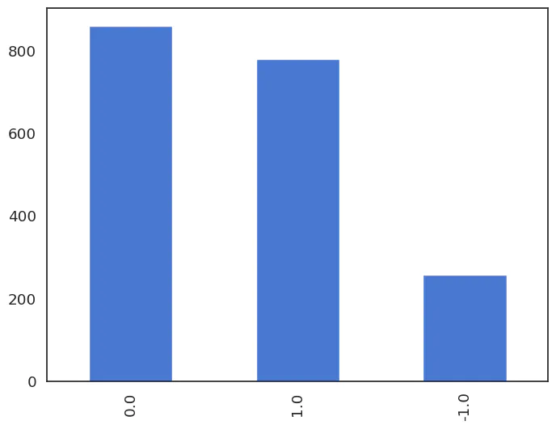

# 微調 Alpaca 和 LLaMA：使用自定義數據集

原文:[Fine-tuning Alpaca and LLaMA: Training on a Custom Dataset](https://www.mlexpert.io/machine-learning/tutorials/alpaca-fine-tuning)


歡迎來到 Alpaca LoRa 微調教程！在本教程中，我們將探索微調 Alpaca LoRa 以檢測比特幣推文中的情緒的過程。

[Alpaca LoRa 存儲庫](https://github.com/tloen/alpaca-lora/)提供了使用 low-rank adaptation (LoRA) 來重現 [Stanford Alpaca 模型](https://crfm.stanford.edu/2023/03/13/alpaca.html)的程式碼。其中包括質量與 `text-davinci-003` 類似的 Instruct 模型。該程式碼可以擴展到 13b、30b 和 65b 模型，訓練的設計使用了 Hugging Face 的 [PEFT](https://github.com/huggingface/peft) 和 Tim Dettmers 的 [bitsandbytes](https://github.com/TimDettmers/bitsandbytes) 來高效且平價地進行模型微調。

我們將介紹在特定數據集上微調 Alpaca LoRa 的整個過程，從數據準備開始，到訓練模型的部署結束。本教程將涵蓋數據處理、模型訓練和使用流行的自然語言處理庫（例如 Transformers 和 Hugging Face）進行評估等主題。此外，我們還將介紹如何使用 Gradio 應用程序部署和測試模型。

!!! info
    在本教程中，我們將使用 Jupyter Notebook 來運行。如果您願意繼續操作，可以在此處訪問筆記本：[打開筆記本](https://colab.research.google.com/drive/1X85FLniXx_NyDsh_F_aphoIAy63DKQ7d?usp=sharing)

## 筆記本設置

[alpaca-lora GitHub 存儲庫](https://github.com/tloen/alpaca-lora/)提供了一個腳本 (`finetune.py`) 來訓練模型。在本教程中，我們將利用此程式碼並對其進行調整，以便在 Google Colab 環境中無縫工作。

讓我們首先從存儲庫安裝必要的依賴項：

```python
!pip install -U pip
!pip install accelerate==0.18.0
!pip install appdirs==1.4.4
!pip install bitsandbytes==0.37.2
!pip install datasets==2.10.1
!pip install fire==0.5.0
!pip install git+https://github.com/huggingface/peft.git
!pip install git+https://github.com/huggingface/transformers.git
!pip install torch==2.0.0
!pip install sentencepiece==0.1.97
!pip install tensorboardX==2.6
!pip install gradio==3.23.0
```

安裝依賴項後，我們將繼續導入所有必需的套件並配置 `matplotlib` 繪圖的設置：

```python
import transformers
import textwrap
from transformers import LlamaTokenizer, LlamaForCausalLM
import os
import sys
from typing import List
 
from peft import (
    LoraConfig,
    get_peft_model,
    get_peft_model_state_dict,
    prepare_model_for_int8_training,
)
 
import fire
import torch
from datasets import load_dataset
import pandas as pd
 
import matplotlib.pyplot as plt
import matplotlib as mpl
import seaborn as sns
from pylab import rcParams
 
%matplotlib inline

sns.set(rc={'figure.figsize':(10, 7)})
sns.set(rc={'figure.dpi':100})
sns.set(style='white', palette='muted', font_scale=1.2)
 
DEVICE = "cuda" if torch.cuda.is_available() else "cpu"

DEVICE
```

## 數據

我們將使用 [BTC Tweets Sentiment dataset](https://www.kaggle.com/datasets/aisolutions353/btc-tweets-sentiment)，該數據集可在 Kaggle 上獲取，它包含大約 50,000 條與比特幣相關的推文。為了清理數據，我刪除了所有以 `RT` 開頭或包含鏈接的推文。現在讓我們下載數據集：

```python
!gdown 1xQ89cpZCnafsW5T3G3ZQWvR7q682t2BN
```

我們可以使用 Pandas 來加載 CSV：

```python
df = pd.read_csv("bitcoin-sentiment-tweets.csv")

df.head()
```

|	|date	|tweet	|sentiment|
|---|-------|-------|---------|
|0	|Fri Mar 23 00:40:40 +0000 2018	|@p0nd3ea Bitcoin wasn't built to live on exchanges.	|1|
|1	|Fri Mar 23 00:40:40 +0000 2018	|@historyinflicks Buddy if I had whatever series of 19th diseases Bannon clearly has I'd want to be a bitcoin too.	|1|
|2	|Fri Mar 23 00:40:42 +0000 2018	|@eatBCH @Bitcoin @signalapp @myWickr @Samsung @tipprbot patience is truly a virtue	|0|
|3	|Fri Mar 23 00:41:04 +0000 2018	|@aantonop Even if Bitcoin crash tomorrow morning, the technology it's still revolutionary. A way of simplifying it. #Ihavetobepartofthis	|0|
|4	|Fri Mar 23 00:41:07 +0000 2018	|I am experimenting whether I can live only with bit coins donated. Please cooperate.	|1|

我們的數據集包含大約 1900 條推文。

情緒標籤以數字表示，其中 `-1` 表示負面情緒，`0` 表示中性情緒，`1` 表示正面情緒。我們來看看他們的分佈：

```python
df.sentiment.value_counts()
```

結果:

```bash
 0.0    860
 1.0    779
-1.0    258
Name: sentiment, dtype: int64
```

```python
df.sentiment.value_counts().plot(kind='bar');
```



負面情緒的分佈明顯較低，在評估微調模型的性能時應予以考慮。

## 構建 JSON 數據集

原始 [Alpaca 存儲庫中的 dataset 的格式](https://github.com/tatsu-lab/stanford_alpaca#data-release)由一個 JSON 文件組成，該文件包含包含 `instruction`、`input` 和 `output` 字串的 object 列表。

讓我們將 Pandas dataframe 轉換為符合原始 Alpaca 存儲庫中格式的 JSON 文件：

```python
def sentiment_score_to_name(score: float):
    if score > 0:
        return "Positive"
    elif score < 0:
        return "Negative"
    return "Neutral"
 
dataset_data = [
    {
        "instruction": "Detect the sentiment of the tweet.",
        "input": row_dict["tweet"],
        "output": sentiment_score_to_name(row_dict["sentiment"])
    }
    for row_dict in df.to_dict(orient="records")
]
 
dataset_data[0]
```

結果:

```bash
{
  "instruction": "Detect the sentiment of the tweet.",
  "input": "@p0nd3ea Bitcoin wasn't built to live on exchanges.",
  "output": "Positive"
}
```

最後，我們將保存生成的 JSON 文件，以便稍後使用它來訓練模型：

```python
import json

with open("alpaca-bitcoin-sentiment-dataset.json", "w") as f:
   json.dump(dataset_data, f)
```

## 模型 Weights

我們將使用 HuggingFace 上的 [decapoda-research/llama-7b-hf](https://huggingface.co/decapoda-research/llama-7b-hf) LLaMA v1 權重：

```python
BASE_MODEL = "decapoda-research/llama-7b-hf"
 
model = LlamaForCausalLM.from_pretrained(
    BASE_MODEL,
    load_in_8bit=True,
    torch_dtype=torch.float16,
    device_map="auto",
)
 
tokenizer = LlamaTokenizer.from_pretrained(BASE_MODEL)
 
tokenizer.pad_token_id = (
    0  # unk. we want this to be different from the eos token
)

tokenizer.padding_side = "left"
```

此程式碼使用 Hugging Face `Transformers` 套件中的 `LlamaForCausalLM` 類別加載預訓練的 Llama 模型。 `load_in_8bit=True` 參數代表使用 8-bit quantization 加載模型，以減少內存使用並提高推理速度。

該程式碼還使用 `LlamaTokenizer` 類別加載同一 Llama 模型的 tokenizer，並為填充標記(padding token)設置一些附加屬性。具體來說，它將 `pad_token_id` 設置為 `0` 以表示未知令牌(unknown tokens)，並將 `padding_side` 設置為 "left" 以在左側填充序列。

現在我們已經加載了模型和分詞器，我們可以繼續使用 HuggingFace `datasets` 套件中的 `load_dataset()` 函數加載之前保存的 JSON 文件：

```python
data = load_dataset("json", data_files="alpaca-bitcoin-sentiment-dataset.json")

data["train"]
```

