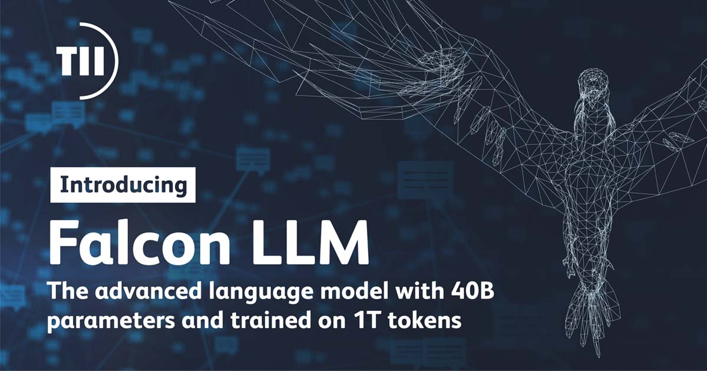
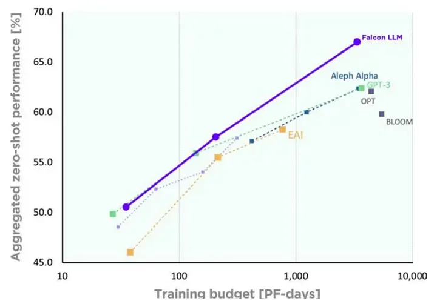
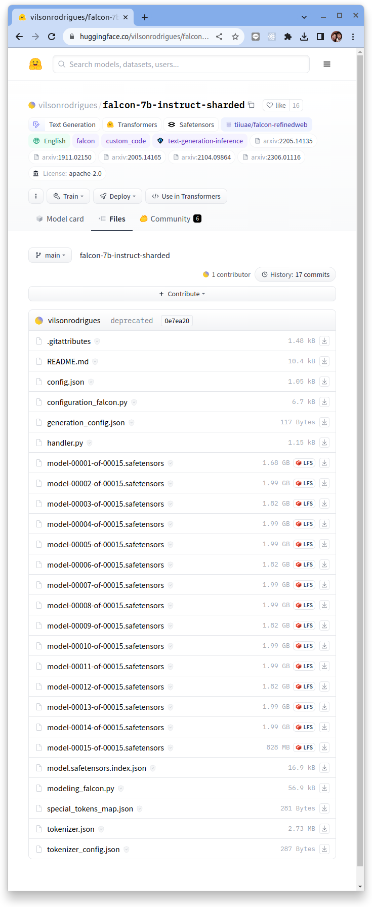

# 使用 4-bit quantization 與 6GB GPU 運行 Falcon-7B-Instruct



原文: [Run your private LLM: Falcon-7B-Instruct with less than 6GB of GPU using 4-bit quantization](https://vilsonrodrigues.medium.com/run-your-private-llm-falcon-7b-instruct-with-less-than-6gb-of-gpu-using-4-bit-quantization-ff1d4ffbabcc)

Falcon 是 [TII](https://falconllm.tii.ae/) 在 Apache 2.0 許可下推出的完全開源模型。

!!! quote
    Falcon LLM 是在 1 萬億個 tokens 上訓練的有著 400 億個參數的基礎大型語言模型 (LLM)。 TII 現已發布 Falcon LLM — 40B 模型。

    該模型僅使用 GPT-3 訓練計算 75% 的算力、Chinchilla 的 40% 的算力和 PaLM-62B 的 80% 的算力。



在 HuggingFace 的 OpenLLM 排行榜上，Falcon 曾占據排名第一的位置，壓制了 META 的 LLaMA-65B。

!!! quote
    Falcon 是一個包含 400 億個參數的自回歸解碼器(autoregressive decoder-only) 模型，在 1 萬億個 token 上進行訓練。它在 AWS 上的 **384** 個 GPU 上進行了兩個月的訓練。

    Falcon 的預訓練數據集是從網絡上使用爬蟲來抓取收集的。使用 `CommonCrawl` 的 dumps，經過大量過濾（以刪除機器生成的文本和成人內容）和重複數據刪除後，組裝了包含近 5 萬億個令牌的預訓練數據集。

Falcon 有一個參數為 7B 的弟弟，在 1.5T 的 token 上進行訓練。兩者都在 instruct 數據集中進行了微調。缺點是該模型的序列長度為 `2048` 個 tokens。

- [Falcon-40B-Instruct](https://huggingface.co/tiiuae/falcon-40b-instruct)
- [Falcon-7B-Instruct](https://huggingface.co/tiiuae/falcon-7b-instruct)

`Falcon-7B-Instruct` 的模型存在硬碟的空間大小約為 15GB，如何放置在小於 6GB 的 GPU 上？ 量化（Quantization)。

## 準備模型

[bitsandbytes](https://github.com/TimDettmers/bitsandbytes) 是一個令人驚嘆的套件，可在深度學習模型中應用量化來壓縮模型使用 GPU VMem 的大小。 HuggingFace 與 bnb 啟動整合。在[Making LLMs even more accessible with bitsandbytes, 4-bit quantization and QLoRA
](https://huggingface.co/blog/4bit-transformers-bitsandbytes)文章中，他們解釋瞭如何使用 4-bit quantization 來運行模型。

接著我們將在 Colab 中執行了這些相同的步驟。但在進行之前，我們需要將原始 `Falcon-7B-Instruct` 模型權重轉換為較小的 chunk，以便使用 [Accelerate](https://huggingface.co/docs/accelerate/index) 有效加載模型。由於原始權重很大，它消耗了 Colab 運算環境中的所有 RAM。

- [vilsonrodrigues/falcon-7b-instruct-sharded](https://huggingface.co/vilsonrodrigues/falcon-7b-instruct-sharded)



## 啟動 Falcon-7B-Instruct 模型

如果想要重新在你自己的環境來進行下列的操作, 你需要:

1. 登入 Colab 
2. 確定 runtime 有掛載了 T4 GPU

Colab Notebook 鏈結: [使用 4-bit quantization 與 6GB GPU 運行 Falcon-7B-Instruct](https://colab.research.google.com/drive/1dHb0eX4YKV2o2NZdXfOr76vTuIQVjHMT?usp=sharing)

### 安裝套件

```python
!pip install -q -U bitsandbytes
!pip install -q -U git+https://github.com/huggingface/transformers.git
!pip install -q -U git+https://github.com/huggingface/peft.git
!pip install -q -U git+https://github.com/huggingface/accelerate.git
!pip install -q -U einops
!pip install -q -U safetensors
```

### 配置 `bitsandbytes`

4-bit 的量化模型壓縮整合的設定裡有 2 種不同的量化類型: `FP4` 和 `NF4`。`NF4` dtype 代表 `Normal Float 4`，在 QLoRA 論文中介紹了 `NF4` 的結構。

你可以使用 [`BitsAndBytesConfig`](https://huggingface.co/docs/transformers/v4.32.1/en/main_classes/quantization#transformers.BitsAndBytesConfig) 中的 `bnb_4bit_quant_type` 在這兩種 dtype 之間切換(預設情況下，使用 `FP4` 量化)。

4-bit 的量化模型壓縮設定可以節省GPU VMemory內存的使用，這樣的技術讓我們可以在 NVIDIA-T4 16GB 上微調 llama-13b 模型，序列長度為 `1024`，批量大小為 `1`，梯度累積步長為 `4`。

另外 double quantization 是可再讓 VMemory 使用減少的技術。`double quantization` 是在第一次量化之後再使用第二次量化，以便為每個參數額外節省 `0.4` bit。

要啟用此功能，只需在創建量化配置時添加 `bnb_4bit_use_double_quant=True` 即可！在本次的實驗中, 我們將使用 `NF4`!

```python
import torch
from transformers import BitsAndBytesConfig

quantization_config = BitsAndBytesConfig(
    load_in_4bit=True,
    bnb_4bit_compute_dtype=torch.float16,
    bnb_4bit_quant_type="nf4",
    bnb_4bit_use_double_quant=True,
)
```

### 加載 Model 和 Pipeline

```python
from transformers import AutoModelForCausalLM, AutoTokenizer,pipeline

# smaller chunks on safetensors for low RAM environments
model_id = "vilsonrodrigues/falcon-7b-instruct-sharded"

model_4bit = AutoModelForCausalLM.from_pretrained(
        model_id,
        device_map="auto",
        quantization_config=quantization_config,
        trust_remote_code=True)

tokenizer = AutoTokenizer.from_pretrained(model_id)
```

讓我們檢視一下 Falcon 模型結構:

```python
print(model_4bit)
```

結果:

```bash hl_lines="13-15"
FalconForCausalLM(
  (transformer): FalconModel(
    (word_embeddings): Embedding(65024, 4544)
    (h): ModuleList(
      (0-31): 32 x FalconDecoderLayer(
        (self_attention): FalconAttention(
          (maybe_rotary): FalconRotaryEmbedding()
          (query_key_value): Linear4bit(in_features=4544, out_features=4672, bias=False)
          (dense): Linear4bit(in_features=4544, out_features=4544, bias=False)
          (attention_dropout): Dropout(p=0.0, inplace=False)
        )
        (mlp): FalconMLP(
          (dense_h_to_4h): Linear4bit(in_features=4544, out_features=18176, bias=False)
          (act): GELU(approximate='none')
          (dense_4h_to_h): Linear4bit(in_features=18176, out_features=4544, bias=False)
        )
        (input_layernorm): LayerNorm((4544,), eps=1e-05, elementwise_affine=True)
      )
    )
    (ln_f): LayerNorm((4544,), eps=1e-05, elementwise_affine=True)
  )
  (lm_head): Linear(in_features=4544, out_features=65024, bias=False)
)
```

從模型架構的 summary 中, 我們可觀察到線性層(linear layer)被量化為 `4bit`。

檢查 Colab 中的 VRAM 消耗。可看到大約用了 5.3GB 顯存！ 🤯

### 推論驗證

接著要要這個 Falcon-7b 模型來進行 inference, 讓我們使用 Hugging face 的 [pipeline](https://huggingface.co/docs/transformers/main_classes/pipelines) 類別來包覆整個模型與設定。

```python
import torch
import transformers

pipeline = transformers.pipeline(
        "text-generation", # 要進行的 task 類型
        model=model_4bit,  # 要使用的 llm model
        tokenizer=tokenizer, # 要使用的 tokenizer
        use_cache=True,
        device_map="auto", # 定義設備
        max_length=296,
        do_sample=True,
        top_k=10,
        num_return_sequences=1,
        eos_token_id=tokenizer.eos_token_id,
        pad_token_id=tokenizer.eos_token_id,
)
```

測試一下:

```python
sequences = pipeline(
   "Girafatron is obsessed with giraffes, the most glorious animal on the face of this Earth. Giraftron believes all other animals are irrelevant when compared to the glorious majesty of the giraffe.\nDaniel: Hello, Girafatron!\nGirafatron:"
   )
```

結果:

```bash
[{'generated_text': "Girafatron is obsessed with giraffes, the most glorious animal on the face of this Earth. Giraftron believes all other animals are irrelevant when compared to the glorious majesty of the giraffe.\nDaniel: Hello, Girafatron!\nGirafatron: Ahhh, hello Daniel!\nDaniel: How's it goin' today?\nGirafatron: I'm a-giraf-in' just fine, thank you so much for asking!\nI'll be there soon\nGirafatron - a-giraf-in\nI'll be there soon.\nGirafatron, the giraffe of all the giraffes."}]
```

## 與 LangChain 配合使用

[LangChain](https://github.com/hwchase17/langchain) 是一個多功能框架，旨在支持語言模型驅動的應用程序的開發。通過利用 `LangChain` 的能力，我們可以快速創建強大且高效的應用程序⚡。

```python
# Some error in colab. fix with
import locale
locale.getpreferredencoding = lambda: "UTF-8"
```

安裝 `langchain` 套件:

```bash
!pip install langchain
```

### 創建一個簡單的 chain

```python
from langchain import HuggingFacePipeline
from langchain import PromptTemplate, LLMChain

llm = HuggingFacePipeline(pipeline=pipeline)

template = """Question: {question}
Answer: Let's think step by step."""

prompt = PromptTemplate(
    template=template, 
    input_variables= ["question"]
)

llm_chain = LLMChain(prompt=prompt, llm=llm)
```

讓我們進行一些驗測:

**Test#1:**

```python
llm_chain("How to prepare eggs?")
```

結果:

```bash
{'question': 'How to prepare eggs?',
 'text': " First, we need eggs from hens. Next, you have to keep the hens comfortable. They don't lay if they're cold, so you need to have a warm environment. You also need to keep them away from other hens and predators. Then, the eggs need to be laid in a nesting box or nesting tray. You can keep the eggs clean by using a nesting box liner. Finally, after the eggs are laid, you need to keep the hens comfortable by providing a clean, dry nest."}
```

**Test#2:**

```python
template2 = """Question: /n {question}. Answer: """

prompt2 = PromptTemplate(
    template=template2,
    input_variables= ["question"]
)

llm_chain_2 = LLMChain(prompt=prompt2, llm=llm)

result_explanation = llm_chain_2("Explain antibiotics")

result_explanation['text']
```

結果:

```bash
/n
Antibiotics are medications that are used to treat bacterial infections in the body. They work by preventing bacteria from growing and spreading, thus killing the bacteria or reducing their numbers. There are several classes of antibiotics, such as tetracycline, macrolide, penicillin, cephalosporin, and fluoroquinolones. Antioxidants, such as vitamin C, can also be taken along with antibiotics to reduce the risk of side effects.
```

## 結論

Falcon 模型很驚人但它還沒有達到與 ChatGPT 相同的表現。同時它也不是最快的 token 生成模型。即便如此，Falcon-7B 模型也可以完成許多 LLm 基本的應用。如果想要更完整的 LLM，您應該選擇 40B。

