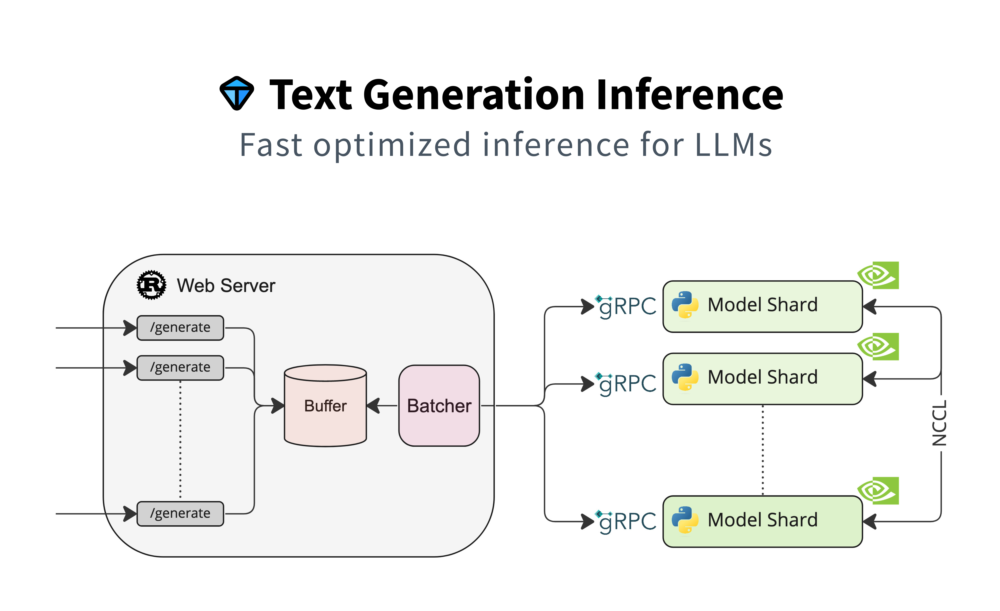

#  Falcon 模型提供推論服務使用 🤗 TGI



原文: [Serving Falcon models with 🤗 Text Generation Inference (TGI)](https://vilsonrodrigues.medium.com/serving-falcon-models-with-text-generation-inference-tgi-5f32005c663b)


在[使用 4-bit quantization 與 6GB GPU 運行 Falcon-7B-Instruct](./falcon-7b-instruct-using-4-bit-quantization.md)文章中，我們看到使用 4bit quantization 在 單個 GPU (6 GB) 中運行 `Falcon-7b-Instruct` 模型。本文將展示如何在本地和雲端運行 Falcon 模型。

🤗 `Text Generation Inference` 是 HuggingFace 設計的一種可用於生產的模型推理工具，它可輕鬆為 LLM 應用程序提供支持。它由 Python、Rust 和 gRPC 提供支持。根據 Apache 2.0 許可證。

## TGI 的功能

TGI 列出的一些功能包括：

- 通過簡單的啟動器提供最流行的大型語言模型
- 張量並行可在多個 GPU 上實現更快的推理
- 使用 Server-Sent Events (SSE) 的 token 串流
- [連續批處理傳入請求](https://github.com/huggingface/text-generation-inference/tree/main/router)以提高總吞吐量
- 使用 [flash-attention](https://github.com/HazyResearch/flash-attention) 和 [Paged Attention](https://github.com/vllm-project/vllm) 進行推論的優化轉換器代碼
- 使用 [bitsandbytes](https://github.com/TimDettmers/bitsandbytes) 和 [GPT-Q](https://arxiv.org/abs/2210.17323) 進行量化
- 支持 [Safetensors](https://github.com/huggingface/safetensors) 模型權重加載
- 支持大型語言模型的浮水印功能
- Logits warper（temperature 縮放、top-p、top-k、重複懲罰，更多詳細信息請參見 [Transformers.LogitsProcessor](https://huggingface.co/docs/transformers/internal/generation_utils#transformers.LogitsProcessor)）
- 停止序列
- 概率產出的日誌
- 生產就緒（使用 Open Telemetry、Prometheus 指標進行分佈式跟踪）
- 自定義提示生成：通過提供自定義提示來指導模型的輸出，輕鬆生成文本。
- 微調支持：利用針對特定任務的微調模型來實現更高的準確性和性能。

## 優化 LLM 架構

| Name | Model Id |
|-------|---------|
|[BLOOM](https://huggingface.co/bigscience/bloom)|`bigscience/bloom`|
|[FLAN-T5](https://huggingface.co/google/flan-t5-xxl)|`google/flan-t5-xxl`|
|[Galactica](https://huggingface.co/facebook/galactica-120b)|`facebook/galactica-120b`|
|[GPT-Neox](https://huggingface.co/EleutherAI/gpt-neox-20b)|`EleutherAI/gpt-neox-20b`|
|[Llama](https://github.com/facebookresearch/llama)||
|[OPT](https://huggingface.co/facebook/opt-66b)|`facebook/opt-66b`|
|[SantaCoder](https://huggingface.co/bigcode/santacoder)|`bigcode/santacoder`|
|[Starcoder](https://huggingface.co/bigcode/starcoder)|`bigcode/starcoder`|
|[Falcon 7B](https://huggingface.co/tiiuae/falcon-7b)|`tiiuae/falcon-7b`|
|[Falcon 40B](https://huggingface.co/tiiuae/falcon-40b)|`tiiuae/falcon-40b`|
|[MPT](https://huggingface.co/mosaicml/mpt-30b)|`mosaicml/mpt-30b`|
|[Llama V2](https://huggingface.co/meta-llama)|`meta-llama/Llama-2-7b`|
|[Code Llama](https://huggingface.co/codellama)|`codellama/CodeLlama-7b-Python-hf`|

其他 LLM 架構則會在 best effort 的基礎上得到支持，使用：

```python
AutoModelForCausalLM.from_pretrained(<model>, device_map="auto")

# or

AutoModelForSeq2SeqLM.from_pretrained(<model>, device_map="auto")
```

## TGI Routers

探索 TGI 路由器的最佳方式是使用 swagger 頁面：

- `/info` — [GET] — Text Generation Inference endpoint info
- `/metrics` — [GET] — Prometheus metrics scrape endpoint
- `/generate` — [POST] — Generate tokens
- `/generate_stream` — [POST] — Generate a stream of token using Server-Sent Events
- `/` — [POST] — Generate tokens if stream == false or a stream of token if stream == true


## Serving

Hugging face 提供了容器鏡像來讓大家可下載使用

```bash
docker pull ghcr.io/huggingface/text-generation-inference:1.0.3
```

## TGI Parameters

TGI 提供了許多的設定參數, 使用下列指令來列出相關的參數說明:

```bash
docker run ghcr.io/huggingface/text-generation-inference:1.0.3 --help
```

| 選項 | 環境變數名稱 | 設定值 | 說明 |
|--------|-----|-------------|---------|
|`--model-id <MODEL_ID>`|MODEL_ID|default: bigscience/bloom-560m|要加載的模型的名稱。可以是 <https://hf.co/models> 上列出的 MODEL_ID，例如 `gpt2` 或 `OpenAssistant/oasst-sft-1-pythia-12b`。或者它可以是包含由 transformer 的 `save_pretrained(...)` 方法保存的必要文件的本地目錄。|
|`--revision <REVISION>`|REVISION||如果使用的是 Hugging face Hub 上的模型，則為模型的實際修訂版。您可以使用特定的提交 ID 或分支，例如 `refs/pr/2`。|
|`--validation-workers <VALIDATION_WORKERS>`|VALIDATION_WORKERS|default: 2|用於 router 內部設定驗證 payload validation 的 tokenizer 的 worker 數量。|
|`--sharded <SHARDED>`|SHARDED|possible values: true, false|是否將模型分片到多個 GPU 默認情況下，TGI 將使用所有可用的 GPU 來運行模型。將其設置為 `false` 會停用 `num_shard`。|
|`--num-shard <NUM_SHARD>`|NUM_SHARD||如果您不想使用計算機上的所有 GPU，則要設定分片數量。您可以使用`CUDA_VISIBLE_DEVICES=0,1 text- Generation-launcher... --num_shard 2` 和 `CUDA_VISIBLE_DEVICES=2,3 text- Generation-launcher... --num_shard 2` 啟動 2 個副本，每個副本有 2 個分片例如，在具有 4 個 GPU 的給定機器上。|
|`--quantize <QUANTIZE>`|QUANTIZE|possible values: bitsandbytes, bitsandbytes-nf4, bitsandbytes-fp4, gptq|是否希望模型被量化。這將使用`bitsandbytes` 進行動態量化，或 `gptq`。通過提供 `bitsandbytes-fp4` 或 `bitsandbytes-nf4` 選項，可以實現 4bit 量化。|
|`--dtype <DTYPE>`|DTYPE|possible values: float16, bfloat16|強制應用於模型的 dtype。此選項不能與 `--quantize` 一起使用。|
|`--trust-remote-code`|TRUST_REMOTE_CODE|possible values: true, false|是否要執行 Hub 建模代碼。在使用自定義代碼加載模型時，鼓勵顯式傳遞 `revision`，以確保在較新的修訂版中沒有貢獻惡意代碼。|
|`--max-concurrent-requests`|MAX_CONCURRENT_REQUESTS|default: 128|此特定部署的最大並發請求數。設置較低的限制將拒絕客戶端請求，而不是讓他們等待太長時間，並且通常有助於正確處理 backpressure。|
|`--max-best-of`|MAX_BEST_OF|default: 2|這是客戶端設置 `best_of` 的最大允許值。 Best of 同時生成 `n` 代，並返回整個生成序列的總體對數概率方面的最佳值。|
|`--max-stop-sequences`|MAX_STOP_SEQUENCES|default: 4|這是客戶端設置 `stop_sequences` 的最大允許值。`stop_sequences` 用於允許模型不僅僅停止在 `EOS` 令牌上，並啟用更複雜的“提示”，用戶可以以特定方式預先提示模型，並定義與提示一致的“自己的”停止令牌。|
|`--max-top-n-tokens`|MAX_TOP_N_TOKENS|default: 5|這是客戶端設置 `top_n_tokens` 的最大允許值。 `top_n_tokens` 用於在每個生成步驟返回有關 `n` 個最有可能的令牌的信息，而不僅僅是採樣的令牌。此信息可用於下游任務，例如分類或排名。|
|`--max-input-length`|MAX_INPUT_LENGTH|default: 1024|這是用戶允許的最大輸入長度（以 token 數量表示）。該值越大，用戶可以發送的提示越長，這可能會影響處理負載所需的總體內存。請注意，某些模型可以處理的序列範圍有限。|
|`--max-total-tokens`|MAX_TOTAL_TOKENS|default: 2048|這是要設置的最重要的值，因為它定義了運行客戶端請求的 “內存預算”。客戶端將發送輸入序列並要求在頂部生成`max_new_tokens`。值為 `1512` 的用戶可以發送提示 `1000` 並請求 `512` 新令牌，或者發送提示 `1` 並請求 `1511` max_new_tokens。該值越大，RAM 中每個請求的量就越大，批處理的效率就越低。|
|`--waiting-served-ratio`|WAITING_SERVED_RATIO|default: 1.2|這表示等待查詢與正在運行的查詢的比率，您希望開始考慮暫停正在運行的查詢以將等待查詢包含到同一批次中。 `waiting_served_ratio=1.2` 意味著當 12 個查詢正在等待並且當前批次中只剩下 10 個查詢時，我們檢查是否可以將這 12 個等待查詢放入批處理策略中，如果可以，則進行批處理，將 10 個正在運行的查詢延遲“預填充”運行。<br/>僅當批次中有 `max_batch_total_tokens` 定義的空間時，才應用此設置。|
|`--max-batch-prefill-tokens`|MAX_BATCH_PREFILL_TOKENS|default: 4096|限制預填充操作的 token 數量。由於此操作佔用最多內存並且受計算限制，因此限制可以發送的請求數量很有趣。|
|`--max-batch-total-tokens`|MAX_BATCH_TOTAL_TOKENS||**重要** 這是一項關鍵控制，可最大限度地利用可用硬件。<br/>這代表批次內潛在 token 的總量。當使用填充時（不推薦），這相當於 `batch_size * max_total_tokens`。<br/>然而，在無填充（flash attention）版本中，這可以更好。<br/>總的來說，這個數字應該是適合剩餘內存的最大可能數量（模型加載後）。由於實際的內存開銷取決於其他參數，例如您是否使用量化、閃存注意力或模型實現，因此文本生成推理無法自動推斷出該數字。|
|`--max-waiting-tokens`|MAX_WAITING_TOKENS|default: 20|此設置定義在強制將等待查詢放入批次之前可以傳遞多少個令牌（如果批次的大小允許）。新查詢需要 1 個“預填充”轉發，這與“解碼”不同，因此您需要暫停正在運行的批處理，以便運行“預填充”來為等待查詢創建正確的值，以便能夠加入批處理。<br/>如果值太小，查詢將始終“竊取”計算來運行“預填充”，並且運行查詢將被延遲很多。<br/>如果值太大，等待查詢可能會等待很長時間，然後才能在正在運行的批處理中獲得一個 slot。如果您的服務器繁忙，這意味著在空服務器上運行約 2 秒的請求最終可能會在約 20 秒內運行，因為查詢必須等待 18 秒。<br/>這個數字以 token 數量表示，使其與“模型”更加無關，但真正重要的是最終用戶的整體延遲。|
|`--hostname`|HOSTNAME|default: 0.0.0.0|TGI服務監聽的IP地址。|
|`--port`|PORT|default: 3000|監聽的端口|
|`--shard-uds-path`|SHARD_UDS_PATH|default: /tmp/text-generation-server|Web 服務器和分片之間用於 gRPC 通信的套接字的名稱。|
|`--master-addr`|MASTER_ADDR|default: localhost|主分片將監聽的地址。(被 `torch distributed` 使用的設定)|
|`--master-port`|MASTER_PORT|default: 29500|主分片端口將偵聽的地址。(被 `torch distributed` 使用的設定)|
|`--huggingface-hub-cache`|HUGGINGFACE_HUB_CACHE|default: /data|Huggingface Hub 緩存的位置。例如，如果您想提供已安裝的磁盤路徑，則用於覆蓋該位置。|
|`--weights-cache-override`|WEIGHTS_CACHE_OVERRIDE||Huggingface 集線器緩存的位置。例如，如果您想提供已安裝的磁盤，則用於覆蓋該位置。|
|`--disable-custom-kernels`|DISABLE_CUSTOM_KERNELS|default: false|對於某些模型（如Bloom），文本生成推理實現了自定義cuda內核以加速推理。這些內核僅在 A100 上進行了測試。如果您在不同的硬件上運行並遇到問題，請使用此 flag 來禁用它們。|
|`--cuda-memory-fraction`|CUDA_MEMORY_FRACTION|default: 1.0|限制 CUDA 可用內存。允許的值等於總可見內存乘以 cuda-memory-fraction。|
|`--rope-scaling`|ROPE_SCALING|possible values: linear, dynamic| Rope 縮放僅用於 RoPE 模型，並允許重新縮放位置旋轉以適應更大的 prompt。<br/>這個設定需要與 `rope_factor` 一起使用。<br/><ul><li>`--rope-factor 2.0` 給出因子為 `2.0` 的線性縮放</i><li>`--rope-scaling dynamic` 給出因子為 `1.0` 的動態縮放</li><li>`--rope-scaling linear` 給出因子為 `1.0` 的線性縮放</li></ul>|
|`--rope-factor`|ROPE_FACTOR|float: 1.0, 2.0|Rope 縮放僅用於 RoPE 模型, 請參閱 `rope_scaling`。|
|`--json-output`|JSON_OUTPUT||以 JSON 格式輸出日誌（對於 telemetry 有用）。|
|`--otlp-endpoint`|OTLP_ENDPOINT||將跟踪和指標發送到的 URL, TGI 使用 opentelemetry 來整合 tracing。 請參閱[源碼](https://github.com/huggingface/text-generation-inference/blob/main/server/text_generation_server/tracing.py)。|
|`--cors-allow-origin`|CORS_ALLOW_ORIGIN|||設定跨來源資源共用 (CORS) 的呼叫清單, 例如: `*,*.wistron.com`。|
|`--watermark-gamma`|WATERMARK_GAMMA|||
|`--watermark-delta`|WATERMARK_DELTA|||
|`--ngrok`|NGROK||啟用 `ngrok` tunning。|
|`--ngrok-authtoken`|NGROK_AUTHTOKEN||ngrok authentication 令牌。|
|`--ngrok-edge`|NGROK_EDGE||ngrok edge|

哇，有很多選擇😬，但這是🤗開發者👨‍💻的出色工作。接下來我們將使用一些參數作為 env：

```bash
# share a volume with the Docker container to avoid 
# downloading weights every run
volume=$PWD/data

# model on 🤗 Hub
model=tiiuae/falcon-7b-instruct

# apply quant to reduce gpu consume
quantize=bitsandbytes
```

Falcon-7b model 不支持 Shard (Tensor Parallelism)。

```bash
num_shard=1
```

另外

```bash
--trust-remote-code
```

對於允許分片的 Falcon-40B model，您應該添加：

```bash
--sharded true --num-shard NUM_GPUS
```

`bitsandbytes` 量化是為訓練而不是推理而設計的，預計量化的啟用會比正常沒有量化的模型推論要慢。 GPT-Q 和 SQPR 中的量化手法已經被添加進 TGI，應該會改進 inference 的速度。

```bash
--quantize bitsandbytes-nf4

# or

--quantize bitsandbytes-fp4
```

## 在本地環境中運行

要在本地環境運行 TGI, 需要先行配置 [NVIDIA Container Toolkit](https://docs.nvidia.com/datacenter/cloud-native/container-toolkit/install-guide.html) 才能使用 GPU 來進行推論。

**範例-01**:

```bash
docker run --gpus all --shm-size 1g -p 8080:80 \ 
        -v $volume:/data \ 
        ghcr.io/huggingface/text-generation-inference:latest \
        --model-id $model --num-shard $num_shard \
        --quantize $quantize
```

**範例-02**:

```bash
docker run --shm-size 1g -p 8080:80   -v $volume:/data   ghcr.io/huggingface/text-generation-inference:1.0.3   --model-id $model
```

**範例-03**:

```bash
# share a volume with the Docker container to avoid 
# downloading weights every run
volume=$PWD/data

# model on 🤗 Hub
model=bigscience/bloom-560m

docker run --gpus all --shm-size 1g -p 8080:80 \
  -v $volume:/data \
  ghcr.io/huggingface/text-generation-inference:1.0.3 \
  --model-id $model \
  --disable-custom-kernels \
  --sharded false \
  --quantize bitsandbytes-nf4 \
  --port 80
```

### Bash 腳本測試

呼叫 `/generate` 的 API:

```bash
curl 127.0.0.1:8080/generate \
     -X POST \
     -d '{"inputs":"What is Deep Learning?","parameters":{"max_new_tokens":17}}' \
     -H 'Content-Type: application/json'
```

呼叫 `/generate_stream` 的 API:

```bash
curl 127.0.0.1:8080/generate_stream \
    -X POST \
    -d '{"inputs":"What is Deep Learning?","parameters":{"max_new_tokens":17}}' \
    -H 'Content-Type: application/json'
```

呼叫 `/` 的 API(宣告要使用 `stream`):

```bash
curl 127.0.0.1:8080/ \
    -X POST \
    -d '{"inputs":"What is Deep Learning?", "parameters":{"max_new_tokens":17}, "stream":true}' \
    -H 'Content-Type: application/json'
```

### TGI client 測試

安裝套件:

```bash
!pip install text-generation
```

使用 tgi clint 來呼叫相關的 API:

```python
from text_generation import Client

# Generate
client = Client("http://127.0.0.1:8080")
print(client.generate("What is Deep Learning?", max_new_tokens=17).generated_text)

# Generate stream
text = ""
for response in client.generate_stream("What is Deep Learning?", max_new_tokens=17):
    if not response.token.special:
        text += response.token.text
print(text)
```

### LangChain

如果你的 Notebook 是跑在 Colab 的話, 執行下列命令:

```python
# Some error in colab. fix with
import locale
locale.getpreferredencoding = lambda: "UTF-8"
```

安裝套件:

```bash
!pip install langchain transformers
```

將 TGI 使用 `HuggingFaceTextGenInference` 類別來包覆起來:

```python
# Wrapper to TGI client with langchain

from langchain.llms import HuggingFaceTextGenInference

inference_server_url_local = "http://127.0.0.1:8080"

llm_local = HuggingFaceTextGenInference(
    inference_server_url=inference_server_url_local,
    max_new_tokens=400,
    top_k=10,
    top_p=0.95,
    typical_p=0.95,
    temperature=0.7,
    repetition_penalty=1.03,
)
```

設定 PromptTemplate 並構建一個 chain:

```python
from langchain import PromptTemplate, LLMChain

template = """Question: {question}
Answer: Let's think step by step."""

prompt = PromptTemplate(
    template=template, 
    input_variables= ["question"]
)

llm_chain_local = LLMChain(prompt=prompt, llm=llm_local)
```

執行：

```python
# llm_chain_local("your question")

llm_chain_local("What is Deep Learning?")
```

## 注意事項

TGI 是一個出色的工具，可以高效運行大型語言模型並做好生產準備。但是注意相關參數的配置與 GPU 與模型的兼容性
