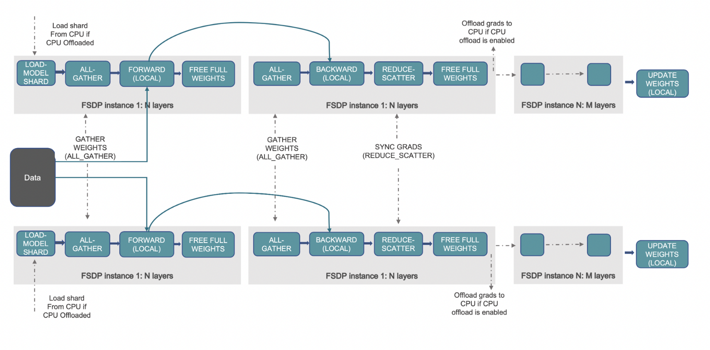

# LLM 分片(sharding)



原文: [Sharding Large models for parallel inference](https://medium.com/@jain.sm/sharding-large-models-for-parallel-inference-ee19844cc44)

## 介紹

隨著深度學習的出現和日益強大的模型的發展，預訓練語言模型的規模顯著增長。雖然這些模型在各種自然語言處理（NLP）任務中表現出了卓越的性能，但它們的龐大規模給資源受限設備和大規模分佈式系統的推理帶來了挑戰。

為了應對這些挑戰，分片或將大型模型分割成更小的部分，已成為實現更高效、更快速的分佈式推理的一種方法。

在本中，我們將深入探討大型模型分片的概念，探索其好處、用例和實現細節。我們還將討論流行的套件和工具，例如 “[accelerate](https://huggingface.co/docs/accelerate/index)”，它們有助於分片並更容易執行分佈式推論。

## LLM 的 Sharding

在大型模型的背景下，分片 (sharding) 是指將模型劃分為更小的部分或分片。每個分片都是原始模型的獨立且較小的部分。分片過程旨在有效地利用併行性，允許每個分片在不同的設備或處理器上獨立處理，從而實現更快、更高效的推理。

## 分片的好處

- **Memory Efficiency**: 分片可以在內存有限的設備上運行大型模型。分片無需將整個模型加載到內存中，而是只允許加載和處理必要的部分，從而顯著減少內存需求。
- **Faster Inference**: 通過將計算分佈在多個設備上，分片有助於實現併行性，從而縮短推理時間。這在處理大規模模型時特別有用，否則在單個設備上運行速度會很慢。
- **Scalability**: 分片有助於在具有多個 GPU 的分佈式系統甚至跨集群上部署大型模型，從而可以處理海量工作負載和更大規模的任務。
- **Distributed Inference**: 分片對於處理能力分佈在多個節點或 GPU 上的大規模分佈式系統至關重要。這確保了計算資源的有效利用並最大限度地減少了通信開銷。

## 通過 `accelerate` 分片

[Accelerate](https://pypi.org/project/accelerate/) 是一個功能強大的套件，可以簡化分佈式推理大型模型的分片過程。以下是使用 `accelerate` 實現分片的方法：

1. **Install `Accelerate`**: 首先，使用 `pip` 安裝 `accelerate` 套件以及其他所需的依賴項。

    ```python
    pip install accelerate
    ```

2. **Load the Model and Tokenizer**: 使用 transformers 套件加載預先訓練的語言模型和分詞器。選擇適合您特定用例的模型。

3. **Shard the Model**: 使用 `accelerate` 套件將模型分割成更小的部分。此步驟會優化分佈式推理模型。

4. **Save the Sharded Model**: 將分片模型保存到特定目錄。此過程會生成多個分片，可以在分佈式環境中有效利用這些分片。

5. **Load and Dispatch the Model**: 使用 `accelerate` 套件加載分片模型，並根據您的硬體設置將其分派到適當的設備，例如 CPU 或多個 GPU。

範例如下:

安裝套件

```bash
## 1. Install Accelerate
pip install sentencepiece accelerate
```


```python
from transformers import T5Tokenizer, T5ForConditionalGeneration,AutoTokenizer
from accelerate import Accelerator
from accelerate import load_checkpoint_and_dispatch

##  2. Load the Model and Tokenizer

tokenizer = AutoTokenizer.from_pretrained('declare-lab/flan-alpaca-xl')

model = T5ForConditionalGeneration.from_pretrained('declare-lab/flan-alpaca-xl')

save_directory="/content/model"

##  3. Shard the Model

accelerator = Accelerator()

# Here i am taking a Flan T5 XL fine tuned model (around 10GB) and creating shards of 2 GB each
accelerator.save_model(model=model, save_directory=save_directory,max_shard_size="2GB")

##  4. Load and Dispatch the Model

# choosing cpu as the device. I have 7 cores , so will spread the model shards across those.
device_map={'':'cpu'}

model = load_checkpoint_and_dispatch(
    model, checkpoint="/content/model/", device_map=device_map, no_split_module_classes=['Block']
)

# inference testing
raw_inputs = 'tell me about alpaca'

inputs = tokenizer(raw_inputs, padding=True, truncation=True, return_tensors='pt')

outputs = model.generate(**inputs, max_new_tokens=100, return_dict_in_generate=True, output_scores=True)
```

## 結論

分片大型語言模型已成為實現高效分佈式推理和在資源受限設備上部署模型的關鍵技術。通過將大型模型劃分為更小的、可管理的部分，分片使我們能夠充分利用深度學習模型的潛力，而不會影響性能或內存要求。

`accelerate` 套件以及其他相關工具簡化了分片過程，使開發人員更容易高效地實現分佈式推理。隨著自然語言處理和深度學習領域的不斷發展，分片將在實際應用中充分利用大型模型的功能方面發揮越來越重要的作用。