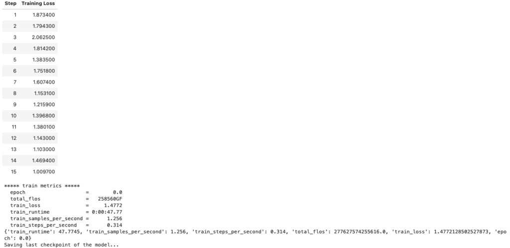

# 使用單個 GPU 微調 LLaMA 2 模型

原文: [Fine-Tuning LLaMA 2 Models using a single GPU, QLoRA and AI Notebooks](https://blog.ovhcloud.com/fine-tuning-llama-2-models-using-a-single-gpu-qlora-and-ai-notebooks/)


在本教程中，我們將引導您完成 LLaMA 2 模型的微調過程，並提供逐步說明。

- [Jupyter Notebook 參考](https://github.com/ovh/ai-training-examples/blob/main/notebooks/natural-language-processing/llm/miniconda/llama2-fine-tuning/llama_2_finetuning.ipynb)

## 介紹

Meta 在 July 18, 2023 發布了 LLaMA 2，這些新的 LLM 模型在 January 2023 到 July 2023 期間接受了 2 trillion tokens 的模型訓練，在許多評測基準上都優於其他 LLM，包括推理、編碼、熟練程度和知識測試。LLaMA 2 模型參數大小有 7B、13B 和 70B。模型可免費用於商業和研究用途。

為了適應所需的每個文本生成並微調這些模型，我們將使用 [QLoRA (Efficient Finetuning of Quantized LLMs)](https://arxiv.org/abs/2305.14314)，這是一種高效的微調技術，涉及將預訓練的 LLM 量化為 4-bit 並添加小型 Low-Rank Adapters。這種獨特的方法讓使用單個 GPU 來微調 LLM 模型成為可能! 我們將使用 [PEFT 函式庫](https://huggingface.co/docs/peft/) 來使用該技術。

為了微調 LLaMA 2 模型，我們將使用 1 個 GPU 來進行微調。

## 環境要求

要成功微調 LLaMA 2 模型，您將需要以下環境：

1. 填寫 Meta 的表格以請求下載 Llama 模型權重檔。事實上，Llama 2 的使用受 Meta 許可證的約束，您必須接受該許可證才能下載模型權重和分詞器。
2. 擁有一個 Hugging Face 帳戶。
3. 擁有Hugging Face 的模型/數據集讀取 token。
4. 透過執行 [huggingface-cli](https://pypi.org/project/huggingface-hub/) `login` 命令從筆記本終端登入 Hugging Face 模型 Hub，然後輸入您的令牌。您不需要將令牌新增為 git 憑證。
5. 強大的運算資源，微調 Llama 2 模型需要大量的運算能力。請確保您在 GPU 上執行程式碼。

## 設定 Python 環境

建立以下 `requirements.txt` 檔案：

```text
torch
accelerate @ git+https://github.com/huggingface/accelerate.git
bitsandbytes
datasets==2.13.1
transformers @ git+https://github.com/huggingface/transformers.git
peft @ git+https://github.com/huggingface/peft.git
trl @ git+https://github.com/lvwerra/trl.git
scipy
```

安裝套件：

```bash
pip install -r requirements.txt
```

並導入套件:

```python
import argparse
import bitsandbytes as bnb
from functools import partial
import os
from peft import LoraConfig, get_peft_model, prepare_model_for_kbit_training, AutoPeftModelForCausalLM
import torch

from transformers import AutoModelForCausalLM, AutoTokenizer, set_seed, Trainer, TrainingArguments, BitsAndBytesConfig, \
    DataCollatorForLanguageModeling, Trainer, TrainingArguments

from datasets import load_dataset
```

## 下載 LLaMA 2 模型

如前所述，LLaMA 2 模型有 7B、13B 和 70B。您的選擇可能會受到計算資源的影響。事實上，更大的模型需要更多的資源、記憶體、處理能力和訓練時間。

若要下載您有權存取的模型，請確保您已登入 Hugging Face model hub。如要求步驟中所述，您需要使用 `huggingface-cli` 登入命令。

以下函數將幫助我們下載模型及其 tokenizer。

```python
def load_model(model_name, bnb_config):
    n_gpus = torch.cuda.device_count()
    max_memory = f'{40960}MB'

    model = AutoModelForCausalLM.from_pretrained(
        model_name,
        quantization_config=bnb_config,
        device_map="auto", # dispatch efficiently the model on the available ressources
        max_memory = {i: max_memory for i in range(n_gpus)},
    )
    tokenizer = AutoTokenizer.from_pretrained(model_name, use_auth_token=True)

    # Needed for LLaMA tokenizer
    tokenizer.pad_token = tokenizer.eos_token

    return model, tokenizer
```

## 下載資料集

有許多資料集可以幫助您微調模型。您甚至可以使用自己的資料集！

在本教程中，我們將下載並使用 [Databricks Dolly 15k 資料集](https://huggingface.co/datasets/databricks/databricks-dolly-15k)，其中包含 15,000 個提示/回應對。它是由 5,000 多名 Databricks 員工於 2023 年 3 月和 4 月期間製作的。

他的資料集是專門為微調大型語言模型而設計的。它在 [CC BY-SA 3.0](https://creativecommons.org/licenses/by-sa/3.0/) 許可下發布，任何個人或公司都可以使用、修改和擴展，甚至可以用於商業應用。所以它非常適合我們的用例！

然而，與大多數資料集一樣，這個資料集也有其限制。確實，要注意以下幾點：

- 它由從公共互聯網收集的內容組成，這意味著它可能包含令人反感的、不正確或有偏見的內容以及拼寫錯誤，這可能會影響使用該數據集微調的模型的行為。
- 由於該資料集是由 Databricks 自己的員工為 Databricks 創建的，因此值得注意的是，該資料集反映了 Databricks 員工的興趣和語義選擇，這可能無法代表全球整體人口。
- 我們只能存取資料集的 `train` split ，這是其最大的子集。

```python
# Load the databricks dataset from Hugging Face
from datasets import load_dataset

dataset = load_dataset("databricks/databricks-dolly-15k", split="train")
```

## 探索資料集

下載資料集後，我們可以查看它以了解它包含的內容：

```python
print(f'Number of prompts: {len(dataset)}')
print(f'Column names are: {dataset.column_names}')

*** OUTPUT ***
Number of prompts: 15011
Column Names are: ['instruction', 'context', 'response', 'category']
```

正如我們所看到的，每個樣本都是 dict 物件，其中包含：

- `instruction`: 使用者可以輸入什麼內容，例如問題
- `context`: 幫助解釋範例
- `response`: 對指令的回答
- `category`: 將樣本分類為開放式問答、封閉式問答、從維基百科中提取資訊、從維基百科中總結資訊、腦力激盪、分類、創意寫作

## 資料集預處理

指令微調 (instruction fine-tuning) 是一種 LLM 微調常用技術，用於針對特定下游用例來微調 LLM foundation 模型。

它將幫助我們格式化提示，如下所示：

```
Below is an instruction that describes a task. Write a response that appropriately completes the request.

### Instruction:
Sea or Mountain

### Response:
I believe Mountain are more attractive but Ocean has it's own beauty and this tropical weather definitely turn you on! SO 50% 50%

### End
```

要透過主題標籤分隔每個提示部分，我們可以使用以下函數：

```python
def create_prompt_formats(sample):
    """
    Format various fields of the sample ('instruction', 'context', 'response')
    Then concatenate them using two newline characters 
    :param sample: Sample dictionnary
    """

    INTRO_BLURB = "Below is an instruction that describes a task. Write a response that appropriately completes the request."
    INSTRUCTION_KEY = "### Instruction:"
    INPUT_KEY = "Input:"
    RESPONSE_KEY = "### Response:"
    END_KEY = "### End"
    
    blurb = f"{INTRO_BLURB}"
    instruction = f"{INSTRUCTION_KEY}\n{sample['instruction']}"
    input_context = f"{INPUT_KEY}\n{sample['context']}" if sample["context"] else None
    response = f"{RESPONSE_KEY}\n{sample['response']}"
    end = f"{END_KEY}"
    
    parts = [part for part in [blurb, instruction, input_context, response, end] if part]

    formatted_prompt = "\n\n".join(parts)
    
    sample["text"] = formatted_prompt

    return sample
```


現在，我們將使用模型 tokenizer 將這些提示(prompt)處理為標記化的提示。

目標是創建統一長度的輸入序列（適合微調語言模型，因為它可以最大限度地提高效率並最小化計算開銷），並且不得超過模型的最大標記限制。

```python
# SOURCE https://github.com/databrickslabs/dolly/blob/master/training/trainer.py
def get_max_length(model):
    conf = model.config
    max_length = None
    for length_setting in ["n_positions", "max_position_embeddings", "seq_length"]:
        max_length = getattr(model.config, length_setting, None)
        if max_length:
            print(f"Found max lenth: {max_length}")
            break
    if not max_length:
        max_length = 1024
        print(f"Using default max length: {max_length}")
    return max_length


def preprocess_batch(batch, tokenizer, max_length):
    """
    Tokenizing a batch
    """
    return tokenizer(
        batch["text"],
        max_length=max_length,
        truncation=True,
    )


# SOURCE https://github.com/databrickslabs/dolly/blob/master/training/trainer.py
def preprocess_dataset(tokenizer: AutoTokenizer, max_length: int, seed, dataset: str):
    """Format & tokenize it so it is ready for training
    :param tokenizer (AutoTokenizer): Model Tokenizer
    :param max_length (int): Maximum number of tokens to emit from tokenizer
    """
    
    # Add prompt to each sample
    print("Preprocessing dataset...")
    dataset = dataset.map(create_prompt_formats)#, batched=True)
    
    # Apply preprocessing to each batch of the dataset & and remove 'instruction', 'context', 'response', 'category' fields
    _preprocessing_function = partial(preprocess_batch, max_length=max_length, tokenizer=tokenizer)

    dataset = dataset.map(
        _preprocessing_function,
        batched=True,
        remove_columns=["instruction", "context", "response", "text", "category"],
    )

    # Filter out samples that have input_ids exceeding max_length
    dataset = dataset.filter(lambda sample: len(sample["input_ids"]) < max_length)
    
    # Shuffle dataset
    dataset = dataset.shuffle(seed=seed)

    return dataset
```

有了這些函數，我們的資料集就可以進行微調了！

## 構建 bitsandbytes 配置

`bitsandbytes` 配置使我們能夠以 4bit 量化來加載 LLM。為了節省內存，我們選擇應用 `bfloat16` 計算資料類型和嵌套量化。

```python
def create_bnb_config():
    bnb_config = BitsAndBytesConfig(
        load_in_4bit=True,
        bnb_4bit_use_double_quant=True,
        bnb_4bit_quant_type="nf4",
        bnb_4bit_compute_dtype=torch.bfloat16,
    )

    return bnb_config
```

為了利用 `LoRa` 方法，我們需要將模型包裝為 `PeftModel`。

為此，我們需要實作 [LoRa 配置](https://huggingface.co/docs/peft/conceptual_guides/lora)：

```python
def create_peft_config(modules):
    """
    Create Parameter-Efficient Fine-Tuning config for your model
    :param modules: Names of the modules to apply Lora to
    """
    config = LoraConfig(
        r=16,  # dimension of the updated matrices
        lora_alpha=64,  # parameter for scaling
        target_modules=modules,
        lora_dropout=0.1,  # dropout probability for layers
        bias="none",
        task_type="CAUSAL_LM",
    )

    return config
```

前一個函數需要指定 target modules 來更新必要的權重矩陣。以下函數將為我們的模型取得這些 target modules：

```python
# SOURCE https://github.com/artidoro/qlora/blob/main/qlora.py

def find_all_linear_names(model):
    cls = bnb.nn.Linear4bit #if args.bits == 4 else (bnb.nn.Linear8bitLt if args.bits == 8 else torch.nn.Linear)
    lora_module_names = set()
    for name, module in model.named_modules():
        if isinstance(module, cls):
            names = name.split('.')
            lora_module_names.add(names[0] if len(names) == 1 else names[-1])

    if 'lm_head' in lora_module_names:  # needed for 16-bit
        lora_module_names.remove('lm_head')
    return list(lora_module_names)
```

一旦一切設定完畢並準備好基本模型，我們就可以使用 `print_trainable_parameters()` 輔助函數來查看模型中有多少個可訓練參數。

```python
def print_trainable_parameters(model, use_4bit=False):
    """
    Prints the number of trainable parameters in the model.
    """
    trainable_params = 0
    all_param = 0
    for _, param in model.named_parameters():
        num_params = param.numel()
        # if using DS Zero 3 and the weights are initialized empty
        if num_params == 0 and hasattr(param, "ds_numel"):
            num_params = param.ds_numel

        all_param += num_params
        if param.requires_grad:
            trainable_params += num_params
    if use_4bit:
        trainable_params /= 2
    print(
        f"all params: {all_param:,d} || trainable params: {trainable_params:,d} || trainable%: {100 * trainable_params / all_param}"
    )
```

與原始模型相比，我們希望 LoRa 模型具有更少的可訓練參數，因為我們想要執行微調。

## 模型訓練

現在一切都準備好了，我們可以預處理我們的資料集並使用設定的配置來載入我們的模型：

```python
# Load model from HF with user's token and with bitsandbytes config

model_name = "meta-llama/Llama-2-7b-hf" 

bnb_config = create_bnb_config()

model, tokenizer = load_model(model_name, bnb_config)

## Preprocess dataset

max_length = get_max_length(model)

dataset = preprocess_dataset(tokenizer, max_length, seed, dataset)
```

然後，我們可以運行我們的微調過程：

```python
def train(model, tokenizer, dataset, output_dir):
    # Apply preprocessing to the model to prepare it by
    # 1 - Enabling gradient checkpointing to reduce memory usage during fine-tuning
    model.gradient_checkpointing_enable()

    # 2 - Using the prepare_model_for_kbit_training method from PEFT
    model = prepare_model_for_kbit_training(model)

    # Get lora module names
    modules = find_all_linear_names(model)

    # Create PEFT config for these modules and wrap the model to PEFT
    peft_config = create_peft_config(modules)
    model = get_peft_model(model, peft_config)
    
    # Print information about the percentage of trainable parameters
    print_trainable_parameters(model)
    
    # Training parameters
    trainer = Trainer(
        model=model,
        train_dataset=dataset,
        args=TrainingArguments(
            per_device_train_batch_size=1,
            gradient_accumulation_steps=4,
            warmup_steps=2,
            max_steps=20,
            learning_rate=2e-4,
            fp16=True,
            logging_steps=1,
            output_dir="outputs",
            optim="paged_adamw_8bit",
        ),
        data_collator=DataCollatorForLanguageModeling(tokenizer, mlm=False)
    )
    
    model.config.use_cache = False  # re-enable for inference to speed up predictions for similar inputs
    
    ### SOURCE https://github.com/artidoro/qlora/blob/main/qlora.py
    # Verifying the datatypes before training
    
    dtypes = {}
    for _, p in model.named_parameters():
        dtype = p.dtype
        if dtype not in dtypes: dtypes[dtype] = 0
        dtypes[dtype] += p.numel()
    total = 0
    for k, v in dtypes.items(): total+= v
    for k, v in dtypes.items():
        print(k, v, v/total)
     
    do_train = True
    
    # Launch training
    print("Training...")
    
    if do_train:
        train_result = trainer.train()
        metrics = train_result.metrics
        trainer.log_metrics("train", metrics)
        trainer.save_metrics("train", metrics)
        trainer.save_state()
        print(metrics)    
    
    ###
    
    # Saving model
    print("Saving last checkpoint of the model...")
    os.makedirs(output_dir, exist_ok=True)
    trainer.model.save_pretrained(output_dir)
    
    # Free memory for merging weights
    del model
    del trainer
    torch.cuda.empty_cache()
    
    
output_dir = "results/llama2/final_checkpoint"

train(model, tokenizer, dataset, output_dir)
```

如果您希望擁有多個 `epoch`（整個訓練資料集將通過模型）而不是多個訓練步驟（使用一批資料向前和向後通過模型），則可以將 `max_steps` 參數替換為 `num_train_epochs` 。

為了稍後載入並使用模型進行推理，我們使用了 `trainer.model.save_pretrained(output_dir)` 函數，該函數保存微調後的模型的權重、配置和分詞器檔案。



不幸的是，最新的權重可能不是最好的。為了解決這個問題，您可以在微調期間從轉換器實作 `EarlyStoppingCallback`。這將使您能夠定期在驗證集上測試您的模型，並僅保留最佳權重。

## 合併權重

一旦我們有了微調的權重，我們就可以建立微調的模型並將其及其關聯的分詞器保存到新目錄中。透過執行這些步驟，我們可以擁有一個記憶體高效的微調模型和分詞器以供推理！

```python
model = AutoPeftModelForCausalLM.from_pretrained(output_dir, device_map="auto", torch_dtype=torch.bfloat16)
model = model.merge_and_unload()

output_merged_dir = "results/llama2/final_merged_checkpoint"
os.makedirs(output_merged_dir, exist_ok=True)
model.save_pretrained(output_merged_dir, safe_serialization=True)

# save tokenizer for easy inference
tokenizer = AutoTokenizer.from_pretrained(model_name)
tokenizer.save_pretrained(output_merged_dir)
```

## 結論

現在您可以在自己的資料集上微調 LLaMA 2 模型！


